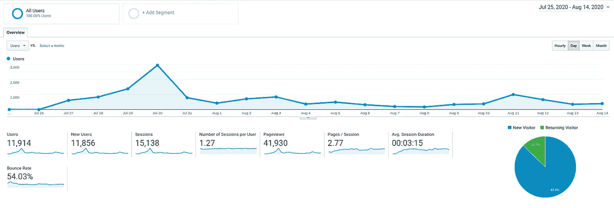
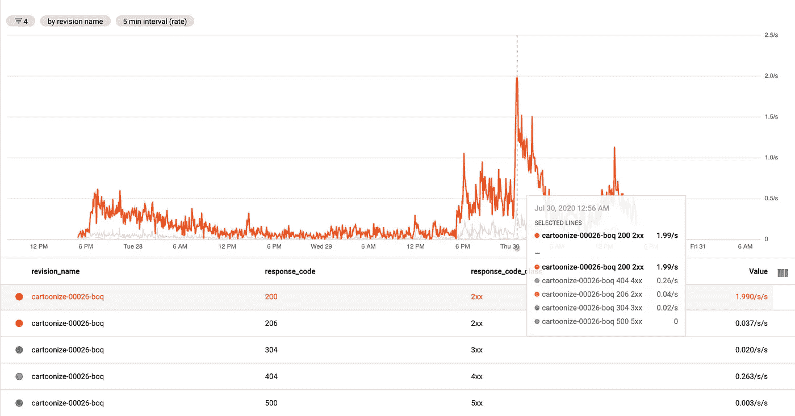

# 我们如何建立一个廉价的、可扩展的架构来卡通化这个世界！

> 原文：<https://towardsdatascience.com/how-we-built-an-inexpensive-scalable-architecture-to-cartoonize-the-world-8610050f90a0?source=collection_archive---------22----------------------->

## 并在生产中大规模部署耗电的深度学习模型。

很多人都对 [*漫画家*](https://cartoonize-lkqov62dia-de.a.run.app/) *背后的建筑感兴趣。所以* [*Tejas*](https://tjdevworks.github.io/) *和我(*[*Niraj*](https://nirajpandkar.github.io/about/)*)试着解释我们所采用的让它工作的过程。Algorithmia 为我们的视频推理管道提供了动力。*😇

AI 卡通化形象！由[杜凡](https://unsplash.com/@miinyuii?utm_source=unsplash&amp;utm_medium=referral&amp;utm_content=creditCopyText")在 [Unsplash](https://unsplash.com/s/photos/friends?utm_source=unsplash&utm_medium=referral&utm_content=creditCopyText) 上拍摄的原始照片

在当今快节奏的世界中，ML 专家被期望在 ML 工作流程中扮演多重角色。工作流中的一个关键任务是为生产中的模型服务！管道中这一看似重要的部分往往会被忽视，从而无法为客户提供价值。

> 没有(数据)科学家的工作，工程学科显然无法存在——MLE(机器学习工程)是建立在数据科学的工作基础上的——但工程是科学应用于世界的方式。
> --[迦凯泽](/why-we-built-a-platform-for-machine-learning-engineering-not-data-science-54004d5b6e95)

本文将解释我们的尝试，不仅仅是为生产中的计算密集型 GAN 模型**提供廉价的**服务，而且还要对其进行水平扩展。

# ML 灾难😅

如果你熟悉托管 REST API，它保证这些基本的东西-

1.  烧瓶中的快速原型
2.  设置环境

*   GCP 或 AWS 实例
*   系统依赖性以及 python 特定依赖性(pip)
*   代理服务系统
*   多个工作人员进行横向扩展

作为一名 ML 工程师，第二点是乏味的，在可伸缩性和服务器成本方面不太令人满意。维护服务器的责任落在您肩上的日子已经一去不复返了！我说的是外包和自动化的第二点完全。输入**谷歌云运行！**

# 跑云跑！

在我介绍这个架构的工作原理之前，我想给你一些用户统计数据，让你感受一下我们可以用最少的成本满足的流量。

## 我们收到的流量😮

自从我们在 7 月 26 日推出我们的演示网络应用以来，在不到 3 周的时间里，我们已经拥有了大约 12，000 名用户！**在最初的 **4 天**中有 6000**——大部分流量来自我们的 [Reddit 帖子](https://www.reddit.com/r/MachineLearning/comments/hyqmi9/p_cartoonize_your_world/)和 [TheNextWeb 文章](https://thenextweb.com/neural/2020/07/28/this-ai-will-turn-your-ugly-face-into-a-cute-cartoon/)，这些文章随后也被不同国家的其他博客转载。

在这个高峰时间的任何时候，我们都有大约 50 多个用户请求我们的图像和视频服务。

超过两周的用户

## 我们准备好的交通💪

开箱即用，Cloud Run 允许我们基于传入流量生成 1000 个实例。默认情况下，每个容器实例最多有 80 个请求。因此**理想情况下**我们可以满足每秒 80，000 个请求！

但是由于卡通化过程已经很繁重了，我们将程序限制在每个实例 8 个工人。这意味着一个实例被限制为 8 个并发请求。如果有的话，第 9 个请求将被路由到第二个实例。因此，我们基本上可以满足每秒 8000 个请求的需求！

# 视频处理在 CPU 还是 GPU 上？🎥

我们的独特卖点是构建一个架构，让我们能够以最低的成本提供视频和图像。视频只不过是图像(帧)的集合，我们必须将每一帧都卡通化。

以每秒 30 帧的速度卡通化，分辨率为 720p

在 8 核 i7 CPU 上，卡通化 1080p 分辨率的图像大约需要 1 秒钟。不幸的是，Google Cloud Run 最多只提供 2 个 vCPUs，这使得时间增加到了 **3 秒/图像**！你可以想象在那种计算机上处理视频有多恐怖！每秒 30 帧(fps)的 10 秒视频将花费 **15 分钟**！😱

我们采用了两种技术来降低视频推理时间。

*   **将图像的分辨率降低到 480p** :这实质上减少了每帧的负荷，而质量没有任何明显的变化。这帮助我们达到了 **1 秒/图像**的推断时间。
*   **降低视频的帧速率**:我们将其从 30 fps 降低到 15 fps，这大大减少了我们的视频计算时间。

我们尝试使用 tensorflow lite 进行权重量化，以加速推理管道，但我们面临着为动态输入图像大小提供模型的问题。虽然它适用于固定的图像大小，但我们没有发现延迟和计算权衡的结果是合理的。

即使通过降低分辨率和减少每秒帧数，视频卡通化也要花费 **2.5 分钟**来制作一个 10 秒的视频。考虑到用户体验，这个价格还是太高了。因此，将视频转换成卡通需要一些额外的大炮。

# GPU 上的速度优势⏩

使用 GPU 将图像速度提高了 10 倍。推断时间归结为 **50 毫秒/图像。**这意味着我们可以卡通化并在 **7 秒**内提供 10 秒的视频！现在我们开始做生意了。😉

至少我们是这么认为的。有两个问题困扰着我们-

1.  我们如何扩展 GPU 服务以跟上类似云运行的扩展？
2.  我们如何能有效地做到这一点？

一种方法是将模型作为 API 部署在 Google 计算引擎实例上，但这违背了云运行扩展的目的。所有的并发请求将会排队，GPU 将会成为我们管道中的瓶颈。此外，全天候运行一个实例并不便宜💰

# 如何使用 GPU 进行扩展(廉价)？

作为托管无状态容器服务的云运行无法提供 GPU 支持。因此，我们将 GPU 计算外包给一个名为 Algorithmia 的服务，而不是出租昂贵的谷歌计算引擎服务器。原因是双重的-

1.  首先，它拥有在生产中[大规模部署深度学习模型](https://algorithmia.com/blog/deploying-machine-learning-at-scale)的能力！每个 GPU 计算实例可以处理 24 个并发请求。此外，它可以在任何给定的时间点自动扩展到 80 个实例。
2.  因为我们把它建成了一个周末版，所以我们想证明我们投入的时间是值得的；在这里，Algorithmia 惊讶地发现了一个非常灵活的平台，可以轻松地部署具有 GPU 支持和配置环境的 ML 模型，而无需知道 GPU 驱动程序和 tensorflow 版本是否兼容，如果你明白我的意思。:P

这意味着我们可以同时满足大约 1500+个视频请求，而且相对便宜！

# 学习

## 一个实例上有 80 个请求！🤔

我们的 Flask API 被编码为通过使用 Gunicorn 生成 8 个 workers 来处理 8 个并发请求，但是我们没有改变云运行中每个实例 80 个请求的默认设置。

这意味着整个过程中只产生了一个实例，也许用户请求在我们的 Flask 服务器上排队。缺点是用户必须等待更长时间才能得到他们的卡通图像和视频☹️

好的一面是我们只为一个实例付费。每个实例的请求数量越少，产生的实例数量就越多，从而增加了可计费的实例时间。但是将请求重新路由到不同的实例意味着更好更快的用户满意度。😉

每秒最大请求数(每秒 2 个请求)

# 未来范围

我们设想这将被用于以下方面—

*   为动画、卡通和游戏制作快速原型或精灵
*   因为它概括了面部特征和信息，所以可以用来生成**最小艺术**
*   游戏可以非常容易地导入简短的**过场动画****而无需使用动作捕捉**
*   可以作为平面设计师或动画师的助手。

如果你有什么有趣的东西要展示，请联系我们！

webapp 演示的代码可在 [Github](https://github.com/experience-ml/cartoonize) 上获得！试试这里的演示！