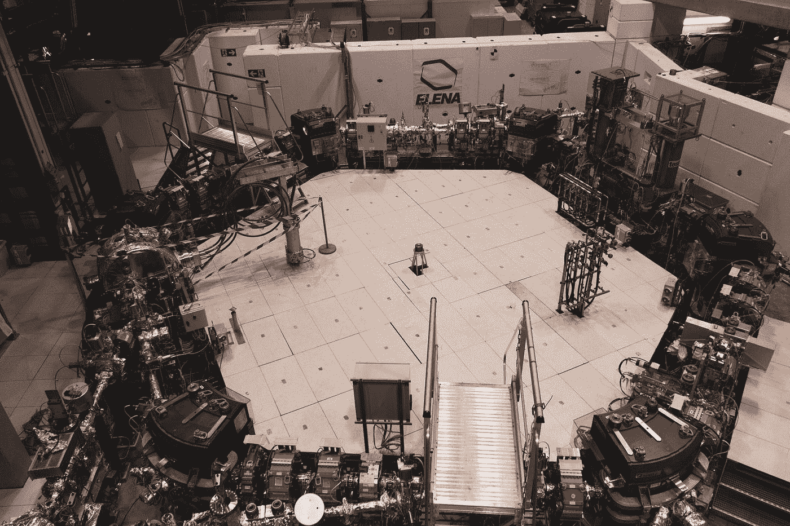
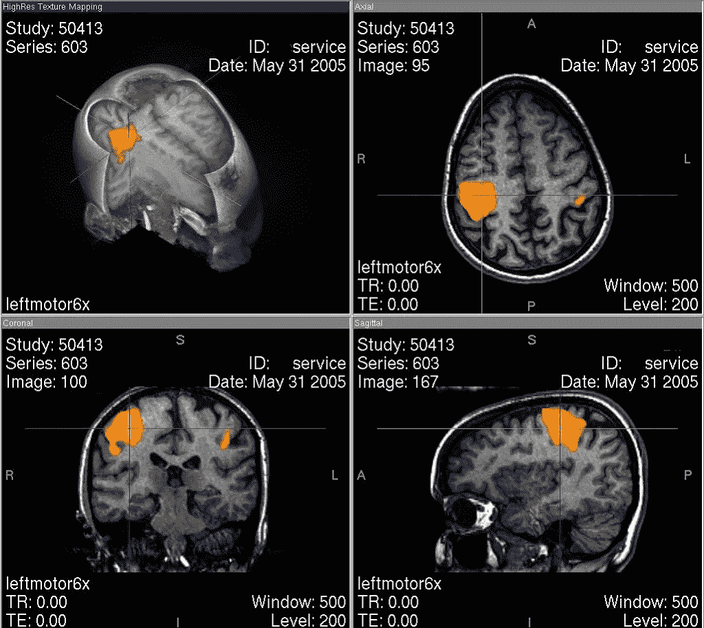

# 我们如何从大脑中学习来了解大脑是如何学习的

> 原文：<https://towardsdatascience.com/how-we-can-learn-from-the-brain-to-learn-how-the-brain-learns-2b81286a1a7b?source=collection_archive---------21----------------------->

## 来自地球上最古老的数据科学家的教训

内森·杜姆劳在 [Unsplash](https://unsplash.com?utm_source=medium&utm_medium=referral) 上的照片

数据科学是查看数据并从中提取有用知识的艺术。数据无处不在。数据意味着图像、音频、文本、股票市场趋势。 ***数据是我们探究世界时，世界呈现给我们的方式。无论是为了物种的生存还是为了公司的生存，拥有有用的知识比没有有用的知识更有优势。***

因此，数据科学家的探索与生命地球本身一样古老:所有生命形式都在以这样或那样的方式从来自环境的数据流中提取知识，以服务于它们的生存目标。有些持续了几亿年，甚至几十亿年。

大脑已经率先以最复杂的方式完成了这项工作。

## 科学探究

德文·罗杰斯在 [Unsplash](https://unsplash.com?utm_source=medium&utm_medium=referral) 上拍摄的照片

对科学的追求同样是从世界中获取知识，尽管是在一个更加刻意的过程中。，它大致分为两个部分:建立世界模型，并将这些模型与数据进行比较。

更抽象地说，这两个步骤类似于生成模型的两个部分，如*自动编码器*(我在这里写了更多关于[生成模型背后的核心思想)。](/how-to-make-computers-dream-3b4b10e4463a)

## **1。编码器:数据→型号**

在第一阶段，可以称为编码器阶段，我们从数据中提取某种表示/模型，我们希望以某种方式反映一些真实的(因果/概率等。)数据背后的结构。

## **2。解码器:模型→预测(新数据)**

第二阶段通过预测世界来解码模型，并在实验中与观察结果进行比较。

## 模型反演

纳丁·沙巴纳在 [Unsplash](https://unsplash.com?utm_source=medium&utm_medium=referral) 上拍摄的照片

但是我们还需要采取另一个步骤。如果我们只有很少的信息或者我们的预测是错误的(*信息不确定性*)，我们如何建立和改变我们的模型？如果我们的模型不再足够好，因为建立模型的世界发生了变化或包含了某种内在的不确定性(*环境不确定性*)，会发生什么？物理定律可能永远不变，但如果我们代之以建模像另一个人的行为一样变化无常和不确定的东西会怎样？

因此，我们需要另一个阶段，将对世界的预测与真实世界进行比较，并调整模型以适应预测误差。

## **3。模型反演:预测数据与输入数据→改进模型**

你如何利用数据最有效地改进你的模型？你如何同时转动一个复杂模型的许多螺丝而不把它搞砸？

正如我在开头提到的，大脑真的很擅长从数据中提取相关知识。重要的是，他们是杰出的直觉科学家(尽管他们有数百种偏见，正如我在我关于人工智能和认知偏见之间的联系的文章中所述[)。他们不断地建立世界的模型，根据这些模型做出预测，如果他们的预测是错误的，就反转并改进它们。这就是为什么进化一开始就把它们放在我们的脑袋里。](/explainability-and-the-art-of-confabulation-d4fb176de982)

大脑在各种任务中都是高效的学习者。它们往往比我们当前的机器学习算法概括得更好，学习更灵活，这也意味着快速适应不断变化的环境。

他们对极其复杂的过程做出预测，例如 ***“我几分钟前遇到的这个人接下来会做什么？”*** ，这意味着我们的大脑为我们遇到的每一个人建立一个模型，将这个模型整合到预先存在的一个人的模型中，进一步整合几个数据模态(这个人看起来/说话/闻起来/移动起来如何？)来微调模型，然后使用这个人的新的近似模型来对他或她的行为进行实时预测，或者将他们快速分类为朋友或敌人。

如果这个人的行为与我们的预测相冲突，我们的大脑会无缝地更新它的模型，而我们大多数时候不会注意到它。但正如机器学习和人工智能领域的当前标准所示，用计算机做这些事情需要更长的时间，花费更多的资源，需要更多的数据。

## 向大脑学习向大脑学习

功能磁共振成像数据。来源:德国维基百科上的 M . r . w . hh[公共领域]

神经科学家研究大脑已经有一百多年了。但是大脑是一块难啃的骨头。我们从中收集的数据通常是杂乱的，难以解释。有时候放弃是很诱人的。但是大脑每天都面临着类似的情况。而且脑子也经不起找借口。如果我们的大脑只是听天由命，说“这个世界太复杂了，不可能从中学到任何有用的东西”，我们早就灭绝了。

因此，与其放弃，我们如何才能学习好的大脑模型，即使我们没有大量干净的数据可用？

在一个极其单调的循环中，我们可以从我们研究的主题本身寻找指导:我们可以从大脑中了解大脑如何学习， ***找到如何改进和构建我们算法的灵感，这些算法反过来帮助我们更好地分析和建模大脑数据和行为数据*** (我将很快给出一个更具体的例子)。

## 大脑中的层次模型

由[Edvard Alexander lvaag](https://unsplash.com/@edvardr?utm_source=medium&utm_medium=referral)在 [Unsplash](https://unsplash.com?utm_source=medium&utm_medium=referral) 上拍摄的照片

大脑可以有效地推断和改进它不断变化的世界模型。

***层次模型*** 是对此进行概念化的一种方式。正如我在我的关于智力的文章中所详述的那样(在这里阅读)，认知可以被认为是有层次结构的(这也适用于思维本身，参见我的关于[思维几何学](/the-geometry-of-thought-700047775956))的文章。

层次模型是逐步建立越来越复杂的对象表示的好工具。它们可以捕捉数据背后深刻而重要的结构和概率分布，并可用于有效地生成预测(有关更多技术介绍和分层模型的示例，请阅读 ***Penny 和 Henson*** [的介绍，此处为](http://www.mrc-cbu.cam.ac.uk/personal/rik.henson/personal/PennyHenson_SPM_06a.pdf))。

它们的潜力激发了神经科学家去寻找大脑中的层次模型。作为卡尔·弗里斯顿的著名且有争议的 T4 贝叶斯大脑假说的一部分，他和他的同事们提出，层级模型可以在人类大脑皮层中实施，我们可以在功能性核磁共振成像数据中观察它们是如何在人类的实时行为实验中更新的。

我们在一个由不确定性塑造的世界中度过了一生，有一些证据表明，大脑可能在使用大脑 中概率分布的隐式 ***表示，这可以解释这种不确定性。关于这些如何在神经元水平上构建到大脑中有一些理论(见[这里](https://www.ncbi.nlm.nih.gov/pmc/articles/PMC4487650/)对大脑中的概率有一个很好的概述)。***

这些世界概率模型的不同层(正如我们将看到的)可能分布在不同的大脑区域和前额皮质的不同层，因此我们的世界模型同样会在物理上分布在大脑上。

## 高斯滤波器模型

作为一个简单的分层模型，它可以以某种形式在大脑中实现。提出分层高斯滤波器。

感知总是包含一定程度的对环境隐藏状态的不确定性。有没有一种方法可以直接模拟这种不确定性？

高斯滤波器的目的是了解可以随时间变化的 ***隐藏变量 x*** 的概率结构。这个 ***隐藏变量可以代表你能想到的任何种类的数据*** ，无论是股票可能如何变化，还是你最好朋友的决策。

该模型代表了代理关于该变量如何随时间变化的信念，并提供了一个可以对该变量进行预测的生成模型。

一个 ***高斯滤波器模型*** 由几个相互堆叠的高斯随机分布构成。每一个高斯都有各自的 ***均值*** 和 ***方差*** ，它的逆很直观地叫做*，因为如果高斯的方差很高，它生成的估计值 ***就不会很精确*** 。*

*这些高斯分布随时间进行离散化的[随机游走](https://en.wikipedia.org/wiki/Random_walk#Gaussian_random_walk)，这意味着每个高斯分布在时间 t 的新均值是通过从时间 t-1 的相同高斯分布中抽取来确定的。*

*为了使用该模型进行预测，我们从顶部开始，并从高斯值中提取值，该高斯值位于 N 个高斯等级的最高处，并且具有固定的精度。由高斯函数给出的值通过一些函数决定了下一层高斯函数的精度，然后我们从这一层开始绘制。这个高斯反过来决定了下面高斯的相应协方差。*

*冲洗，洗涤，重复，直到我们到达底层。*

*我们试图预测的 ***隐藏变量 x*** 连接到高斯层次的底层。在变量是二进制的情况下(在决策过程中采用布尔值，如“是”或“否”)，底部高斯可以连接到一个函数，如 ***单位正方形。*** 如果 x 本身被假设为高斯，则底部高斯直接 ***模型*** ***随机变量 x*** 的概率分布。*

*到目前为止，这可能看起来有点抽象(同样[参见原始论文](https://www.frontiersin.org/articles/10.3389/fnhum.2014.00825/full)中的数字)，所以让我们对这里发生的事情有一些直觉。*

## *用高斯滤波器模型学习行为*

**

*两条路在树林中分岔。我们如何建模一个代理将采取哪一个？照片由[延斯·勒列](https://unsplash.com/@leliejens?utm_source=medium&utm_medium=referral)在 [Unsplash](https://unsplash.com?utm_source=medium&utm_medium=referral) 上拍摄*

*高斯滤波器模型不仅被提出是在大脑 中以某种方式实现的 ***，而且可以被“转过来”分析来自行为实验的数据， ***模拟真实大脑在现实生活中如何学习*** 。****

*让我们来看一个最简单的例子，两个高斯函数堆叠在一起，通过一个单位平方 sigmoid 函数连接到一个布尔变量/decision。*

*比方说，我们希望弄清楚代理是选择“是”还是“否”，这是由一些 ***隐藏状态*** 决定的。这些我们可以认为是我们正在观察的代理的内部过程，就像他的 ***思想和动机*** 。当然，它们会随着时间的推移而发生变化(我假设你曾经对某件事说了“是”，但后来在你的世界模式改变后，你又深深后悔说了“是”)。*

*底层的高斯编码了主体倾向于“是”或“否”的倾向。上一层的第二个高斯现在对底部高斯 的 ***波动进行建模:代理人对是或否的倾向随时间变化的强烈程度，以及我们对代理人将说是或否的预测的信心程度？****

*如果我们在现有的两个高斯模型上叠加额外的高斯模型，它们将模拟波动率 的 ***波动率，以此类推，允许模型捕捉代理中隐藏状态的越来越复杂的概率分布。****

## *分层模型中的模型反演*

*我们还没完。正如我在开始时所说，每个模型的第三步也是关键的一步是 ***模型反演。****

*神经网络通常通过反向传播来训练。你取损失函数的梯度(在某种意义上，它只不过是一个预测误差)并调整网络的参数，以便使损失更小。*

*高斯滤波器模型中的模型反演在结构上有些类似。在做出预测之后，通过传播预测误差，最小化变分自由能***(在*上的下限，在 ***贝叶斯大脑假设*** 的语言中)来更新它的层，由逆精度加权，向上通过模型的层。*****

*通过进行平均场近似(假设分布保持高斯分布并且独立更新)，该方案相对简单并且计算有效，并且可以以试验方式实时执行。*

*基于相应的预测误差来调整参数。事实上，您是从底层开始，这与反向传播的逻辑完全相同，也是从连接到输出的网络层开始。*

****根据预测误差*** 的大小更新高斯均值和精度。可以这样想:如果预测真的很好(几乎完美地匹配了观察值)，那么传播的误差就很小，并且一旦你向上移动层次，误差就会变得越来越小。*

*如果预测很差，但是猜测的精度非常低，首先(这意味着模型在这个级别上对其预测高度不确定)，模型也不会调整得太强，因为它已经假设其预测是不确定的，并且可能是错误的。*

## *学习了解大脑如何学习*

*这个模型真的向我们展示了大脑是如何学习的吗？答案仍然是不确定的(问题是我们的大脑如何对这种不确定性进行建模)，我们可以成功地使用模型来学习行为的事实并不表明大脑真的是这样实现的。*

*然而[伊格莱西亚斯等人。Al 声称已经从神经成像研究中找到了证据，证明它可以做到这一点，](https://www.ncbi.nlm.nih.gov/pubmed/24139048)根据预测误差的大小，观察预测误差传播到不同的大脑区域/层次，并反过来将它们与不同的神经递质联系起来，如参与奖励预测的多巴胺。*

*[弗里斯顿进一步提出](https://journals.plos.org/ploscompbiol/article/file?id=10.1371/journal.pcbi.1000211&type=printable)，基于[芒福德](https://link.springer.com/article/10.1007/BF00198477)的想法，这个模型可以与神经解剖学联系起来:例如，预测可能会通过*深层锥体细胞，而预测错误会被编码。，由 ***浅锥体细胞*** 组成。**

**但仍有许多未解决的问题，如如何在解剖学上实现模型的高斯分布，如何根据来自锥体细胞的信号更新它们的均值和协方差，如何计算预测误差等。**

**我们不仅可以通过用大脑启发的模型预测大脑的行为来了解大脑是如何了解世界的。**

**但在更普遍的意义上，分层模型在许多深度学习和数据科学应用中是有用的工具，因为它们在构建推理网络方面的能力(例如用于动态系统摊销推理的[、自然语言处理中的](https://arxiv.org/abs/1905.12090)或用于学习变分自动编码器中更好的近似后验概率的)并且可以帮助使它们更具可解释性。由于我们对世界的感知是分层次的，拥有层次模型可以轻松地将它们与我们的直觉和日常语言联系起来。**

**正如我在关于[循环神经网络](/the-power-of-recurrent-neural-networks-1ef056dae2a5)的文章中解释的那样，建立更结构化的大脑模型是理解大脑如何组织自身的关键一步，这可以帮助我们从 fMRI、EEG 等大脑测量数据中获得更多 ***意义..*****

**学习 ***数据的无监督生成模型*** 看起来是 AI 发展的重要一步。我认为，分层次的方法是更有前途的思考方式之一。**