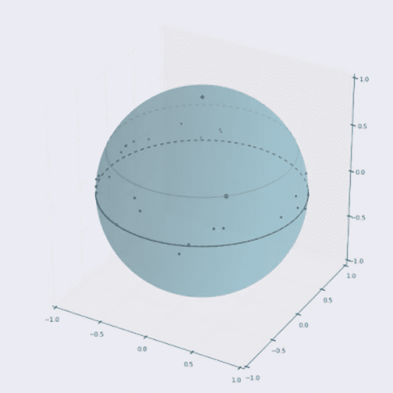
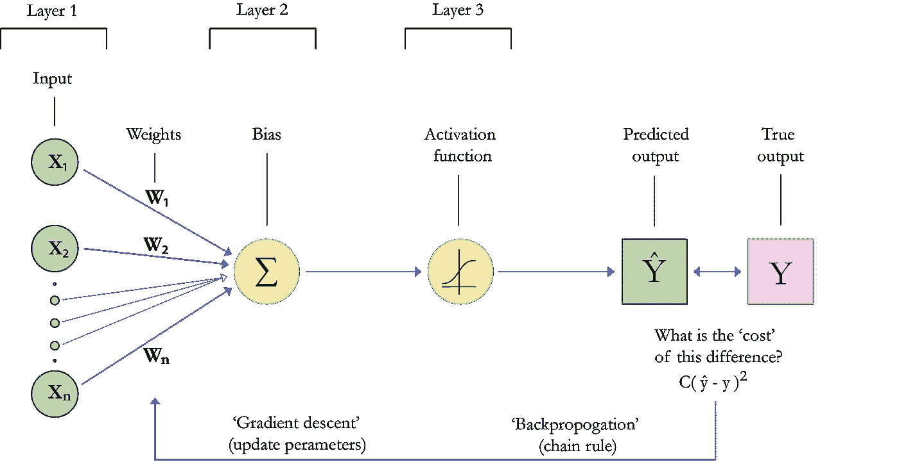
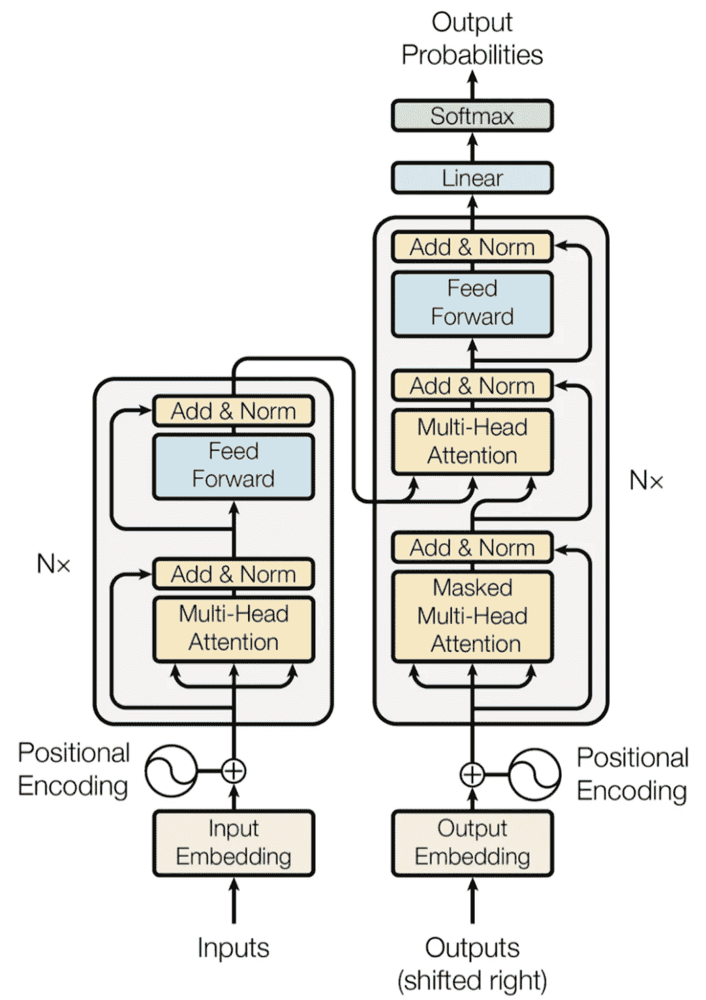
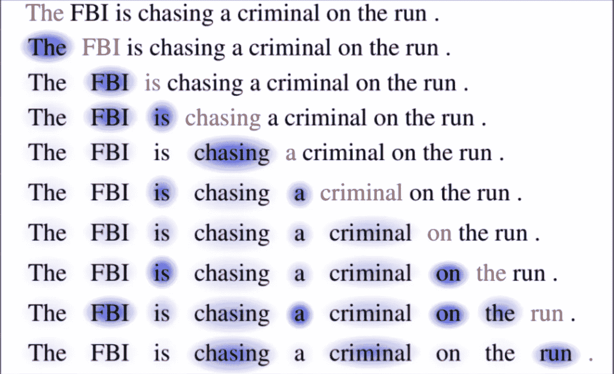
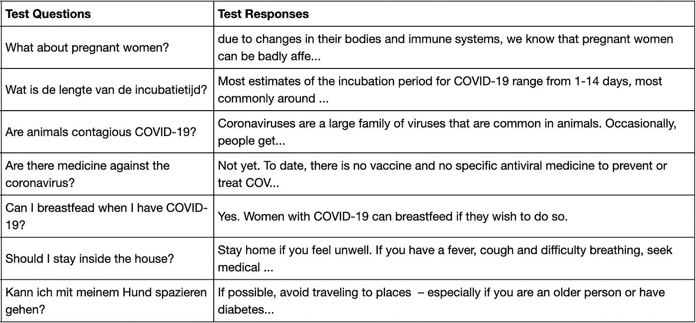

# 我们如何创建一个开源的新冠肺炎聊天机器人

> 原文：<https://towardsdatascience.com/how-we-created-an-open-source-covid-19-chatbot-c5c900b382df?source=collection_archive---------7----------------------->

## 深入探讨人工智能和自然语言处理，带你一起踏上开发这个 Corona-chatbot 的旅程

图片由[三重](https://www.linkedin.com/company/triple-it/)的[安妮·海吉科普](https://www.linkedin.com/in/anneheijkoop/)拍摄

*冠状病毒的爆发对全球社会产生了重大影响。人们理所当然地感到关切，并有许多迫切的问题。世界卫生组织在其网站上提供了关于冠状病毒的常见问题的答案(* [*链接*](https://www.who.int/news-room/q-a-detail/q-a-coronaviruses) *)。然而，你可能需要搜索一段时间才能找到你的问题的正确答案。让人们充分了解当前的措施是至关重要的。这样我们可以有效地限制大规模传播。聊天机器人可以很好的帮助你！*

在这篇博文中，我们将创建一个聊天机器人来回答关于冠状病毒的问题。这将基于人工智能(AI)和自然语言处理(NLP)。首先，我们将进一步了解这个聊天机器人使用的 AI 和 NLP。此后，将基于所讨论的技术演示聊天机器人的实现。源代码和数据集也可以从相应的 GitHub 页面下载([链接](https://github.com/wearetriple/ai-faqbot-who))。

这篇博客是为技术领域的公司写的，这些公司希望帮助阻止冠状病毒，并在这个过程中了解一点人工智能和 NLP。近年来，在人工智能和自然语言处理领域有很多创新。因此，首先，深入了解并学习更多关于如何制作最先进的聊天机器人是有好处的。

> *对于对实现聊天机器人比较感兴趣，想跳过理论部分的读者，我推荐从:* [*实现使用和聊天机器人对数据的新冠肺炎*](#e753) *继续阅读*

## 目录

*   什么是聊天机器人？
*   聊天机器人的好处
*   聊天机器人是如何工作的？
*   [在新冠肺炎 datat 上实现使用聊天机器人](#e753)
*   [缺点](#096c)
*   [最后一句话](#bf0e)

# 什么是聊天机器人？

在 2020 年，聊天机器人不再被称为一种特殊的奢侈品。我可以肯定地说，几乎每个人，不管是有意识的还是无意识的，都接触过聊天机器人。例如，您可能会向数字客户服务或其他在线聊天服务提出问题。在这样的对话中，聊天机器人知道如何回答你的问题，提出问题，或者可能向你推荐一个可以回答你的问题的网站。聊天机器人也可以在网站和即时通讯程序中找到(包括 Skype、Facebook Messenger 和 Slack)。

在过去，聊天机器人完全基于预编程的规则，因此与人工智能(AI)无关。然而，今天，由于自然语言处理(NLP)的巨大发展，人工智能越来越多地用于实现聊天机器人。这种发展是必不可少的，因为聊天机器人要有一定程度的“智能”，就必须对语言有一定的理解。但是我们如何教计算机理解语言，聊天机器人如何应用这种语言理解呢？

通过这篇博客，你将深入了解基于人工智能的聊天机器人的理论和技术背景。我将解释我们如何使用通用句子编码器(USE)来学习计算机语言，这是一种最先进的“深度学习模型”。我还将展示如何使用 Python 在一个数据集上构建一个聊天机器人，该数据集上有关于冠状病毒的常见问题(来自世卫组织)。简而言之，如果实现聊天机器人在你的项目清单上，这个博客将提供一个强大的基础。

# 聊天机器人的好处

使用聊天机器人对消费者和生产者都有很多好处。

> *首先，对消费者的好处。*

*   ***主动* :** 聊天机器人可以根据消费者在网站上花费的时间来开始与他/她对话。有可能消费者已经在一个网站上呆了很长时间，却找不到他/她想要的东西，这时一个询问你是否需要帮助的聊天机器人就可以派上用场了。
*   ***直接回答:*** 聊天机器人几秒内生成答案，而电话客服或邮件往往等待时间更长。
*   ***全天候可用:*** 聊天机器人不必睡觉或休息，这意味着一天中的任何时间都有可用的服务。
*   ***相关信息:*** 聊天机器人可以直接引导消费者，帮助查找相关信息。例如，您可以通过向聊天机器人寻求管理来避免在一个大范围的网站上进行长时间的搜索。
*   *聊天机器人可以在对话过程中展示吸引人的图片、视频、gif，刺激消费者更多地参与对话。*

> **现在是制作人的收益:**

*   ****降低成本:*** 聊天机器人最强大的好处之一就是节省成本(前提是机器人运行良好)。它提供了便宜快捷的客户服务，避免了长时间的等待。这意味着公司可以腾出时间来处理更复杂的问题，并且可能需要更少的人力来为客户服务。*
*   ****满意的消费者:*** 基于前面提到的对消费者的好处，你可以假设消费者满意度提高了(前提是 bot 运行良好)。这反过来为实现聊天机器人的组织提供了优势。*
*   ****反馈:*** 聊天机器人可以在每次对话结束时要求反馈。要么以开放式问题的形式，要么以选择题的形式。这提供了一个可以处理附加反馈并直接分析它的平台。*
*   ****在工作场所:*** 员工可以向聊天机器人询问有关公司内部业务方面的问题。例如，我如何更改我的密码，我应该联系谁来解决某个问题。这确保了公司内部的效率。*

# *聊天机器人是如何工作的？*

*现在我们知道了聊天机器人是什么，它能用来做什么，以及对消费者和生产者都有什么好处。但是聊天机器人到底是如何工作的，聊天机器人是如何理解语言的？我们现在将从语言理解这个主题开始，一步一步地讨论这个问题。*

> **自然语言处理**

*正如我前面提到的，NLP 是聊天机器人最重要的组成部分之一。NLP 是用来教计算机“理解”人类语言的技术。这项技术被认为是人工智能的一个难题，因为人类语言的逻辑很难翻译成代码。拿一句讽刺的评论或者一个笑话来说，你怎么教一台计算机理解这个？*

*首先，有必要有一个计算机可以解释的文本表示(编码)。为了获得这样的表示，使用一种策略将“字符串”转换成数字，也称为文本的矢量化。重要的是，这些向量包含关于句子之间的交互/语义关系的信息，因为这对语言理解很重要。例如，以下面的句子“我有点感冒，这可能是新型冠状病毒吗？”以及“恐怕我得了新冠肺炎，因为我感冒了。”这两个句子意思相同，但表述方式不同。重要的是，尽管存在差异，但计算机理解这些句子具有语义相似的意思。*

*计算机可以通过“句子编码”来学习理解这一点，这是 NLP 中常用的方法。总的想法是，我们给具有相同语义的句子(如前面的例句)一个相似(但不完全相同)的编码。所以，这些编码实际上是一种句子意义的“条形码”。要看两个句子意思是否相等，我们只需要看这些条形码是不是差不多。这使得计算机能够学习识别语言中的模式，从而解释短语之间的相似性，如“我有点感冒，这可能是新的冠状病毒吗？”以及“恐怕我得了新冠肺炎，因为我感冒了。”。*

*在博客的后面，我们将深入探究计算机最终是如何学习这些编码的。目前，重要的是要记住，这是在大量可用文本数据(如维基百科、新闻提要等)的基础上完成的。).*

*我们知道:如果编码差不多，它们的意思也差不多。但是，我们实际上如何衡量什么时候“大约相等”呢？我将使用下图(左)来解释这一点。句子编码，如果这些编码发生在三维空间，我们可以看到这个球体上的点(对于对“为什么是球体”这个问题感兴趣的读者来说；这是因为编码总是长度为 1 的向量。可以计算出这些点之间的一定距离。但是我们用什么距离来表示呢？从线性代数中我们经常使用“余弦相似性”。这是从球体中心观察时两个点所成的角度。从红点看，蓝点从中心看角度最小，所以我们可以说与蓝点相关的句子最像红点。如果你想进一步了解余弦相似度，我可以推荐这个博客([链接](https://www.machinelearningplus.com/nlp/cosine-similarity/))。*

****

*左图由[杨等人，(2019)](https://ai.googleblog.com/2019/07/multilingual-universal-sentence-encoder.html) 。右图由[三联](https://www.linkedin.com/company/triple-it/)*

*正如我刚才提到的，我们计算这些点(编码)之间的角度(余弦),以比较句子在语义上是否相等。由于每个编码的长度已经是 1，我们只需要计算内积。内积计算红点和蓝点之间角度的余弦，得到一个值。该值代表两点(编码)之间的一致程度。余弦越高，角度越小，所以语义相似度越高。上图(右图)可能会提供更好的见解。方框的蓝色越深，角度越小(因此余弦值越高)。*

*简单回顾一下。我们现在明白，通过句子编码，我们能够确定语义关系，从而大大提高了计算机对自然语言的理解。我们还知道如何使用“余弦相似度”来确定句子之间的关系。但是我们到底是如何得到这些句子编码的呢？*

*句子编码由神经网络生成。有不同类型的神经网络，其中通用句子编码器(USE)是目前最好的一种。为了理解其用途及其相关的变压器架构，首先需要了解神经网络的基本知识。对于已经熟悉神经网络的读者，我建议跳过下一个标题“神经网络”。*

> **神经网络**

*神经网络有时被比作人脑，但这是否完全合理是有争议的。然而，与人脑的比较为神经网络如何工作提供了一个稍微简化的初步指示。人类神经元接收来自其他神经元的电信号。当达到某个阈值时，神经元开始放电。电脉冲通过轴突到达一个或多个其他神经元。来自神经网络的神经元也接收输入信号(例如图像的黑色和白色像素)，并且当达到某个阈值时将被激活。然而，人类神经元和非人类神经元之间还有一个巨大而重要的区别。这种差异在于，迄今为止，我们并不确切知道人类神经元是如何工作和学习的；我们确实从神经网络中了解了神经元。我现在将简要解释一个简单的神经网络是如何工作和学习的。*

*神经网络基本上由三种类型的“层”组成(见图)。第一层总是包含**输入**变量，这是神经网络的初始数据。第二层由**隐藏层**组成，这是执行计算的层。在第三层中，应用了引入非线性的**激活函数**。*

**

*图由[艾玛·施勒鲁斯](https://www.linkedin.com/in/emma-schreurs-002a49191/)拍摄(2020)*

*如前所述，我们并不知道人类神经元是如何学习的。幸运的是，神经网络的学习过程是可以解释的。神经网络即通过最小化**成本函数**来“学习”。该成本函数提供了模型性能的度量，该模型性能在于其正确估计输入和输出变量之间的关系的能力。如上图右侧所示，成本函数计算预测结果变量和真实结果变量之间的差异。我们希望最小化这种差异，因为我们希望模型能够准确预测真实的结果。**梯度下降**进场。梯度下降是一种搜索成本函数的局部或全局最小值的优化算法。你可以把这比作在山区寻找一个山谷。在这个山谷中，预测和真实结果变量之间的差异的“成本”是最小的。换句话说，这里我们的模型最好地预测了真实的结果。但是我们如何确定朝哪个方向走才能到达这个山谷呢？我们通过**反向传播**做到这一点。它计算成本函数的所谓“梯度”。这个坡度决定了我们到达山谷必须走的方向。反向传播使用“链式法则”计算该梯度，这计算了成本函数相对于权重的导数。然后梯度下降更新神经网络的权重和偏差(这些是**参数**),使得成本函数最小化(预测结果更接近真实结果)。这是神经网络学习过程的基础和简短步骤(见图片)。有许多大胆的术语，如果你不能根据这个简短的解释一下子全部理解，这些术语是有意义的。如果你想了解更多这方面的知识，我推荐你观看 YouTube 上的 3blue1brown ( [link](https://www.youtube.com/watch?v=aircAruvnKk&list=PLZHQObOWTQDNU6R1_67000Dx_ZCJB-3pi) )。*

*现在你已经对句子编码和神经网络有了基本的了解。现在两者之间的联系还有待建立。因此，是时候开始指定用于学习聊天机器人的句子编码的神经网络模型了。*

> **通用语句编码器(使用)**

*正如我前面提到的，这是目前最好的句子编码器之一。该用法有多个版本，其中一个版本特别适合创建聊天机器人。这个基于**变压器**架构，使用**注意力**。这些新术语的含义将在以下段落中解释。在“注意力是你所需要的全部”这篇文章中，你可以找到额外的详细解释([链接](https://papers.nips.cc/paper/7181-attention-is-all-you-need.pdf))。*

*首先，变压器架构。transformer 架构提供了一种创新方法，使用一个**编码器**和一个**解码器**将一个**序列**转换为另一个序列，见图。与其他常用的句子编码器不同，该转换器不使用**递归网络**。迄今为止，递归网络一直是确定序列间依赖关系的最佳方式，但这种情况即将改变。谷歌人工智能提出了一个没有递归网络的架构，只有**关注**。该模型在各种 NLP 任务(翻译、问答和情感分析)上取得了最先进的结果。请参见下图中的模型架构。*

**

*图由 [Vaswani 等人提供，(2017)](https://papers.nips.cc/paper/7181-attention-is-all-you-need.pdf)*

*一下子，这些都是很多新的术语，对于更有经验的读者和该领域的新手来说，很难马上理解。因此，我将更详细地解释所有粗体术语。从序列和编码器/解码器架构开始。*

*序列对序列学习(seq2seq)顾名思义就是将一个元素序列转化为另一个元素序列的神经网络。Seq2seq 在翻译任务上表现非常好，在翻译任务中，一个单词序列被翻译成另一种语言的单词序列。Seq2seq 模型由所谓的编码器-解码器结构组成。编码器处理输入序列，并将其转换为 n 维向量(句子编码)。这个抽象向量被输入解码器，解码器将它转换成输出序列。例如，这个输出序列可以是不同的语言。你可以把 n 维向量理解为一种通用语言。假设你给编码器输入一个荷兰语句子，这个句子必须在解码器中被翻译成法语，那么这个 n 维向量就充当了一个中间语言，这个中间语言对于荷兰语编码器和法语解码器来说都是可以理解的。然而，编码器和解码器最初都不会流利地使用这种通用语言。所以，他们都需要接受大量例子的训练，稍后会有更多的例子。*

*现在我们了解了 seq2seq 和编码器-解码器结构。然而，在变压器架构的描述中，我也谈到了循环网络。要了解这些，了解什么是前馈网络(变压器使用的网络)也很重要。我现在解释一下。*

*前馈网络实际上与前面在标题“神经网络”下描述的神经网络相同。前馈网络的一个例子是基于先前手动分类的数据将图片分类为猫和非猫。然后，网络将通过梯度下降和反向传播来最小化成本函数。然而，前馈网络也有一个严重的缺点，因为它们不能感知时间的顺序。这是因为前馈网络只考虑它直接暴露于什么。另一方面，除了接收到的当前输入，循环网络还能够记住过去的输入。一个循环网络有时被比作一个人，因为它有一个在决策中起作用的记忆。因此，循环网络非常有用，经常使用。然而，变压器架构不使用循环网络。这使得它无法记住输入是何时以及如何输入到模型中的。这是必要的，因为句子中的每个单词都有相对于句子中其他元素的位置。因此，转换器使用位置编码，这些位置被添加到每个单词的 n 维向量中。*

*最后，注意力的重要性和用途。注意是一种机制，它查看编码器中的输入序列，并确定序列的哪些部分是最重要的。换句话说，注意力像人一样，除了关注当前单词之外，还会记住句子中的关键词。我们这样做是为了理解一个句子或故事的上下文。因此，注意力能够忽略句子中的噪音，专注于相关信息。此外，注意力能够记住出现在句子或文件开头的相关单词。*

*下图更清晰地展示了注意力。红色单词是当前正在读取/处理的单词，蓝色单词是记忆。记忆的颜色越深，那一刻的记忆就越强烈。起初，注意力被用来增加循环网络，但我们现在发现，注意力本身就可以达到最先进的效果。如果你想了解更多关于注意力的知识，我推荐你阅读这篇博客([链接](https://pathmind.com/wiki/attention-mechanism-memory-network))。*

**

*图由[瓦斯瓦尼等人提供，(2017)](https://papers.nips.cc/paper/7181-attention-is-all-you-need.pdf)*

*到目前为止，您可能想知道如何使用这个 transformer 架构来创建句子编码。这是这样的:一个大的神经网络在各种语言相关的任务上被训练(多任务网络)。一个普通的编码器用于此，见下图。常见的编码器(见图中红色部分)是带有相关转换器架构的使用编码器。这种多任务神经网络在大量数据上接受训练，“学习”对所有这些任务通用的句子编码。当训练完成时，公共编码器被断开。这个编码器可以用于其他特定的任务，如聊天机器人！*

**

*图由[奇丹巴拉姆等人(2019)](https://www.groundai.com/project/learning-cross-lingual-sentence-representations-via-a-multi-task-dual-encoder-model/1)*

*使用多语言句子编码器的原因是多任务神经网络中增加了翻译任务。剩下的三项任务(会话反应、快速思考和 NLI)都是用同一种语言训练的。另一方面，翻译任务是在两种语言上训练的。因此，它使得编码器创建对于翻译任务中添加的语言可解释的句子编码。总共有 16 种语言的使用培训。*

*简而言之，我们现在已经了解了什么是句子编码，它们是如何学习的，什么是神经网络，以及用法是如何构造的。因此，是时候展示如何在 Python 中将这种用法应用到您自己的数据集了。*

# *数据新冠肺炎的实现使用和聊天机器人*

*现在是时候展示如何使用它来构建我们自己的聊天机器人了。使用的编码是预先训练好的，该模型可在谷歌的 TensorFlow Hub ( [链接](https://tfhub.dev/google/universal-sentence-encoder-multilingual-qa/3))中获得。*

*首先，简单描述一下数据集。关于这些不幸的日冕时代，我们选择了一个相关的数据集。即一名来自世界卫生组织(世卫组织)。正如我前面提到的，世卫组织网站上有一个网页提供了关于冠状病毒的常见问题的答案。这正是适合聊天机器人的数据类型。我们收集的数据集包含关于冠状病毒的各种主题的 86 个可能的答案(包括“什么是冠状病毒”和“新冠肺炎的症状是什么”)。相关数据集和代码可在相应的 GitHub 页面([链接](https://github.com/wearetriple/ai-faqbot-who))获得。*

*现在是时候对创建的数据集进行应用了。首先，我们加载包含使用模型的模块，并加载必要的包，参见下面的代码。您还会看到数据框的顶行，其中包含 chatbot 的所有答案选项以及答案选项的上下文。*

**

*我们希望使用刚刚加载的这个模块来创建“响应编码”。冠状病毒相关主题的所有可能答案都可以在上面的数据集中找到。这些用于创建响应编码。使用模型还提供了围绕可能的答案提供上下文的机会。上下文也可以在上面的数据集中找到。在下面的代码中，您可以看到如何基于数据集的答案和上下文创建响应编码。*

*现在我们有了响应编码，我们可以问一个关于冠状病毒的问题，并立即得到答案！但是，对于这个问题，我们也使用模块(提醒一下，这个包含使用)。您提出的每个问题都有一个问题编码。基于这个问题编码，算法现在可以搜索相应的响应编码。这实际上是这个聊天机器人的本质。语义上最相似的响应是使用内积找到的，如先前在“自然语言处理”下所解释的。下面的代码显示了一些测试问题，问题编码也被创建，内积被用来寻找在语义上与问题最相似的答案。*

**

*这个聊天机器人给出了上述所有测试问题的正确答案。所以这是非常好的消息！！然而，我们遇到了一些缺点。我现在将讨论这些。*

# *缺点*

*第一，模型的缺点。在测试聊天机器人时，可以注意到每个包含“新冠肺炎”的问题都有一个奇怪的答案。这可以解释为所有句子编码都是预先训练好的。由于新冠肺炎病毒是一种新病毒(因此也是一个新词)，在编码训练期间还没有引入这种用法。因此，这表明了该模型的缺点，因为它不能很好地处理“未知”单词。我们现在已经解决了这个问题，将“新冠肺炎”一词替换为“冠状病毒”。该算法还会对每个问题自动执行此操作。因此，在提问时没有必要考虑这一点。*

*此外，当数据集中有长于三句话的答案选项时，聊天机器人会给出奇怪的答案。这种用法主要适用于单句或短文本(最多。三句话)。TensorFlow 上的用户指南中也提到，该用法在一些句子上表现更好。然而，为了给出关于冠状病毒的问题的完全信息性的答案，长的答案有时是必要的。因此，这个问题的解决方案是非常有价值的。*

*最后，聊天机器人的缺点。目前为冠状病毒相关问题创建的聊天机器人是基于一个有点小的数据集。这意味着这个聊天机器人不能回答每个问题。为了使这个聊天机器人变得更好，可以从世卫组织收集更多的数据，数据集应该保持最新，因为经常有关于冠状病毒的更新。正如我之前提到的，如果聊天机器人能够支持更长的答案，它也会更好。不幸的是，这在使用模型中是不可能的。*

# *一锤定音*

*谁知道呢，读完这篇博客后，你可能会变得热情起来，想要从相应的 GitHub 页面上可用的数据集和代码开始。这篇博文中使用的 USE 算法是可以用来构建聊天机器人的众多构件之一。因此，也有其他选择来建立聊天机器人。如果这个博客对你来说太专业了，Triple 也提供了一个替代品，Wozzbot。这是一个应用程序，提供了一个非技术性的方法来建立一个或多个聊天机器人。有关信息，请访问[www.wozzbot.com](http://www.wozzbot.com)并联系位于[info@wozzbot.com](http://info@wozzbot.com)的团队。*

*关于冠状病毒，为了限制进一步传播，人们尽可能通知自己是非常重要的。聊天机器人可以为此做出巨大贡献。例如，人们可以通过应用程序输入一个紧急问题，他们可以立即得到答案。简而言之，我们可以用这个做更多的事情！！*