# 我们如何通过预测风能获利

> 原文：<https://towardsdatascience.com/how-we-made-profits-forecasting-wind-energy-production-levels-b93bd3a7f1ed?source=collection_archive---------48----------------------->

作者插图。

**比赛:**ai4 impact data thon 2020
**合作:** Isabelle Lim，刘天伟

# 文章大纲

1.  挑战
2.  数据探索和分析
3.  数据预处理
4.  要优化的两个指标
5.  特征工程
6.  模特们
7.  局限性和未来的改进

# 1.挑战

作为一名**风能交易商**，创建准确的预测是当务之急。管理特定区域能源网的**电网运营商**根据预测向**风能生产商**购买能源。

游戏规则如下:

1.  我们(风能交易商)有 10，000，000 英镑作为现金储备，以防超额预测。
2.  预测的每千瓦时风能以 10 英镑出售。
3.  **预测不足:**如果产生的风能比预测的多，多余的就浪费了(我们没有从中获利)。
4.  **超额预测:**如果风能发电量低于预测，我们将不得不从现货市场购买能源，每千瓦时的成本为 20 美元，以弥补不足。如果我们手头的现金少于弥补差额所需的金额，我们将因无法购买的金额而被处以每千瓦时 100 美元的罚款。这种负现金(债务)是累积的。

在这项挑战中，我们的任务是通过使用人工神经网络(ANN)对 2020 年 7 月 23 日至 2020 年 7 月 29 日交易窗口期间产生的风能进行准确的 **T+18 小时**预测，从而实现利润最大化。

在本文中，我们将详细介绍从原始数据到用于预测风能的最终模型的过程。

# 2.数据探索和分析

我们有两个数据集可以使用:

1.  **2017 年 1 月 1 日至今 [RTE](https://www.rte-france.com/) 的风能发电量**。*这是我们试图预测的值。*使用*之前的插值*和 72 小时的窗口，将 15 分钟的时间刻度数据插值为 1 小时的时间刻度。
2.  法兰西岛地区 8 个地点的风速**和风向**预测，每个地点代表该地区的一个主要风电场。风速以米/秒为单位测量，方向以北纬度为单位测量。类似地，这些预测也使用*之前的插值*和 72 小时窗口进行插值，以适应风能生产水平的每小时时间尺度。****

此外，对风速和风向的预测来自两个不同的模型(每个模型覆盖相同的 8 个风电场位置)。这使得数据集中的列总数:

> 8 个位置* 2 个特征(速度和方向)* 2 个模型= 32 列

## 2.1 风能生产水平

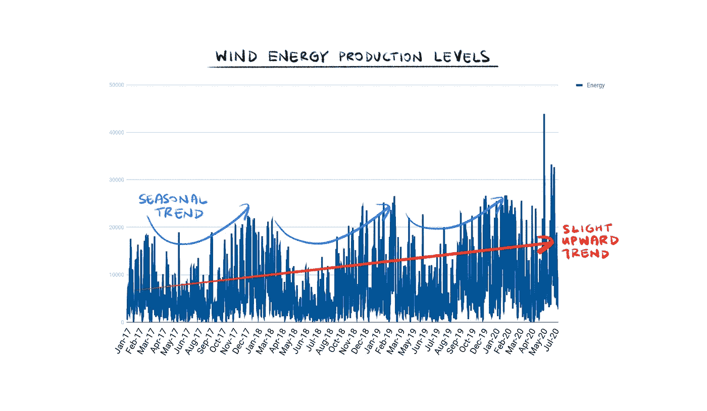

风能生产水平。作者插图。

查看原始数据，我们发现风能生产水平看起来有很强的季节性。风电厂的性能在冬季和秋季往往较高，在春季和夏季较低。我们还可以看到这些年来产生的能量逐渐上升的趋势。这可能是由于多年来运行中的风力发电场数量的增加导致了发电量的增加

## 2.2 风速预测

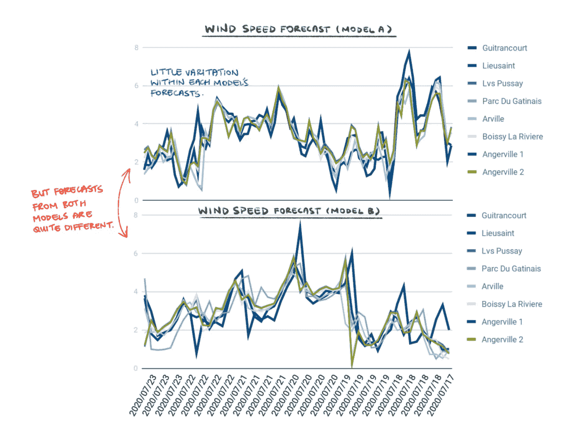

## 2.3 风向预测

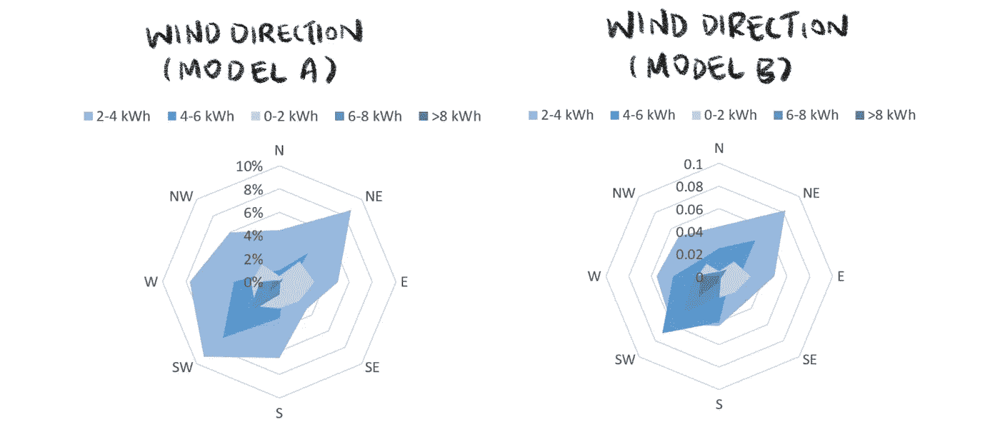

从两个预测模型中可视化风向。作者插图。

我们从两个预报模型中看到，风通常吹向东北和西南方向。

# 3.数据预处理

对于预处理，我们将**空间平均**和**归一化**应用于风速和风向。

假设我们有 32 列数据，仅用于两个基本特征(风速和风向)，平均风速和风向可以帮助减少我们数据输入的维度，潜在地使数据**噪音更少，并且计算成本更低**。

由于风能水平、速度和方向都是以不同的单位测量的，因此标准化也是必要的，以确保所有这些值**共享一个共同的标度，而不会扭曲它们各自值范围**的差异。

## 3.1 预处理风速

从上面看风速预测图，我们看到每个模型对 8 个地点的预测看起来非常相似。因此，在 8 个地点取一个简单的平均值是有意义的。对两种预测模型都这样做可以将风速的列数从 16 列减少到 2 列。

使用下面的公式对风速进行归一化是很简单的，我们对风能生产水平也是如此。这样，我们将分布风速和发电量水平集中在 0 左右，它们现在共享相同的标度，即大多数值在[ -1，1 ]之间的标准偏差数。

标准化公式。作者插图。

## 3.2 预处理风向

因为方向是以北纬度来测量的，平均化和归一化风向是一个稍微不那么直接的问题，因此也是一个有趣的问题。

简单地将所有 8 个位置的方向之和除以 8 是不准确的(注意，这在平均风速时是可以接受的，认为 50 公里/小时是 40 公里/小时和 60 公里/小时的平均值)。取 359 和 1 之间的平均值，(359 +1 )/2，会得出平均值 180，这与 359 和 1 的方向完全相反！因此，我们需要另一种平均方向数据的方法。

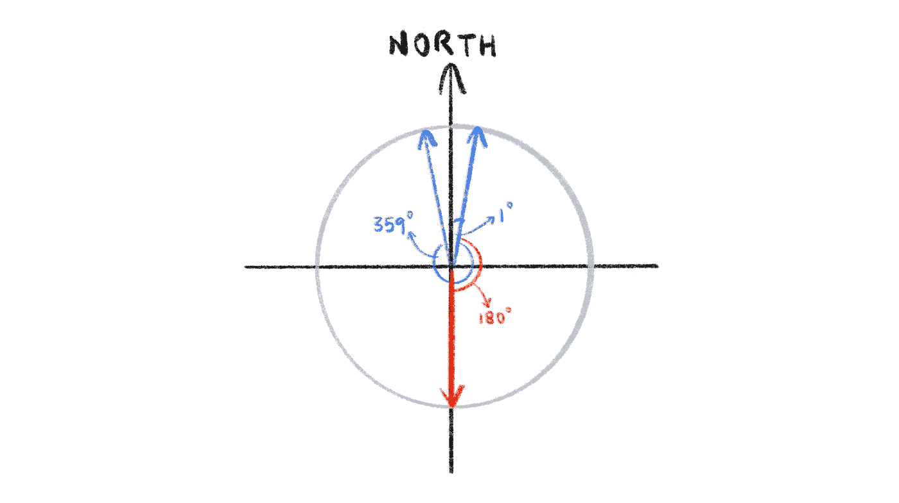

取 359 和 1 的平均值，给我们一个方向，指向几乎完全相反的方向。作者插图。

因为弧度通过使用它所描绘的弧的长度来测量角度[1]，我们可以通过首先**将角度转换为弧度来解决这个问题，归一化，然后最后在 8 个位置上求平均值**。请注意，我们必须在取平均值之前进行归一化，否则我们仍然会面临上述相同的问题。

为了归一化以弧度度量的方向，我们必须取它们的正弦和余弦来将方向压缩到[ -1，1 ]的范围内。我们必须同时取正弦和余弦，因为忽略任何一个函数都无法判断原始角度来自哪个象限。下图说明了这个数学问题。只有 sin(x) = ( **√** 2)/2 给我们两个可能的值 x = {(1/4)π，(3/4)π}。只有 cos(x) = ( **√** 2)/2 也给了我们两个可能的值 x = {(1/4)π，(7/4)π}。但是，知道了 sin(x) = cos(x) = ( **√** 2)/2 就告诉我们，x = (1/4)π。

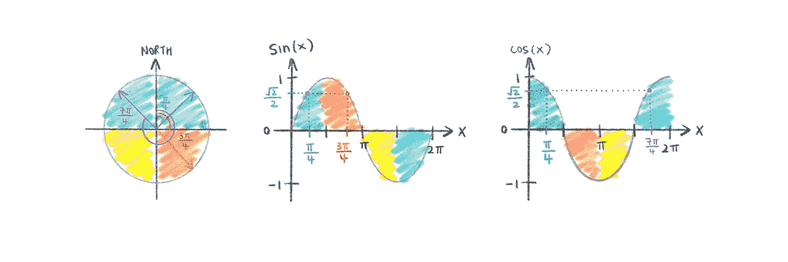

使用正弦和余弦函数来归一化方向。作者插图。

在平均和标准化之后，我们设法将原始的 33 列数据压缩到 7 列，而没有丢失太多信息。

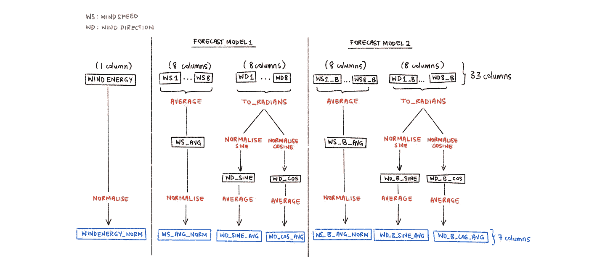

数据预处理的可视化概要。作者插图。

# 4.要优化的两个指标

在探索特征工程和我们的模型之前，我们必须理解在优化我们的特征和模型时作为我们衡量标准的两个标准。它们是:

1.  MAE 试验损失——最小化。
2.  美元利润占总可能利润的百分比(利润比率)——最大化。

请注意，MAE 的持久性损失为 0.6483，这是我们选择的功能和模型要克服的损失。此外，第 7 节“限制”将解释为什么使用 MAE 试验损失。

# 5.特征工程

平均和归一化帮助我们预处理原始数据集。从这个预处理过的数据集中，我们可以使用**特征工程**来准备我们的模型将要学习的实际输入数据集。特征工程是关于**从我们现有的输入特征**(预处理的原始数据集)中创建新的输入特征。

> 一般来说，你可以把数据清理看成是一个减法的过程，把特征工程看成是一个加法的过程。[2]

## 5.1 进行切割的特征

我们的特征工程在很大程度上是一个迭代过程，伴随着我们的模型构建过程(我们将在下一节深入探讨)。我们经历了许多功能，丢弃了我们(错误地)认为是好的原始功能，并添加了我们从未想过会起作用的新功能。经过一系列的试验和错误，这些是最终的特点，使削减。

我们最终的工程特征。

对于我们的窗口选择，我们分别从 0:-5 和 18:0 的小天真窗口开始，因为从太大的窗口开始会导致较差的学习。然后，我们慢慢增加窗口大小，因为小窗口可能会排除数据中的重要信息。我们发现，发电量的窗口为 0:-54(预测窗口的三倍)，风速和风向的窗口分别为 18:-18(预测窗口的两倍)时，模型性能最佳。

## **5.2 未被切割的特征**

我们试验过的其他功能包括:

*   **风速的立方值:**我们试图使用风力发电方程来注入领域知识，其中风速是一个立方变量。然而，在测试中，我们发现使用立方风速比使用原始风速在利润和测试损失方面表现更差。

风力发电方程式。作者插图。

*   **捕捉风速和风向之间的相互作用:**我们认为风能高度依赖于风速和风向是很直观的。根据我们外行人的直觉，如果我们的风吹向正确的方向，但速度很低(或速度很高，但方向错误)，这将导致产生的能量水平很低。反过来看起来也是一个合理的论点。因此，我们试图通过乘以风速和风向来捕捉这种相互作用。然而，我们发现这些特征并没有帮助改善模型的测试损失或利润。
*   **差异、动量和力:**我们对 2、6、9 和 18 的差异、动量和力项进行了实验，发现模型几乎没有改进。在某些情况下，该模型甚至表现更差。
*   **原始风速和风向窗口:**我们使用风速和风向窗口作为输入进行测试。数据窗口可以捕捉趋势和模式等重要信息。然而，需要注意的是，具有相似速度和方向的窗口可以被映射到彼此非常不同的向量(即较差的聚类)。我们的测试表明，使用从移动窗口得到的特征集合的模型(**表示**、**标准偏差**、**最大值**、**最小值**、**一阶微分**和**平均二阶微分**)始终优于使用原始速度和方向的移动窗口的模型。

# 6.模特们

有了经过预处理的原始数据和一系列工程功能，我们现在完全有能力开始试验我们神经网络的**架构**、**调整其超参数**和**评估其性能**，以便决定部署最合适的模型。

在我们运行的无数模型中，我们从实验的 3 个阶段中的每一个阶段记录了一个关键模型，该模型捕捉了我们的意图和模型的结果。

## 6.1 模型 V0 —基线基准

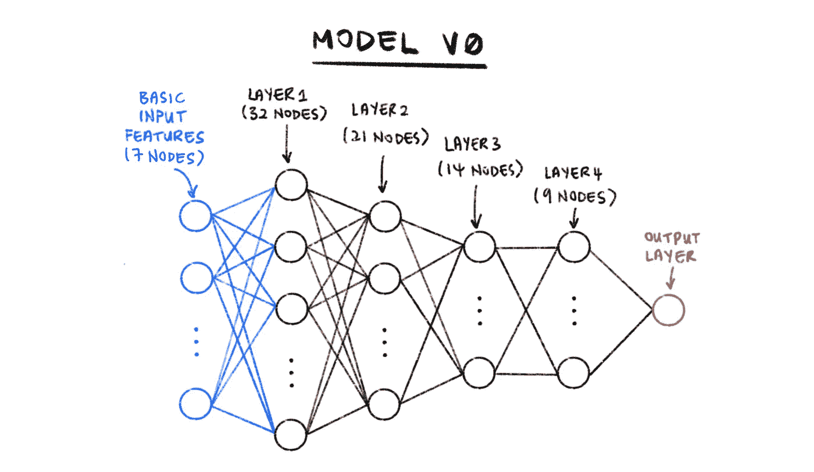

模型 V0 的架构。作者插图。

我们从最基本的神经网络和最基本的特征开始，如图所示。在保持⅔减少层间节点数量的同时，我们对第 1 层的节点数量进行了试验。如下所列，我们试验了第 1 层中节点数量的不同配置、损失函数的类型和反向传播算法的类型。第 1 层中的**【32】**、用于反向传播的**【MAE】**损失函数和**【Adam】**的配置(下面加粗)产生了 0.7306 的最小测试损失和 0.4218 的利润比率。

这个模型设置了基线基准，我们的目标是在后续的模型迭代中超越它。

*   **网络:**⅔归约 4 层，从第 1 层的 16 / [ **32 ]** / 64 个节点开始。
*   **输入特征:**T0 时的风能值，T18 时每个模型的平均风速和风向(余弦和正弦)(7 列)
*   **损失函数:** RMSE / **【梅】/** 非对称*
*   **反向传播算法:****【Adam】/**SGD
*   **最小。测试损失:** 0.7306
*   利润/最大值。可能利润: 0.4218

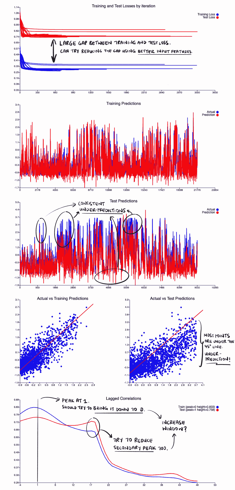

## 6.2 模型—试验我们的工程特性

模仿 V1 的建筑。作者插图。

一旦我们确定了神经网络的粗略结构，我们就开始用 4.1 节中提到的工程特征进行实验。使用我们设计的所有特征，第 1 层中的**【128】****【MAE】**损失函数和用于反向传播的**【Adam】**的配置产生(下面加粗)0.4829 的最小测试损失和 0.5804 的利润。这种配置是 V0 车型基准测试的最大改进。

*   **网络:**⅔归约的 4 层，从第 1 层的 32/64/**【128】**节点开始。
*   **输入特性:**第 4.1 节中提到的所有工程特性(313 列)
*   **损失函数:** RMSE / **【美】** /不对称
*   **反向传播算法:****【Adam】/**SGD
*   **最小。测试损失:** 0.4829
*   **利润/最大。可能利润:** 0.5804

## 6.3 模拟 V2 —体验复杂的网络功能

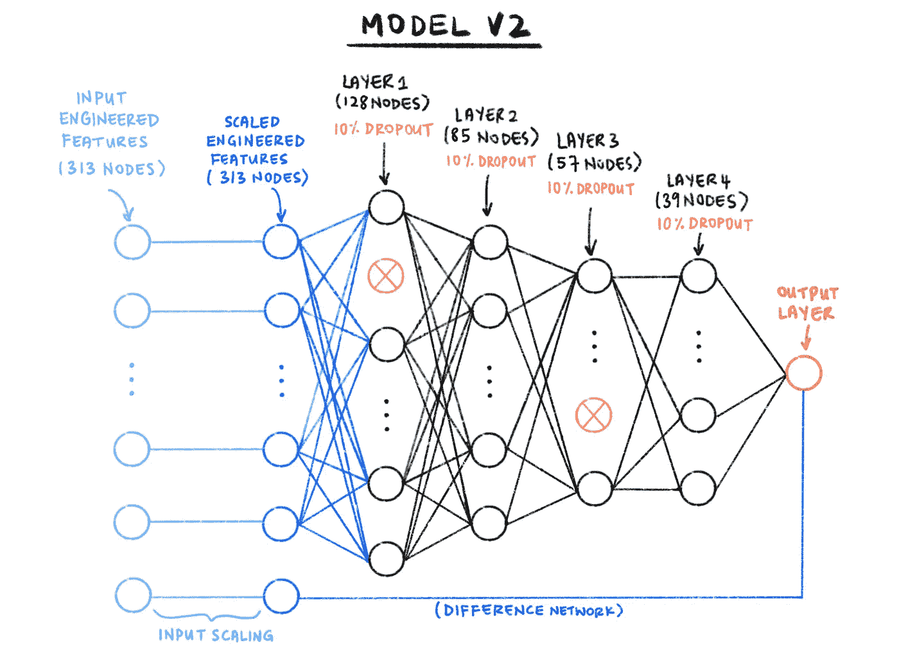

模仿 V2 的建筑。作者插图。

我们从使用 V1 模型的实验中了解到，与基准测试相比，我们的工程特性始终提供更低的测试损失和更高的利润。在这最后一轮实验中，我们因此坚持使用我们所有的工程功能，并试验了更复杂的网络功能，如输入缩放、退出和 L2 正则化。这一次，从输入缩放**【无】**箝位、**【128】**第一层节点、**【0.1】**丢失概率、**【0.001】**L2 正则化权重衰减、**【MAE】**损失函数和**【Adam】**反向传播(下面加粗)开始的配置产生了最低的测试损失 0.4794。

*   **网络:** 4 层带⅔归约，从第 1 层的 32/64/**【128】**节点开始。
*   **输入缩放:**带/ **【不带】**箝位
*   **退出概率:[0.1]** / 0.2 / 0.25
*   **L2 正规化重量衰减:[0.001]**/0.0001/0.00001/0.000001
*   **输入特性:**第 4.1 节中提到的所有工程特性(313 列)
*   **损失函数:**RMSE/**【MAE】**/不对称
*   **反向传播算法:** **【亚当】/** SGD
*   **最小。测试损失:** 0.4794
*   **利润/最大值。可能的利润:** 0.5912

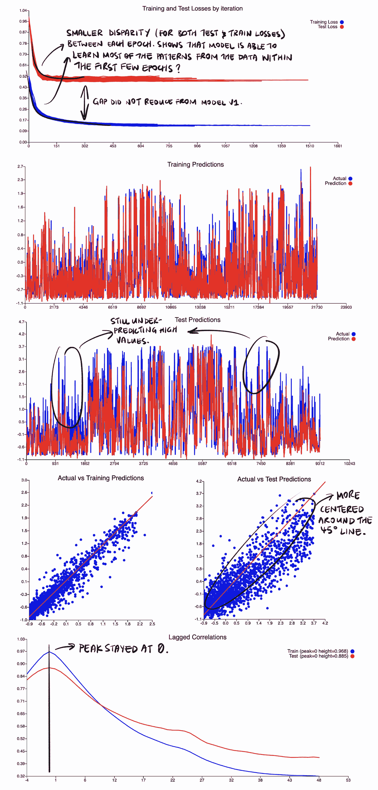

## 6.4 其他实验/模型:

在上面列出的三种主要类型的实验中，这些是我们实验的其他修改，它们没有针对我们的两个指标优化我们的模型:

*   **添加第五层:**由于我们的训练数据集相对较大，我们想看看我们的模型是否会随着额外的复杂性而改进，因此用第五层对其进行了测试。然而，这增加了我们的测试损失，反而导致更多的过度拟合。
*   **瓶颈尺寸为 1.5、2、4 和 8 的自动编码器**:由于我们的神经网络正在处理大尺寸输入(> 300)，我们希望使用自动编码器来降低尺寸。然而，这反而使我们的测试损失和利润更糟。
*   **平方感知器:**平方感知器作为普通感知器的替代物，可能有助于模型比普通感知器学习得更好，但在我们的模型中，没有平方感知器的模型表现更好。
*   **动量和力损失:**动量和力损失通常是为了帮助减少滞后，但在我们的情况下，我们的滞后相关性已经达到峰值 0。不管怎样，我们对这些损失进行了试验，正如所预料的那样，有动量和力损失的模型最终会有更严重的试验损失，因为求差通常会导致更大的噪声。

# 7.局限性和未来的改进

## 7.1 H **测试损耗高，培训与测试损耗差距仍然很大**

这表明该模型对看不见的数据概括得不够好，可能是网络可能正在记忆训练数据的警告信号。即使有了功能工程，微调现有功能的窗口，在 V2 模型中添加辍学和体重调整，这些变化也只是略微改善了训练和测试损失之间的差距。相对较高的测试损失和较大的差距的两个可能原因是:(1)数据本身非常嘈杂，以及(2)所提供的数据不能真正预测风能生产。

解决非预测性数据问题的一个潜在方法是**获取更多预测性数据**。在预测风能生产的情况下，我们可以考虑包括空气密度、风电场的效率系数和转子叶片长度(所有这些都属于风力发电方程的术语)的外部数据源。这可能会提高我们拥有的预测数据的数量，从而提高神经网络的概括能力。

## **7.2 一致的预测不足**

从“实际与测试预测”图中，我们看到在我们的模型中，大部分绘制点倾向于低于 45 度线。这意味着我们的模型总是低估风能产量。这在“测试预测”图中也可以看到，我们在上部区域看到更多的蓝色，表明上部值经常预测不足。

预测不足的一个可能原因是我们用来训练模型的数据集。在用于训练模型的原始数据集中，我们有从 2017 年 1 月 1 日至今所有 8 个位置的风速和风向预测。虽然每个位置代表了法兰西岛地区一个主要风电场的位置，但 Boissy-la-Rivière 仅从 2017 年 8 月开始运行，而 Angerville 1 和 Angerville 2 (Les Pointes)仅从 2019 年 7 月 2 日开始运行。对于给定的风力预测，这可能会影响该地区的总发电量(即，相同的平均风速可能会导致 2019 年下半年的风能发电量高于 2017 年上半年)。这可能会在数据中引入噪声——不是由于我们的模型输入的变化而导致的风能产量的变化。

因此，我们在 3 个数据集上测试了我们的 V2 模型:

1.  从 2017 年 1 月 1 日至今的**原始数据集**
2.  一个**加权数据集**，将 2017 年 8 月 1 日之前的能源实际值乘以 50%，将 2017 年 8 月 1 日至 2019 年 7 月 2 日之间的能源实际值乘以 80%，将 2019 年 7 月 2 日之后的能源实际值乘以 100%。根据以下公式估算各持续时间的权重: *%运行中的风能发电量=当前运行中的风电场的总估算标称功率输出*⊙*8 个主要风电场的总估算标称功率输出。*
3.  一个**截断数据集**，仅包含 2019 年 7 月 2 日之后的数据，基于所有 8 个风电场都在运行且风能生产能力从该点起没有显著变化的假设。

以下是结果对比:

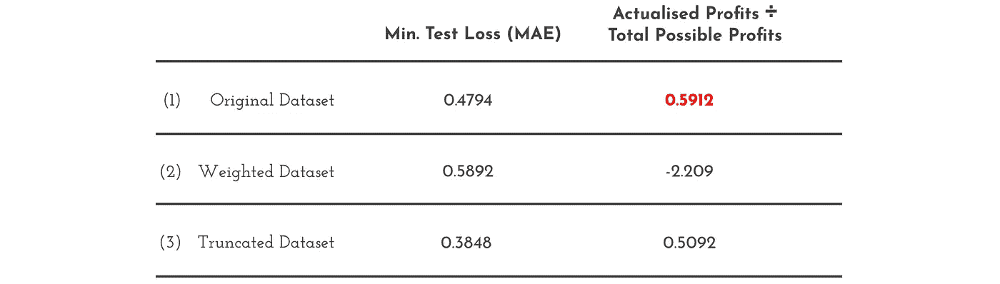

原始数据集、加权数据集和截断数据集之间的 MAE 测试损失比较→原始数据集优于其他数据集。

尽管在截断数据集上训练的模型导致最低的测试损失 0.38，但在原始数据集上训练的模型导致最高的**实际利润与总可能利润比率**。在加权数据集上训练的模型在这两个指标方面表现最差，甚至导致了大量的美元损失。**最后，我们决定坚持使用原始数据集，因为我们的目标是最大化利润，而不是最小化测试损失**。

假设法兰西岛地区的风能发电量不变，当 2019 年 7 月 2 日之后有大量数据可用时，使用截断数据集可能是一种可行的方法，可以改善我们未来的测试损失和利润。

## **7.3 MAE 测试损失可能与利润最大化目标不一致**

我们采用的 MAE 测试损失**对每个预测不足和预测过度的单元进行相同程度的惩罚**。然而，从挑战的设置中，我们知道 1 千瓦时的过度预测的成本是 1 千瓦时的两倍，而 1 千瓦时的预测不足。因此，MAE 测试损失不是我们预测误差相对成本的真实反映，因此可能不是用于优化我们模型的最佳指标。

因此，我们定义了自己的损失函数:

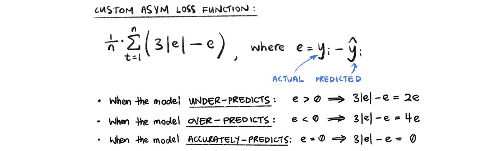

我们定制的损失函数——不对称损失，对过度预测的惩罚大于对不足预测的惩罚。

通过这种方式，我们能够更准确地反映我们的挑战设置，并对过度预测进行两倍于不足预测的惩罚。

我们在原始数据集上测试了我们的模型性能，但是使用了两个不同的损失函数:

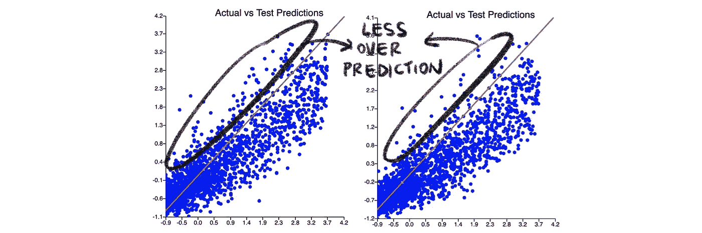

MAE(左)和 ASYM(右)损失的实际与测试预测图。

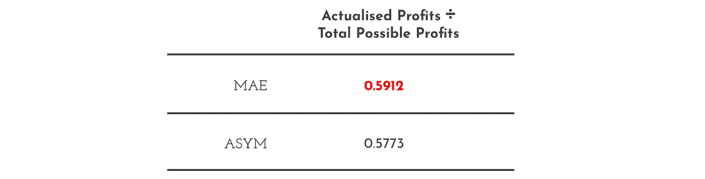

比较 MAE 和 ASYM 损失函数的利润率→ MAE 优于 ASYM。

我们看到，在“实际与测试预测”图中，与使用 MAE 损失函数相比，使用 ASYM 损失函数减少了过度预测的数量，增加了预测不足的数量。这是意料之中的，因为我们对过度预测的惩罚比对预测不足的多。

然而，当我们比较实际利润和总可能利润时，我们发现使用 **MAE 测试损失比 ASYM 测试损失**帮助我们的模型获得更多利润。因此，最终，我们选择使用 MAE 测试损失。

使用 ASYM 没有提高我们的利润的一个原因，即使它更能反映挑战设置，可能是由于我们的模型中已经存在更普遍的预测不足的问题(见限制 7.2)。我们的模型已经显示出预测不足而不是预测过度的趋势，因此使用 ASYM 将使我们模型中的预测不足问题更加严重，而对我们的预测过度仅做出适度的改进，因此导致我们在潜在利润上损失更多。因此，只有当 7.2 的限制得到解决，我们得到更好的数据时，不对称损失函数才可能是一个更可行的解决方案。

## 谢谢你

如果你已经读完了这篇文章，我希望你喜欢这篇文章。如果这篇文章给你自己的项目带来了一些启发、价值和帮助，请随意与你的社区分享。此外，任何建设性的问题，反馈或讨论都是绝对受欢迎的，所以请随时在下面评论或通过 Twitter 联系我，地址是 **@CleonW_。**

## 参考

[1][https://better explained . com/articles/intuitive-guide-to-angles-degrees-and-radians/](https://betterexplained.com/articles/intuitive-guide-to-angles-degrees-and-radians/)

[2][https://elitedatascience.com/feature-engineering](https://elitedatascience.com/feature-engineering)