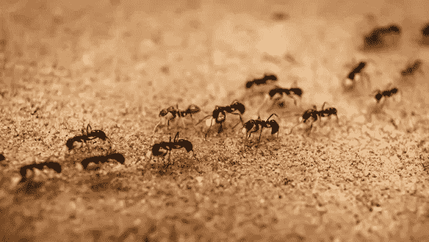
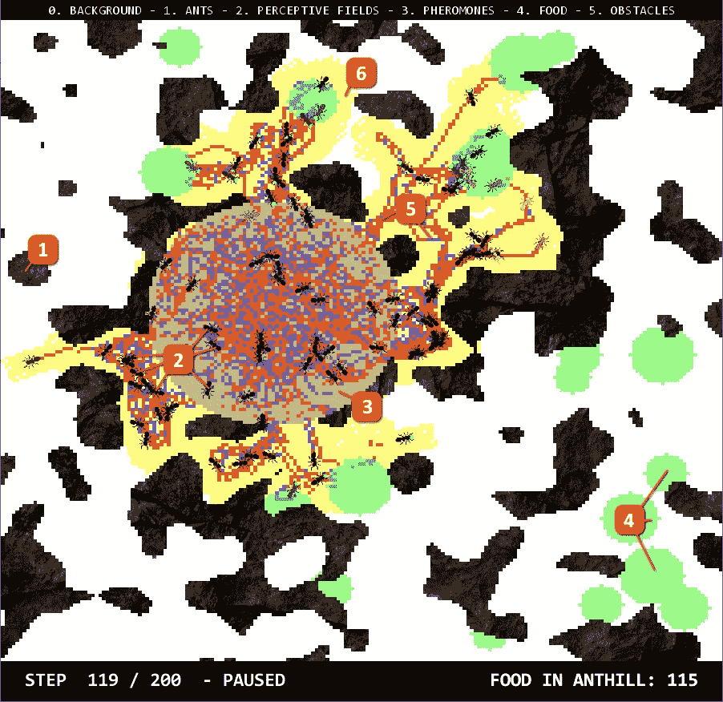
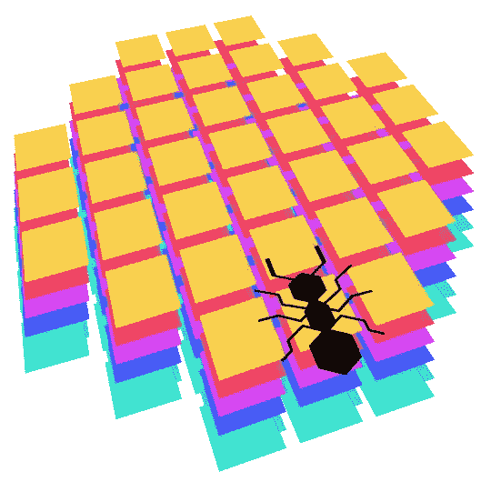
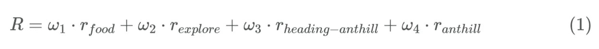
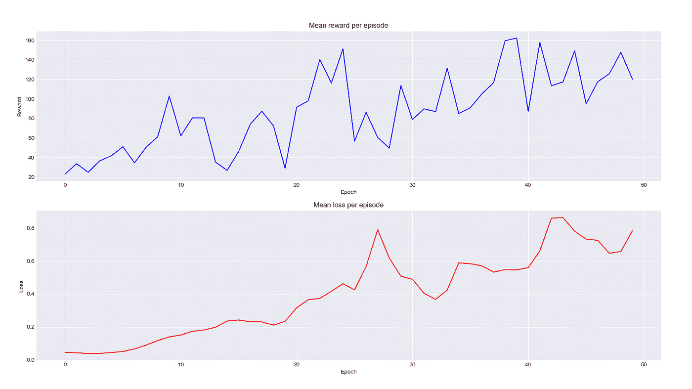
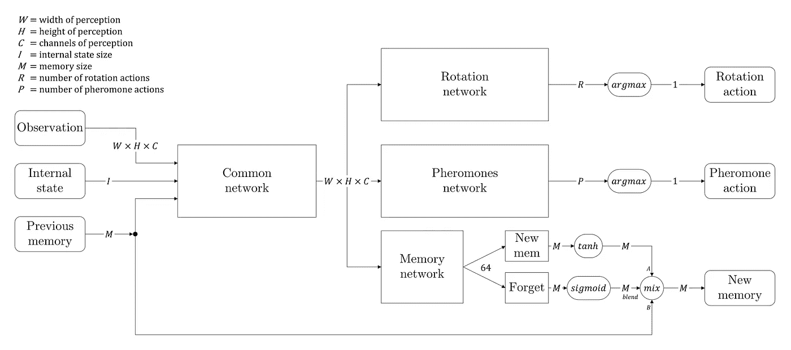

# 我们如何用强化学习训练蚂蚁

> 原文：<https://towardsdatascience.com/how-we-trained-ants-using-reinforcement-learning-7ec651c08cc0?source=collection_archive---------43----------------------->

## 一个模拟蚂蚁的项目。深度强化学习和多智能体系统的混合。

> 编剧:安东宁·杜瓦尔和托马斯·拉姆森

图片:ALLGORD/ISTOCKPHOTO

如果你曾经观察过一群蚂蚁，你可能会注意到它们看起来是多么有组织。为了采集食物和抵御威胁，平均 250，000 只蚂蚁需要合作和自我组织。通过使用特定的角色和一种强大的工具——信息素——成千上万只有些受限的蚂蚁可以合作实现更大的目标。

我们感兴趣的是探索这种行为在模拟环境中的出现。给一些“蚂蚁”正确的工具使用和探索的环境，我们会看到这些现象从无到有吗？

在多智能体理论和强化学习的交叉路口，我们设计了一个系统，让一群非常简单的蚂蚁制定聪明的策略来优化它们的食物供应。

为了引起您的注意，并让您更好地理解我们在这里尝试做的事情，请看一下我们美丽的随机代理的这个快速视频。

50 只蚂蚁的随机智能体模拟

它做的不多，但你会看到我们将如何改善我们的蚂蚁，让他们一起工作！我们将在下面进一步解释环境如何工作以及代理如何与之交互。

# 钻研手头的问题

## 假设

为了让我们训练的蚂蚁的行为接近真正的蚂蚁，我们首先以一种聪明的方式设计它们的环境是很重要的。所以，让我们来看看我们做实验的主要假设。

第一个也是最重要的假设是**药剂的完全隔离**。这是*多代理*范例的主要假设之一:代理没有任何不通过环境本身的直接通信方式。

第二个假设是感知的相对性。重要的是我们的特工不知道他们在世界上的位置和方位。总的来说，他们只是从个人的角度看世界。

## 环境

对于任何 RL 应用程序，环境的定义是项目的核心。

我们蚂蚁的环境截图

1.  **墙壁:**那些是程序生成的岩石，禁止蚂蚁通过。
2.  蚂蚁:我们代理商的代表是这些小黑蚂蚁。
3.  **蚁丘:**中间的蓝色圆圈是每个蚂蚁来的地方，也是每个蚂蚁带食物回来的地方。
4.  食物:那些绿色的圆圈，也是程序生成的，是食物来源。蚂蚁可以把它们捡起来，去掉一个像素，然后把它丢进蚁丘。
5.  **信息素:**我们给蚂蚁两种信息素。一个红色的和一个蓝色的。两者都是自己下面的蚂蚁沉淀下来的，随着时间的推移慢慢淡去。
6.  **探索地图:**我们的蚂蚁完全看不到，这个黄色的可视化区域代表了地图上被所有蚁群探索过的区域。

生成环境的代码尽可能简单，以便任何人都可以尝试不同的地图配置。通过使用不同的程序生成器，你可以生成不同密度的墙，许多或一些食物源，远离或不远离蚁丘，等等。最后，如果必要的话，可以指定一个种子来确保生成的环境是受控的，这对于在同一个地图上评估我们不同的代理是有用的。

## 代理人

你已经在上面的图片中看到他们了，但是让我们给出更多关于我们的代理的细节:蚂蚁。正如假设中所解释的，我们的代理完全相互独立，不共享任何直接信息。他们的内部定义随着我们实现的不同模型而变化，但是他们对世界的感知和对世界的行为方式是相同的。

你可以看到当一只蚂蚁捡起一些食物时:它的下颚间有一个绿点。是不是很可爱？

## 感觉

他们能看到前方一定半径范围内的情况。这是一个代表他们感知形状的图像，用 2D 网格中的离散槽来表示。首先，我们通过应用相对于它们当前位置的平移和旋转来计算每个感知槽的浮点坐标，然后我们对这些坐标进行舍入以获得它们感知的真实 2D 网格槽。它有时会给出奇怪的结果，但是我们认为我们的蚂蚁就像真正的蚂蚁一样:非常不善于观察事物！然而，他们应该能够很容易地发现他们面前的信息素，墙壁，食物或其他蚂蚁。

蚂蚁在我们的模拟中所能看到的视觉表现

用数学术语来说，他们的感知总是一个 7x7 的正方形矩阵，用一个面具使它更圆，用尽可能多的层来代表他们视觉的每个“通道”。在我们的例子中，世界上每一种类型的物体(蚁丘、其他蚂蚁、食物、墙壁、信息素等。)表现在不同的感知层面上。这给出了非常有规律的感觉，这种感觉很容易在以后反馈给神经网络。

## 行动

蚂蚁可以执行两种类型的动作:

1.  好转
2.  存放选定类型的信息素

当它们的下颚空了，地板上有食物时，它们会自动捡起食物，如果它们在蚁丘里，它们会扔掉食物。我们也可以让他们学习这些动作，但是我们认为这些简单的规则并不复杂，所以我们节省了一些学习时间并手动实现了它们。

最终，我们的蚂蚁不得不控制它们的**航向**朝着正确的方向前进，并且**释放信息素**与其他蚂蚁进行长期交流。正如我们将看到的，这已经很困难了。

# 如何激励蚂蚁

在这个阶段，我们有功能，但完全空的蚂蚁壳。现在是赋予他们*生命*并让他们实际行动的时候了。

如果你以前听说过**强化学习**，你就知道学习最优策略的关键要素之一是拥有一个设计良好的*奖励函数*。这就是我们将如何教我们的代理执行某些类型的行为。在这里，我们的蚂蚁只有一个目标:坚持不懈地为蚁丘提供食物。这个简单的任务需要长期规划和社会合作。因此，我们把它分成一系列不同的子目标:较小的奖励，我们将用来告诉我们的蚂蚁“是的，你做得很好，继续这样！”。

这是我们如何编写奖励函数的:

*   当一只蚂蚁在地图上找到美味的沙拉(绿色像素)时，食物奖励就是一个分数。
*   由于蚂蚁没有全球定位系统，它们不知道自己在哪里。他们必须找到一种前进的方式，而不会被堵在墙上，也不会回到蚂蚁之前所在的地方。当他们探索地图的新部分时，我们会给他们奖励。
*   就像一个晚上喝了太多酒，手机没有电池，我们的蚂蚁很难找到回家的路。他们需要一点帮助，但我们没有直接给他们:我们设计了一个奖励，只要他们携带一些食物，减少他们的位置和蚁丘之间的距离，就给他们一个好点。
*   最后的奖励，也是最重要的。在长途跋涉之后，是时候把食物放进蚁丘了。蚂蚁每成功一次，我们就给它一分。

这里，ω1、ω2、ω3 和ω4 是在训练开始时设置的任意因子。这些都是超参数，我们必须非常小心地调整，因为它们完全改变了我们蚂蚁的学习和行为方式。

# 用 DQN 教蚂蚁

这篇帖子的目标不是详细解释什么是深度 Q 学习算法( [Mnih 等人，通过深度强化学习的人类级控制(2015)](https://web.stanford.edu/class/psych209/Readings/MnihEtAlHassibis15NatureControlDeepRL.pdf) [1])。如果你对此不熟悉，我们邀请你阅读[这篇伟大的文章](https://lilianweng.github.io/lil-log/2018/02/19/a-long-peek-into-reinforcement-learning.html) [2]，它解释了你需要知道的关于强化学习的一切！

由于蚂蚁可以同时执行两个动作(移动和存放信息素)，我们需要为每个动作输出 2 组 Q 值。怎么做呢？论文[分支 Q-learning](https://arxiv.org/pdf/1711.08946.pdf) A. Tavakoli，2019【3】给出了一个共享的决策模块，后面跟着几个网络分支，每个行动维度一个。最后，我们有两个独立的网络头预测独立动作的 Q 值。为了决定要执行的动作，我们只需选择每个分支的最大值，这就给出了一个动作组合！

由于我们没有办法确保我们走在正确的方向上(嗯，理论上它*有*可以工作，但这很容易说)，我们决定在一个更简单的问题上迈出第一步:教蚂蚁探索地图。

我们设定ω1 = 1，ω2 = ω3 = ω4 = 0，用 20 只蚂蚁展开了 50 个纪元的训练。下面是结果！

代理人被训练探索 50 个时代的地图。

此回放是在评估模式下从随机地图中截取的。从这个回放中，我们可以得到两个主要的感悟:

1.  代理学会去没有信息素的地方，因为它更有可能是地图上尚未被探索的部分。
2.  特工们学会了用一种有趣的方式使用这两种信息素。他们在探索时使用红色的，当他们通过已经看到的领域时使用蓝色的。那是什么意思？我们不知道。但也许他们有。

太好了，我们的模型成功了！然而，让我们试着更像严谨的科学家，通过展示每一次训练的平均回报和平均损失的图表，向你证明我们的蚂蚁有所提高:

越来越多的损失？嗯，这在强化学习中还不错。在我们的例子中，它主要是增加的，因为我们的代理人得到的回报越来越高，我们也增加了网络在预测这些 Q 值时产生的误差范围。我们真正感兴趣的是蓝色曲线，从中我们可以清楚地看到勘探从随机基线开始增加(它只擅长勘探)。

## 有记忆的特工

我们成功训练了一名探险特工。现在，让我们深吸一口气，深入真正的任务:**让蚂蚁捡起食物并带回蚁丘。**

为此，我们决定改变我们网络的架构，并从 LSTM 网络中获得灵感。我们添加了一个分支来创建**某种内存信息**，它将从当前状态传递到下一个状态。此外，我们在**中添加了一个遗忘门**，这是一个由一系列层组成的堆栈，之后是一个 sigmoid 激活，这样网络就可以在记忆的时候学习*，在*记忆什么*。下图给出了完整的架构。*

我们网络的架构

我们称“内部状态”为两条在感知矩阵中不直接可见的信息:蚂蚁目前持有多少食物，以及一个随机种子，它给每只蚂蚁区分自己的机会(种子在整个事件中对给定的蚂蚁保持不变)。

最后，记忆作为任何观察信息存储在重放记忆中，使每只蚂蚁都有能力被训练正确地记住事情。

# 训练时间！

现在我们有了更强的网络，一个好的奖励功能，我们只需要开始加热机器，开始训练！但是等等…仍然有一些重要的超参数需要选择。

这种多智能体系统的好处是，我们可以让它与任意数量的蚂蚁一起工作。然而，由于像现实生活中那样用 250，000 只蚂蚁进行训练对地球和我们可怜的计算机来说似乎不太合理，我们决定只用 20 只蚂蚁进行训练。

**历元数**该参数根据经验选择。因为环境是用 Python 编码的，所以引擎相当慢。因此，我们不得不将纪元的数量限制在 150–200，以限制训练时间。如果我们与其他强化学习应用程序相比，这是一个相当小的事件数。然而，结果表明，在我们的情况下，获得执行行为就足够了。

**衰减ε**探索是强化学习的关键。我们使用了一个衰减的ϵ因子。这使得我们的特工可以在第一集探索很多，然后慢慢开始挑选最好的行动。

# 结果

终于要看到一些**成果**了！我们的蚂蚁学到什么了吗？我们能解释一下学到的东西吗？我们将从现在开始讨论这类问题。

尽管我们每集训练的步数不超过 1000 步，我们还是制作了一个 20000 步的视频来看看发生了什么。还记得我们如何用 20 只蚂蚁训练我们的模型吗？一旦经过训练，我们实际上可以使用任何数量的蚂蚁！所以，因为更有趣，我们用 50 只蚂蚁做了这个模拟。我们终于可以看到我们的蚂蚁在地图上收集所有的食物，坚持不懈地在整个地图上建立它们的信息素网络，一旦一个用尽就改变目标…我们包括了一些只有信息素的部分，因为我们发现它们很漂亮。

经过 150 个时代的完全训练的蚂蚁

我们观察到它们建立了某种信息素网络，用来在地图上移动。因为他们学会了被某种类型的信息素所吸引，他们更倾向于选择一些路径。这创造了道路的层次，有些是真正的高速公路，有些更像是小乡村小路。

# 结论、未决问题和进一步发展

我们最初的目标有点雄心勃勃:我们已经在想象蚁群为了食物而相互争斗，蚂蚁将石头推出小路或推入小河以通过障碍并获得更多食物……永远以星星为目标！

即使在 150 个世代之后，结果仍然非常有希望，我们确实在蚂蚁社会中看到了一些新出现的行为，这是我们主要关心的。现在，我们觉得我们不能就此止步，但这已经是我们这个项目的最后时间了。然而，这不会阻止我们更新这个项目和这个职位！

在进一步的发展中，我们将让蚂蚁用它们的下颚来行动，以便像其他蚂蚁一样在拾取食物和对抗威胁之间做出选择。我们还将使地图更加复杂，并为蚂蚁提供一种更容易沟通的方式，通过一种可见的状态，当足够近时，其他蚂蚁可以看到。但是在这之前，我们要用 C++重新实现我们的模拟:我们有一个独家新闻，Python 是**慢**。

我们只看到了我们所期望的新兴行为的最开始，但是我们相信，如果我们为我们的代理添加更多的工具，并解决更复杂的问题，我们将会看到越来越多的聪明行为出现！

嗯…很多事情可以做，从我们停下来的地方开始！也许新的篇章会随之而来？谁知道呢。

要获得该项目的完整 Python 源代码，请访问我们的 github:【https://github.com/WeazelDev/AntsRL 

参考资料:

*   [1] Mnih 等[通过深度强化学习实现人的层面控制，](https://web.stanford.edu/class/psych209/Readings/MnihEtAlHassibis15NatureControlDeepRL.pdf) 2015
*   [2] [一(长)窥强化学习(blogpost)](https://lilianweng.github.io/lil-log/2018/02/19/a-long-peek-into-reinforcement-learning.html)
*   [3] A. Tavakoli，分支 Q-learning，2019，NIPS 2017 深度 RL 研讨会
*   [4] R. Sutton，强化学习，导论

我们在整个项目中使用的主要模块:

*   Numpy —用于模拟
*   PyTorch —用于代理定义和 DQN 培训
*   PyGame——用于可视化

全文可以在这里看到:

*   https://antoninduval.github.io/posts/2020/04/blog-post-2/
*   [http://Thomas-lam son . com/ants rl-multi-agent-reinforcement-learning/](http://thomas-lamson.com/antsrl-multi-agent-reinforcement-learning/)

*最初发表于*[https://antoninduval.github.io/](https://antoninduval.github.io/posts/2020/04/blog-post-2/)