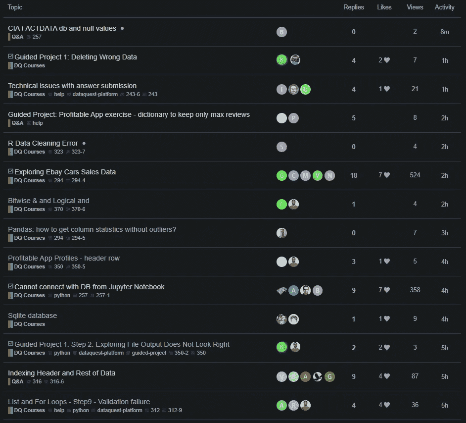

# 网络搜集如何帮助我从学习走向教学

> 原文：<https://towardsdatascience.com/how-web-scraping-helped-me-going-from-learning-to-teaching-20c1bba7a10b?source=collection_archive---------60----------------------->

## 还有一个快速教程

[卡特曼戈斯塔-www.freepik.com 创建的业务向量](https://www.freepik.com/free-photos-vectors/business)

我在今年 2020 年初开始学习数据科学的 python。我基本上没有任何编程背景，除了很久以前在大学里用 *C++* 类编程。虽然我可以在互联网上找到一些很棒的(有时是免费的)课程，但总有一些情况下，你需要向社区寻求一些帮助，有时是因为你不理解一些概念或技术，有时是因为你正在尝试一些更复杂的东西。我过去经常(现在仍然)这样做。

但是通过第五个月的学习，我开始发现这个问题的另一面:那些回答问题的人。我当时(现在仍然)使用一个名为 Dataquest 的在线平台。他们有一个很棒的社区，人们在那里分享项目，寻求帮助等等。在那里我发现，无论你是一个多么初级的人，总会有人比你更初级。

所以，我现在已经在他们社区活跃了一个月左右。在我被他们的新冠肺炎经济资助奖学金录取后，我开始更频繁地去那里。被接受参加这个项目让我对在每个人都经历的困难时期得到帮助感到非常感激，所以我觉得我应该付出更多的努力来帮助别人。然后，我开始每天访问社区，看看我是否能帮助一些人。

我的想法是，如果我可以帮助其他学生解决他们的问题，我不仅可以帮助我回答问题的学生，还可以帮助最初帮助我的平台。

虽然我已经学习了将近六个月，但我仍然不是 python 专家或有经验的数据科学家或类似的人。我只是一名数据科学学生，所以我不确定我是否有能力回答人们的问题。但事实证明，我是。当我继续回答问题时，我注意到我也在帮助自己，因为我必须重温我已经学过的东西，甚至学习新的东西来回答问题。

过了一段时间，我发现自己每天都要在浏览器中输入几次 *community.dataquest.io* ，并且乐在其中。所以我想了一个方法来优化我的时间和我提供的帮助:我写了一个 web scraper，每当有新的问题在社区中发布时，它都会通过电子邮件通知我。

这样做的好处是:

我练习刮痧；
·我不再需要一直手动查看网站；学生的问题可以更快得到回答(当然，如果我有能力回答的话)。

我知道，当你是一个初学者，陷入困境时，很容易失去动力，特别是如果你依赖社区来获得一些答案，并且需要等待几个小时甚至几天才能得到一个允许你继续前进的答案。

坏处是…嗯，我没看到。每个人都赢了。

在我让我的 scraper 工作之后，我觉得把这个想法和代码分享给社区中的每个人会很好。我分享的目的只是试图让更多的人帮助别人，展示刮擦(这很有趣)可以很简单，也许会让一些人对它感兴趣，当然，分享我所做的。这个想法很受其他用户和版主的欢迎，我被鼓励去发表这个想法，并接触更多的读者。所以，我现在在这里。

# 说够了，让我们编码吧！

在我让这个刮刀开始工作后，我每天回答的问题数量激增，现在你已经知道了这个刮刀背后的历史，让我向你展示我是如何让它发生的。

首先，代码是使用谷歌 Chrome 来废弃和 Gmail 来发送电子邮件。当然，你可以使用其他人，但这取决于你。

我们将从导入我们将使用的库开始。你可能已经熟悉了*熊猫*和*时间*的*睡眠*功能。除此之外，我们将使用 [*smtplib*](https://docs.python.org/3/library/smtplib.html) 发送电子邮件和 [*selenium*](https://selenium-python.readthedocs.io/) 这是一个非常强大的工具来废弃网站。如果你喜欢网络抓取，selenium 是必须的。
此外，你需要下载[*Chrome web driver*](https://sites.google.com/a/chromium.org/chromedriver/downloads)*(如果你使用 Chrome 的话)，并把它放在你的脚本所在的目录下。*

*现在，我们将编写 *send_email* 函数来发送电子邮件。这个函数非常简单，即使你从未使用过 smtplib。
我们将使用 *try* 和 *except* 子句，这样当脚本无法连接到 Gmail 服务器时就不会出现错误。*

*现在，我们去刮痧吧。我们将使用一个无限循环来保持代码一直运行，在代码结束时，我们将使用 *sleep* 来设置我们希望 scraper 在每次检查新帖子之间等待的时间。从现在开始，一切都在*里面，而*里面。*

*因此，首先我们设置 *selenium* 并实例化*驱动程序*对象。然后我们告诉*驱动*到*获取*网站。如果你将 *option.headless* 设置为 *False* 你就可以实际看到你的浏览器打开并进入网站废弃数据，这真的很有趣。*

*现在我们在社区中，这是我们感兴趣的网站部分。如果你懂 HTML，你就会知道这是一个表格。如果你没有，你不需要担心:*

**

*社区的问答部分*

*我们将使用 *pd.read_htm* l 来读取*驱动*的页面源。这将返回一个列表，以数据帧的形式显示网站上的所有表格。由于我们抓取的页面只有一个表(我们想要的表)，我们将把列表的第一个(也是唯一的)元素赋给我们的 *table* 变量:*

*这是*表*:*

*虽然你在这里看不到它，但它有你在之前的图像中可以看到的所有列。另外，请注意，第一个主题似乎是我们不感兴趣的固定主题，因为我们正在寻找新的主题。然后，我们将使用切片来选择前十个主题，不选择固定的主题，只选择*主题*、*回复*和*活动*列。*

*我们还需要将 activity 列分成两列，第一列只包含数字，另一列包含表示时间单位(小时或分钟)的字母:*

*现在我们有了这个:*

*我将一个新主题定义为 scraper 运行前不到 10 分钟创建的没有回复的主题。因此，我们将创建*new _ topics**data frame*，只选择满足这些要求的行。然后，我们将使用*形状*方法将新主题的数量分配给变量 *num_new* :*

*然后我们有:*

*工作基本上完成了。我们将使用一个 *if* 语句来检查新帖子的数量是否大于零，如果是，我们将设置主题、消息并调用 *send_email* 函数。如果它不大于零，它将只打印“没有找到新主题。”。*

*主题包含新帖子的数量，消息正文包含*new _ topics*data frame 以便我们可以看到新主题的标题。该消息还包含 url，因此我们只需点击即可直接进入社区。

之后，我们将使用 *sleep* 让我们的代码在再次检查网站之前等待。我把它设置为十分钟，我认为这是一个公平的时间量。*

*最后，要从您的 Gmail 帐户发送电子邮件，您必须允许在您的帐户中使用不太安全的应用程序。我没有为此提供链接，只是谷歌"*不太安全的应用程序谷歌"*，你会看到如何做。*

*仅此而已。你可以随意使用这段代码，它是完全免费的。完整的代码可以在 GitHub 库中找到。*

*我希望你喜欢这一点，它可以在某种程度上有用。正如我所说的，我只是想帮助或者激励人们，并且认为我至少完成了其中的一项。*

*如果你有问题，有建议，或者只是想保持联系，请随时通过 [Twitter](https://twitter.com/simoessotavio) 、 [GitHub](https://github.com/otavio-s-s/data_science) ，或者 [Linkedin](https://www.linkedin.com/in/otavioss28/) 联系。*