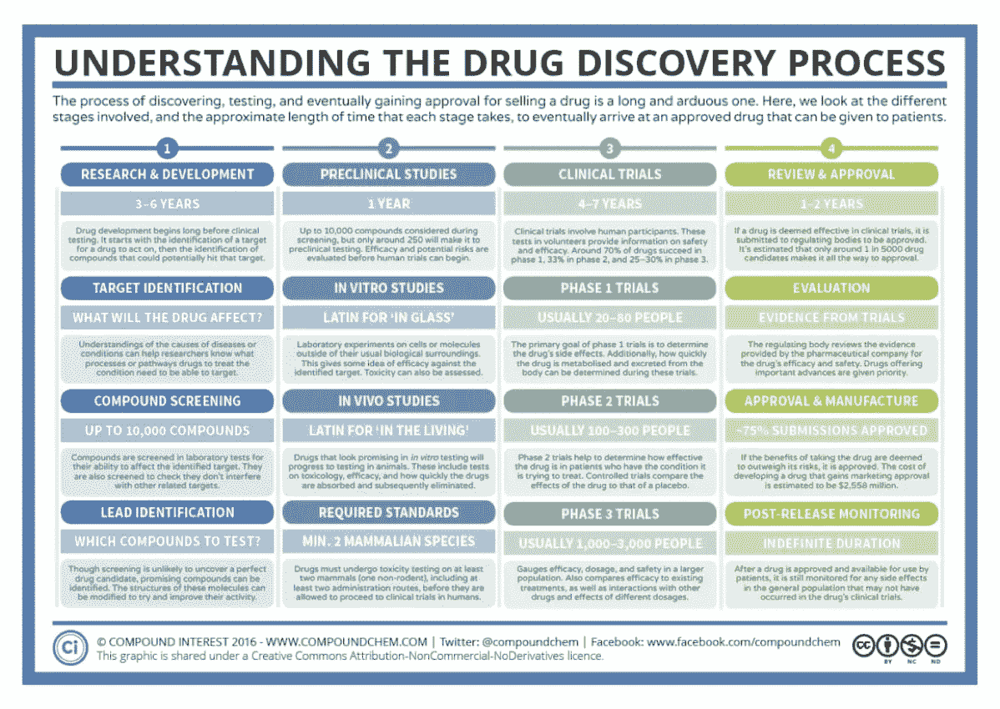

# 人工智能将如何加速药物发现？

> 原文：<https://towardsdatascience.com/how-will-ai-accelerate-drug-discovery-c6386ff0644f?source=collection_archive---------74----------------------->

## (并导致新的、更便宜的药物和患者健康的改善)

# 药物研发的成本

众所周知，药物开发过程非常困难；一种药物从识别出分子到临床应用平均需要 10-15 年的时间，只有大约 3%的初始药物能够顺利通过。一种药物从开发到最后一关失败的成本通常超过 10 亿美元。

对于那些不熟悉药物开发途径的人，这里有一个有用的概述:

如图所示，药物可能在许多阶段失效。早失败比晚失败好得多，所以任何预测哪些药物会失败的能力都是有利的(正如我们将看到的..).不过这样做可能相当困难。

更糟糕的是，开发药物的成本在增加，而开发的成功率在降低(见 [Eroom 定律](https://en.wikipedia.org/wiki/Eroom%27s_law))。制药公司在公众中的名声也不好，各种各样的法规限制不正当的行为(比如人为抬高价格)。总而言之，这为制药公司的发展创造了一个相当棘手的局面…

# 机器学习:隧道尽头的光？

那么，机器学习(ML)如何提供一条出路呢？在我看来，它从根本上归结于其**卓越的模式识别能力**，这种能力可以应用于多种方式。让我们按照时间顺序，从这个角度来看它的具体用法。

## 1.候选人识别和选择

考虑到测试一个分子需要投入大量的时间和成本，花大力气鉴别和选择分子是有意义的。传统上，相当经验性的方法更受青睐，如一系列的溶解度、蛋白结合强度、细胞毒性、分子稳定性等测试。已经尝试采取更“第一原理”的方法，基于我们当前对疾病的理解来识别潜在的分子。虽然很吸引人，但这样做很困难，部分原因是生物系统的复杂性。[refoxcib 就是这种](https://www.ncbi.nlm.nih.gov/pmc/articles/PMC1779871/)的一个例子。

通过*模式识别*，ML 提供了识别候选人的新方法。逻辑是这样的:候选项越多，其中包含好候选项的概率就越大。一种新颖的方法是使用 [GANs](https://en.wikipedia.org/wiki/Generative_adversarial_network) ，它训练一个网络来生成与现有分子相似的潜在分子。最近的一个成功案例是去年发表在《自然》杂志上的[。](https://www.nature.com/articles/s41587-019-0224-x)

另一种方法是使用“知识图”，它将靶标、抑制剂和疾病之间的关系表示为相互连接的节点。基本原理是，通过研究已知的关系，我们可以识别新的关系。例如，如果已知分子 1 抑制信号蛋白 x、y 和 z，并且对疾病 A 有效，并且已知分子 2 也抑制 x、y 和 z(但是到目前为止仅用于治疗疾病 B)，那么分子 2 可能也对疾病 A 有效。这是一个过于简单的例子，但是 ML 可以使这种逻辑在规模上得以遵循。Benevolent.ai [已经描述了](https://www.youtube.com/watch?v=Ba4G_pZZdaQ)他们如何使用这种方法来识别目标。

按照咒语 ***快速失败*** 的说法，尽早识别将失败的分子是值得的。ML 可以通过与已知的相互作用进行比较来预测不期望的相互作用。

## 2.优化临床试验

ML 还可以从几个方面提高临床试验的成功率。一种方法是通过识别(通过模式识别)更有可能对药物产生成功反应的亚群。这增加了试验的成功率，从而增加了药物进入市场的可能性。虽然许可证可能更具体，但可以通过后续试验进行扩展。

对于所有这些方法，值得注意的是，机器学习的结合并不能保证新分子的成功开发。药物和生物学是一个非常混乱的行业，我们离完全模拟这些系统还有很长的路要走。然而，这些技术确实提供了增加的可能性和缩短的时间尺度，当在大量试验中扩大规模时，可以产生非常大的影响。

## 药物发现的新时代？

鉴于采用这种方法的新潜力，现有的制药公司正在将 ML 纳入他们的管道，许多以基于 ML 的发现为中心的新公司已经涌现。这似乎是一个拥挤的空间，正如这些 43 家制药公司和 221 家 T2 初创企业的名单所显示的。然而，我认为这反映了问题的范围，以及从解决方案中获得的经济回报。

那么，到目前为止，我们看到了多少成功呢？我知道有四种新药已经通过了研发+/-临床前阶段，它们明确使用了 ML 技术。这些是；一种来自深度学习药物再利用的[抗生素](https://www.cell.com/cell/pdf/S0092-8674(20)30102-1.pdf)，一种[强迫症药物](https://www.ft.com/content/fe55190e-42bf-11ea-a43a-c4b328d9061c)和一种[抗纤维化药物](https://www.nature.com/articles/s41587-019-0224-x)，这两种药物都是使用 GANs 鉴定的，还有[一种来自多伦多初创企业 Deep Genomics 的威尔逊氏病的靶标](https://www.biorxiv.org/content/10.1101/693572v3)。

据我所知，还没有一个完全通过管道，这可能反映了技术发展的新近性。

看看事情如何发展会很有趣。我认为将 ML 纳入药物发现标志着一个转折点。大玩家需要适应(我知道他们是这样)，与更小、更敏捷的初创企业合作的空间很大。我们将会看到新公司从老巨头那里夺取了多少市场份额。

在过去，药物发现往往是为了找到下一个“重磅炸弹药物”,它提供了指数级的投资回报，从而弥补了所有的失败。我希望 ML 能够改变这种情况，并使药物开发更加平衡。

考虑到健康的根本重要性，以及大量未经治疗的疾病，应该有足够的馅饼可供分配。时间会告诉我们该地区 221 家(还在增加)初创企业的表现。我怀疑其中的失败是不可避免的，最终可能归结于投资者的支持或早期的胜利；后者是由运气和技巧共同决定的。

即使有加速的承诺，药物发现仍然是一个相对长期的游戏，药物有多年的开发和生命周期。所以我们可能要等一段时间，看看到底会发生什么。

无论哪家公司赢了还是输了，我相信患者都可能从更好的药物供应和更低的相关价格中受益。这让我很乐观:)

***你怎么看？如果你对这个问题有什么想法，我很想听听。***

**更新:**写完这篇文章后，我和一位在大型人工智能药物研发公司工作的朋友进行了一次讨论，他解释说，许多初创公司的商业模式是向更成熟的制药公司提供候选药物，这些公司将进一步发展。这样，事情就平衡了；较小的初创公司不承担进行昂贵试验的财务责任，较大的公司可以接收更多使用人工智能进行智能筛选的候选药物。

# 链接

在准备本文时，我遇到的最有用的资源是:

*   加州大学圣地亚哥分校的这两门课程分别是关于药物发现和药物开发的。它们有点过时，但为理解传统工艺提供了良好的基础。我发现仅仅以 2 倍的速度观看视频就能给出一个坚实的介绍，整个课程大约需要 1-2 个小时。
*   [“用人工智能寻找新药”](https://www.nature.com/articles/d41586-019-03846-0) —《自然》杂志的一篇社论，概述了截至 2019 年 12 月的发展状况
*   三篇报告使用人工智能发现药物的论文(据我所知已发表的仅有三篇): [**【深度学习能够快速识别有效的 DDR1 激酶抑制剂】**](https://www.nature.com/articles/s41587-019-0224-x)**[**【ATP7B 变体 c . 1934t>G . p . met 645 arg 通过促进外显子 6 跳过**](https://www.biorxiv.org/content/10.1101/693572v3)**[**【抗生素发现的深度学习方法】**](http://cell.com/cell/fulltext/S0092-8674(20)30102-1)****