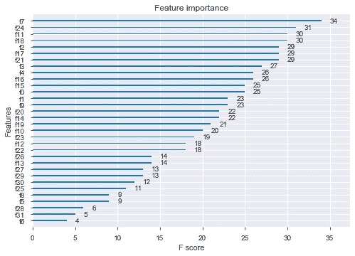
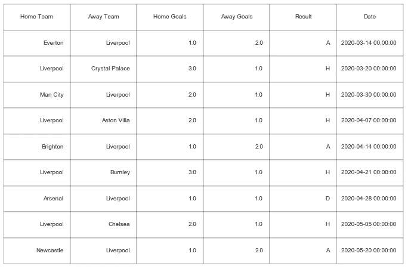
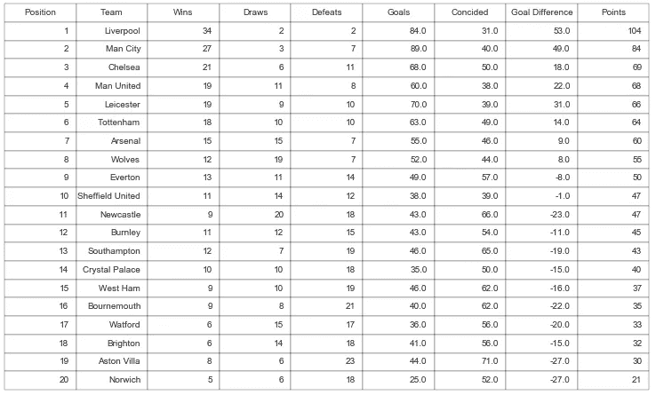

# 英超将如何收场？

> 原文：<https://towardsdatascience.com/how-will-the-premier-league-end-6f262e76e6c6?source=collection_archive---------62----------------------->

## 用 XGBoost 预测并完成英超积分榜。


Ajay Meganathan 在 [Unsplash](https://unsplash.com?utm_source=medium&utm_medium=referral) 上拍摄的照片

英超联赛，连同几乎足球世界的其他部分，都暂停了。目前还不清楚联赛是否会继续。但如果继续下去，会如何收场？在这篇文章中，我将创建一个模型，预测英超联赛的结果，以完成联赛表。利物浦会赢得联赛冠军吗？曼联会晋级欧冠吗？还有哪些队伍会被拒绝？这些是将在本文结尾回答的一些问题。

# 资料组

为了创建一个有用的数据集，我们需要大量的匹配统计数据。对我们来说幸运的是，【http://www.football-data.co.uk/】是一个提供从 2005 年到今天每一场英超比赛统计数据的网站。在这里，我下载了每个季节的数据，并将其合并成一个数据集。

```
import pandas as pd# Dataset df = pd.read_csv('pl_data.csv')df.info()

<class 'pandas.core.frame.DataFrame'>
RangeIndex: **5592** entries, 0 to 5591
Columns: **144** entries, Div to SBA
dtypes: datetime64[ns](1), float64(131), int64(1), object(11)
memory usage: 6.1+ MB
```

该数据集包含 5592 个观察值和 144 个变量。但是，我们不会在最终模型中使用任何变量。相反，这些变量将用于创建新的变量，如“主队的平均进球”。事实上，该模型将主要依赖于平均变量。由于目标是预测剩下的比赛，变量如‘Form*’*将依赖于早期的预测。为了更清楚地说明这一点，假设我们有变量' Form *'* (衡量主队或客场队在最近五场比赛中的得分)，我们希望预测本赛季的最后一场比赛。那么变量将只取决于早期预测的结果。这可能会扭曲预测，从而扭曲最终的排名。但是，在创建常规投注模型时，变量如“Form*”*是至关重要的，应该添加。

完整的数据集最终有八个变量，分为主场或客场球队和赛季或总平均水平。这使得变量总数为 8*2*2 = **32。**这些是变量:

*   平均进球数。
*   平均射门次数。
*   平均出手次数。
*   平均角数。
*   平均犯规次数。
*   平均黄牌数。
*   红牌的平均数量。
*   半场平均进球数。

当然，再增加几个变量也无妨。但是现在这样就可以了。下面是为主队和客场队创建总平均变量的代码(在计算“赛季平均”变量时使用类似的方法)。

```
# Create the columns # 
df['avg_g_hmt'] = df['gameId']
df['avg_g_awt'] = df['gameId']
df['avg_s_hmt'] = df['gameId']
df['avg_s_awt'] = df['gameId']
df['avg_sot_hmt'] = df['gameId']
df['avg_sot_awt'] = df['gameId']
df['avg_c_hmt'] = df['gameId']
df['avg_c_awt'] = df['gameId']
df['avg_f_hmt'] = df['gameId']
df['avg_f_awt'] = df['gameId']
df['avg_yc_hmt'] = df['gameId']
df['avg_yc_awt'] = df['gameId']
df['avg_rc_hmt'] = df['gameId']
df['avg_rc_awt'] = df['gameId']
df['avg_htg_hmt'] = df['gameId']
df['avg_htg_awt'] = df['gameId']gameid_col = df.columns.get_loc('gameId')
HomeTeam_col = df.columns.get_loc('HomeTeam')
FTHG_col = df.columns.get_loc('FTHG')
FTAG_col = df.columns.get_loc('FTAG')
HS_col = df.columns.get_loc('HS')
AS_col = df.columns.get_loc('AS')
HST_col = df.columns.get_loc('HST')
AST_col = df.columns.get_loc('AST')
HF_col = df.columns.get_loc('HF')
AF_col = df.columns.get_loc('AF')
HC_col = df.columns.get_loc('HC')
AC_col = df.columns.get_loc('AC')
HY_col = df.columns.get_loc('HY')
AY_col = df.columns.get_loc('AY')
HR_col = df.columns.get_loc('HR')
AR_col = df.columns.get_loc('AR')
HTHG_col = df.columns.get_loc('HTHG')
HTAG_col = df.columns.get_loc('HTAG')

# Iterate over all teams # 
df = df.sort_values(by = ['Date'])
mylist = list(set(df['HomeTeam']))
count = 0
for i in mylist:
    count = count + 1 
    print(count,": Creating variables for", i)
    homegamesindex = df['HomeTeam'] == i
    awaygamesindex = df['AwayTeam'] == i
    df_1 = df[homegamesindex]
    df_2 = df[awaygamesindex]
    df_3 = pd.concat((df_1,df_2))
    df_3 = df_3.sort_values(by = ['Date'])
    for j in range(len(df_3)):
        gameid = df_3.iloc[j,gameid_col]
        if df_3.iloc[j,HomeTeam_col] == i:
            H_or_A = "H"
        else:
            H_or_A = "A"
        y = j - 1
        # Create the count-variables # 
        avg_g = 0 
        avg_s = 0
        avg_sot = 0
        avg_c = 0
        avg_f = 0
        avg_yc = 0
        avg_rc = 0
        avg_htg = 0
        while y > -1:
        # Home or away in earlier games # 
            if df_3.iloc[y,HomeTeam_col] == i:
                avg_g = avg_g + df_3.iloc[y,FTHG_col]
                avg_s = avg_s + df_3.iloc[y,HS_col]
                avg_sot = avg_sot + df_3.iloc[y,HST_col]
                avg_c = avg_c + df_3.iloc[y,HC_col]
                avg_f = avg_f + df_3.iloc[y,HF_col]
                avg_yc = avg_yc + df_3.iloc[y,HY_col]
                avg_rc = avg_rc + df_3.iloc[y,HR_col]
                avg_htg = avg_htg + df_3.iloc[y,HTHG_col]
            else:
                avg_g = avg_g + df_3.iloc[y,FTAG_col]
                avg_s = avg_s + df_3.iloc[y,AS_col]
                avg_sot = avg_sot + df_3.iloc[y,AST_col]
                avg_c = avg_c + df_3.iloc[y,AC_col]
                avg_f = avg_f + df_3.iloc[y,AF_col]
                avg_yc = avg_yc + df_3.iloc[y,AY_col]
                avg_rc = avg_rc + df_3.iloc[y,AR_col]
                avg_htg = avg_htg + df_3.iloc[y,HTAG_col]

            y = y - 1
       # If the team plays home or away #
       if H_or_A == "H": 
           df['avg_g_hmt'].loc[df['gameId'] == gameid] = avg_g/(j+1)
           df['avg_s_hmt'].loc[df['gameId'] == gameid] = avg_s/(j+1)
           df['avg_sot_hmt'].loc[df['gameId']==gameid]=avg_sot/(j+1)
           df['avg_c_hmt'].loc[df['gameId'] == gameid] = avg_c/(j+1)
           df['avg_f_hmt'].loc[df['gameId'] == gameid] = avg_f/(j+1)
           df['avg_yc_hmt'].loc[df['gameId'] ==gameid]= avg_yc/(j+1)
           df['avg_rc_hmt'].loc[df['gameId'] ==gameid]= avg_rc/(j+1)
           df['avg_htg_hmt'].loc[df['gameId']==gameid]=avg_htg/(j+1)
       else:
           df['avg_g_awt'].loc[df['gameId'] == gameid] =avg_g/(j+1)
           df['avg_s_awt'].loc[df['gameId'] == gameid] =avg_s/(j+1)
           df['avg_sot_awt'].loc[df['gameId']==gameid]=avg_sot/(j+1)
           df['avg_c_awt'].loc[df['gameId'] == gameid] =avg_c/(j+1)
           df['avg_f_awt'].loc[df['gameId'] == gameid] =avg_f/(j+1)
           df['avg_yc_awt'].loc[df['gameId'] ==gameid]=avg_yc/(j+1)
           df['avg_rc_awt'].loc[df['gameId'] ==gameid]=avg_rc/(j+1)
           df['avg_htg_awt'].loc[df['gameId']==gameid]=avg_htg/(j+1)
```

既然数据集已经完成，让我们来探索它吧！首先，它不应该包含任何 NA:s

```
all(data.isna() == False)Out[36]: True
```

完美！现在数据集被分为训练数据集和测试数据集。但是首先，第一轮比赛的所有比赛都被删除了，因为所有的平均变量都为零。此后，为“主场目标”和“客场目标”分别创建一个 XGBoost 模型。这将使我们能够预测即将到来的比赛的结果。在 XGBoost 中，可以绘制变量的重要性，下面是“家庭目标”模型的图。

```
**from** xgboost **import** plot_importance**plot_importance(**home_mod**)**
```



正如预期的那样，有几个变量贡献很大，有几个贡献不太大。“客场球队的平均角球数”和“客场球队的平均黄牌数”似乎是最不重要的。而“主队的平均角球”和“主队的赛季平均进球”似乎是最重要的。这完全有意义，因为我们希望预测主队的进球。客队会有多少角球并不会显著改变得分的概率。然而，所有的变量仍将存在于最终的模型中，因为这不会有太大的计算量。

## 利物浦会赢得联赛冠军吗？

由于利物浦已经领先 25 分，而且只剩下 9 场比赛，他们只需要再赢两场比赛就可以举起奖杯。这是模型如何预测利物浦即将到来的比赛。



预测:利物浦最后一场比赛

轻松点。利物浦在最近的 9 场比赛中以 7 胜 1 平 1 负的成绩轻松夺冠。利物浦不仅是赢家，他们是风格上的赢家。他们以 104 分打破了目前 98 分的积分纪录(曼城，2018/19)。这将是他们 30 年来的第一个 PL 冠军(89/90 赛季)！

那么，其他队表现如何？预测完剩下的比赛，积分榜就这样结束了。



2019/2020 赛季英超联赛预测表

冠军联赛的门票将流向利物浦、曼城(但是他们被禁赛了，所以谁知道呢)、切尔西、曼联，也许还有莱斯特，因为曼城被禁赛了。“前六名”中的另外两支球队，阿森纳和托特纳姆，分别排在第六和第七位。不幸的是，预测下赛季参加锦标赛的球队是布莱顿、阿斯顿维拉和诺维奇。

这种模式似乎有利于大型团队。例如，莱斯特现在在积分榜上排名第三，曼联排名第六，但该模型预测曼联最终会超过莱斯特。类似的事情也发生在布莱顿，它排在第 15 位，但预计会降级。我的假设是，该模型有利于大球队，因为大多数变量取决于球队在许多赛季前的表现。当然，大球队将从中受益。毕竟，他们被认为是大牌，因为他们在过去几个赛季表现出色。如果有人试图自己做这件事，这是一个可以改进的领域。

你有它！利物浦赢了，切尔西下赛季打冠军联赛，诺维奇只拿到 21 分。也就是说，如果我的模型 100%正确。没有模特是这样的。


乔治·特罗瓦托在 [Unsplash](https://unsplash.com?utm_source=medium&utm_medium=referral) 上的照片