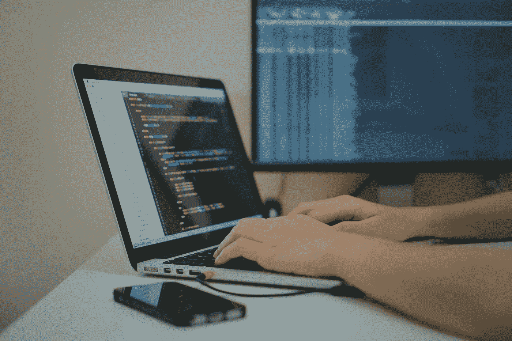
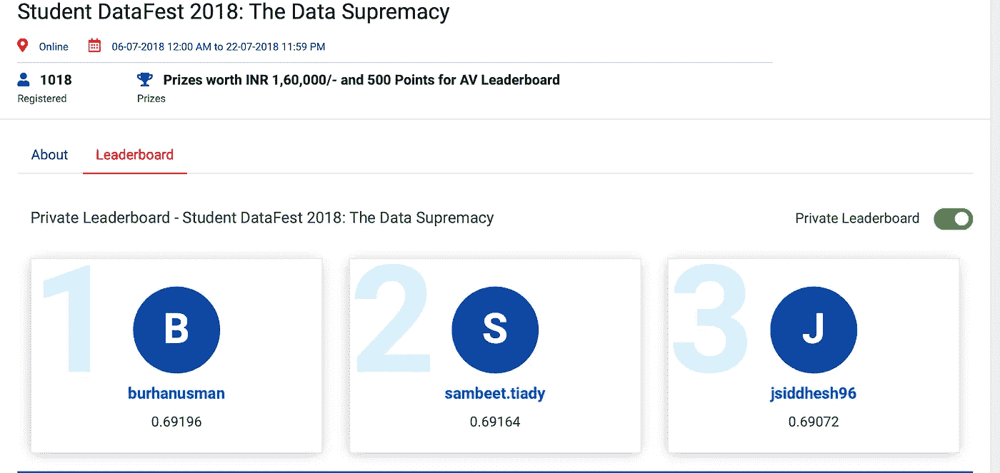
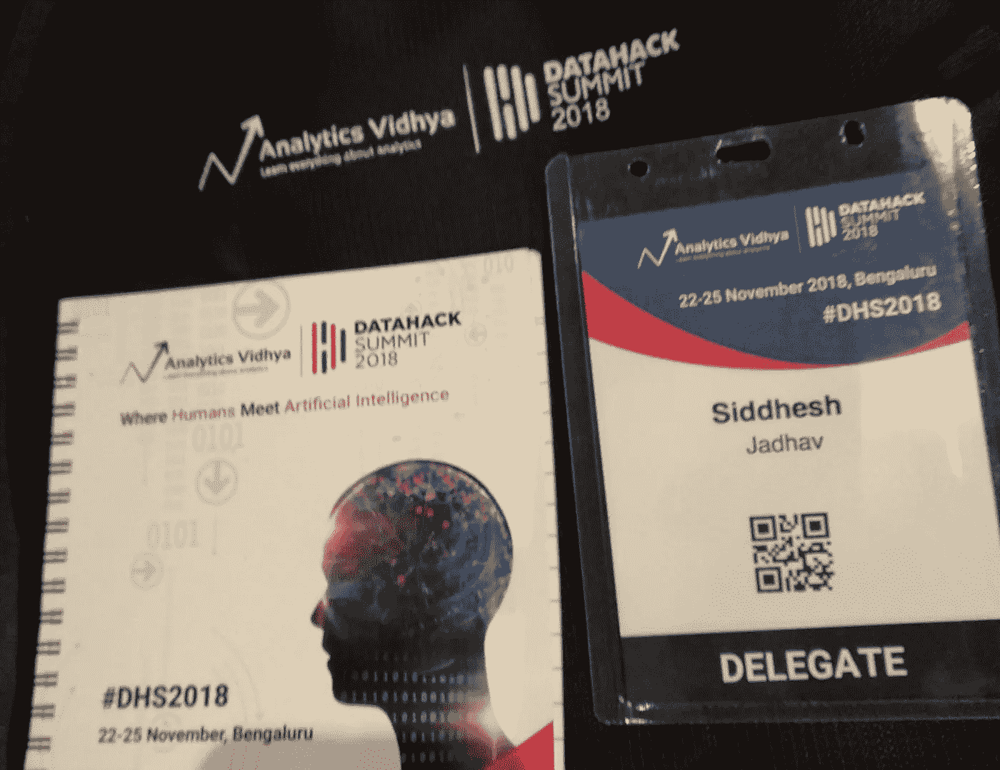

# 赢得我的第一次在线数据科学黑客马拉松如何改变了我的生活

> 原文：<https://towardsdatascience.com/how-winning-my-first-online-data-science-hackathon-changed-my-life-adcb06f02d0f?source=collection_archive---------46----------------------->

## 我成为数据科学家的旅程

Arif Riyanto 在 [Unsplash](https://unsplash.com?utm_source=medium&utm_medium=referral) 上拍摄的照片

2018 年初，我只是一名追求计算机工程的学生，对以哪个领域为职业目标毫无概念。我有各种选择，但不知道应该关注哪一个，即区块链、Android 开发和数据科学。

你面临过类似的情况吗？这个博客是给你的。

什么对我最合适？只有我能回答这个问题。于是，我勇往直前，捡了几个技术，给了一个月，然后实现。

一旦我开始研究数据科学，直接研究基于数学的东西，摆弄数字并从中发现一些价值是很有趣的。随后的旅程改变了我的生活，并使我专注于这个领域。

我需要发生一些事情来证明“**数据科学是我的选择**。因此，为了便于理解，我会按照要点来描述一切

# **学习阶段**

使用任何工具的第一步都是学习该技术的概念。
我在 2018 年初开始学习数据科学的概念。总结一下我学到的东西

1.  在 Udemy，NPTEL 和 Coursera 上上过一些数据科学课程。
2.  学习了各种预处理技术，使用哪个模型以及如何调优 hyperparameter。
3.  在各种在线数据集上尝试了上述事情。

> 即使在这个领域已经工作了 6 个多月，我仍然对“这个领域适合我吗”心存疑虑。

# **在线黑客马拉松**

学习之后，是时候让我将它付诸实践，看看我与其他数据科学家相比处于什么位置。我开始参加 Analytics Vidhya 上的在线数据科学黑客马拉松。在体验了竞争性黑客马拉松的工作方式后，我在 7 月份参加了数据至上黑客马拉松。

截图来自 datahack.analyticsvidhya.com(我的名字:jsiddhesh96)

经过 16 天不断努力提高分数，我获得了第一场胜利，在排行榜上排名第三。

*Yayyy！*努力有回报！

# 现在怎么办？它如何改变了我的生活？

除了奖金，我还收到了由 Analytics Vidhya 举办的首届亚洲最大的人工智能会议的邀请。

会议的日期和我期末考试的日期完全一样。显然，我不会错过期末考试。**真的吗？**当我看到演讲人的名字和他们对数据科学领域的贡献时，我花了几个小时改变了主意，我决定去参加会议。

作者照片

该会议旨在听取来自全球各地的人工智能和机器学习专家的意见，并在会谈后分享专家的知识和指导。

除了会谈，

1.  我采访了 ***Ronald van Loon*** (他连续几年被 Onalytica 评为商业智能领域全球顶级行业专家第二名、大数据领域第三名、数据科学领域第七名、金融科技领域人工智能/数字化转型/保险科技领域第八名以及全球物联网领域第九名)
2.  我采访了 ***塔利·辛格*** (他是一家人工智能初创公司 deepkapha.ai 的首席执行官、创始人和人工智能神经科学研究员)。和他谈论现实生活中的项目是我在那里度过的最美好的时光。

数据科学领导者实际上是如何思考和决策的，这是我从他们两人身上学到的关键东西。

与超过 15 位我称之为各自领域专家的演讲者交谈是我职业生涯的转折点。我得到的指导和在这个领域的正确方向帮助我重新思考我的职业生涯。

当我去参加会议的时候，我只是一个对我的职业生涯几乎一无所知的学生，但是当我回到家的时候，我已经变了一个人，我绝对知道为了追求一个适合我的职业生涯该做什么。

> 我收到的邀请和我做出的参加会议的决定改变了我的生活。

黑客马拉松如何改变了你的生活？如果你有什么故事，请评论。

附:*这是我的第一个博客*