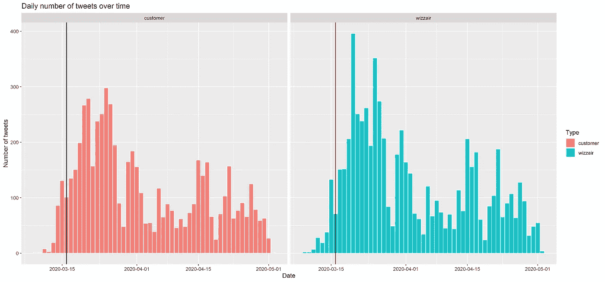
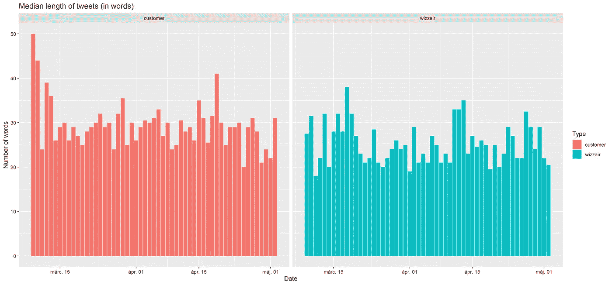
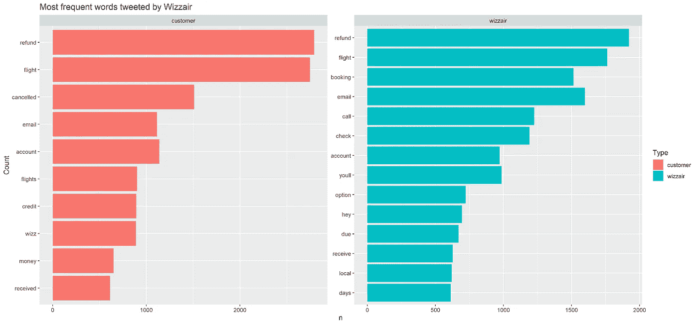
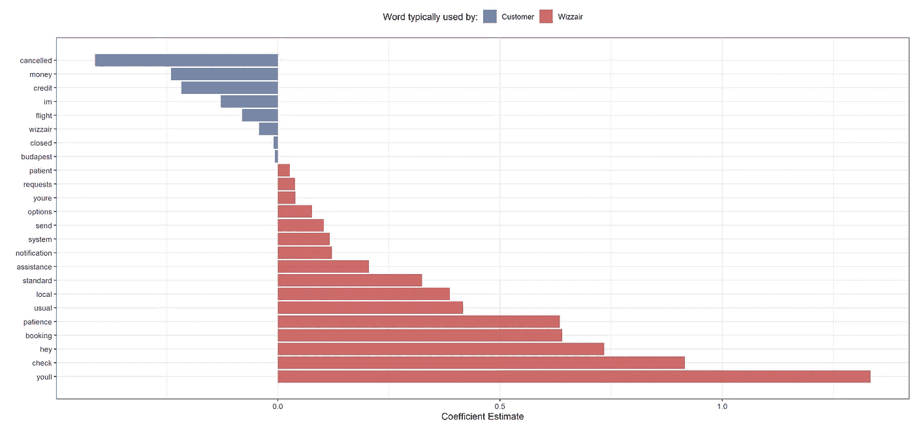
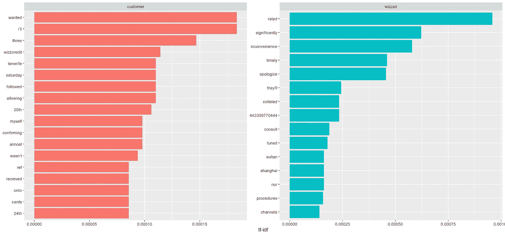
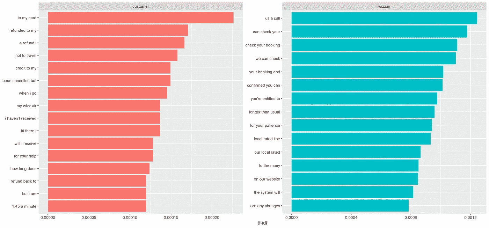
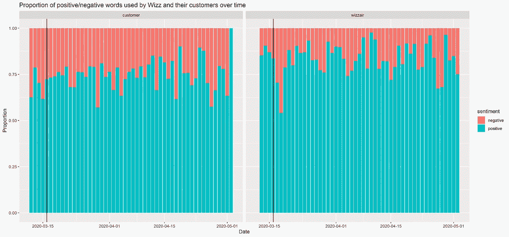
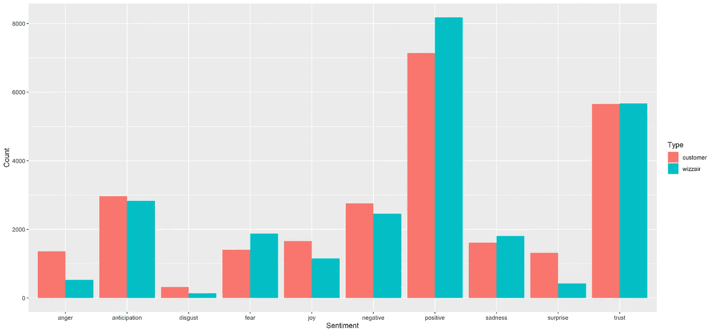
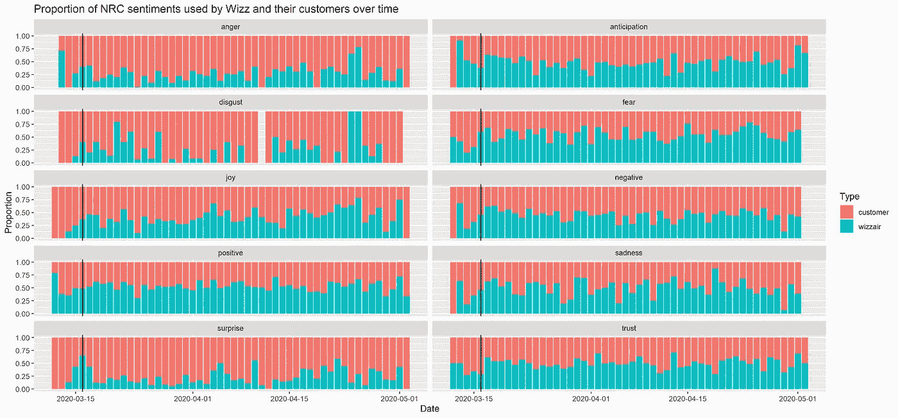

# Wizzair 在新冠肺炎期间是如何给他们的客户发推特的——R 语言的文本分析

> 原文：<https://towardsdatascience.com/how-wizzair-tweeted-their-customers-during-covid-19-text-analysis-in-r-8ed79dbd3b34?source=collection_archive---------69----------------------->

## 新冠肺炎时代 Wizzair 及其用户微博的词汇分布和情感变化的定量文本分析

***编者按:*** [*走向数据科学*](http://towardsdatascience.com/) *是一份以数据科学和机器学习研究为主的中型刊物。我们不是健康专家或流行病学家，本文的观点不应被解释为专业建议。想了解更多关于疫情冠状病毒的信息，可以点击* [*这里*](https://www.who.int/emergencies/diseases/novel-coronavirus-2019/situation-reports) *。*

在新型冠状病毒期间，几乎每架飞机都停飞，取消的航班数量空前。这是一篇关于 Wizzair 的分析，wizza IR 是欧洲最大的廉价航空公司之一，它在新冠肺炎时代是如何给乘客发推特的。他们的主要沟通来源之一是 Twitter，所以这是一个非常相关的信息来源。因此，我搜集了一堆包含所有必要信息的数据来进行定量文本分析。

我首先想到了两个假设:

*   H1: Wizzair 一遍又一遍地重复同样的句子/表达，并没有独特地解决客户问题。
*   H2:与 Wizzair 员工的友善相比，顾客推特的总体情绪更加负面。

# 时间分布

首先，让我们看看一段时间内每天的推文数量。这让你了解什么时候问题被提出或者(希望)被回答。黑色竖线表示匈牙利边境关闭。由于该公司最大的基地位于布达佩斯，这对他们来说至关重要。欧洲各地几乎同时出台了防止病毒传播的严格措施。因此，它是疫情在欧洲“起步”的一个很好的基准。

就在边境关闭和航班突然取消之后，双方的每日推文数量大幅增加。这是我期望看到的，因为人们要么被困，要么在寻找他们的钱回来。他们提出更多的问题是很自然的。

我认为观察顾客是否更罗嗦地详细解释他们所有的问题会很有趣。为了满足我的好奇心，我计算了每天发推的平均长度。

这两者之间没有太大的差异，但是，我可以在左侧检测到更大的条形。这显然不是我想法的有力证据。这可能是推特性质的结果。没有人想写很长的帖子，因为他们不会被阅读。

# 单词分布和常见 n 元语法

该是我分解到文字层次的时候了。我从我的语料库中排除了[停用词](https://en.wikipedia.org/wiki/Stop_words)。让我们来看看出现 600 次的最频繁的单词。很明显，讨论是关于退款的，不是吗？

然而，了解什么样的词汇会在两个群体之间产生差异是很有用的。有哪些词是顾客会用的，但 Wizz 和 vica 会用？在这一点上，不可避免地要强调，即使不同的人以 Wizz 的名义发推特，他们仍然是一个比所有客户更同质的群体。

为了识别有区别的单词，我使用单词出现次数作为输入变量，运行了一个简单的惩罚回归来对两组进行分类。在图中，显示了具有非零系数的每个单词。

现在更有意义了，不是吗？很可能被发在推特上的句子可以从单词中推断出来。如来自客户方的以下内容:

*   顾客的*航班被取消了。*
*   他们要求拿回他们的 T4 钱。

从 Wizzair 的角度来看:

*   Wizzair 要求每个人都有耐心，并要求乘客检查他们的预订。
*   如果有任何变化，他们的*系统*将*发送通知*。

另一种为了区分各方推文重要词的方法是使用[词频——逆文档频率](https://en.wikipedia.org/wiki/Tf%E2%80%93idf)(简称 tf-idf)。

> tf-idf 是一个数字统计量，旨在反映一个词对集合或语料库中的文档有多重要。TF–IDF 值与单词在文档中出现的次数成比例增加，并由语料库中包含该单词的文档数抵消，这有助于调整某些单词通常更频繁出现的事实。

在词汇方面，与回归相比，似乎有很大的不同。然而，叙述和主题并没有发生巨大的变化。

Wizzair 强调他们:

*   经努尔苏丹飞往上海，向匈牙利运送医疗设备
*   英国的呼叫中心
*   对造成的任何不便表示歉意

另一方面，客户在谈论:

*   特内里费岛(他们一定是被困在那里了)
*   想要一些东西(可能是他们的钱)
*   wizz 信用(我想他们不希望这样)

基于这些结果，客户群体更加多样化的想法得到了证实，因此，关于更广泛主题的推文得到了证实。为了理解他们的主题，我需要更多的假设。

为了获得单词旁边的一些上下文，我们将介绍 [n 元语法](https://en.wikipedia.org/wiki/N-gram)的用法。二元模型意义不大，因为它们提供的上下文太少，无法扩大范围，因此，使用三元模型代替。

话题真的没有改变，顾客的航班被取消了，想要退款。另一方面，Wizz 正在通知他们可以给谁打电话，并要求耐心等待，因为给乘客退款需要比平时更多的时间。

从 Wizz 的角度来看，可以挑选几个部分，然后连接起来，最终形成一个句子。它暗示了这样一种现象，即确实可能有预先写好的句子要使用。这些例子是:

*   我们可以检查您的预订
*   us a call +我们的本地费率+本地费率线路

为了进一步研究复现句的概念，我将评估 [Zip 定律](https://en.wikipedia.org/wiki/Zipf%27s_law)是否适用于这种情况。该方法通常用于识别非人类生成的文本数据。

> Zipf 定律最初是根据定量语言学制定的，指出给定一些自然语言话语的语料库，任何词的频率都与其在频率表中的排名成反比。因此，最频繁出现的单词的出现频率大约是第二频繁出现的单词的两倍，第三频繁出现的单词的三倍，等等。:等级-频率分布是一种反比关系。

运行由 *log10(术语频率)~ log10(等级)*表示的回归后，系数估计值为-1，70(标准误差:0.005)。它明显不同于-1，意味着 Zip 定律不适用于此文本。虚线表示-1 的陡度。从图中推断，曲线似乎在等级#100 附近有一个 hars 突变，并且变得比以前更陡。

结果或多或少与 H1 一致。Wizz 有他们喜欢向乘客强调的表达和表达链甚至句子。这引发了一个问题，机器人是否会比人类劳动力更具成本效益，因为它们似乎没有给推文带来多少附加值。

# 情感分析

我将使用两个情感词汇，即 [bing](https://www.cs.uic.edu/~liub/FBS/sentiment-analysis.html) 和 [nrc](http://saifmohammad.com/WebPages/NRC-Emotion-Lexicon.htm) 。后者将每个词分为以下类别之一:信任、恐惧、消极、悲伤、安歌、惊讶、积极、厌恶、喜悦、期待，而前者只考虑两个类别:积极和消极。

## 必应词典

让我们首先考虑 bing 词典。我的第一个想法是比较每组中负面词汇的比例。至于客户端，比率约为 26%,这意味着根据 bind 字典，这个比例的单词是负面的，而不是正面的。Wizz 方面的相同指标是大约 17%,这要低得多。总体而言，客户的推文传达了一种更负面的含义，即支持 H2。

我想知道感情方面是否有任何趋势。具体来说，我的想法是，在取消之后，人们更加愤怒，因此更加消极。

根据上面的 100%堆叠条形图，取消的浪潮似乎没有什么影响。无论是对顾客还是对 Wizz 来说，负面词汇与正面词汇的比例都没有显著变化。不过日常有滴，不过很可能是随机噪音。

## NRC 词典

对情绪的分解肯定有更详细的层次。下图表明，顾客表达了更多的愤怒、厌恶、惊讶和消极情绪。另一方面，威兹更积极，令人惊讶地表现出恐惧和悲伤的迹象(我的假设是他们试图表示同情)。

看了一下 NRC 的情绪是如何随着时间的推移而分布的，H2 就更加支持了。图表显示，愤怒、厌恶和惊讶(可能不是积极的情绪)等情绪主要是由客户发布的。

总的来说，我关于情绪的结果表明，客户表达了更多的负面情绪。另一方面，Wizz 打算用更积极的方式来安抚他们的乘客(嗯..就像它们在飞行中那样)。

然而，边境关闭和大量航班取消似乎对推文的情绪没有影响。客户倾向于在 Wizzair 上发推特，抱怨他们遇到的不愉快的问题。该病毒很可能增加了这些投诉的数量，但是，它没有增加他们的负面影响，因为它已经相当悲观和愤怒。

用于抓取和分析的代码可在此处找到[。](https://github.com/kovacskokokornel/wizzR_tweets)