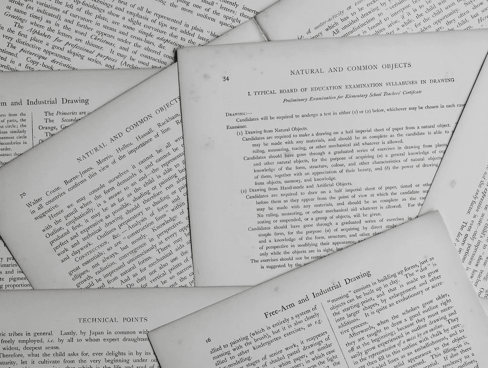
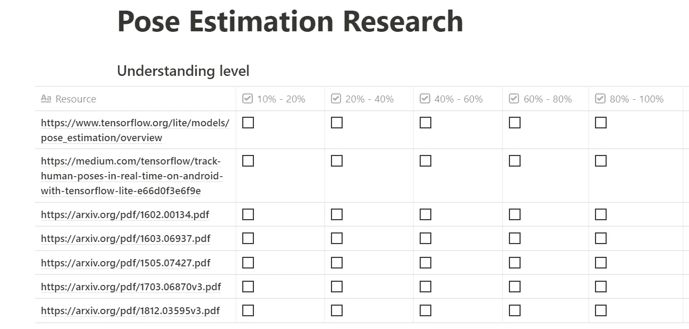
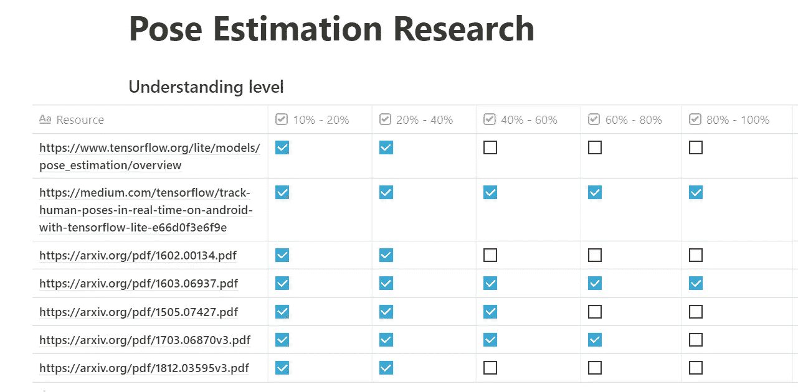

# 根据吴恩达(斯坦福深度学习讲座)，你应该如何阅读研究论文

> 原文：<https://towardsdatascience.com/how-you-should-read-research-papers-according-to-andrew-ng-stanford-deep-learning-lectures-98ecbd3ccfb3?source=collection_archive---------0----------------------->

## 报告的

## 关于如何通过机器学习和教育领域公认人物发表的研究论文获取知识的说明

安妮·斯普拉特在 [Unsplash](https://unsplash.com/s/photos/research-paper?utm_source=unsplash&utm_medium=referral&utm_content=creditCopyText) 上的照片

> [**在我主持的这个现场培训环节，用 TensorFlow 和 Keras 学习 AI 和深度学习的基础知识。**](https://www.oreilly.com/live-events/practical-introduction-to-the-world-of-computer-vision-and-deep-learning-with-tensorflow-keras/0636920060577/0636920061406/)

> "智慧不是学校教育的产物，而是终生努力获取的产物."
> 
> ——阿尔伯特·爱因斯坦

# 介绍

理解人工智能和机器学习领域前沿研究人员产生的信息的能力是每个认真的机器学习从业者都应该掌握的技能。

为了保持相关性并增加你的知识，机器学习从业者需要有学术思维和习惯。人工智能、人工智能和人工智能正在快速发展，我们必须用知识来装备自己以跟上这个领域，这些知识只能通过研究论文才能获得。

**这篇文章将为你提供如何有效地完成一篇研究论文的指导，同时还提供以下内容:**

*   阅读一系列论文以获取某一领域知识的系统方法
*   如何正确阅读研究论文
*   可以帮助你搜索论文和关键信息的有用在线资源

> 对于那些想了解本文关键内容的人，向下滚动到标题为“**阅读研究论文**”的部分。

# 首先，谁是吴恩达？

我在这篇文章中提供的信息来自吴恩达教授的斯坦福讲座。我还用个人技巧和来自互联网资源的信息补充了本文中包含的信息。

但是首先，简单介绍一下[吴恩达](https://medium.com/u/592ce2a67248?source=post_page-----98ecbd3ccfb3--------------------------------)。

[吴恩达](https://www.linkedin.com/in/andrewyng/)可能是互联网上最知名的(*和看了*)机器学习老师。他还是 [Deeplearning.ai](http://deeplearning.ai/) 和 [Coursera](https://www.coursera.org/) 的联合创始人。

除了他正在进行的在线教育方面的工作，他还是斯坦福大学的教授。

谷歌搜索[就能获得更多关于吴恩达的信息。](https://www.google.com/search?q=andrew+ng&oq=andrew+ng&aqs=chrome..69i57j46j0l3j69i61j69i60l2.1935j0j7&sourceid=chrome&ie=UTF-8)

对于一个人来说，学习周围环境中的个体所展示的技能和习惯是很自然的；这就是为什么大多数博士生会获得适当有效消化研究论文内容的技能。这在某种程度上是事实，安德鲁在前面提到的视频中很早就提到了这一点。

但我们不是博士生，有些人可能是，但我们正常人如何获得阅读研究论文并全心全意理解其内容所需的技能。

# 阅读研究论文

由 [Christa Dodoo](https://unsplash.com/@krystagrusseck?utm_source=unsplash&utm_medium=referral&utm_content=creditCopyText) 在 [Unsplash](https://unsplash.com/s/photos/paper?utm_source=unsplash&utm_medium=referral&utm_content=creditCopyText) 上拍摄的照片

如果你有天赋，机器学习领域的专业化是有利的。例如，拥有计算机视觉领域的通才知识是值得称赞的，但拥有关键技术(如姿态估计)方面的专业知识和专长对寻找该领域从业者的公司和组织更有吸引力。

因此，让我们使用姿态估计作为我们如何阅读与主题相关的研究论文的指南:姿态估计。

## 1.收集集中于主题的资源。资源可以以研究论文、媒体文章、博客文章、视频、GitHub 知识库等形式出现。

在谷歌上快速搜索“姿势估计”会给你提供包含相关主题信息的顶级资源。在这第一步，目标是整理所有相关的资源，如 YouTube 视频、实施文档，当然还有研究论文。理想情况下，在这个阶段，你认为重要的资源数量没有限制，但一定要创建一个有用的论文、视频和文章的入围名单。

## 2.在下一步中，你将对你认为与主题相关的任何资源进行深入研究。有一种方法来跟踪对每个入围资源的理解是至关重要的。吴恩达建议根据你的理解水平绘制一个资源表，如下表所示。

Richmond Alake 的理解资源级别表

建议你确保浏览你添加到列表中的每篇论文至少 10-20%的内容；这将确保你已经接触到足够的介绍性内容，并能够准确地衡量其相关性。

对于确定的更相关的论文/资源，期望你进步到更高的理解水平。最终，你会发现一些合适的资源，它们的内容你完全理解。

你可能会问自己，“多少论文/资源是足够的”。

*我没有答案，但是安德鲁有。*

根据 Andrew 的说法，理解 5-20 篇论文将展示对主题的基本理解，也许足够理解到技术的实现。

50-100 篇论文将主要为你提供一个非常好的领域理解。

在浏览了资源并提取了重要信息之后，您的表可能类似于下面所示。

Richmond Alake 更新的资源理解水平表

## 3.第三步是我观察到的在试图理解研究论文时对我有用的快速提示。第三步是做结构化笔记，用你自己的话总结论文中的关键发现、发现和技巧。

> 下面的步骤将集中在如何阅读一篇研究论文上。

# 阅读一篇研究论文

照片由[阿尔方斯·莫拉莱斯](https://unsplash.com/@alfonsmc10?utm_source=unsplash&utm_medium=referral&utm_content=creditCopyText)在 [Unsplash](https://unsplash.com/s/photos/reading?utm_source=unsplash&utm_medium=referral&utm_content=creditCopyText) 拍摄

以理解为目的的阅读不是通过一遍文章的内容来完成的。根据安德鲁的说法，一口气把一篇论文从第一个词读到最后一个词可能不是形成理解的最佳方式。

准备好至少通读一篇论文三次，以充分理解其内容

## 4.在第一遍中，从阅读论文中的以下部分开始:标题、摘要和图表。

## 5.第二遍需要你阅读以下部分:引言、结论、另一遍图表和浏览其余内容。

论文的引言和结论部分包含关于论文内容的简明信息和任何发现的摘要。本节提供的信息通常不包括任何补充信息，只包括关键信息。这对于读者来说是有益的，因为你可以获得继续阅读本文其他部分所需的重要信息。

## 6.论文的第三步包括阅读论文的所有部分，但是跳过任何你可能不熟悉的复杂的数学或技术公式。在此过程中，您还可以跳过任何您不理解或不熟悉的术语。

## 7.那些对一个领域进行深入研究的人可以多走几关。这些额外的考试将主要集中在对论文中出现的数学、技术和未知术语的理解上。

对于那些通常出于信息和工程目的阅读研究论文的人来说，深入研究可能非常耗时，尤其是如果你有 20 多篇论文要完成的话。

> 我用介绍 LeNet 卷积神经网络的[原始论文](http://yann.lecun.com/exdb/publis/pdf/lecun-01a.pdf)浏览了本文中介绍的过程，并在笔记中总结了关键内容，随后我将其转换为一系列中型文章。

 [## 理解和实现 LeNet-5 CNN 架构(深度学习)

### 在本文中，我们使用定制实现的 LeNet-5 神经网络对 MNIST 数据集进行图像分类

towardsdatascience.com](/understanding-and-implementing-lenet-5-cnn-architecture-deep-learning-a2d531ebc342)  [## (你应该)理解深度学习中的子采样层

### 平均池、最大池、子采样、下采样，这些都是你在深度学习中会遇到的短语…

towardsdatascience.com](/you-should-understand-sub-sampling-layers-within-deep-learning-b51016acd551)  [## 理解卷积神经网络中的参数共享(或权重复制)

### 在深度学习研究中，参数共享或权重复制是一个容易被忽略的话题领域…

towardsdatascience.com](/understanding-parameter-sharing-or-weights-replication-within-convolutional-neural-networks-cc26db7b645a)  [## 理解卷积神经网络中的局部感受野

### 想过为什么卷积神经网络中的所有神经元都没有连接起来吗？

towardsdatascience.com](/understand-local-receptive-fields-in-convolutional-neural-networks-f26d700be16c) 

# 要问自己的问题

安德鲁提供了一系列你在阅读论文时应该问自己的问题。这些问题通常表明你理解了论文中的关键信息。我用下面的问题作为信标，以确保我不会偏离理解重要信息的目标。

**它们如下:**

1.  描述论文作者的目标是什么，或者可能已经实现了什么。
2.  如果一篇论文中介绍了一种新的方法/技术/方法，那么新提出的方法的关键要素是什么？
3.  论文中的哪些内容对你有用？
4.  您还想关注哪些参考资料？

# 辅助研究的额外资源

一些在线资源使得相关信息的发现和检索变得相对容易。下面是一些资源示例，可以帮助您搜索相关信息。

*   [机器学习子编辑](https://www.reddit.com/r/MachineLearning/)
*   [深度学习子编辑](https://www.reddit.com/r/deeplearning/)
*   [纸张代码](https://paperswithcode.com/)
*   顶级会议如 [NIPS](https://papers.nips.cc/) ， [ICML](https://icml.cc/) ， [ICLR](https://iclr.cc/)
*   [研究门](https://www.researchgate.net/)

# 结论

> "为了长寿，要稳步学习，而不是短时间爆发."
> 
> —吴恩达

对于机器学习和计算机视觉领域，我还是一个新手，有很多东西我不知道(*这是一种保守的说法*)。尽管如此，我相信如果一个人坚持不懈地寻求知识，不管是在哪个领域，他们都会得到超越常规的理解和专业知识。

根据吴恩达介绍的技术，我每个月至少会阅读四篇研究论文，阅读到理解的程度。老实说，LeNet 论文花了我一周半的时间才全部完成。但是你做的次数越多，阅读和理解研究论文的速度就越快。

Andrew 在他的视频中表示，他随身携带了一批研究论文，打算阅读它们。Andrew 是机器学习领域的杰出人物，我相信模仿他的习惯和学习技巧会对你的学习之旅有好处。

[**在我主持的这个现场培训环节，用 TensorFlow 和 Keras 学习 AI 和深度学习的基础知识。**](https://www.oreilly.com/live-events/practical-introduction-to-the-world-of-computer-vision-and-deep-learning-with-tensorflow-keras/0636920060577/0636920061406/)

# 我希望这篇文章对你有用。

要联系我或找到更多类似本文的内容，请执行以下操作:

1.  [**成为推荐媒介会员，支持我的写作**](https://richmondalake.medium.com/membership)
2.  订阅我的 [**邮件列表**](https://richmond-alake.ck.page/c8e63294ee) 获取每周简讯
3.  通过 [**LinkedIn**](https://www.linkedin.com/in/richmondalake/) 联系我

 [## 我从攻读计算机视觉和机器学习硕士学位中学到了什么

### 如果你打算从事计算机视觉或机器学习方面的任何形式的高级研究，请阅读本文…你可能…

towardsdatascience.com](/what-i-learnt-from-taking-a-masters-in-computer-vision-and-machine-learning-69f0c6dfe9df)  [## 人工智能中的算法偏差需要讨论(和解决)

### 你在这件事上有责任…

towardsdatascience.com](/algorithm-bias-in-artificial-intelligence-needs-to-be-discussed-and-addressed-8d369d675a70)