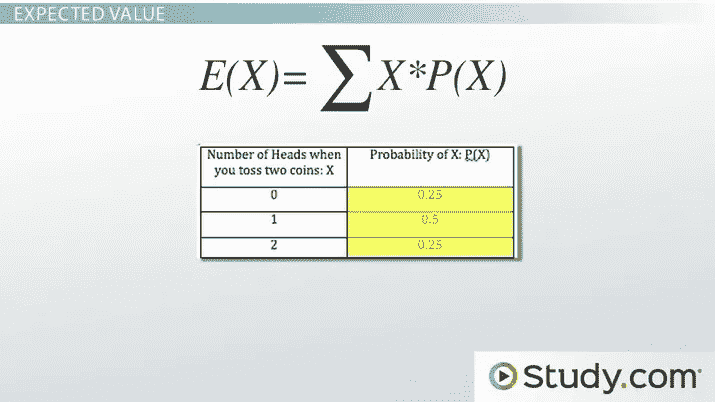
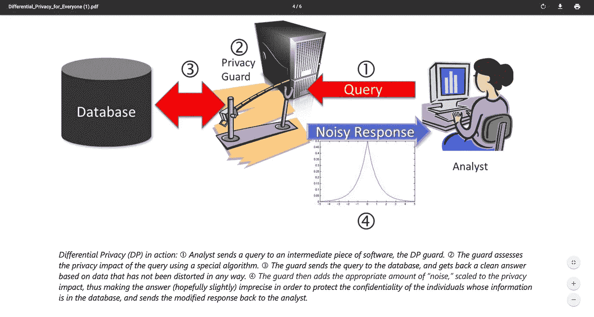
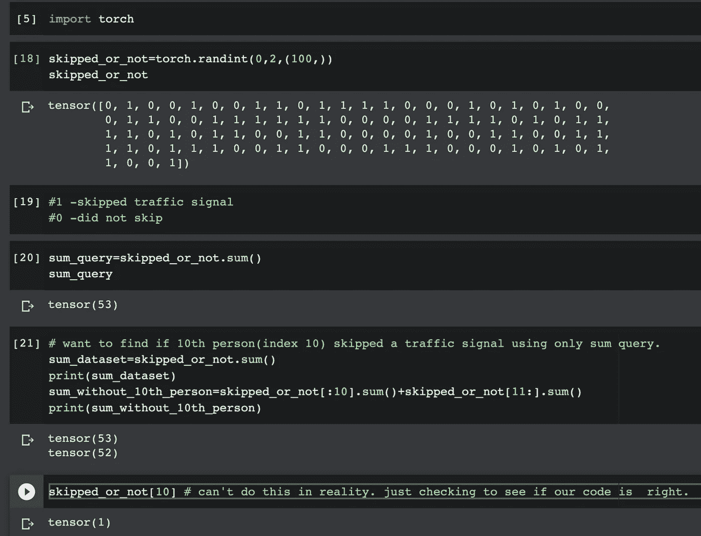
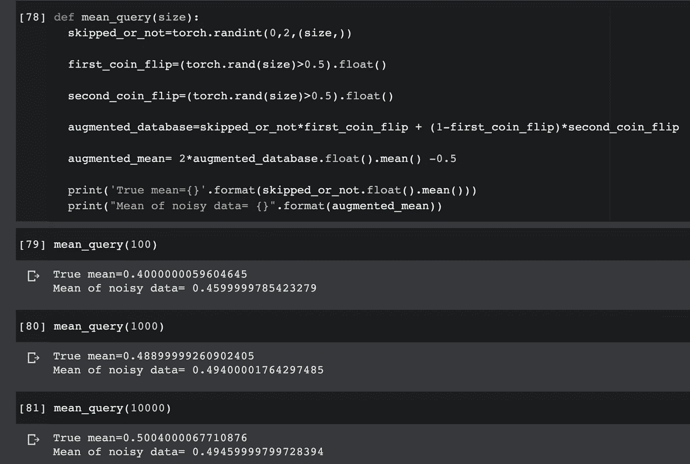

# 如何保护您的数据(通过抛硬币)

> 原文：<https://towardsdatascience.com/how-your-data-is-secured-by-a-coin-toss-c933f9e13d4a?source=collection_archive---------42----------------------->

## ***关于本地化差异隐私的介绍性文章。***

照片由[戴恩·托普金](https://unsplash.com/@dtopkin1?utm_source=unsplash&utm_medium=referral&utm_content=creditCopyText)在 [Unsplash](https://unsplash.com/s/photos/privacy?utm_source=unsplash&utm_medium=referral&utm_content=creditCopyText) 拍摄

假设你想调查 1000 个人，问他们是否跳过了交通信号灯。你在这里收集的数据是敏感的。假设您想要建立一个关于人类行为的数据集来执行某种分析。**跳过的交通信号**将是该数据集的一列。

现在，作为数据集的管理者，您希望公开这些数据，以便有人可以对其进行一些统计分析。然后，分析师可以查询数据集的“跳过的交通信号”列，以确定特定的人是否跳过了信号。但是数据集中的人希望他们的数据是安全的。他们不希望分析师能够询问他们的一些事情，并百分之百确定他们的活动。

现在的问题是，我们如何确保每个人的隐私，同时还提供不太嘈杂的分析师数据，以便他/她可以从中获取价值？

我们可以进行一个简单的实验来做到这一点:

响应是(1)=跳过交通信号

响应号(0)=没有这样做。

1.  扔一次硬币。如果它落在头上，这个人必须说实话(不管他/她是否错过了交通信号)。
2.  如果第一枚硬币正面朝上，再掷一次。如果是正面着地，这个人必须回答“是”，如果是反面着地，这个人必须回答“否”。我们并没有给人们真正的选择。这就是我们添加“随机性”的地方。

想想一个人回答*是的概率，即使那个人实际上 ***没有*** 跳过交通信号。*

*要做到这一点，必须进行第二次抛硬币，而且必须正面朝上。那是因为如果第一次抛的是正面，这个人会告诉他们没有跳过信号。但是如果第一次抛硬币是反面**和**第二次抛硬币是正面，这个人会回答**是**，尽管真实的回答是**否***

# *一些基本概率:*

> *P(是|否)=P(第一次掷硬币的反面)*P(第二次掷硬币的正面)=0.5*0.5=0.25*

*当真实答案实际上是肯定的时候，一个人回答肯定的概率是多少？*

*这可能以两种方式发生。如果第一次掷硬币是正面，他们必须说真话，也就是“是”。或者第一次投掷可能以反面和第二次正面结束。*

> *P(Yes|Yes)=P(第一次投掷正面)+ P(第一次投掷反面)*P(第二次投掷正面)=0.5 + 0.5*0.5 =0.75。*

*这里 P(A|B)是一个条件概率，意思是在 B 已经发生的情况下，A 发生的概率。如果你想了解更多关于概率的知识，你可以查看一下[可汗学院的课程](https://www.khanacademy.org/math/statistics-probability/probability-library)。*

*现在想象一下，跳过交通信号灯的人的“真实比例”是“p”。而那些没有的自然是‘1-p’。抛硬币实验完成后，预计会有多少个“是”的答案？*

*再次回顾这两个概率，我们计算。“是”有两种可能。要么这个人跳过交通信号并回答“是”(P(是|是))，要么他没有跳过交通信号并回答“是”(P(是|否))。*

*A.比例 1-p 谁没有跳过交通信号有多少人是**期望**说“是”？。*

*B.在跳过交通信号灯的比例“p”之外，预计**有多少人**会说“是”？。*

*如果我们把这两个预期的“是”值相加，我们就得到整个人口中“是”的预期数量。*

**

*[随机变量(离散型)的期望值公式。](https://www.google.com/url?sa=i&url=https%3A%2F%2Fstudy.com%2Facademy%2Flesson%2Fdeveloping-probability-distributions-theoretically-finding-expected-values-lesson-quiz.html&psig=AOvVaw0IOAdKacMixC1N4Dhv35y0&ust=1585658079247000&source=images&cd=vfe&ved=0CAIQjRxqFwoTCLin4OaawugCFQAAAAAdAAAAABAD)*

*这是期望值的正式定义。如果我们把它翻译成我们的例子，它看起来会像这样:*

*e(是)=(1-p)*P(是|否)+ p*P(是|是)*

*如果您仔细观察各个组件，它们会分别回答问题 A 和 B。所以 E(是)=(1-p)*0.25 + p*0.75。*

*但是 E 的真实值(是)=p。*

*因此，我们将“噪声”添加到我们的数据集。正如 Cynthia Dwork 在他的书《差分隐私的算法基础》中解释的那样，抛硬币给了人们貌似合理的拒绝。这意味着即使抛硬币的结果是肯定的，即使真实的答案是否定的，他们也可以否认，并归咎于抛硬币(第二次抛硬币更具体，因为在这次抛硬币中，我们并没有给这个人说实话的机会。这是随机的。).*

*现在假设你是一名分析师，想要查看抛硬币的人的数据。假设您想从数据集中查询一个特定的人，以确定他/她是否错过了交通信号。想象一下，如果数据没有被抛硬币保密，这将会是什么样子。*

**

*数据保护方式的图示概述。*

*在上面的表示中，很明显分析师不能直接访问数据库。他/她只能向警卫查询数据库。这种防护从数据库中获取数据，添加适量的噪声，然后将有噪声的答案返回给用户。*

# *让我们用代码把它具体化。*

**

*在这里，分析师只能使用 sum 这样的查询。因此，如果分析师想知道第 10 个人是否跳过了信号，他可以在整个数据库上运行一个 sum 查询，并在没有第 10 个索引的情况下运行另一个 sum 查询。如果这两个和相同，这意味着第 10 个索引的值为 0。否则值为 1。在这种情况下，隐私被侵犯了。但是如果我们在数据中加入了噪声，那么 sum 查询就不会侵犯隐私。分析师不能确定一个特定的值是 1 还是 0。*

*现在让我们向数据集添加噪声，这样分析师就无法找到特定用户的信息。*

*以下代码也在 Udacity 上的[视频中进行了讨论，这是差分隐私课程的一部分。](https://www.youtube.com/watch?time_continue=306&v=f9XToBZY3Nk&feature=emb_logo)*

**

*在上面的代码中，增加的数据库是在两次抛硬币后获得的。有趣的是，我们将增加的平均值乘以 2，然后从中减去 0.5。这是为什么呢？*

*再回头看看我们推导出的公式，在每个人都抛了两次硬币后，预期的“是”的数量。那是:*

> *e(是)=(1-p)* 0.25+p * 0.75 = 1/4-p/4+3p/4 = 1/4-p/2。*

*这个期望值并不能真实代表总体。即使我们给用户增加了隐私，我们也不能把这种意思报告给分析师。我们仍然希望分析师获得关于数据集的有价值的信息，同时保护所有用户的隐私。*

*所以本质上我们需要从 1/4 -p/2 得到 p。这是通过将整件事乘以 2 并从中减去 0.5 来完成的。*

*从上面的代码中，我们发现拥有更多的数据可以让我们更容易地报告人口的准确表示，同时还能保护用户的隐私。随着数据点的增加，真实平均值和噪声数据的平均值收敛。现在我们也可以试着偏向硬币来增加更多的噪音。*

*假设我们只偏向第一个硬币，让尾部概率=噪声，其中噪声的值介于 0 和 1 之间。*

*看看概率是如何变化的:*

> *P(是|否)=P(第一次掷硬币的反面)*P(第二次掷硬币的正面)=(噪音)*0.5*
> 
> *P(是|是)=P(第一次投掷正面)+P(第一次投掷反面)*P(第二次投掷正面)=(1-噪声)+噪声*0.5*
> 
> *e(是)=(噪声)* 0.5 *(1-p)+(1-噪声+噪声*0.5)*p 这个和我们之前做的差不多。我刚刚用 t 代替了 P(第一次投掷时正面朝上)。*
> 
> *因此，简化方程后，我们得到:*
> 
> *e(是)(有噪)=噪声* 0.5+(1-噪声)*p .这是增广数据的期望值。*
> 
> *经过一些重新安排:*
> 
> *真 E(是)=(E(是)/噪声-0.5)*(噪声/(1-噪声))=p*

*让我们看看代码:*

**

*在第一次抛硬币时，我们将其建模为 torch.rand(size)>噪音。这意味着只有当它大于噪声时，我们才赋值 1。或者换句话说，我们分配 1(1-噪声)比例的时间，这只是正面的概率。看看最后一个例子，我们有 10，000 个数据点，并添加了 0.9 的噪声！这确保了用户的高度隐私。*

*但是等等，在有 10，000 个数据点的情况下，我们对真实均值的估计也非常接近实际均值“p”。这意味着，如果有大量数据点，我们可以添加大量噪声，但仍能保持报告数据的准确性。*

*因此，当有更多的数据时，本地差分隐私可以更好地工作。这听起来可能有点违反直觉，但它是有意义的，因为我们有更多的数据噪声往往会相互抵消，我们可以获得更好的人口代表。*

*我希望这是关于差分隐私的一个很好的介绍。很快就会见到你！*

*参考资料:*

1.  *一种不加噪声的局部 DP 实现。*

*2.加入噪声后局部差分法的一种实现。*

*3.可汗学院的概率课程。*

* [## 概率|统计和概率|数学|可汗学院

### 如果您看到此消息，这意味着我们在网站上加载外部资源时遇到了问题。如果你是…

www.khanacademy.org](https://www.khanacademy.org/math/statistics-probability/probability-library) 

4.链接到辛西娅·德沃克和亚伦·罗斯的《差分隐私的算法基础》。这是**深入挖掘差异隐私的**书。

[。https://www.cis.upenn.edu/~aaroth/Papers/privacybook.pdf](https://www.cis.upenn.edu/~aaroth/Papers/privacybook.pdf)*