# 如何优化您的模型|了解您的优化

> 原文：<https://towardsdatascience.com/how-your-model-is-optimized-know-your-optimization-d2809c7a912c?source=collection_archive---------69----------------------->

## *对“为什么我的模型永远在运行？”还是那句经典的:“我觉得它可能已经收敛了？”*

普通数据科学家或 ML 工程师日常使用的许多模型背后的驱动因素依赖于数值优化方法。研究不同功能的优化和性能有助于更好地理解流程是如何工作的。
我们每天面临的挑战是，有人给了我们一个他们如何看待世界或他们的问题的模型。现在，**你**作为一名数据科学家**必须找到问题的最优解**。例如，你看着一个能量函数，想找到一个绝对的全局最小值，使你的工具工作或你的蛋白质稳定。也许你已经建立了用户数据模型，你想找到一个给定所有输入特征的理想客户——希望是连续的输入特征。这里全面总结了优化器是如何工作的。

# 基准函数——曲线函数、弯曲函数和非对称函数

在我们遇到我们的优化器之前，我们必须熟悉我们想要优化的函数。我个人最喜欢的三个是:

*   好好先生就是**椭球函数**。它总体上表现良好，是凸的，并且有一个全局最小值。
    它的定义是:

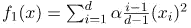

*   Rosenbrock 或**香蕉功能**。它不像我们的椭球那样好，因为它的死亡之谷对优化算法来说是一个挑战。它被定义为:

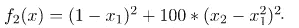

*   扭曲的是我们的吸引扇形函数。这是最不寻常的选择，因为它是非凸的，并且在最小值周围不对称。它被定义为

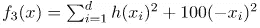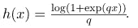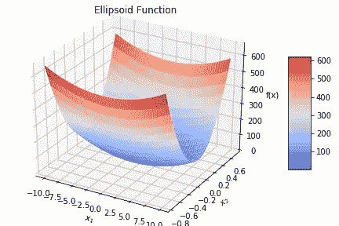

图 1a)R 中的椭球函数。较低的函数值用蓝色表示，全局最小值在(0，0)。

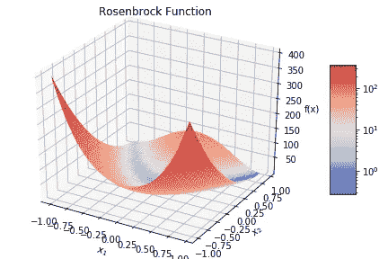

图 1b)R 中的 Rosenbrock 函数。较低的函数值用蓝色表示，全局最小值在(1，1)处，位于谷中。

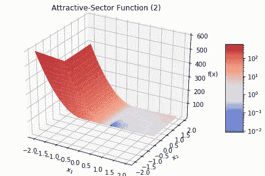

图 1c)R 中的吸引扇区函数。较低的函数值用蓝色表示，全局最小值在(0，0)附近。

这是一个易于理解的函数选择，并且存在大量可用的基准函数来运行您的优化器。从 [Styblinski-Tang](https://commons.wikimedia.org/wiki/File:Styblinski-Tang_function.pdf) 功能的深度到 [Rastrigin](https://en.wikipedia.org/wiki/Rastrigin_function) 的美丽窥视。其中一些是现成的，如[1]中所示。

```
As you might have noticed the functions work on R^n and we provide an input vector **x** ∈ R^n. We will only be looking at two dimensions R^2 and three dimensions R^3 to make the display easier.
```

现在我们已经建立了一个平台，我们可以加载我们选择的工具，比如带有[优化库](https://docs.scipy.org/doc/scipy/reference/generated/scipy.optimize.minimize.html)的 [scipy](https://docs.scipy.org/doc/scipy/reference/index.html) 。我们的目标是捕捉优化器如何在给定不同起点的基准函数上找到最小值。我们只是挑选任何优化程序，如简单的梯度下降“CG”或更复杂的 BFGS。事情是这样的:

```
from scipy.optimize import minimize# import benchmark function with its derivatives
from scipy.optimize import rosen
from scipy.optimize import rosen_der
from scipy.optimize import rosen_hessimport numpy as npdef banana(x, y):
“”” 
a nice 2D way to look at Rosenbrock 
“””
 return (1 — x)**2 + (100 * (y — (x**2))**2)# we select some interesting optimizers:
OPTIMIZERS = [‘CG’, ‘BFGS’, ‘Newton-CG’, ‘dogleg’]
FUNCTIONS = {‘rosen’: [rosen, rosen_der, rosen_hess, banana]
# feel free to add or implement ellipsoid or other benchmark functions here with their derivatives
}start_values = np.random.uniform(low=x_min, high=x_max, size=(10, 2))start_iter = 1
max_iter = 50
step = 1
x_min, x_max = -5, 5
y_min, y_max = -5, 5def optimize_funct(fname, funct, x0, derivative, hess, optimizer, iteration):
“””
Just a wrapper around the scipy minimize function
“””
 fitted_min = minimize(funct, x0=x0, method=optimizer, 
 jac=derivative, hess=hess,
 options={‘maxiter’:iteration})
 return fitted_min# run actual optimization
fitted_optimizers = {}
for opt in OPTIMIZERS:
 fitted_optimizers[opt] = {}
 for name, functs in FUNCTIONS.items():
 fitted_optimizers[opt][name] = []
 f = functs[0]
 fd = functs[1]
 fdd = functs[2]
 f_2d = functs[3]
 for vals in start_values:
 computed_values = []
 x, y = vals
 z = f_2d(x,y)
 # include start values before optimization
 computed_values.append(np.array([x,y,z]))
 for i in range(start_iter, max_iter, step):
 out = optimize_funct(fname=name, funct=f, x0=vals, derivative=fd, hess=fdd,
 optimizer=opt, iteration=i)
 # only save the output values (stored under x)
 x, y = out.x
 z = f_2d(x, y)
 computed_values.append(np.array([x, y, z]))
 fitted_optimizers[opt][name].append(np.array(computed_values))
```

并非每个优化器都是平等的。有些需要一阶导数，有些需要二阶导数作为我们的优化函数，也就是 Jakobian 函数和 Hessian 函数。要额外简要回顾这些是什么以及它们是如何工作的，你可以看这里的。需要记住的一件事是，我们从不同的起始位置开始，让优化器自由漫游——我们现在还没有进行约束优化。

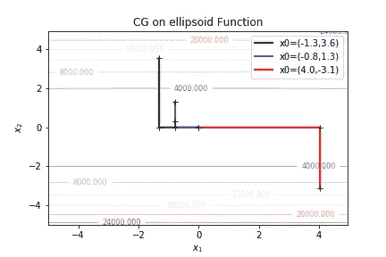

*图 2——使用标准梯度下降法从不同起点绘制的椭球函数等高线图。每一步都是“+”。优化器在几个步骤后找到全局最小值。*

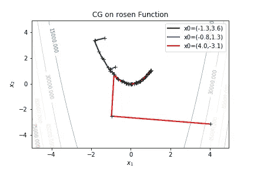

*图 3——罗森布罗克-(香蕉-)函数的等值线图。梯度下降首先走进正确的方向(见黑色“+”)，但它寻找全局最小值无济于事。它所穿越的山谷的功能价值已经很低，而且关于下一步该去哪里的信息也不多。*

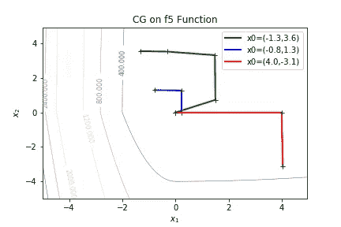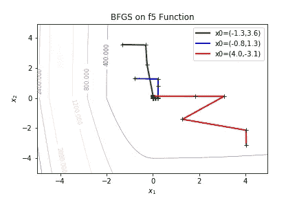

*图 4。属性。函数的扇形等高线图。函数空间上的 BFGS 优化。给定三个起点(三种颜色)，每一步用一个黑色十字表示。最小值很快被发现，我们可以看到线性方法(CG)与 BFGS(属于拟牛顿方法家族)相比表现如何不同。*

就我个人而言，它对我很有帮助，让我看到优化过程是如何在不同的函数空间中移动的。在上图中，你可以看到 CG 和 BFGS 的表现。现在 CG 是 scipy 实现 [**渐变下降**](https://youtu.be/IHZwWFHWa-w?t=325) 的名字。这是简单明了的优化过程，也是经典的**线搜索法**。另一方面，BFGS 使用近似的高阶信息。因此，BFGS 把它归类为一种准牛顿法。

```
A quasi-Newton method approximates higher order information like the Hessian Matrix (second order derivatives) and makes improvements per each step taken. [2]
```

# 线搜索|回溯一切。

一种优化方法是简单地遵循给定基础函数的一条线(见图 2 和图 3)。我们通过回溯保留了一些信息，但仅此而已。为了优化，我们可以利用函数的一阶导数信息。具有回溯的线搜索优化的直观公式是:

1.  计算你的点的梯度
2.  根据你的梯度和步长计算步长
3.  向优化方向迈出一步
4.  通过预先定义的因子(如α)调整步长
5.  重复，直到找到最小值，或者您的步骤之间的值差异非常(非常)小，例如 0.00000001

```
Gradients give us information on how the slope of a function behaves. We take the gradient as the first-order-derivative or partial derivative of a function. It is depicted as a vector and defined as:
```

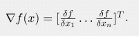

# 信任区域优化器|循环思考

除了直视前方和后方，我们还可以 360 度全方位地环顾四周。我们查看我们的功能信息，如雅可比和海森，并朝着正确的方向迈出最佳的一步。为了实现这一点，我们考虑二次模型函数:

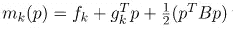

，其中 g 是 f 和 B 的梯度。
当我们进行优化时，我们针对 p 进行优化，并适当调整我们周围的半径。这看起来像:

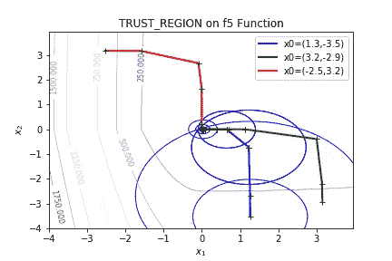

*图 attr 轮廓的信赖域优化。-部门职能。每一步都用“+”表示，每一步的周围是一个区域，从该区域中选择下一步作为一个圆。*

程序的直观表述可以是这样的
(参见附录中的正式表述):

1.  计算函数的 Hessian 和梯度
2.  在您位置周围的半径范围内选择一个最佳点
3.  根据计算出的信息采取措施
4.  根据你进步的多少来调整半径的大小——越接近最小值越小，否则就越大
5.  重复直到达到收敛或公差

当然，这些简短的步骤并不十分复杂，你需要更多的参数和更多的数学知识来找到你半径中的正确点，调整步长和半径。如果你感兴趣的话，你可以去看看 Alg。附录中的 1 和 2。我们可以在实践中观察算法，看看半径如何随时间变化:

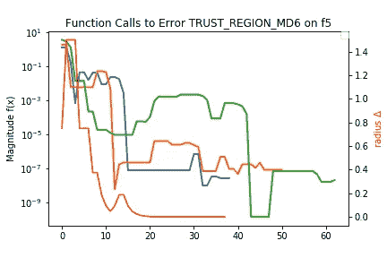

*图 6 —采取的步骤(x 轴)中函数值的幅度变化(y 轴)。半径δ随着函数值的提高而变化。*

我们看到，如果函数值随着时间的推移而提高，那么我们的半径会变小(见图 5 和图 6)，而如果一开始函数值不好，我们会增加半径。参见图 6 中对吸引扇区函数进行优化的第一步。

# 我们起始问题的答案

来回答这个问题:“我的模型收敛了吗？”。我建议如下

1.  测试不同的优化算法，比较性能和确定的最小值——它们是全局的吗？
2.  如果你的问题表面是平坦的，也就是说在优化过程中只有很小的变化:运行更多的迭代，增加容差(收敛-差异的值非常小)，也许尝试跳到函数的不同区域
3.  从多个不同的起点开始:选择均值或中值来衡量绩效。

# 结论|兔子洞

我们已经看到了两类优化方法是如何工作的:直线线性优化器和信赖域优化器。这只是兔子洞的入口。对于我们看到的每个函数和问题，我们都能发现新的东西。我们可以分析我们的 Jacobian 或 Hessian 矩阵如何运行，以使我们的优化器完成工作。我们必须看看函数的形状和性质。显然，存在着大量可用的证明和定理，它们是我们刚刚看到的内容的数学支柱。如果你想深入了解原始数学，我推荐你去读一读《T2 数值优化》这本书。)作者 j·诺切达尔和 s·j·莱特[3]。

# 承认

我在这里展示的大部分工作都是我在参加[大学——DIKU](https://di.ku.dk/english/)的数值优化课程时完成的。没有课程官员的指导，这是不可能的。

# 参考

[1] MathWorks [*全局优化算法的测试函数*](https://www.mathworks.com/matlabcentral/fileexchange/23147-test-functions-for-global-optimization-algorithms)
【2】c . Geiger 和 C. Kanzow。*拟牛顿-弗法伦* [斯普林格](https://link.springer.com/chapter/10.1007/978-3-642-58582-1_11)[1999](https://link.springer.com/chapter/10.1007/978-3-642-58582-1_11)
【3】j .诺切达尔和 S. J .莱特*数值优化*(第二版。斯普林格 2006 年

# 附录

## 信赖域算法

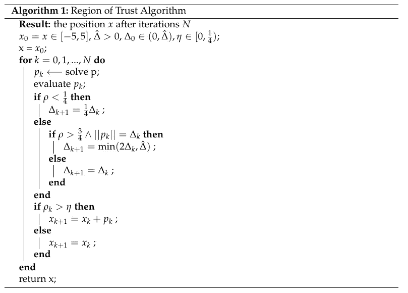

*图 A1——图 5 中信赖域优化的算法*

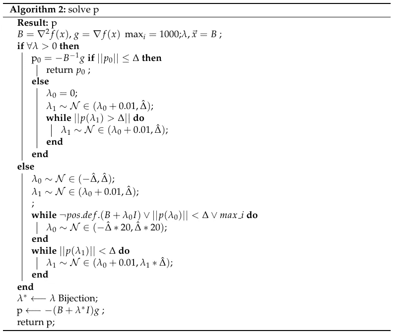

*图 A2 — Alg。求解 p——求解λ是另一个子问题。*