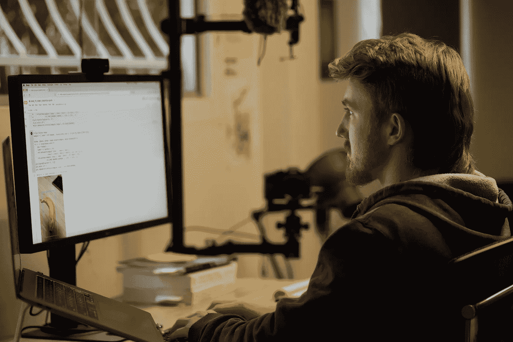

# "你是如何开始机器学习和数据科学的？"[面试]

> 原文：<https://towardsdatascience.com/howd-you-get-started-with-machine-learning-and-data-science-interview-693c33094c2?source=collection_archive---------10----------------------->

## 我在 2017 年在朋友的休息室地板上训练了我的第一个模型。

2020 年对最先进机器学习的要求:鲻鱼。就是这样。山姆·伯克的照片。

前几天，这位绝对和完整的活着的传奇人物，数据科学的负责人和令人难以置信的数据科学相关的 [YouTube 视频](https://www.youtube.com/channel/UCiT9RITQ9PW6BhXK0y2jaeg)、 [Ken Jee](https://twitter.com/KenJee_DS) 的创作者，找到我，问我是否想合作一个(或两个)视频。

我说当然。

我们决定问答，来回类型的视频将是最好的。

所以他发给我一些他可能会问我的问题，为了准备，我写下了每个问题的答案。

现在我把它们复制到这里。

# 首先，你是如何对数据科学/机器学习感兴趣的？

2017 年，我和我的朋友们正在构建一个 web 应用程序(非常原始)，将我们所在地区的本地健身房链接在一起。我们的问题是不能在任何我们想训练的时候一起训练。所以我们有了做健身设施 Airbnb 的想法，你可以去某个地方和你想要的人预定时间/空间和锻炼。

过了一段时间，我们意识到许多健身房的商业模式依赖于人们不去健身。因此，我们试图通过我们花哨的小应用程序(称为 AnyGym)来增加更多的人并没有真正实现。

另外，火花过了一会儿就消失了，因为每个人都有自己的事情要做。这个项目从来没有真正给我们任何人留下超过边项目阶段。

与此同时，我辞去了在苹果零售店的工作(我是天才之一，那些帮你操作电脑的人)，重新开始学习编程(我的第三次到第四次尝试)。

由于我缺乏技能和短暂的注意力跨度，web 开发对我来说有点太乏味了。当然，2017 年是机器学习炒作的高峰，所以在我的搜索中，我偶然发现了各种各样很酷的东西。尤其是 Udacity 全新的深度学习 Nanodegree 和一个叫 Siraj Raval 的开朗角色。漂亮的颜色，有魅力的个性，这一切都吸引了我。所以我从一开始就注册了 2-3 周，对 Python 一无所知。

我想，“哇，计算机为你学习？”…我可以绕过它。

我认为我已经超出了我的能力范围(在阅读了我没有的先决条件列表后)，我发电子邮件给支持部门询问退款政策是什么。幸运的是，我没有坚持退款，并决定继续学习。

# 你在大学学的是什么？(我觉得你说的营养对吧？)

我从生物医学科学开始，但是我的前 2 年是在追女孩、闲坐、健身、去附近的瀑布而不是去上课。

最终，理学院院长给我发了一封邮件，让我过来看看。

他基本上是说，“我们为什么要把你留在这里？”(但措辞要好得多)。

我用了我爸爸生病的好借口(他确实生病了)，但真正的原因是我很懒，试图研究一些并不能真正激发我好奇心的东西。

我会发现自己会熬夜看 YouTube 上健美运动员和世界级运动员为表演而吃东西的视频，而不是阅读讲稿。

院长听到了风声，说:“你为什么不改学营养学？”。

这让我震惊。

因为我想，“你可以选择学什么？”。

你看，这就是我有多天真。我选择了生物医学，因为我觉得说“我正在学习成为一名医生”听起来很酷。

所以大学两年后，我转到了营养和食品科学。我的一些生物医学科目也算，但不是全部。所以 3 年制本科变成了 5 年制。

但是我真的不在乎学位本身，知识对我来说更重要。

即使是现在，人们还会问，你拿着营养学位干什么？我傻笑着告诉他们，“我被撕碎了。”

我带着比学位更有价值的东西离开了大学。

我离开时的想法是，如果有什么东西激发了我的好奇心，我就可以去追寻它。

# 你是从什么概念开始学习机器学习的？(小项目或学习理论)

我从深度学习开始(深度学习纳米学位是我上的第一门课)。我记得在我朋友的地板上，在 CIFAR10 上训练我的第一个卷积神经网络，并向他展示输出。

我给他看了识别飞机照片的模型，他问你怎么做到的，我说我没有，电脑自己学会了。你应该看看他的脸。

Udacity 和 Coursera 的课程是理论和小项目的混合体。尽管这些项目都是手工完成的(一位教师会为你制定步骤)，但我认为这对你的起步是很重要的。如果你尝试的事情太过遥不可及，你会失去动力并停下来。

在你不确定的事情上测试你的能力和走得不够远之间是一条细微的线。如果你不测试自己，你最终会回到你已经学过的内容。

然而，这并不总是一件坏事，因为学习不是线性的。当我复习第二遍的时候，我学到的东西是第二遍的两倍多，第三遍是第三遍的三倍多，以此类推。

# 你是如何将机器学习与你个人的兴趣结合起来的？

我还没有完全，因为，我开始有了将机器学习与健康和营养相结合的想法。

但现在我意识到，机器学习只是工程师工具箱中的另一个工具。一旦你获得了这个工具，你很容易认为这个工具可以用于任何事情。

我确实有一些关于它如何集成的想法，但我很惭愧地说，我没有像我希望的那样遵循它们，现在有一个正在工作中，但我会保密，直到原型准备好。

另外，我对生物学了解得越多，对数学了解得越多，对维数灾难了解得越多，像个性化医疗这样的事情可能在数学上是不可能的。

也就是说，我是团队的一员，更确切地说，我坐在一个团队的对面，这个团队正在进行一个名为 IOP(免疫治疗结果预测)的项目。他们试图获取不同的生物参数，如某人的基因组，并判断他们是否是免疫疗法的潜在候选人。比如，治疗对他们有效的可能性有多大(个性化，但非常小众)。考虑到治疗费用大约是每年 100，000 美元，这是很有价值的(对于可能不起作用的东西来说，这是一笔很大的费用)。

在将机器学习与我的兴趣结合起来的另一方面，我确实对创造艺术有浓厚的兴趣，我指的是写作、摄像、学习艺术本身。所以我有点变成了冷冻酸奶机器，写关于学习机器学习的东西，在上面制作视频。我的朋友都不知道我在做什么，所以我觉得我必须在这个世界上做点什么，才能找到对我感兴趣的人。

我觉得有很多关于如何处理机器学习和其他形式的代码的教程，但是没有一个人谈论如何处理它。比如，真正学到东西需要什么？

为什么有人选择做他们所做的事？

如果有 51443 人和我一起注册了在线课程，我想知道他们每天除了学习材料还做些什么。

他们也在卧室学习吗？

这就是我开始做的东西。

# 你是如何在网上学习的同时找到工作的？

当我在学习的时候，我在周末开车去优步支付课程、书籍、食物和租金(我是一个隐士，所以这些是我唯一的花费)。后来有一天晚上，我因为在错误的地点接人而被罚款。罚款 220 美元，比我一整晚挣的都多。我坐在送这些人下车的路上，好像是凌晨 2 点，在一个周日的早上，我对自己说，我在这里接醉汉并把他们带回家(安全地)，我被一个站在路边用智能手机拍照的人扇了一巴掌。

回家的路上，到了这个阶段，已经接近凌晨 3 点了。我当场就决定了。我再也不开优步了。这是一件大事，因为通常周日下午我会得到一大笔车费，因为周五晚上，周六晚上和周日是唯一真正开车的好时间。所以那个星期天早上我醒来时很累，但我基本上已经忘记了罚款，因为我有了新的任务。

我在我的[自创人工智能硕士学位](https://dbourke.link/aimastersdegree)进行了大约 8 或 9 个月，我想，去他妈的，我会弄明白的。

我最初的计划是买一张去美国的单程票，然后在那里的某个创业公司找份工作。

回想起来，我的技能可能有 70%准备好了在任何地方工作(这是一种奇特的说法，我没有自己想象的那么好)，但在我的脑海中，我知道我能够想出一些办法。

四天后出现了突破。

正如我之前提到的，我已经变成了一台放东西的冷冻酸奶机器。和我一起工作的一个叫 Ashlee 的女孩注意到了我在 LinkedIn 上发布的内容。

Ashlee 和一个叫 Mike 的人一起工作，他认识一群科技界的人。她给我发了一条信息说，“嘿，丹，我看到了你发的帖子，你可能有兴趣见见迈克”。

所以我说当然，并会见了迈克。

原来，迈克是一个很酷的人，当我们交谈时，他说你应该见见卡姆，他是马克斯·凯尔森的健康负责人。我眼前一亮。

大约一周后的周一，我遇到了小卡。我们聊了聊，我告诉他我一直在做什么，在房间里研究人工智能，在网上做东西，开优步，还有我在美国的计划。

然后他问我，“为什么是美国？”。

这让我大吃一惊。因为我真的没有答案。除了我在网上看到的来自美国的东西。

他继续对我说，如果我愿意，我可以在这里(我住在澳大利亚的布里斯班)做我想做的事情。当然，这里指的是马克斯·凯尔森。

“你为什么不在星期四来？”他问。

于是我照做了。然后下一个星期四(在这段时间里，我主要从事探索性的数据分析工作，没有机器学习，只是用熊猫清理数据)。在那之后的周四，我和首席执行官尼克以及机器学习负责人 Athon 去了路边的咖啡馆，他们给了我一个角色。

大约 14 个月后，我和尼克去了同一家咖啡馆，递交了辞职信(这是一个非常艰难的决定，因为这是我做过的最好的工作)，然后离开去开创自己的事业。

# 对于希望从头开始学习机器学习的人，你有什么建议？(或者说你是怎么做到的？)

如果我有时间，我最大的改变是学习更多的软件工程技能。我会扭曲我的人工智能硕士学位，以包括更多的东西，如 web 开发或全栈开发。

我会在短时间内学习，然后在短时间内完成项目。比如，1-3 个月的学习(从零开始)，然后用这些知识做一个项目至少 1 个月。

你看，我一直在想获得证书和完成更多的课程会带来更多的技能。但事实并非如此。

当然，课程有助于建立基础知识，但通过试错来完成自己的项目才是真正的学习。

我知道这一点，因为这基本上是我在担任机器学习工程师时所做的全部工作，我会使用在课程中和通过各种其他资源学到的基本技能，为各种企业构建小型概念验证项目。但是我们一直面临的瓶颈是如何将我们的产品投入生产。

正是在这里，我了解到机器学习在很大程度上是一个基础设施问题。这就是为什么如果我有时间，我会在学习机器的同时学习软件工程。我不会让我的模特死在 Jupyter 笔记本里，而是让更多的模特死在别人手里。

如果你是一个完全的初学者，这一切可能听起来完全超出你的理解。但别担心，每个人都会经历那个阶段。事实上，我认为你学得越多，你就越意识到自己不知道。所以你的情况永远不会真正改善，你只是(希望)在决定下一步追求什么方面变得更好。

但是如果你在寻找具体的步骤，试试这个:

我会先学习 Python，熟悉这门语言，然后学习一些机器学习课程(所有课程都很好，只需选择一两门引起你兴趣的课程)。

除了学习 Python 和各种机器技能，我还会学习全栈 web 开发和各种软件工程技能。

更简洁地说:

## 学习机器学习概念

*   浏览人工智能的[元素**(从总体上了解机器学习的全貌)。**](https://www.elementsofai.com/)

## 学习 Python

*   学习 Python 基础知识(如果你能用 Python 写一个函数，你就是在阅读开始学习机器学习)。
*   学习熊猫(用于数据操作)。
*   学习 NumPy(用于数值计算)。
*   Learn Scikit-Learn(黄金标准的机器学习库)。
*   学习深度学习(fast.ai 或者 deeplearning.ai 都很棒)。
*   Plug: [我的机器学习课程](https://dbourke.link/mlcourse)教授以上所有内容。

## 学习全栈 web 开发(与 Python 一起)

*   freeCodeCamp 的课程足够扎实。
*   更多信息，请阅读 Jason Benn 的《我如何学习编码》一文。

## 学习软件工程技能(在你需要的时候，或者在 6-12 个月之后)

*   浏览 CS50(计算机科学 101 +计算机/互联网如何工作)。
*   仔细检查你的计算机科学学位缺失的部分(这里有很多工具，你最终会用它们来建造东西)。
*   浏览[全栈深度学习课程](https://course.fullstackdeeplearning.com/)(这将帮助你让你的机器学习模型走向世界)。

## 临时演员…

*   浏览可汗学院提供的任何你需要的主题。
*   如果你能找到一个小组一起研究不同的东西，这将是惊人的。
*   你可能想要熟悉至少一种云计算产品(AWS、GCP 或 Azure)。

当然，[一路上分享你的工作](https://www.mrdbourke.com/how-can-a-beginner-data-scientist-like-me-gain-experience/)，创建你自己的博客，向 GitHub 发布代码，分享你的机器学习项目(试着用 [Streamlit](https://www.streamlit.io) 在用 ML 制作的[上构建这些项目(不管它们是什么)。](https://madewithml.com/)

要以视频格式查看这些问题的答案，请查看 Ken YouTube 上的视频:

我还在我的频道上采访了 Ken(问了一些问题，比如他在采访初级数据科学家时会寻找什么):

如果你有任何进一步的问题，或者只是想打声招呼，请留下回复或者给我发电子邮件。