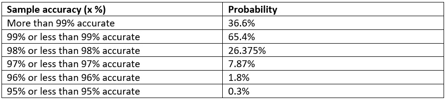
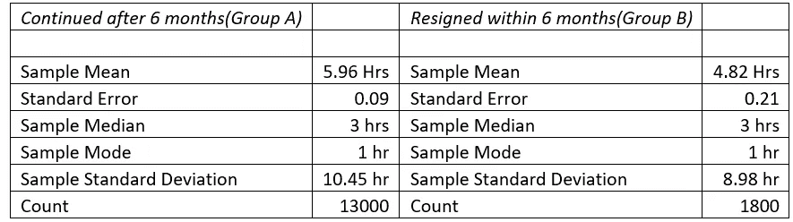
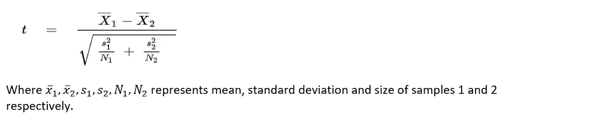
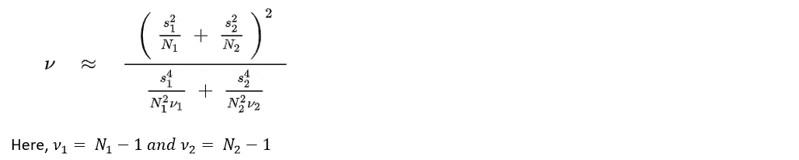
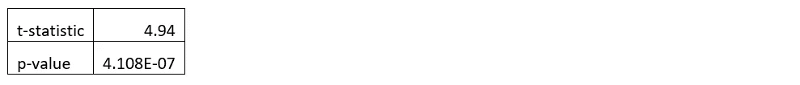

# 人力资源分析和测试假设的艺术！

> 原文：<https://towardsdatascience.com/hr-analytics-and-the-art-of-testing-hypotheses-5dd66d3153b1?source=collection_archive---------30----------------------->

随着技术在人力资源部门扎根，科技巨头开始探索人工智能和人工智能可以给人力资源带来的无限可能性，测试假设的简单艺术仍然可以帮助人力资源做出有意义和有影响的推断。

**假设检验和 p 值背后的思想是什么？**

假设一家公司生产了一种新冠肺炎检测试剂盒，并声称该检测具有 99%的准确性，即如果检测试剂盒的整个群体用于检测个体，99%的检测结果将是正确的。然而，如果我们从检测试剂盒的人群中取样，并不是所有的样本都是 99%准确的。有些样本可能 100%准确，而有些样本可能只有 95%准确。假设某个拥有无限智慧的人给了我们，从声称 99%准确的总体测试中获得不同准确水平的样本的概率(如下所述)。下表显示了在给定总体准确度为 99%的情况下，获得准确度为 x%或更低的样本的概率(由某人提供给我们):

现在，如果我们想从人群中抽取 100 个测试包来测试公司关于测试包准确性的声明，我们可以通过假设检验来实现。让我们从陈述这个测试的“无效”和“替代”假设开始。

Ho(空):测试的准确率是 99%

Ha(备用):测试的准确率低于 99%

假设，我们选择的样本有 95%的准确率。现在，我们知道，如果我们的零假设为真，即如果测试试剂盒确实有 99%的准确性，那么选择准确性小于或等于 95%的试剂盒样本的概率将为 0.3%(或“p 值”将为 0.003)。这意味着在零假设下，获得 95%准确度的样本是非常不可能的。因此，我们拒绝零假设，接受替代假设。

有人可能想知道，我们是如何决定 p 值的临界值的，在这个临界值以下，我们可以拒绝零假设。答案在一个被称为“显著性水平”的阈值概率中。如果 p 值低于显著性水平，我们拒绝零假设。通常，采用 5%的显著性水平，但用户可以根据所需的确定性水平选择另一个值。

**假设检验如何在分析人力资源数据中发挥重要作用？**

一个组织想要确定与其他员工相比，提前辞职(入职六个月内)的员工是否接受了更短时间的面试。让我们假设组织有足够的理由(通过反馈和调查)怀疑较短的面试时间可能是影响提前辞职的因素之一。为了解决这个问题，人力资源部门收集了 2019 年 1 月至 12 月聘用的员工(具有相似的背景和经验，并被聘用担任相似的角色，以保持可能的复合因素不变)的面试数据，并将他们分为两组-在六个月内辞职和超过六个月继续工作。以下是两组的描述性统计数据:

描述性统计:

根据描述性统计，我们了解到两组的平均采访时间存在一些差异。假设分析是在 2020 年 5 月进行的，现在基于从上述样本中获得的差异，我们是否可以说它对 2020 年 1 月雇用的员工成立，或者对 2018 年 1 月雇用的员工成立？人力资源收集的数据仅代表该组织在其运营过程中雇用的人员样本。我们怎么能说从样本中获得的结果对总体是正确的呢？这就是假设检验可以帮助弥合差距的地方。假设检验通过检验两个或两个以上总体或数据组的样本，从统计学上确定它们是否有显著差异。为了检验上述数据，让我们从建立零假设和交替假设开始:

ho:6 个月后继续工作的员工和 6 个月后辞职的员工的面试时间是一样的

ha:6 个月后继续工作的员工的面试时间比 6 个月内辞职的员工的面试时间多

使用不等方差的 2 样本 t 检验(韦尔奇 t 检验)来检验这一假设，显著性水平(α)设为 0.05。

韦尔奇 t 检验:

自由度:

测试结果:

4.108*10^-7 的 p 值表示“如果零假设为真”,我们从两个总体中抽取多个随机样本，那么样本均值之间的差异(5.9–4.8 = 1.1 或更大)的概率为 0.000041%。这一概率小于 5%。因此，我们拒绝零假设，即总体均值之间的差异不为零，这表明在 6 个月内辞职的员工比留下的员工接受的面试时间短。

**后续行动:**

假设检验不是结果，而是进一步分析的开始。曾经，我们已经确立，早走的员工面试时间更短；我们应该进一步尝试确定缩短面试时间是如何导致提前辞职的。分析数据以发现问题，如“面试时间缩短是否会导致沟通障碍，从而导致员工加入时的期望不匹配？”或者“一个基于简短面试的快速决定导致了被雇佣员工的技能和角色的不匹配”可以帮助我们到达真正问题的深度。为了进一步解决这些问题，我们还应该尝试确定最佳的面试时间，以解决已发现的问题，并帮助我们提高员工忠诚度。

一旦确定了最佳面试时间，就应该根据分析数据得出的结果重新设计面试体验。新的面试流程/形式应在员工样本上进行测试。如果获得了满意的结果，面试体验的重新设计就可以在组织层面上实施了。