# 人力资源预测分析:评估经理绩效(第 1 部分)

> 原文：<https://towardsdatascience.com/hr-predictive-analytics-assessing-manager-performance-part-1-841fc56eff12?source=collection_archive---------33----------------------->

## 预测分析和人力资源

## 通过预测模型和 R 的应用，探索是什么因素驱动着公司经理的绩效


在 [Unsplash](https://unsplash.com/s/photos/team?utm_source=unsplash&utm_medium=referral&utm_content=creditCopyText) 上由[米米·蒂安](https://unsplash.com/@mimithian?utm_source=unsplash&utm_medium=referral&utm_content=creditCopyText)拍摄的照片

本文是一项更具技术性的工作，展示了机器学习技术在人力资源数据集上的逐步实现，以了解经理的绩效。数据集取自[基思·麦纽提](https://medium.com/u/a859aab532a0?source=post_page-----841fc56eff12--------------------------------)的[帖子](https://github.com/keithmcnulty/ebp_exercise)，他在那里分享了这个用例以及数据集。这是关于评估组织中经理的绩效的 2 部分系列的第 1 部分。在本文中，我将介绍数据集的数据准备和探索性数据分析。

## 目标:

一家公司的首席执行官对其经理的表现感兴趣。使用 ***实验*** 数据集，本工作的主要目标是探索以下内容:

*   对数据集进行探索性数据分析，以确定数据集中可能对性能产生影响的变量
*   进行机器学习建模方法，以确定哪些变量对经理的绩效有较强或较弱的影响
*   提供分析工作的见解和局限性

**第一步:数据准备**

我首先加载数据集并快速浏览数据。数据集包含每个经理的绩效数据。我已经用 R 中的 dataexplorer 包进行了一系列的数据探索性分析。

```
perf.data <- read.csv("data.csv",header = TRUE)# Quickly visualize the data by using the plot_str functionperf.data %>%
  plot_str(fontSize=80)# Return first 5 rows of the dataset
perf.data %>%
  head(5)%>%
  kable() %>%
  kable_styling(bootstrap_options = c("hover","striped","condensed"),full_width = F)
```

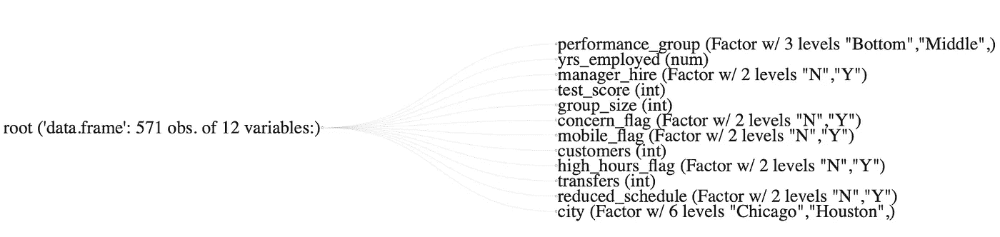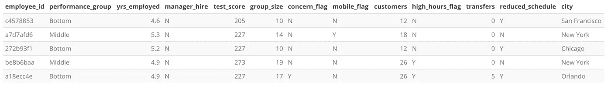

数据集混合了字符和数字变量。 ***性能组*** 是我们要研究的与数据集中所有其他变量相关的列。以下是数据集中字段的简要描述:

*   每位经理的员工 id
*   绩效 _ 每位经理的分组:绩效最低、中等或最高
*   yrs_employed:以年为单位的总工作时间
*   manager_hire:个人是被直接聘用为经理(Y)还是晋升为经理(N)
*   test_score:给所有经理的测试分数
*   group_size:他们管理的组中的员工数量
*   concern_flag:经理们是否收到了来自其团队成员的投诉
*   mobile_flag:个人是移动工作(Y)还是在办公室工作(N)
*   客户:经理负责的客户账户数量
*   high_hours_flag:经理是否在他们的时间表中输入了异常高的小时数
*   调动:当他们是经理时，来自经理小组的调动请求的数量
*   reduced_schedule:经理是兼职工作(Y)还是全职工作(N)
*   城市:经理的当前办公室

**第二步:探索性数据分析**

探索性数据分析是了解数据的过程，以便我们可以生成和检验我们的假设。使用 R 中的 data-explorer 包，很容易可视化数据集的内容，尤其是在数据集中有缺失值的情况下。

*   **简介**

这里是数据集的介绍，我们探索数据集的结构，并确定任何丢失的值。

```
# Visualize the data
plot_intro(perf.data)
```

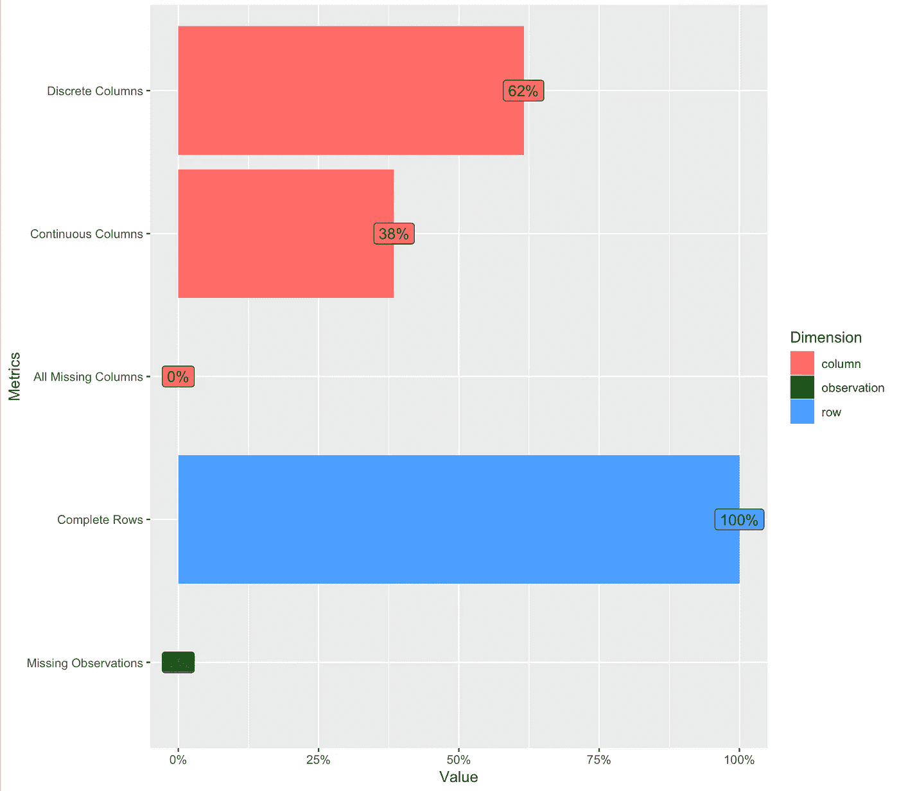

```
# Lets visualize if any missing data exists in the dataset
plot_missing(perf.data)
```

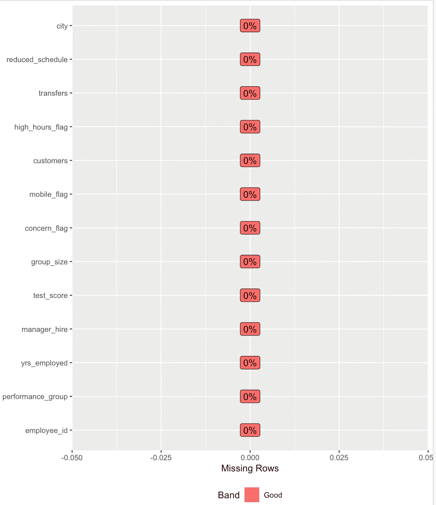

***我们正在处理一个干净的数据集，它的任何一行都没有丢失数据。在现实世界中，我们经常会遇到杂乱的数据。***

由于我们对驱动性能组的因素的理解感兴趣，下表显示了每个性能组的数据分布。

```
# Return %ages of workers in different classes of performance groupperf.data %>%
  group_by(performance_group) %>%
  summarise(n = n()) %>%
  ungroup() %>%
  mutate(pct = n / sum(n))%>%
  kable() %>%
  kable_styling(bootstrap_options = c("hover","striped","condensed"),full_width = F)
```

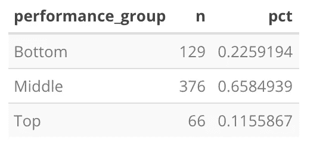

绩效 _ 组分布表

***我们可以看到，65.8%的管理者属于中等绩效群体。这是一个重要的观察结果，我们将在第 2 部分提到。***

**第三步:分配**

通过条形图、直方图、QQ 图，我们更仔细地检查数据，以获得一些高层次的见解。

```
# This plot visualisizes frequency distributions for all the discrete features
plot_bar(perf.data)
```

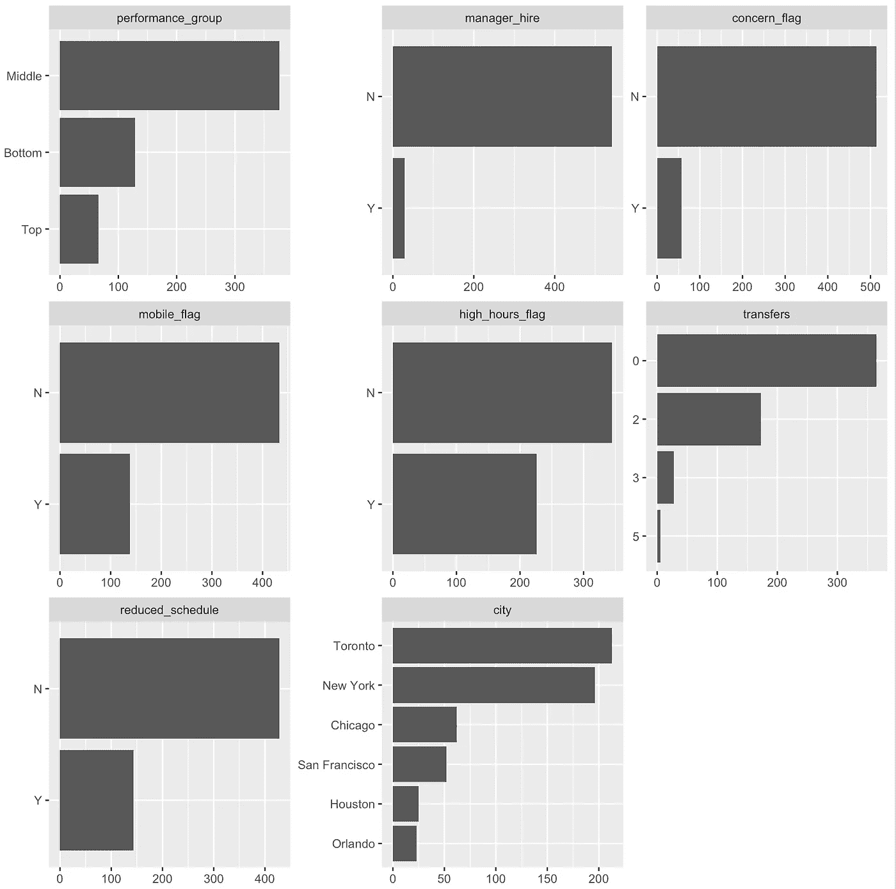

离散变量的频率分布图

仔细观察非数值离散变量的频率分布，我们可以发现:

*   **大多数经理已被直接提升至经理职位(图 2)**
*   **大多数经理位于多伦多和纽约办事处(图 7)**

现在让我们可视化所有数字/连续变量的分布。

```
plot_histogram(perf.data)
```

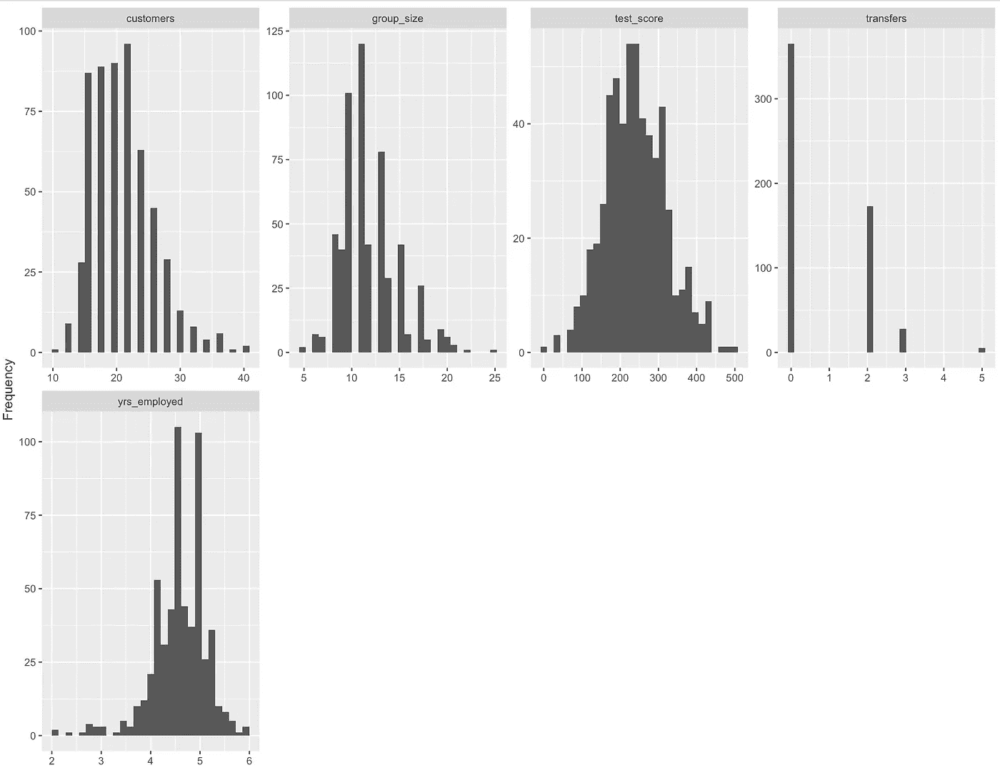

连续变量的 qq 图

我们可以看到，变量 customers、group_size 和 yrs_employed 的子图向左或向右倾斜。

我生成的下一个图是分位数-分位数图，它有助于可视化特定正态概率分布的偏差。

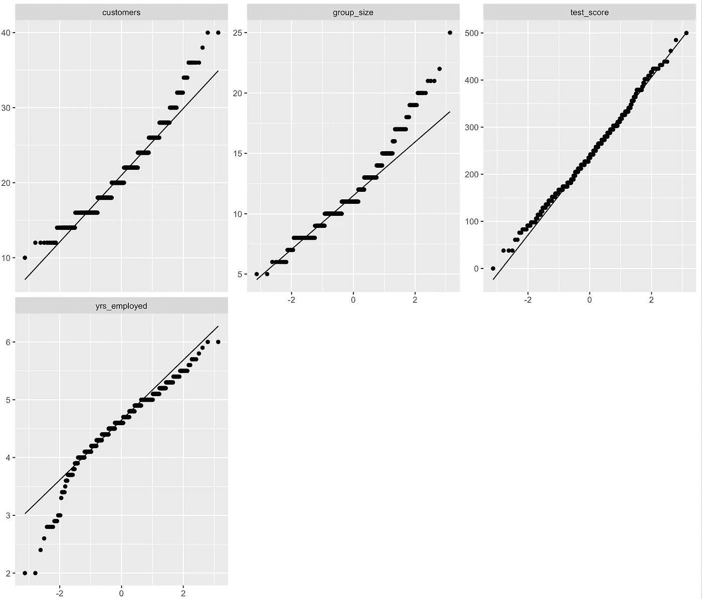

在进行任何建模工作之前，通过处理数据使分布正常化是一个很好的做法，这样分布更接近正常模式(图中的对角线)。我们通过将变量转换为它们的对数值来实现这一点。根据 qq 图，我们可以看到客户、group_size 和 yrs_employed 的数据似乎在两个尾部都是倾斜的。我对变量进行了简单的对数变换，并再次生成了 qq 图

```
# Lets run the qq plot after converting the variables into the log values.log_qq_data <- update_columns(qq_data, c("customers", "group_size", "yrs_employed"), function(x) log(x + 1))plot_qq(log_qq_data[, c("customers", "group_size", "yrs_employed")], sampled_rows = 1000L)
```

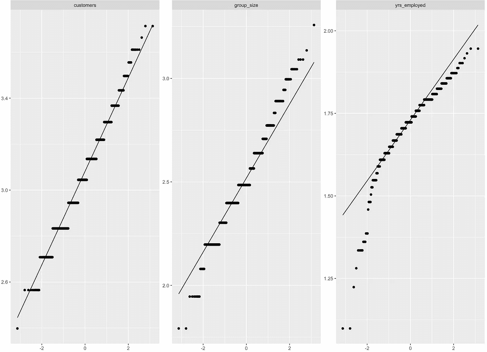

对数转换变量的 qq 图

现在分布看起来更好了。我们还可以通过另一个特性(如 performance_group)来可视化 qq 图，这是我们研究的目标。

```
# Now lets visualize the QQ plot by the feature Performance_groupqq_data <- perf.data[, c("customers", "group_size", "yrs_employed", "test_score","performance_group")]plot_qq(qq_data, by = "performance_group", sampled_rows = 1000L)
```

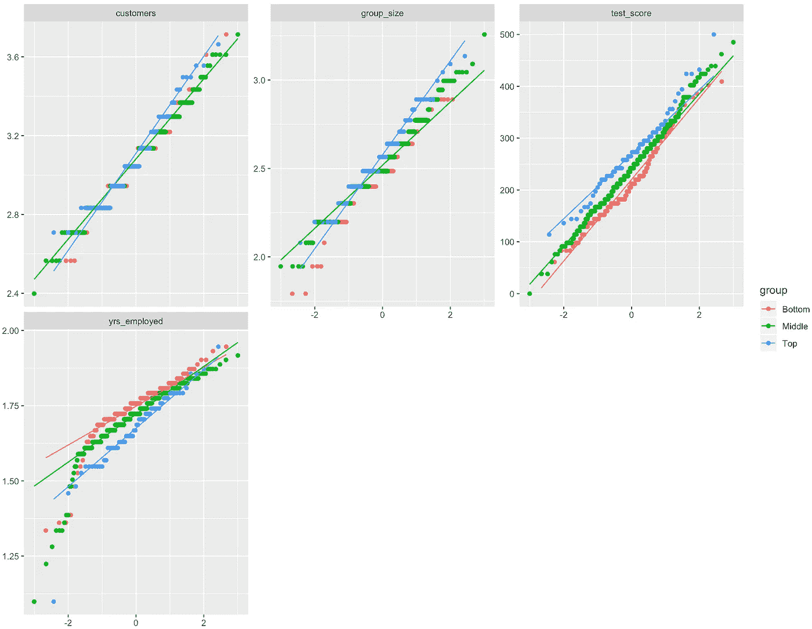

从上面的情节中，我们可以看出:

*   **表现优异者拥有更大的客户群和更高的测试分数，这是意料之中的**
*   **优秀的员工也管理更大规模的团队**
*   **公司中更有经验的经理也更有可能属于绩效最差的那一组**

**第四步:相关性分析**

相关性分析旨在揭示特征变量与目标变量之间的任何依赖性/相关性。换句话说，我们试图了解绩效是否受到雇佣年限、工作时间、团队规模、客户数量等因素的影响。

```
# Plot correlation plot to display relationshipsplot_correlation(na.omit(perf.data), maxcat = 5L)
```

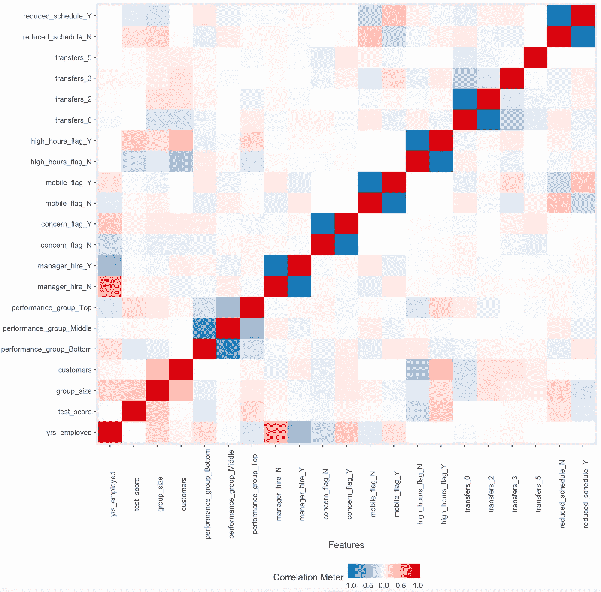

相关图

有些相关性是众所周知的，例如 high_hours_flag_N 对客户有负相关性。这意味着没有标记高工作时间的经理可能会有较少的客户。

在本文的第 2 部分，我将分享一种基于机器学习的方法，来探索什么样的特征会影响管理者的表现，这种影响有多强，以及背后的原因是什么。

***参考文献:***

R : [中的数据浏览器包 https://cran . R-project . org/web/packages/data Explorer/vignettes/data Explorer-intro . html](https://cran.r-project.org/web/packages/DataExplorer/vignettes/dataexplorer-intro.html)

Github 帐户以及 R:[https://github.com/Sambit78/ebp_exercise](https://github.com/Sambit78/ebp_exercise)中重构的代码

链接到原始数据集和问题:[https://github.com/keithmcnulty/ebp_exercise](https://github.com/keithmcnulty/ebp_exercise)