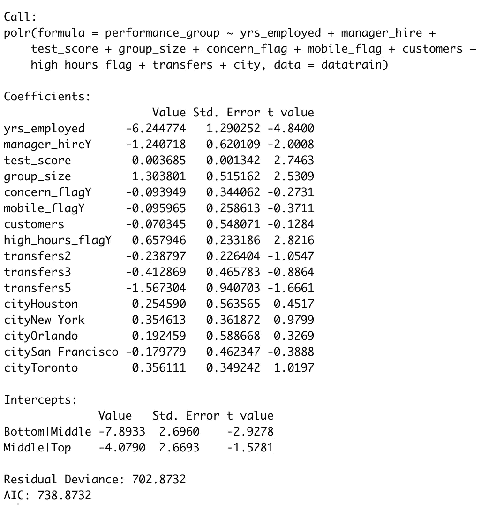
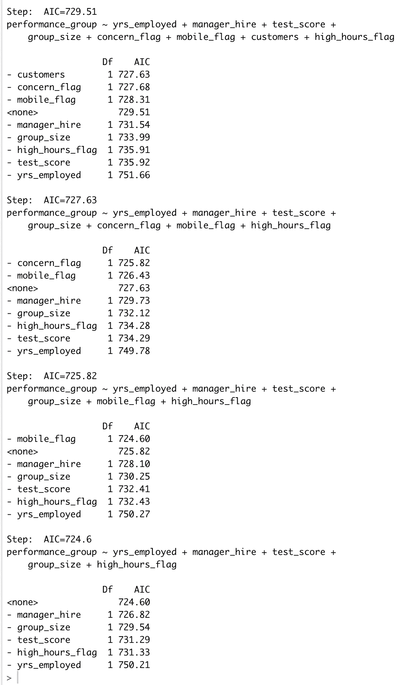
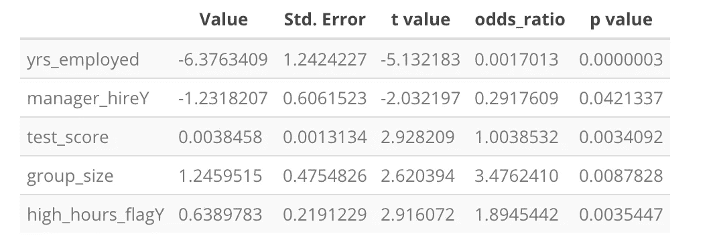
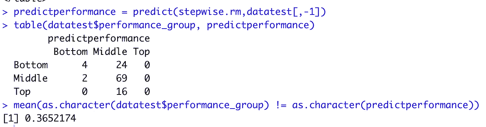
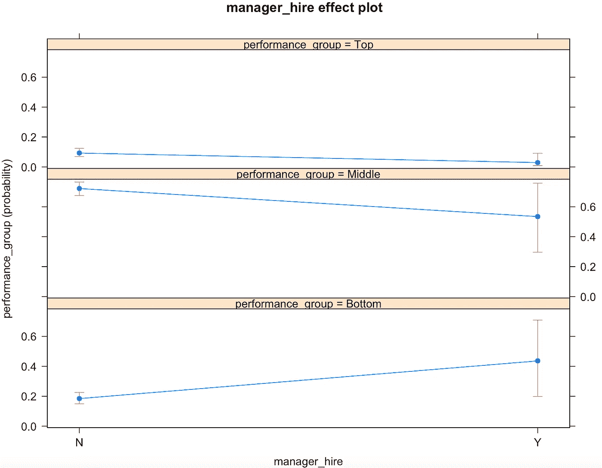
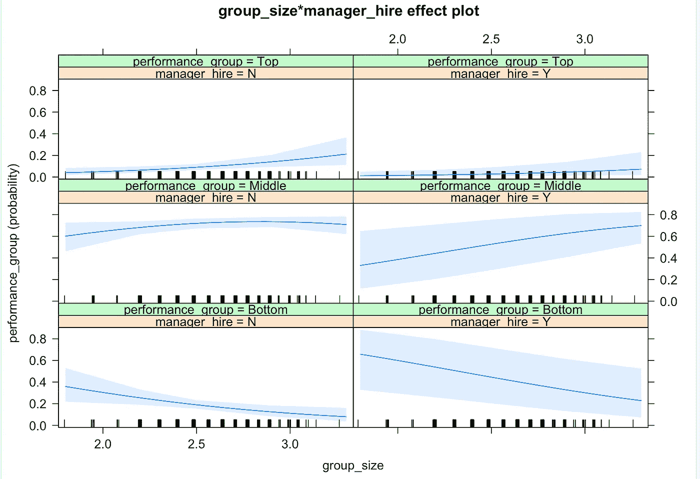

# 人力资源预测分析:评估经理绩效(第二部分)

> 原文：<https://towardsdatascience.com/hr-predictive-analytics-assessing-manager-performance-part-2-2d3bd4edf153?source=collection_archive---------21----------------------->

## 预测分析和人力资源

## 通过预测模型和 R 的应用探索驱动公司经理绩效的因素


照片由[福克斯](https://www.pexels.com/@hillaryfox?utm_content=attributionCopyText&utm_medium=referral&utm_source=pexels)从[派克斯](https://www.pexels.com/photo/group-of-people-watching-on-laptop-1595385/?utm_content=attributionCopyText&utm_medium=referral&utm_source=pexels)拍摄

这是我的评估组织中管理者表现系列的第二部分。在完成了[第一部分](/hr-predictive-analytics-assessing-manager-performance-part-1-841fc56eff12)中的数据探索过程后，我开始研究机器学习模型在用例中的应用。数据集取自基思·麦纽提的帖子，他在那里分享了这个用例以及数据集。

**步骤 5:定义训练和测试数据集**

我将在训练数据集上构建模型，并在测试数据集上验证计算出的模型。这意味着模型将在包括性能组在内的所有数据字段上进行训练。训练数据集将使模型能够决定哪些因素促成了性能组中的变化。对测试数据集的模型评估意味着我们将隐藏测试数据集的性能组列，并要求模型预测测试数据集中每一行数据的性能组级别。将数据划分为训练和测试数据集是随机的。随机样本是使用 sample()函数和 seed 函数()生成的。

```
#Dividing data into training and test set#Random sampling 
samplesize = 0.80*nrow(perf.data)
set.seed(100)
index = sample(seq_len(nrow(perf.data)), size = samplesize)#Creating training and test set 
datatrain = perf.data[index,]
datatest = perf.data[-index,]
```

**第六步:建立有序逻辑回归模型**

现在，我将使用训练数据集构建模型。众所周知，因变量(我们正在研究的变量)是绩效组变量。我已经创建了一个上层/基本模型，其中包括与单个因变量 performance_group 相关的所有输入变量。

```
# Define upper model;
upper.rm <- polr(performance_group ~ yrs_employed + manager_hire + test_score
                       + group_size + concern_flag + mobile_flag + customers 
                       + high_hours_flag + transfers + city,data=datatrain)
summary(upper.rm)
```



该表显示了系数和截距的值，以及相应的标准误差和 t 值。对系数的解释如下。例如，在保持其他一切不变的情况下，一个单位使用的 yrs _ 值的增加会降低预期的绩效值(对数概率为-6.2)。同样，可以解释对等体和质量的系数。AIC 是对信息损失和模型拟合的一种度量。在下一步中，我将使用自动特征选择技术来确定产生最佳 AIC 分数的特征的最佳数量。

**步骤 7:使用步骤 AIC 的自动特征选择**

在第 6 步中，我已经使用所有输入变量创建了有序逻辑回归模型。这里的想法是通过只选择有助于预测性能的重要输入特征来简化模型。为了进行自动特征检测，我在 MASS 包中使用了 stepAIC 函数()。

```
# Step AIC model :stepwise.rm <- stepAIC(upper.rm)
```



因此，在转换之后，创建了一个修正的 StepAIC 模型，该模型仅使用 5 个输入变量:经理 _ 雇用、组 _ 规模、测试 _ 得分、高 _ 小时 _ 标记和年 _ 雇用。

**第八步:特征重要性**

这里我创建了一个表格，显示了按重要性排列的特性。

```
ctable <- coef(summary(stepwise.rm))
odds_ratio <- exp(coef(summary(stepwise.rm))[ , c("Value")])
p <- pnorm(abs(ctable[, "t value"]), lower.tail = FALSE) * 2
coef_summary <- cbind(ctable, as.data.frame(odds_ratio, nrow = nrow(ctable), ncol = 1), "p value" = p)kable(coef_summary[1:(nrow(coef_summary) - 2), ]) %>%
kable_styling(bootstrap_options = c("hover","striped","condensed"),full_width = F)
```



有五个影响性能的重要变量:

*   每多雇用一年经理，就减少了更高绩效的可能性
*   直接聘用的经理表现出色的可能性要高出 30%
*   得分高的经理更有可能表现出色。这里的赔率很小
*   如果 a 经理管理的团队增加了，那么业绩的可能性就会显著增加
*   那些工作时间长的经理有大约 90%的机会表现出色

**第九步:模型评估**

在建立模型和解释模型结果之后，我使用混淆矩阵对模型进行了评估。对模型的评估是在测试数据集中完成的，其中 performance_group 值没有隐藏在测试数据集中。我们使用模型预测得分与实际得分进行比较，得出混淆矩阵结果。

```
predictperformance = predict(stepwise.rm,datatest[,-1])
table(datatest$performance_group, predictperformance)
mean(as.character(datatest$performance_group) != as.character(predictperformance))
```



混淆矩阵显示了有序逻辑回归模型的性能。例如，它表明，在测试数据集中，4 倍底部概率类别被正确识别。类似地，69 倍中等类别和 0 倍高类别被正确识别。我们观察到，该模型识别高概率类别很差。这是因为训练数据集中高概率类别的表示不充分。使用混淆矩阵，我们发现我们的模型的错误分类误差是 36%。这表明整体模型拟合不是很强，这可能有多种原因。主要原因之一是数据集的性质严重偏向于中等绩效组的经理。

**步骤 10:使用绘图进行解释**

用对数优势比来解释逻辑顺序回归并不十分直接。在这里，我试图用图来解释模型的结果。

```
#Plotting the effects 
library("effects")
Effect(focal.predictors = "yrs_employed",stepwise.rm)
plot(Effect(focal.predictors = "manager_hire",stepwise.rm))
plot(Effect(focal.predictors = c("group_size", "manager_hire"),stepwise.rm))
```

第一幅图显示，直接聘用的经理增加了被归入垫底群体的可能性，并略微降低了被归入最高和中等绩效群体的可能性。



第二个图非常有趣，因为它显示了两个特征在性能上的相互作用。左上部分显示，随着团队规模的增加，与直接聘用的经理相比，内部晋升的经理进入最佳绩效组的可能性增加。随着团队规模的增加，直接招聘经理增加了绩效水平处于中等水平的可能性(见图的右半部分)



**步骤 11:结论**

这篇文章有两个要点。首先，在处理可以排序的因变量时，有序逻辑回归很方便。例如，在人力资源领域，我们可以应用这些原则来研究员工福利。解释特征的对数似然性可能是棘手和困难的。使用图解法，很容易理解独立变量对分类可能性的单独和联合影响。

**参考文献:**

[](https://github.com/Sambit78/ebp_exercise) [## sambit 78/ebp _ 练习

### 您为一家北美销售公司工作，该公司在六个地方设有办事处。最近这家公司的首席执行官…

github.com](https://github.com/Sambit78/ebp_exercise)