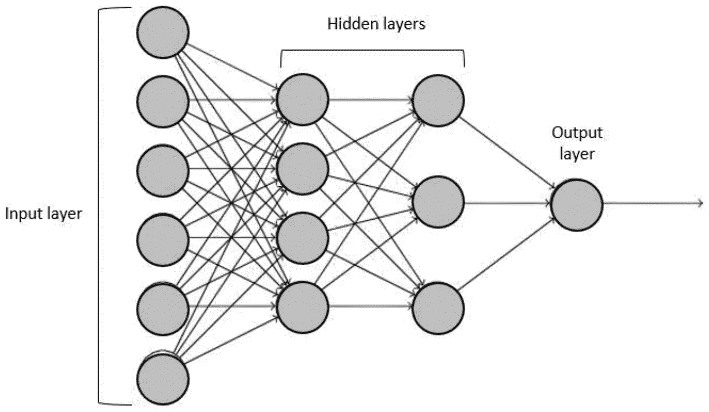
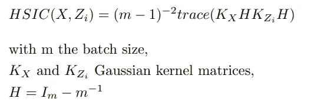
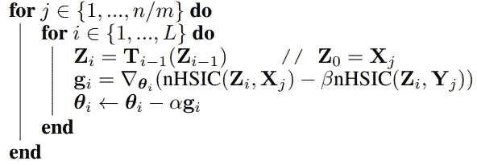
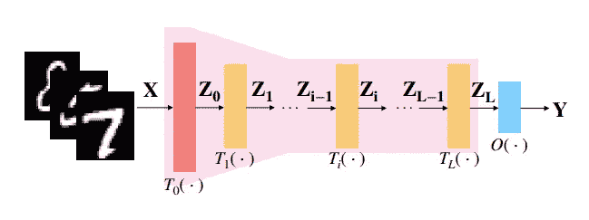
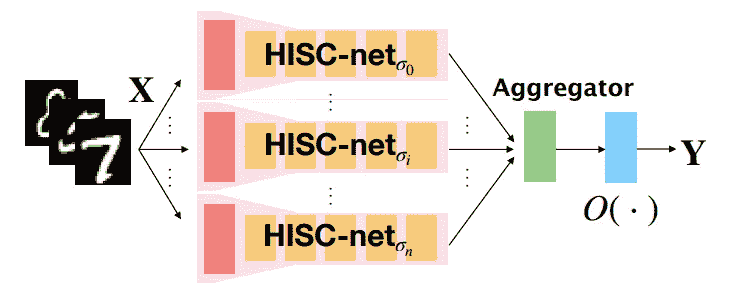
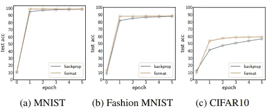

# HSIC 瓶颈:反向传播的替代方案

> 原文：<https://towardsdatascience.com/hsic-bottleneck-an-alternative-to-back-propagation-36e951d4582c?source=collection_archive---------27----------------------->

## 信息论如何带给我们深度学习模型训练的其他技术

由 [Unsplash](https://unsplash.com?utm_source=medium&utm_medium=referral) 上的 [Clarisse Croset](https://unsplash.com/@herfrenchness?utm_source=medium&utm_medium=referral) 拍摄的照片

D eep 学习模型使用基于梯度下降的方法进行学习。这要归功于一种特殊的算法，即反向传播算法，它允许我们通过计算参数更新的偏导数，在整个模型参数中反向传播训练误差。
这种算法非常昂贵，因为它需要在向前传递之后，通过整个模型的向后操作来计算偏导数。

但是如果我们能避免这种情况呢？如果我们不需要在模型的最末端计算整体损失，然后通过整个模型反向传播这个误差，会怎么样？如果我们可以在前向传递过程中直接估计我们的模型的每个隐藏层的“训练目标”,然后直接计算涉及的参数的梯度而不需要反向传播，会怎么样？

嗯，我偶然看到一篇非常有趣的论文[1]研究这个问题:*HSIC 瓶颈:没有反向传播的深度学习*作者**万多·库尔特·马，J.P .刘易斯，w .巴斯蒂亚安·克莱恩**。他们利用信息论来完成这样的任务。

# 反向传播

反向传播是一种基于链式法则的算法，它能够计算损失函数相对于前馈神经网络中所有参数的偏导数。在该算法中，偏导数是在从最后一层到第一层的反向传递中计算的，因此称为反向传播，没有并行化的可能性。

我将不再进一步扩展反向传播。对这个算法的深入分析感兴趣的话，可以看看[迈克尔·尼尔森](http://michaelnielsen.org/)的这篇令人惊叹的博客 [2](http://neuralnetworksanddeeplearning.com/chap2.html) 。

# 信息论

在攻击本文的核心之前，让我们首先介绍信息论中的一些快速概念。

信息论为我们提供了工具来测量我们所能掌握的关于给定随机变量分布的信息量。例如，根据信息论，我们可以计算随机变量 x 的熵或不确定性。

## 熵

离散随机变量的熵测度

连续可变熵

让我们考虑一组事件 A、B、C、D、E、F 以及这些事件的概率分布，考虑它们发生的可能性。设 A 为极有可能发生的事件(概率接近 1)，B，C，D，E，F 为极不可能发生的事件。

从熵公式来看，这里的变量(可以取值 A、B、C、D、E 或 F)的熵显然接近于 0。

如果我们考虑具有相同变量和相同事件集的第二个场景，但这次是在我们的事件集上的均匀概率分布，我们最终得到的熵为 **0.77** 。

这令人惊讶吗？不完全是。在第一个场景中，我们非常确定哪一个事件可能会发生，从而导致较低的不确定性(熵)。另一方面，在第二种情况下，事件集的均匀分布增加了我们所掌握信息的不确定性，我们不再确定哪个事件将会发生。

## 互信息

信息论的另一个有趣的工具是互信息(MI)。MI 衡量两个随机变量之间的相关性。

MI 作为 X 和 Y 的实际联合概率与联合分布(如果它们是独立的)之间的 Kullback Leibler 散度度量。

离散案例

连续案例

正如我们所见，MI 测量两个随机变量的联合概率和两个变量的概率乘积之间的 [Kullback Leibler 散度](https://www.countbayesie.com/blog/2017/5/9/kullback-leibler-divergence-explained) [2]，就好像它们是独立的一样。对于两个独立变量，我们有 p(X，Y) = p(X)。p(Y)，导致零 KL 发散，然后是零 MI。当两个变量强烈相关时，观察到相反的情况:爆发 KL 散度。

嗯，那很有趣！但是和我们今天的话题有什么关系呢？坚持住，我们就要到了；) .

# 无反向传播的深度学习

让我们先花点时间想想我们的深度学习模型实际上是做什么的。粗略地说，在为给定的任务(如分类)建立和训练神经网络时，我们只是在学习一个模型，它可以接受复杂的输入，将其连续转换为更简单的内容(隐藏层或内部表示)，仍然与目标变量高度“相关”。复杂的输入是文本、图像还是声音信号等等——虽然人类可读，但对我们的计算机来说很复杂。

[来源](https://www.mdpi.com/2624-6511/2/2/9)

这些内部表示仅捕获输入 x 的一部分信号，理解这一点的直观方法是考虑卷积神经网络。经过卷积和最大池层，我们得到了一个更小的数字，这可能是不可读的，但保持了微小的足够的信号，它需要从源图像仍然是“相关”的目标相应值。

考虑到这一点，我们知道我们的神经网络学习产生隐藏的表示(贯穿所有层),通过只保留相关信息来减少与输入的“相关性”,并尽可能多地与目标输出相关。我们希望训练我们的神经网络来学习这样做而不用反向传播，因此估计一个目标函数来优化每个隐藏层。

我绝对肯定，在这一点上，你有一点提示:)。我几乎能听到你在说:

> “Stéphane，我们只需要量化和最小化神经网络产生的隐藏表示与相应输入之间的相关性，还需要量化和最大化相同隐藏表示与输出变量之间的相关性。我们可以用互信息度量来量化这些信息。”

无论如何，关于论文作者的提议，你是绝对正确的:)。太棒了。

这个方法一点都不新鲜。事实上它来自于信息论:信息瓶颈原理。

I 实际上是互信息，β是超参数。

作者为神经网络的每个隐藏层找到了他们需要的目标函数。

## 信息瓶颈

IB 是由 [Naftali Tishby](https://en.wikipedia.org/wiki/Naftali_Tishby) ，Fernando C. Pereira 和 [William Bialek](https://en.wikipedia.org/wiki/William_Bialek) 介绍的一种方法。

[信号源](https://www.researchgate.net/publication/265497360_Computational_Intelligence_Techniques_for_Missing_Data_Imputation)

优化 IB 相当于最小化 X 和新变量 T 之间的互信息(相关性)，同时最大化 T 和目标变量 y 之间的 MI。

换句话说，IB 允许我们学习产生一个新的变量 T，它对源输入 X(压缩)的依赖性最小，而对目标 y 的依赖性尽可能大。

这里 T 可以是神经网络中 X 的任何隐藏表示。

## 实际上是什么？

作者介绍了一个目标函数，可用于每一个隐藏层。但是还有一个遗留的问题。

让我们假设你使用连续可微的激活函数，如 sigmoid 或 leaky-relu。此外，让我们假设您的输入 X 是一个连续变量(通常是这种情况-例如:您在模型入口处的 32x32 图像取位于[0，1] *中的连续值)。

第一个假设留给我们一个确定性的神经网络。因此，对于第二个假设，隐藏表示只是绝对依赖于 x 的连续变量。更准确地说， *Tᵢ=fᵢ(X)，*其中 fᵢ是确定性函数，Tᵢ是 x 的第 I 个隐藏表示。然后，我们几乎总是得到 MI(X，Tᵢ) = ∞，而不管神经网络的初始权重如何。

**我们如何优化一个几乎总是无穷大的函数？**
这个问题是不适定的，糜并不是出于实际目的的一种方便的度量。

作者建议用另一个相关性度量工具来代替 MI:希尔伯特-施密特独立性准则的 HSIC。

# HSIC 瓶颈

HSIC 只是两组变量之间的互协方差矩阵的范数。

在我们的例子中，让我们考虑一批输入数据 X = (X₁，X₂，…，Xₘ).每个 Xᵢ都是一个随机变量，因为它可以是数据集中的任何输入样本。还有，让我们考虑用我们的神经网络从 x 得到的 kᵗʰ隐藏层，Zᵏ = (Zᵏ₁，Zᵏ₂，…，Zᵏm).交叉协方差只是测量 x 的每个变量和 Zᵏ.的每个变量之间的协方差

HSIC 可以重写为一个矩阵的迹。

让我们来分解这个公式。K_x 或 K_z 是相似矩阵，其中每一行是从一个个体到相同变量的其他个体的距离向量。这些距离可以使用由长度标度σ参数化的高斯核来计算。
在计算 K_x.H 或 K_z.H 时，我们只需通过减去每个个体到其他个体的平均距离来确定每个变量中每个个体的距离向量的中心。例如，从平均值中减去 K_X₁(从个体 1 到所有其他个体的距离向量)。
我们最终得到一种代表两个变量中每个元素的编码向量。这个向量编码了同一个变量中每个个体与其他个体的关系。计算上述轨迹相当于对来自 X 的个体和来自 y 的相应个体的编码之间的内积求和。

> 当 X 的每个点 I 和 X 的所有其他点之间的关系类似于 Y 的相应点 I 和 Y 的所有其他点之间的关系时，这个内积将是大的，对所有 I 求和，并且其中通过高斯核来测量相似性。

有了 HSIC，我们可以凭经验估计两个变量之间的相关性。尽管有 MI，HSIC 不会爆发，也不太可能展现出无限的价值。因此，它可以作为我们的目标函数的替代。

HSIC 瓶颈

# 提议的算法

在这一节中，我将介绍整个方法，以及它们是如何组合在一起的。

最初的目标是找到反向传播的替代方法。为此，作者为神经网络的每个隐层提出了一种稳健的目标方法:HSIC 瓶颈。

隐藏表示 Z 由我们的神经网络权重来参数化。然后，当作者说我们正在寻找较少地依赖于 X 而尽可能地依赖于 Y 的隐藏表示(Z)时，他们的意思是寻找在给定输入 X 的情况下产生 Z 的参数权重。由于我们对每个隐藏层都有一个目标函数，所以我们可以直接计算每个层中涉及的权重的梯度，而不需要反向传播。

算法是这样的:

[来源](https://arxiv.org/pdf/1908.01580.pdf)

我们通过对 m 个输入示例及其目标进行采样来迭代训练数据集。请注意，Tᵢ-1 在这里代表了我们的模型的第 1-1 层的权重；在前面的段落中，我们将 T 称为隐藏变量，即隐藏层的输出；这里不一样。另外，上述算法中的(Xⱼ，Yⱼ)指的是第 j 批数据。

下面几行描述了我们模型中的正向传递:

*   我们通过将 Tᵢ₋₁应用于先前的批量隐藏表示来计算给定层的输出。
*   我们计算我们的目标函数和相对于当前层的权重的梯度。
*   我们用类似 SGD 的更新规则直接更新当前层的权重。

如我们所见，仅通过向前传递，我们已经能够计算目标函数来最小化并直接更新权重，而不需要向后传递。

在分类的情况下，最后一个隐藏的制图表达维度将等于类的数量。给定位置的最大值将用于预测相应的类别。这是未格式化的模型。
在格式化模型中，作者在神经网络的末端附加了一个全连接和一个 softmax 激活输出，并用 SGD 和无反向传播来训练这个单层。他们使用交叉熵损失来训练这一层。

格式化模型。[来源](https://arxiv.org/pdf/1908.01580.pdf)

正如我们之前看到的，HSIC 瓶颈将取决于一个超参数σ。作者发现结果确实受到这个超参数的选择的影响。为了克服这一点，使用具有不同长度尺度σ的 HSIC 瓶颈来学习并发神经网络。然后将每个网络的最终隐藏表示汇总(平均或求和)。他们进一步使用 SGD 和交叉熵损失训练具有 softmax 输出的单个全连接层。

多尺度网络。[信号源](https://arxiv.org/pdf/1908.01580.pdf)

就是这样！这是你的深度学习框架，没有用于训练的反向传播。

# 实验

作者进行了大量实验来支持他们介绍的框架。

首先，他们从经验上证明了神经网络实际上遵循了信息瓶颈原则:神经网络通过保留相关信息来学习产生较少依赖于输入 X 的隐藏表示，而非常依赖于目标 Y。就此而言，他们为大量神经网络计算了学习到的隐藏层与 X 之间的 HSIC，以及隐藏层与 Y 之间的 HSIC。这里有一个在 MNIST 数据集上训练的全连接神经网络的例子。

不同深度(层数)的深层网络的最后一个隐藏层、输入 X 和目标 Y 之间的 HSIC。[来源](https://arxiv.org/pdf/1908.01580.pdf)

正如我们所看到的，我们对神经网络的训练越深入，它就越倾向于遵循信息瓶颈原则。

他们还试验了无格式的全连接模型，其中最后一层是用 HSIC 瓶颈训练的。他们在 CIFAR 数据集上实验了这样的模型。

他们最后用一个额外的全连接层测试了格式化的模型，该层使用 SGD 和交叉熵损失进行训练。他们发现这些模型比使用反向传播训练的模型收敛得更快。

HSIC 格式的模型与用反向传播训练的模型。[来源](https://arxiv.org/pdf/1908.01580.pdf)

# 结论

有没有现在训练出来的深度学习模型，不需要反向传播？如果真的存在，那一定很少见。反向传播实际上是在深度神经网络中计算偏导数的不可避免的算法。然而，这种算法是昂贵的，经常遭受梯度消失，没有提供并行化的可能性。正是在这种背景下，我们研究的论文的作者提出了 HSIC 瓶颈，一种替代反向传播。该算法依赖于信息论中的信息瓶颈原理。使用这种方法，作者能够为我们的深层网络的每个隐藏层提出一个鲁棒的目标函数，从而能够在正向传递期间计算关于所有参数的梯度，而不需要在反向传递中传播误差，具有链式规则。

我发现解决方案绝对优雅，已经等不及这个方向的后续作品了。

# 参考

[1]万多·库尔特·马，J.P .刘易斯，w .巴斯蒂亚安·克莱恩，[HSIC 瓶颈:没有反向传播的深度学习](https://arxiv.org/abs/1908.01580v3) (2019)，arxiv 2019

[2]迈克尔·尼尔森，[反向传播算法如何工作](http://neuralnetworksanddeeplearning.com/chap2.html)(2019 年 12 月)

[3]阿瑟·格雷顿，肯吉·福水，春辉·特奥，乐松，伯恩哈德·肖尔科普夫，亚历山大·j·斯莫拉，[2008 年《独立性的核统计检验》](https://papers.nips.cc/paper/3201-a-kernel-statistical-test-of-independence.pdf)，NeurIPS 2008

[4]亚历山大·a·阿莱米、伊恩·菲舍尔、约书亚·v·狄龙、凯文·墨菲[深度变分信息瓶颈](https://arxiv.org/abs/1612.00410) 2017、ICLR 2017