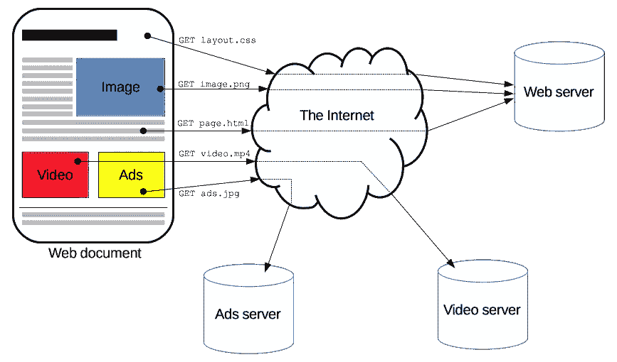

# HTTP 3 已经问世了！

> 原文：<https://towardsdatascience.com/http-3-is-out-and-about-7c903f9aab9e?source=collection_archive---------0----------------------->

## HTTP 从 HTTP 1 到 HTTP 3 的演变

# 什么是 HTTP？

HTTP 代表超文本传输协议。这是用于将网页从服务器传送到浏览器的一组规则。HTTPS 简单意味着在加密层使用相同的协议以获得更好的保密性。

HTTP 及其层(TCP/IP 堆栈)。来源: [Mozilla Dev](https://developer.mozilla.org/en-US/docs/Web/HTTP/Overview)

对于那些熟悉互联网/通信的 OSI(开放系统互连)规范的人来说，HTTP 是一个应用层协议。这意味着它与底层硬件结构或介质无关。这使得随着带宽等的增加来改进和升级 HTTP 规范变得可行。您很快就会看到这是如何发生的！

获取网页。来源: [Mozilla Dev](https://developer.mozilla.org/en-US/docs/Web/HTTP/Overview)

> HTTP 是一种客户-服务器协议:请求由一个实体，即用户代理(或代表它的代理)发送。大多数情况下，用户代理是一个网络浏览器，但它可以是任何东西，例如一个在网络上爬行以填充和维护搜索引擎索引的机器人。
> 引自 Mozilla

这个定义中的客户端是用户代理。这可能是浏览器、程序或任何使用 HTTP 协议调用服务器的东西。网络服务器传送或提供所请求的内容。代理协调 web 服务器和用户代理之间的通信。

代理的功能如下:

*   贮藏
*   过滤(隐藏成人内容或基于区域阻止内容)
*   负载平衡(直接请求空闲的服务器)
*   身份验证(允许用户与不同的服务器通信)
*   日志记录(HTTP 日志记录通常用于异常检测等)

在 HTTP 1 或(1.1)中，上述任务只是平静地发生。然而在 2009 年，一个更新的协议 HTTP 2 开始兴起。

# HTTP 2

HTTP 2 的提出是为了解决随着网络技术和带宽的发展，HTTP 1 遇到的一些限制。

*   需要执行多路复用:这允许通过相同的 TCP 连接进行并发请求。有助于同时加载资源。
*   允许浏览器优先获取哪些内容，以便更快地加载网页。或者提高页面加载的感知速度。
*   降低 HTTP 报头的权重。
*   服务器推送，使服务器能够在 web 浏览器请求资源之前推送资源。这使得解析 HTML 和重新获取 HTML 中的内容的往返时间大大缩短。

HTTP 2 提供了更快和更安全的(在 HTTP 2 中执行 HTTP 加密)web 体验。你可以看看 akamai 云提供商的这个演示。

# HTTP 3 新成员

这是(某种程度上)即将到来的协议。然而，我注意到 YouTube 已经在 chrome 浏览器中使用了 HTTP 3(但不确定其他浏览器是否也使用了 HTTP 3！).我哪里知道？因为我用一个插件看 HTTP 协议(HTTP/2 和 SPDY 指示器)。

## 有什么新鲜事？

新规范还承诺提供更快、更好、更安全的网络体验。但是怎么做呢？

HTTP 3 旨在简化 TCP 握手(这是一个 3 次握手，嗨，嗨，好吧，你得到了我的嗨，一样。).最重要的是，使用 QUIC 协议可以更快地建立连接，这也是一个新特性。

增强的连接建立承诺在 wifi 连接和移动网络等之间发生更好的连接迁移。请注意，这不是您在同一网络中的路由器之间看到的连接迁移。非常复杂和精密。

最后，QUIC 还试图升级 **TCP 慢启动**，从而更快地实现高速。QUIC 试图为此增加拥塞窗口指数。这将是一个重要的游戏升级，在 UHD 和以上的体育场和视频流的情况下。在这里阅读更多。

这可能是因为 YouTube 速度非常快，从启动就开始播放高清视频，没有缓冲。但是不要引用我的话。完美的规范可能会在今年年底出台。

我希望您喜欢阅读我在 HTTP 3 上的文章。虽然我没有深入研究技术术语和本质细节，但现在你知道我们未来的互联网会是什么样子了。为了更深入的比较，请看下面的文章。

 [## QUIC 互联网。是未来！

### QUIC 协议的到来

medium.com](https://medium.com/@anuradhawick/the-quic-internet-its-the-future-d903440b26ea) 

几篇你可能会喜欢的文章，

 [## MQTT:物联网设备如何相互对话

### 消息排队遥测传输及其在物联网中的应用

medium.com](https://medium.com/swlh/mqtt-how-iot-devices-talk-to-each-other-7b363da3ebf)  [## 什么是边缘计算

### 边缘计算概念介绍

medium.com](https://medium.com/@anuradhawick/what-is-edge-computing-d27d15f843e)  [## 互联网隐私:如何避免跟踪者

### 2020 年实现无障碍网络浏览，不被跟踪

medium.com](https://medium.com/@anuradhawick/internet-privacy-how-to-avoid-trackers-eb5c3f25419a)  [## Pi-hole，屏蔽恼人的广告

### 创建您自己的 DNS sinkhole 来阻止您家中所有设备上的广告

anuradhawick.medium.com](https://anuradhawick.medium.com/pi-hole-to-block-away-annoying-ads-68f2b5a5d20) 

干杯！