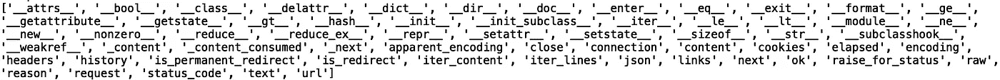
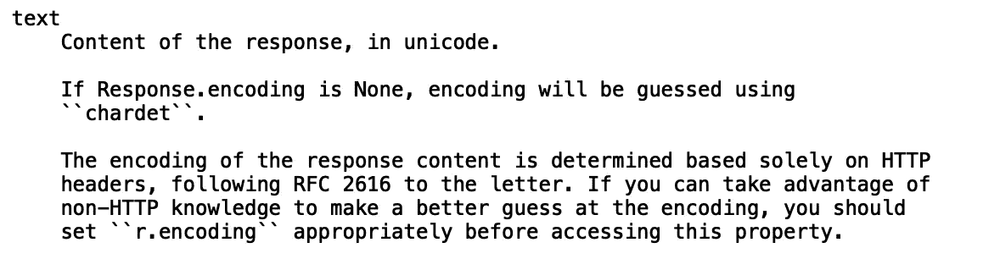
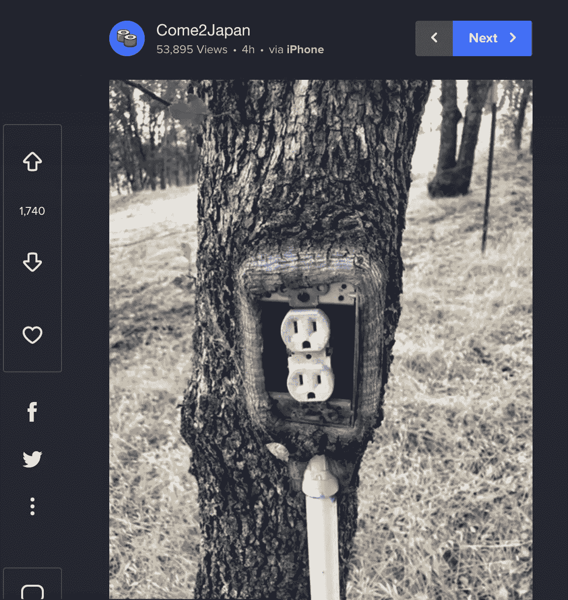
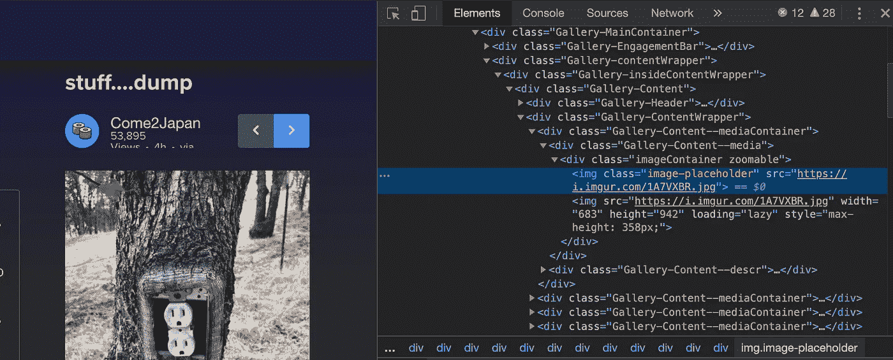

# Python 中的 HTTP 请求

> 原文：<https://towardsdatascience.com/http-requests-in-python-f19c08250079?source=collection_archive---------40----------------------->

## 请求库简介


[来源](https://www.pexels.com/photo/grayscale-photo-of-computer-laptop-near-white-notebook-and-ceramic-mug-on-table-169573/)

python 请求库简化了 HTTP 请求任务，例如从网站获取信息、发布信息、下载图像、跟踪重定向等等。在本帖中，我们将讨论 python 请求库的基础知识。

我们开始吧！

首先，让我们确保安装了请求库。在命令行中键入:

```
pip install requests
```

现在，在 python 脚本中导入请求库:

```
import requests
```

我们将从图片分享和托管网站 imgur.com[获取内容:](https://imgur.com/)


为了指定我们的请求，我们将包含 url 的字符串传递给“get()”方法:

```
r = requests.get('https://imgur.com/')
```

为了检查请求的响应状态，我们可以打印响应对象:

```
print(r)
```


响应代码 200 对应于成功的请求。我们可以使用“dir()”看到 python 中对象可用的所有方法和属性。让我们将“dir()”应用于我们的响应对象:

```
print(dir(r))
```



我们看到我们有标题、json、链接、ok 状态、状态代码等等。要更详细地解释对象的属性和方法，我们可以将“help()”方法应用于我们的对象:

```
print(help(r))
```

让我们来看看“文本”属性的详细信息:



我们可以使用“text”属性打印响应对象的文本:

```
print(r.text)
```


我们会在浏览器中看到之前查看的页面的 html 内容。我们可以用“BeautifulSoup”这样的工具进一步解析这个 html 文本。关于 BeautifulSoup 的介绍，请查看[*beautiful soup*](/introduction-to-web-scraping-with-beautifulsoup-e87a06c2b857)*的网页抓取介绍。*

现在，让我们从“imgur”网站提取一张图片。让我们导航到该网站:


接下来，让我们单击左下角有电源插座的树的图像:



右键单击图像，然后单击“检查”:



最后，导航到突出显示的链接“[https://i.imgur.com/1A7VXBR.jpg](https://i.imgur.com/1A7VXBR.jpg)”。您应该会看到该链接将您导向一个只有图像的页面。我们可以使用请求和“contents”属性从“imgur”中提取该图像。让我们用一个到图像的链接重新定义我们的请求对象，并打印内容:

```
r = requests.get('[https://i.imgur.com/1A7VXBR.jpg](https://i.imgur.com/1A7VXBR.jpg)')
print(r.content)
```


如果我们回顾一下响应对象的帮助输出，我们会看到 contents 属性是以字节为单位的:


我们可以从图像中提取字节并保存到我们的机器上。我们将在“写入字节(wb)”模式下打开一个名为“tree.png”的文件，并将内容写入该文件:

```
with open('tree.png', 'wb') as f:
    f.write(r.content)
```

如果我们打开包含 python 脚本的文件夹，我们应该会看到一个名为“tree.png”的文件，其中包含我们选择的图像。我就讲到这里，但是我鼓励你自己去研究代码。请随意使用本文中的代码尝试从其他站点获取文本和图像。

# 结论

总之，在这篇文章中，我们讨论了 python 请求库的基础。我们看一下响应对象可用的属性和方法。我们使用 text 属性来提取“imgur”主页的 html 文本。我们还展示了如何从“imgur”网站上提取一幅图像，并将其保存到我们机器上的一个文件中。我希望你觉得这篇文章有用/有趣。这篇文章中的代码可以在 [GitHub](https://github.com/spierre91/medium_code/blob/master/requessts_library/request_library_basics.py) 上找到。感谢您的阅读！