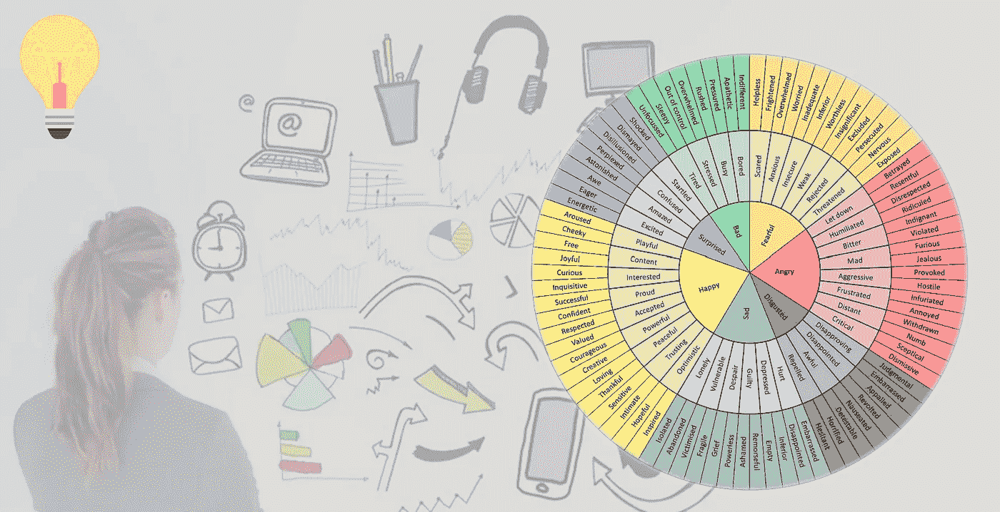
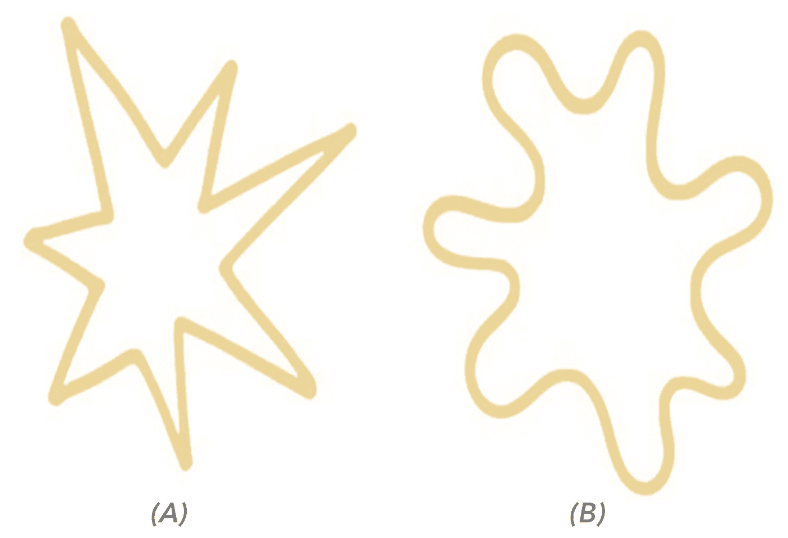
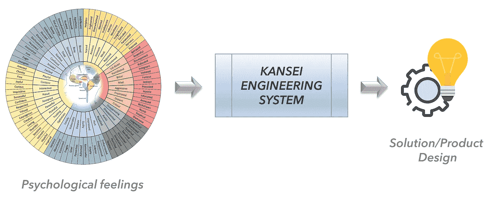
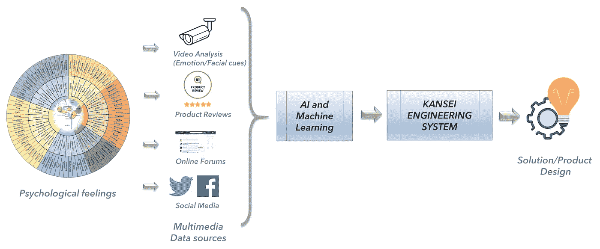

# 基于感性工学和人工智能的人性化产品设计

> 原文：<https://towardsdatascience.com/human-centric-product-design-with-kansei-engineering-and-artificial-intelligence-f38cb3c0f26d?source=collection_archive---------17----------------------->

## 感性工程过程介绍，随后是通过人工智能和大数据捕捉消费者情感和情绪的进步。

作者根据 Ackerman 和 Wavebreakmedia 提供的图片

> “设计师不是从一些先入为主的想法开始的。相反，这个想法是仔细研究和观察的结果，而设计是这个想法的产物。”-作者保罗·兰德

大多数产品/解决方案的最终目标是为最终用户/客户提供最佳利用率和满意度。顾客的满意度和喜好很可能是由人类的情感和情感决定的。*感性工学*(由长町光雄于 1974 年创立)的概念旨在捕捉顾客的心理感受，并将其带入产品或社交系统的设计中。这个意义上的心理感受包括想要、需要、美感(美丽、优雅等)等概念。)，品味好等。感性工学从观察顾客的行为开始，使用心理学量表掌握他们的情绪和情感，并使用几个统计分析来分析情绪，以引导产品或系统的设计规范。

首先，我们试着对感性的概念有一个直觉。下图是两件艺术品，一件叫卢蒙巴，一件叫塔科特。光看图像，你能说出他们是 Lumumba 还是 Takete 吗？

两件名为 Lumumba 和 Takete 的艺术品(图片由作者提供)

你们中的大多数人会把左边的锯齿状艺术(A)命名为 Takete，把右边的弯曲艺术(B)命名为 Lumumba。同样，Ramachandran 等人[1]对大学生和本科生进行了一项实验，结果是 98%的人选择左为武田，右为卢蒙巴。这表明人类大脑能够从形状和声音中提取抽象属性，它们最有可能与心理感受相关联。

以上是一个了解人类心理感受的简单实验，但在现实世界中，关注的主题(领域)可以是新的手机、体育项目、网站甚至人工智能产品，而不是艺术。因此，感性工学是一种捕捉人们(特别是目标消费者)的情绪和情感并转化为产品设计和解决方案的方法(或艺术)。

# 传统感性工学流程

感性工学过程从一开始就被用于许多产品领域的开发，如家居用品、园艺工具、汽车、服装。下图描绘了感性过程的传统观点。

感性工程流程架构(图片由作者提供)

原则上，我们对每个感官都有一个情感(情绪)反应和一个理性(认知)反应。也就是说，当接收到感官输入时，人类将构建某种类型的意识，从而产生情感和情绪。有时，很难解释为什么会产生这种情绪，因为与武田和卢蒙巴的例子相似，它是非常主观和隐含的。但大多数时候，消费者会根据第一印象来决定产品，因此，了解消费者的思维过程非常重要。另一方面，人类也会对感官知觉建立理性的理解。这是一个寻求人类对他/她对产品的看法做出理性反应的过程。没有必要两种反应都一样，但在产品设计中，感性工学过程会将两种反应都考虑在内，以推动最终的产品设计。

因此，感性工学的流程可以根据下面的流程图来理解。在开始时，定义了**域**，这是描述产品背后的整体思想的上下文。这包括理解和定义预期的目标群体和用户类型，市场定位，和产品组的问题。

感性工学工艺流程(图片由作者提供)

然后从两个不同的方面描述该域。一个是语义空间，一个是产品的属性/规格。**语义空间**可以用语义表达式(词)定义的某个向量空间来描述。这可以通过收集大量从语义角度描述领域的词汇来实现。这些词被称为感性词。例如，要描述一部手机，可以选择酷炫、优雅、美观、方便等词语。

应用程序的**空间**可以通过理解对用户真正重要的属性来定义。这可能是关键特征，并选择产品属性进行进一步评估。这些特性可以从不同的来源识别，如现有产品、客户建议、可能的技术解决方案和设计概念。

下一步是感性工学特有的，是两个空间的**合成**。在最近的文献中，诸如类别分类法、心理量表法、多变量统计分析和感性粗糙集模型等技术被用来进行这一步骤。以手机设计为例，这一步将分析什么样的应用规范可以驱动语义空间指标，如酷、方便、美观，反之亦然。下面简要介绍几种广泛使用的合成应用和情感空间的技术。进一步的细节可以在[这篇研究](https://link.springer.com/chapter/10.1007/978-3-319-60495-4_38)文章中找到，作者是感性工学过程的创始人长町光夫教授【2】。

**(1)品类分类方法**:首先确定新产品领域:(如网上商城、无线加速度计)。想象产品并写下顾客的情感，例如，想象顾客需要什么样的财产，然后写在一张纸上。然后，使用卡片创建一个树状结构，如第一类、第二类等等。在这个阶段可以使用“鱼生图”。

**(2)心理量表法**:收集感性(情绪)词后，你用那些感性词创建一个 Likart 型量表(或 SD 量表)。在这种情况下，5 或 7 级非常受欢迎。在这种方法中，我们通常会查看产品的真实样品，并在秤上检查感觉。接下来，使用多变量统计方法分析这些记录。

**(3)使用多变量统计方法的分析**:计算因子分析得到相似意义组作为因子结构，从研究中删除无意义的感性词。主成分分析、数据挖掘方法等都是有用的。JMP (SAS)分析对从顾客情感中寻找设计项目是最有用的。

**(4)感性粗糙集模型**:粗糙集模型是波兰 Zdzislaw Pawlak 教授开发的一种独特的数学模型，能够明确隐藏的情感与设计项目之间的关系。

在综合步骤之后，进行**验证**和**建模**步骤，以检查预测模型是否可靠、真实和合适。在预测模型失败的情况下，有必要更新属性空间和语义空间，从而改进模型。

# 基于感性工学开发的产品

许多大公司都采用了这种感性工学工艺，特别是在日本和瑞典。丰田、本田、马自达、松下、三洋、三星、索尼、小松、雅马哈等公司是少数使用感性工艺的世界知名公司。这些产品包括夏普的新冰箱设计(1979 年)、马自达的 MX5 乘用车(1987 年)、现代的索纳塔 2(1995 年)、波音 787 的内部设计(2008 年)和 Vf Lee 的 Urban Rider 牛仔裤(2014 年)。

马自达 MX5 (1987 年)是一个有趣的案例——马自达首席执行官构思的一款概念车，将成为年轻一代的运动型轿车。

图片来自 [Pixabay](https://pixabay.com/)

正如 Nagamachi 等人的原始文章[2]中所详述的，一组年轻驾驶员被选为用户群。取了两组驱动程序。第一次发生在年轻司机旁边的座位上。司机开车时拍摄了一段视频。第二个是研究人员站在十字路口，启动摄像机，如果任何司机看起来像年轻司机。调查结束后，所有 R&D 成员聚集到一个研究室，写下司机的情绪或行为，每个人在一张小卡片上看视频节目。这就是所谓的类别分类法。然后，他们收集一组卡片，如果它们被认为是同一类的话。之后，R&D 成员用这些卡片制作一个树状结构，就像鱼出生的图表一样。看树形结构，设计师分组联动卡意为设计元素。

# 用人工智能和机器学习增强感性工学过程

传统的感性工学过程是使用个性化体验样本进行的，其中包括 10-100 名消费者。然而，随着大数据的激增，如今大量数据可以免费公开获取。例如，Twitter、脸书、Instagram 等社交媒体平台包含数以百万计的情绪，这些情绪可以从公众中提取出来。此外，产品评论网站(如[在线产品评论](https://www.productreview.com.au/))和在线论坛(如[惠而浦在线论坛](https://forums.whirlpool.net.au/))也包含大量的人们的意见、表达和评论。此外，在超市安装的大量监控摄像头可以捕捉不同产品购买者的面部表情和情绪。利用这些海量的大数据，肯定会使感性工学过程更上一层楼。因此，我们通过使用人工智能和大数据作为以下模型架构，扩展了传统的感性工程流程架构。

通过人工智能和大数据增强的感性工程流程(图片由作者提供)

考虑开发一种新的可穿戴智能手表，它可以捕捉人的惯性测量。我们可以简单地设计一个虚拟现实(VR)应用程序，让用户在通过摄像机捕捉用户行为(捕捉表情)的同时，对产品进行实验，而不是设计原型。此外，语义空间可以通过在线社交媒体、产品评论和类似产品的论坛来捕捉，以确定公众的看法。应用空间同样可以被这样的在线媒体捕获。之后，通过关西工程流程，可以改进和实现产品设计。

具体化从在线社交媒体数据中提取的情感可以用于多个领域，因为它提供了以更好的方式理解客户/利益相关者的机会。最近，[数据分析和认知中心](https://www.latrobe.edu.au/centre-for-data-analytics-and-cognition)团队开发了[患者报告信息多维探索(PRIME)框架](https://github.com/CDAC-lab/PRIME)，旨在识别数字患者护理中的情感计算方面【3】。除了社交媒体数据之外，许多来自图像和视频数据的人类活动识别和情感检测方法也是可用的，它们可用于导出关于用户的情感信息[4]。

下面的视频显示了情绪研究实验室的面部识别软件在测试酸奶时实时捕捉消费者的情绪。

情绪面部识别产品测试

# 最后的想法

尽管有许多产品设计和开发方法，但我对感性工学过程很着迷，它能带给顾客想要、需要、美感(美丽、优雅等)等心理感受。)，好品味，融入到产品的设计中。感性工学过程从一开始就被用于许多产品领域的开发，如家居用品、园艺工具、车辆、服装等，并被许多世界领先的行业如丰田、马自达、索尼、三星、松下等所采用。简而言之，感性工学过程在产品设计中考虑了消费者情感(语义空间)和对应用规范的认知理解(应用空间)。

感性工学过程的传统实现考虑使用有限数量的消费者进行体验测试(由于可行性原因)，然而，随着大数据的出现和激增，如今可免费公开获得的大量数据可被利用来生成语义空间和应用空间的更好、可靠和复杂的视图。如今，有几种工具和技术可以最大限度地利用这种大数据平台。因此，将这些工具和技术与感性工学过程相结合，有可能设计出面向大众市场的消费者友好型产品、系统和解决方案。

## 参考

[1] Ramachandran，Vilayanur S .，和 Edward M. Hubbard。“听颜色，尝形状。”《科学美国人》288.5(2003):52–59。

[2]永町，光雄。"感性工学的历史和人工智能的应用."*国际应用人因与工效学会议*。施普林格，查姆，2017。

[3] Adikari，Achini 等，“在线支持团体能解决癌症患者的心理病态问题吗？基于人工智能的前列腺癌轨迹调查。”*《公共科学图书馆·综合杂志》* 15.3 (2020): e0229361。

[4] Nawaratne，Rashmika，等人，“用于人类活动识别的具有短暂性的分层双流增长自组织映射” *IEEE 工业信息学汇刊* (2019)。