# 使用深度学习的人类情感和手势检测器:第 1 部分

> 原文：<https://towardsdatascience.com/human-emotion-and-gesture-detector-using-deep-learning-part-1-d0023008d0eb?source=collection_archive---------16----------------------->

## [情感手势检测](https://medium.com/tag/emotion-gesture-detection/latest)

## 了解如何从零开始构建具有深度学习的人类情感和手势检测器。

有没有人曾经疑惑地看着某人，试图分析他们有什么样的情绪或他们试图做出什么样的手势，但你最终被弄糊涂了。也许有一次你试图接近一个长得像这样的婴儿:

资料来源:科林·梅纳德-恩斯普拉什

你以为它喜欢你，只是想要一个拥抱，结果你抱着它，然后就发生了这种事！

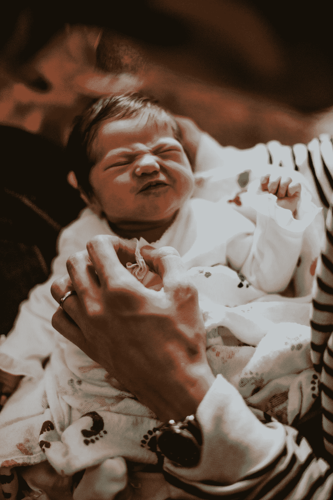

来源:Brytny.com-Unsplash

哎呀！这并没有按计划进行。但现实生活中的使用可能不像上述情况那样简单，可能需要更精确的人类情感分析以及手势分析。这一应用领域在任何部门都特别有用，在这些部门中，客户满意度或仅仅知道客户想要什么是极其重要的。

今天，我们将揭示几个深度学习模型，正是这样做的。我们今天将开发的模型可以识别一些人类情感以及一些手势。我们将尝试识别 6 种情绪，即愤怒、快乐、中性、恐惧、悲伤和惊讶。我们还将识别 4 种手势，即失败、胜利、超级和出拳。我们将进行实时表演，我们将得到模特的实时声音反应。

情绪模型将使用卷积神经网络从头开始构建，对于手指手势，我将使用 VGG-16 架构的迁移学习，并添加自定义层来提高模型的性能，以获得更好、更高的准确性。情绪分析和手指手势将为每个动作提供适当的声音和文本响应。我们将使用的衡量标准是准确性，我们将努力实现情感模型 1 的验证准确性至少为 50%，情感模型 2 的验证准确性超过 65%，手势模型的验证准确性超过 90%。

# 数据集:

现在，让我们来看看可供我们选择的数据集。

**1。** [**Kaggle 的 fer2013 数据集**](https://www.kaggle.com/c/challenges-in-representation-learning-facial-expression-recognition-challenge/data) **—** 该数据集是一个开源数据集，包含 35887 张各种情绪的灰度图像，这些图像都被标记，大小为 48x48。面部表情识别数据集在机器学习国际会议(ICML)期间发布。这个 Kaggle 数据集将是本案例研究中用于情绪分析的更主要和更重要的数据集。

数据集在中的 excel 表格中给出。csv 格式并提取像素，在提取像素并预处理数据后，数据集看起来像下面发布的图像:

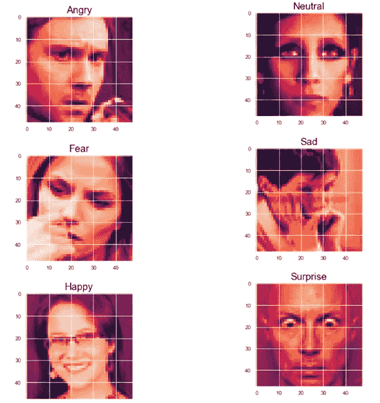

来源:作者图片

(如果第一个链接不工作，请参考[该链接](https://www.kaggle.com/deadskull7/fer2013))。

**2。** [**野外挑战中的第一个影响**](https://ibug.doc.ic.ac.uk/resources/first-affect-wild-challenge/) **—** 这可以是本案例研究考虑的第二个数据集。第一个在野外影响的挑战是设计先进的深度神经架构，包括 AffWildNet，它允许我们利用 AffWild 数据库来学习特征，这可以用作实现维度和分类情感识别的最佳性能的先验。在下载链接中，我们会找到一个 tar.gz 文件，它包含 4 个文件夹:视频、注释、盒子和地标。然而，对于我们的情感识别模型，我们将严格地只考虑 fer2013 数据集。

**3。** [**美国手语字母数据集**](https://www.kaggle.com/grassknoted/asl-alphabet) **—** 这将是手指手势检测的主要数据集。“美国手语”字母表数据集由来自美国手语的字母表的图像集合组成，被分成 29 个文件夹，这些文件夹代表各种类别。训练数据集包含 87，000 幅 200x200 像素的图像。

共有 29 类，其中 26 类用于字母 A-Z，3 类用于*空格、*和*无。*这 3 个类对实时应用和分类非常有帮助。然而，对于我们的手势识别，我们将使用来自该数据的从 A 到 Z 的 4 个类，用于手指的一些适当的所需动作。该模型将被训练识别这些特定手势中的 4 个，即 A(出拳)、F(超级)、L(失败)和 V(胜利)。然后，我们将训练我们的模型来识别这些手势，并相应地对以下每一项做出适当的声音响应。

**4。自定义数据集—** 对于情感分析和手指手势检测，我们还可以使用自己、朋友甚至家人的自定义数据集来识别各种情感和手势。拍摄的图像将被灰度化，然后根据我们的要求调整大小。

# 预处理:

对于我们的情绪模型，我们将使用 Kaggle 的 fer2013 数据集，并将使用 ASL 数据集进行手势识别。我们可以开始执行模型所需的预处理。对于情感数据集，我们将查看预处理所需的库。

Pandas 是一个快速、灵活的开源数据分析库，我们将使用它来访问。csv 文件。

**Numpy** 用于多维数组上的处理。对于我们的数据预处理，我们将使用 numpy 来制作像素特征的数组。

**OS** 模块为我们提供了一种与操作系统交互的方式。

**cv2** 模块是计算机视觉/open-cv 模块，我们将使用它将像素的 numpy 数组转换成视觉图像。

**tqdm** 是一个可选的库，我们可以用它来可视化处理速度和每秒位数。

现在让我们使用 pandas 来读取 fer2013.csv 文件。

我们使用 pandas 读取 fer2013.csv 文件。fer2013 是面部表情识别。Kaggle 的 csv 文件。在。csv 文件我们有 3 个主要栏目-情感，像素和使用。情感栏由标签 0-6 组成。像素行包含数组格式的像素图像。使用列包含培训、公共测试和私有测试。让我们仔细看看这个。

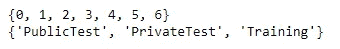

标签在 0-6 的范围内，其中:

0 =生气，1 =厌恶，2 =恐惧，3 =开心，

4 =悲伤，5 =惊喜，6 =中性。

像素由像素值组成，我们可以将其转换为数组形式，然后使用 open cv 模块 cv2 将像素数组转换为我们可以可视化的实际图像。Usage 列由 Training、PublicTest 和 PrivateTest 组成。我们将使用训练来存储训练数据集的位置，剩余的 PublicTest 和 PrivateTest 将用于存储验证文件夹中的图像。

现在让我们相应地提取这些图像。在下面的代码块中，我将展示一个类的训练和验证。在这个代码块中，我们将从 pixel 的列中提取图像，然后我们将创建一个可以从 Usage 列中跟踪的 train 和 validation 文件夹。对于每个训练和验证目录，我们将创建所有 7 个文件夹，其中包含愤怒、厌恶、恐惧、快乐、悲伤、惊讶和中立。

我们遍历数据集，将像素从字符串转换为浮点，然后将所有浮点值存储在 numpy 数组中。我们正在转换尺寸为 48x48 的图像，这是我们想要的图像尺寸。(这一步是可选的，因为给定的像素已经是期望的大小。)

如果用法是作为训练给出的，那么我们为每种情绪制作一个训练目录和单独的目录。我们将图像存储在正确的情感目录中，可以通过情感栏的标签找到该目录。

对于我们认为使用值为 PublicTest 和 PrivateTest 的验证目录，类似地重复这些步骤。情绪由情绪栏中的标签分类，类似于火车目录的工作方式。

在这个步骤之后，现在完成了用于训练情绪的所有数据预处理，并且我们已经成功地提取了情绪识别模型所需的所有图像，现在我们可以继续进行进一步的步骤。幸运的是，我们不必为手势数据做大量的预处理。下载 ASL 数据集，然后创建 train1 和 validation1 文件夹，如下所示:

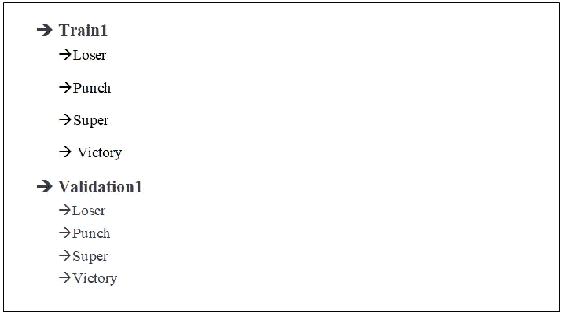

train1 和 validation1 目录有 4 个子目录，如图所示。我们将用字母“L”代表失败者，“A”代表重击，“F”代表超级，“V”代表胜利。总结下面的字母和手势:

L =失败者| A =出拳| F =超级| V =胜利

ASL 数据集包含每个字母的 3000 幅图像。因此，我们将使用前 2400 幅图像进行训练，其余 600 幅图像用于验证。这样，我们将数据分成 80:20，训练:验证比率。将每个字母“L”、“A”、“F”和“V”的前 2400 个图像粘贴到 train1 文件夹中它们各自的子目录中，并将剩余的 600 个图像粘贴到 validation1 文件夹中它们各自的子目录中。

# 探索性数据分析(EDA):

在开始训练我们的情绪和手势模型之前，让我们看看预处理步骤后我们手中的图像和整体数据。首先，我们将研究情绪数据的 EDA，然后我们将研究手势数据。从情绪数据开始，我们将绘制一个条形图和散点图来查看数据集是平衡的、相当平衡的还是完全不平衡的。我们将查阅列车目录。

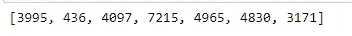

## 条形图:

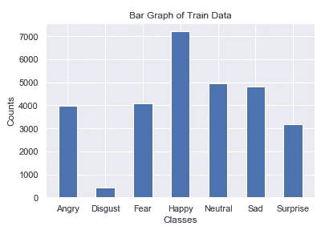

## 散点图:

我们可以注意到，这是一个相当平衡的模型，除了“厌恶”的图像相对较少。对于我们的第一个情绪模型，我们将完全放弃这种情绪，我们将只考虑剩下的 6 种情绪。现在让我们看看情感数据集的训练和验证目录是什么样子的。

# 火车:

列车数据的条形图和散点图如下所示:

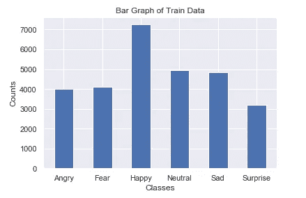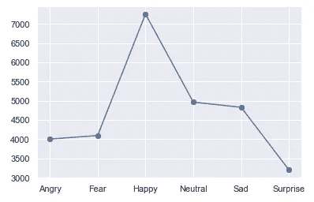

每个数据集的训练图像如下所示:

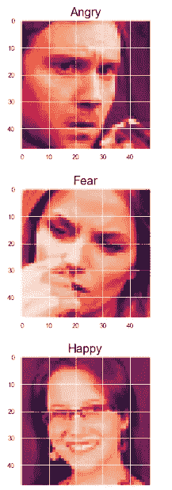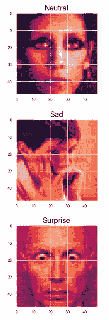

# 验证:

列车数据的条形图和散点图如下所示:

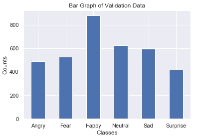

每个数据集的验证图像如下所示:

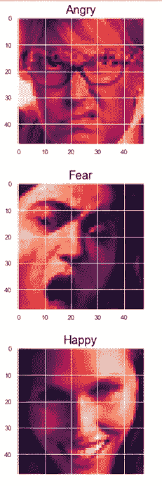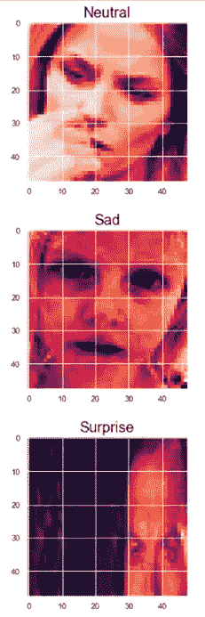

分析完我们的情绪数据集后，我们可以继续分析手势数据集，执行与上面类似的分析，并理解手势数据集。由于用于训练和验证的手势数据的数据集是完全平衡的，因此分析它们更容易。手势数据集的训练和验证数据将在下一部分进行分析，类似的图像也将显示出来。

这就完成了我们对情绪模型的探索性数据分析。我们现在可以开始建立我们的情感识别模型。首先，我们将使用图像数据增强来建立情绪模型，然后我们将建立手势模型。稍后，我们将直接从。csv 文件，并尝试获得更高的准确性。最后，我们将创建一个最终模型来运行整个脚本。

# 情绪模型-1:

在模型 1 中，我们将使用数据增强技术。数据扩充的正式定义如下-

> **数据扩充**是一种策略，使从业者能够显著增加可用于训练模型的**数据**的多样性，而无需实际收集新的**数据**。**数据扩充**裁剪、填充和水平翻转等技术通常用于训练大型神经网络。

参考:[bair.berkeley.edu](https://bair.berkeley.edu/blog/2019/06/07/data_aug/#:~:text=Data%20augmentation%20is%20a%20strategy,to%20train%20large%20neural%20networks.)

我们现在将继续导入所需的库，并指定训练模型所需的一些参数。

导入所有重要的所需深度学习库来训练情绪模型。
Keras 是一个应用编程接口(API)，可以运行在 Tensorflow 之上。
Tensorflow 将是我们用来构建深度学习模型的主要深度学习模块。
imagedata generator 用于数据扩充，模型可以看到模型的更多副本。数据扩充用于创建原始图像的副本，并在每个时期使用这些变换。
将使用的训练层如下:
1。**输入** =我们传递输入形状的输入层。
2。 **Conv2D** =卷积层与输入结合，提供张量
3 的输出。 **Maxpool2D** =对卷积层的数据进行下采样。
4。**批量标准化** =这是一种用于训练深度神经网络的技术，它将每个小批量的输入标准化到一个层。这具有稳定学习过程和显著减少训练深度网络所需的训练时期的效果。
5。 **Dropout** = Dropout 是一种在训练过程中忽略随机选择的神经元的技术。它们是随机“退出”的，这防止了过度拟合。
6。**密集** =完全连接的层。7。**展平** =将整个结构展平为一维数组。
模型可以建立在类似模型的结构中，也可以按顺序建立。
使用 l2 正则化进行微调。
所使用的优化器将是 Adam，因为它比该模型上的其他优化器执行得更好。
Numpy 用于数值数组类运算。
pydot_ng 和 Graphviz 用于制作剧情。我们也在导入操作系统模块，使其与 Windows 环境兼容。

num_classes 定义了我们必须预测的类别的数量，即愤怒、恐惧、快乐、中性、惊讶和中性。
从探索性的数据分析中我们知道图像的维数是:
图像高度= 48 像素
图像宽度= 48 像素
类别数= 1 因为图像是灰度图像。
对于图像增强的训练，我们将考虑 32 的批量大小。

为存储的图像指定序列和验证目录。
train_dir 是包含用于训练的图像集的目录。
验证目录是包含验证图像集的目录。

# 数据扩充:

我们现在来看看数据扩充代码:

ImageDataGenerator 用于图像的数据扩充。
我们将复制和制作
原始图像的转换副本。Keras 数据生成器将使用副本和
而不是原件。这对于每个时期的训练都是有用的。

我们将重新缩放图像，并更新所有参数，以适应我们的模型。参数如下:
1。**重缩放** =重缩放 1。/255 来归一化每个像素值
2。**旋转 _ 范围** =指定旋转的随机范围
3。 **shear_range** =指定逆时针范围内每个角度的强度。
4。 **zoom_range** =指定缩放范围。
5。 **width_shift_range** =指定扩展的宽度。6。 **height_shift_range** =指定延伸的高度。7。**水平 _ 翻转** =水平翻转图像。8。 **fill_mode** =根据最近的边界填充。

train _ data gen . flow _ from _ directory 取目录路径&生成批量增广数据。可调用属性如下:
1。**训练目录** =指定我们存储图像数据的目录。
2。 **color_mode** =我们需要指定图像分类方式的重要功能，即灰度或 RGB 格式。默认值为 RGB。
3。 **target_size** =图像的尺寸。
4。 **batch_size** =流水作业的数据批次数。
5。 **class_mode** =确定返回的标签数组的类型。
“分类”将是 2D 一键编码的标签。
6。**无序播放** =无序播放:是否无序播放数据(默认值:True)
如果设置为 False，则按字母数字顺序对数据进行排序。

# 情绪模型-1:

现在，我们将着手构建模型。

我们将为我们的模型使用一个顺序类型的架构。我们的顺序模型总共有 5 个块，即三个卷积块、一个全连接层和一个输出层。我们将有 3 个卷积块，其滤波器的大小分别为 32、64 和 128。内核大小将是(3，3)并且内核初始化器将是 he_normal。我们也可以使用 l2 规范化的核正则化。我们首选的激活是 elu，因为它通常在图像上表现得更好。输入形状将与我们的每个训练和验证图像的大小相同。
批处理规范化层-批处理规范化是一种提高人工神经网络的速度、性能和稳定性的技术。最大池用于缩减数据采样。脱落层用于防止过度配合。
全连通块由 64 个滤波器的密集层和一个批处理归一化组成，后面是一个丢弃层。在通过密集层之前，数据被展平以匹配维度。
最后，输出层由带有 softmax 激活的密集层组成，根据 num_classes 给出概率，num _ classes 代表要进行的预测的数量。

# 模型图:

这是我们建立的整体模型的样子:

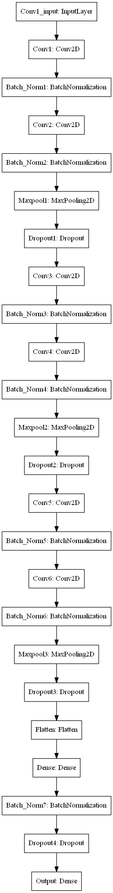

# 回访:

我们将导入培训我们的模型所需的 3 个回调。3 个重要的回调是 ModelCheckpoint、ReduceLROnPlateau 和 Tensorboard。让我们看看每个回调函数执行什么任务。

1.  **ModelCheckpoint** —这个回调用于存储我们的模型在训练后的权重。通过指定 save_best_only=True，我们只保存模型的最佳权重。我们将使用准确性指标来监控我们的培训。
2.  **ReduceLROnPlateau** —该回调用于在指定数量的时期后降低优化器的学习率。这里，我们将耐心指定为 10。如果准确度在 10 个时期后没有提高，那么我们的学习率相应地降低 0.2 倍。这里用于监控的指标也是准确性。
3.  **tensor board**—tensor board 回调用于绘制图形的可视化，即绘制精度和损耗的图形。

# 编译并拟合模型:

我们正在最后一步编译和装配我们的模型。这里，我们正在训练模型并将最佳权重保存到 emotions.h5，这样我们就不必重复地重新训练模型，并且可以在需要时使用我们保存的模型。我们将对训练和验证数据进行训练。我们使用的损失是 categorical _ crossentropy，它计算标签和预测之间的交叉熵损失。我们将使用的优化器是 Adam，学习率为 0.001，我们将根据指标准确性编译我们的模型。我们将在增强的训练和验证图像上拟合数据。在拟合步骤之后，这些是我们能够在训练和验证损失和准确性上实现的结果。

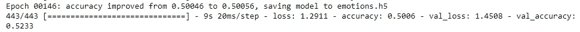

# 图表:

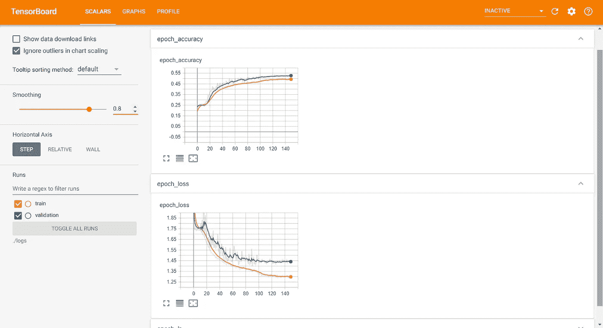

# 观察:

> 该模型能够很好地执行。我们可以注意到，训练和验证损失不断减少，训练和验证精度不断提高。在深度学习模型中没有过度拟合，并且我们能够实现大约 51%的准确度和大约 53%的验证准确度。

这是第一部分，伙计们！我希望你们都像我写这篇文章一样喜欢阅读这篇文章。在下一部分中，我们将介绍手势训练模型，然后研究第二个情绪训练模型，我们可以使用它来实现更高的准确性。最后，我们将创建一个最终管道来实时访问模型，并从模型中获得关于特定情绪或手势的声音响应。我还将发布完整代码、脚本和构建模块的 GitHub 库。敬请期待下一部分，祝你有美好的一天！