# 人类智能、计算和通用机器

> 原文：<https://towardsdatascience.com/human-intelligence-computation-and-the-universal-machine-f8e78c93355f?source=collection_archive---------21----------------------->

## 数学和计算的流动性

大多数人对人类认知只不过是计算的概念感到不舒服。毕竟人类目前在大多数任务上远远优于机器。用某种干巴巴地将输入转化为输出的符号搅动机器来框定人类思维的能力，似乎太局限了。

但是关于为什么会这样的争论似乎总是不了了之。人类的思维有什么不同？如果人类的智力不仅仅是计算，那么这更多的 T1 来自哪里？

我认为人们对机器类比的厌恶源于他们对计算本身的误解。当计算被视为某种僵硬的、机械的构造时，人和机器之间的对比是明显的。但是计算绝不是固定和僵化的。它比大多数人意识到的更有表现力，甚至创造力。

要理解计算不仅仅是程序输出，我们需要了解机器是如何做出决策的，以及普适性的概念。更重要的是对哥德尔和图灵发现的东西的欣赏和理解。

只有理解数学和计算的流动性和创造性，人们才能充分理解计算类比，并从这个基础上正确地开始他们的论点。在选择辩论的任何一方之前，我们必须认识到计算的核心是什么。

本文旨在帮助提供这一基础。

> 我将在整篇文章中使用术语计算“类比”(带引号)，但*而不是*作为人类认知不同于计算的声明(即**只是**的一个类比)。一个人不能把结论放进他们的前提，否则他们的写作就是循环。因此，我使用计算“类比”只是为了比较人类和机器的思维。

# 框定问题

最近，⁴写了两篇文章，认为基于计算的普遍性，人们不可能比其他人更聪明，并邀请我对这一观点发表意见。事实证明，比较智能方法是一种将人类和机器并列的好方法。因此，我不会对特里尚克的文章中提出的观点进行评论，而是利用这个机会来阐述我们将人类认知与计算进行比较的问题。

# 概观

*   敏捷
*   机器思维
*   从符号洗牌到普遍性
*   数学和计算的创造力
*   论计算类比的有效性
*   速度即熟悉度
*   天才神话

我们开始吧。

# 敏捷

对许多人来说，有些人比其他人“聪明”的想法似乎是显而易见的。有些人似乎能够更快地得出答案*、*和/或给出*更好的*答案。

但是一个人比另一个人“更聪明”的想法是值得怀疑的，原因有很多。首先，智力可以被描述为与逻辑、理解、意识、推理、计划等有关。说我们可以观察到一个人在*所有*认知范畴中超越他人是一种戏剧性的过度简单化。

我们还知道，像智商这样的智力单一定义在统计学上和科学上都不成立，尽管心理学家(和在线测试者)一直在推动它。我还没有看到反对参考文章的[论点](https://medium.com/@seanaaron100/intelligence-complexity-and-the-failed-science-of-iq-4fb17ce3f12#5788)不是逻辑谬误或者缺乏对统计、概率和科学的正确理解。

但是，在试图通过智力来比较人们时，人们可能会采取另一个角度。也许比较智力可以通过在人类认知和计算之间画出平行线来挽救？

从计算的角度思考是有吸引力的。可以说，掌握计算“类比”(记住，故意引用)比试图挖掘统计/概率错误或理解复杂和简单现象之间的根本差异更容易。机器和人类认知之间似乎有一种直观的联系，即使对于那些将这种相似性视为被迫的人来说也是如此。

当人们用计算类比来论证“智能”时，他们在某种意义上是在谈论 ***处理*** 能力。计算机将输入转化为输出的能力有多强，有些人能比其他人更好地完成这种转化吗？人们可能会寻找有形计算组件的心理类似物，如 RAM、硬盘驱动器和 CPU。当然，已知会影响计算的概念有物理版本，如*接口*、*内存*、*吞吐量*、*并行性和缺陷*。

但是当你在更基础的层面上理解计算时，就没有必要诉诸个体之间的物理差异。计算最终是不可知的，其原因在本文中将变得显而易见。计算是关于数学、符号和信息，以及当复杂性达到一定程度时，这些结构所提供的矛盾的自由。

如果我们要在人们的认知能力之间进行比较，使用计算作为类比，那么我们需要理解“思维”在计算中是如何建模的。

# 机器思维

首先，我们将看看机器如何解决问题，为此，我们必须了解问题解决本身的性质。这就把我们带到了计算中问题是如何建模的。

## 决策问题

在计算中，决策建模的方式是通过使用所谓的*决策问题*。决策问题是带有是/否答案的问题，并且构成了[计算复杂性理论](https://en.wikipedia.org/wiki/Computational_complexity_theory)的主要部分。

> 当人类在决策中引入更多的 ***主观性*** 时，我们需要围绕一些精确的东西开始我们的比较。我们将在后面看到，机器也通过利用过去的“经验”和使用近似值来得出它们的解决方案，从而引入了“主观性”。

决策问题根据其复杂程度进行分类。两个最著名的复杂性类是 **P** 和 **NP** 。p 代表*多项式时间，* NP 代表*非确定性多项式时间*。把这些想成是*迅速解决了*和*分别迅速验证了*。 **P** 既可以快速求解*又可以快速验证*，而 NP 只能(？)被迅速验证(不太对，但留在我身边)。

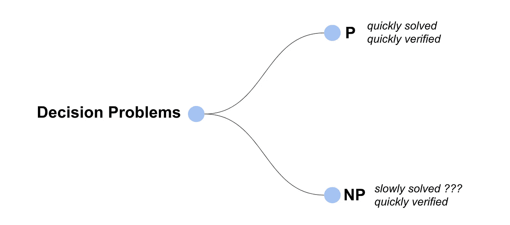

**图 2** 决策问题的两种最常见的**复杂性类别**。

注意 NP 复杂性类的“慢慢解决”旁边的问号。我们并不确切知道 NP 问题是否只能慢慢解决，但是从来没有人找到一个 NP 问题的快速而精确的解决方案(对于一个*合理输入大小*的问题)。这就是计算机科学中著名的 **P vs NP** 问题，该问题问**是否存在比验证**更难计算的问题(或者说，快速验证其解的问题是否也能快速解决？)?

> 复杂性理论家们目前的共识是 P ≠ NP，因为还没有人在合理规模的输入上找到一个实例来暗示 otherwise⁸.

这篇文章为什么要关心 P vs NP？a 类决策问题的复杂性告诉我们一个算法能够多有效地得到它的解决方案。既然我们使用计算来比较人们的智力，我们就需要欣赏人们在应对挑战时所解决的那种问题。

复杂性类别在技术上并不通过难度来划分问题，因为复杂性类别的下限是未知的。现在，我们只能说复杂性类向我们展示了一些问题可以快速解决(因此*可以预见*)，而其他问题没有*明显的*快速解决方案。**图** **3** 显示了 **P** 和 **NP** 复杂度类之间的定性比较。

**图 3**P 和 n P 在求解和验证速度上的差异。对于 **P** ，计算答案的时间随着输入大小的多项式增加。对于 **NP** ，计算答案的时间随着输入的大小呈指数增长(在确定性图灵机上)。

绘制的线让我们感觉到 P 和 NP 是多么的不同。为了完整地完成这个对话，我们需要包括另外两个**复杂性类别**、 *NP-Hard* 和 *NP-Complete* 。**图 4** 显示了我们的 4 个复杂度等级，按照复杂度递增排列。

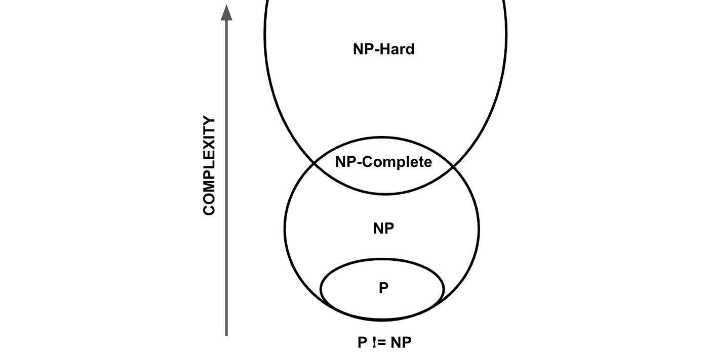

**图 4** 四大复杂度类之间的关系(假设 P ≠ NP 下)。

当计算机试图解决一个问题时，它们试图解决的是这些复杂性类别中的一个挑战。挑战落在哪里显然取决于复杂性，但更具体地说，问题被认为有多困难。同样，我们只能对 P 问题的难度进行明确的分类，因为它们有明显的快速解决方案。所有其他问题都被认为更加困难，因为还没有找到快速(准确)的解决方案。

> 重要的是要明白，我们不能用问题的绝对难度来标记它，而只能用它的相对难度来标记。这是因为下界极难证明。

下面是**复杂性类别定义**:

*   **P** :能在多项式时间内*求解*(“快速求解”)；
*   **NP** :可以在多项式时间内*验证*(“快查”)；
*   **NP-hard** :如果 NP 中的任何问题都可以在多项式时间内归结为 *it* (但本身不包含在 NP 内)；
*   **NP-complete** : 如果 NP 中的任何问题都可以归结为*它*在多项式时间内并且它在 NP 中。

我们可以使用图 4 中的图表来推理一个程序所处理的挑战的相对难度。解决一个 P 问题和解决一个 NP 问题是非常不同的。

事实上，一个人试图解决的问题的*类型*也改变了“解决”的含义说计算机“解决”了一个问题并不能告诉我们太多，除非我们同意“解决”这个词的意思。事实证明，这取决于你问谁。

## ***数学家和工程师***

问数学家“求解”这个词是什么意思，他们会告诉你一些非常精确的东西。**数学** **解**是对未知变量的表达式赋值，使得等式**为真**。这种*精度*符合数学想要实现的目标。

但是如果你问一个工程师“解决”是什么意思，他们会告诉你完全不同的东西。这是因为工程解决方案是*对*起作用，提供*效用*的东西。这是一个足够好的解决方案，可以在给定的问题空间中取得进展。

这两种类型的求解都是由计算机实现的，使用哪一种取决于问题的复杂程度。P 问题使用产生精确答案的**例程**来解决，而 NP 问题使用近似法，称为**试探法**，以*达到*足够好的解决方案。

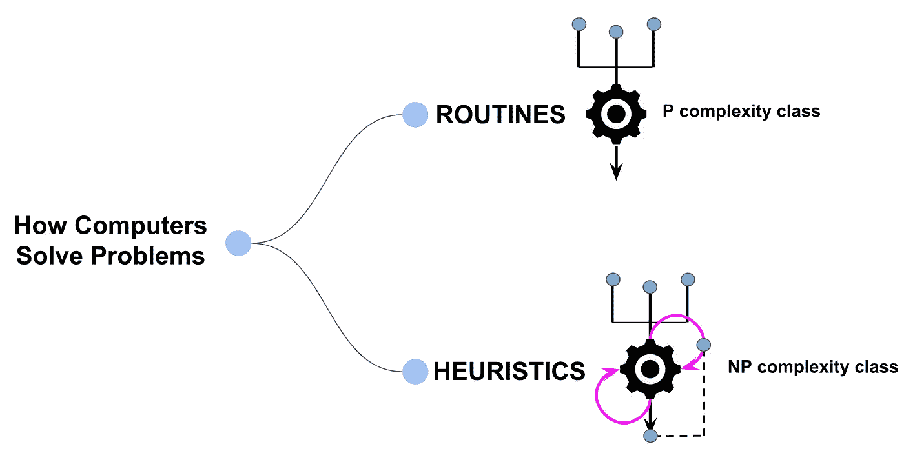

**图 5** 计算机解决问题的两种方式。属于 P 复杂性类别的问题通过**例程**解决。使用**试探法**解决属于 NP 复杂性类别的问题。

复杂类问题是通过“算法”来解决的这意味着有一个由明确定义的步骤组成的*例程*。这是可能的，因为 P 问题的计算有一个已知的下限。我们可以预测解决这些问题需要多长时间。但是 **NP** 复杂度类包含了没有人精确解决的问题，使用一个显式的逐步例程，对于合理的输入大小。NP 问题要求我们大幅放宽对“解决”的定义

> 这是我们第一次看到在处理真正困难的问题时，计算是多么“软”。人们根据严格的规则来设计计算，但这只适用于相对简单的问题，并有快速的解决方案。每当有人反对人类与计算机相似时，他们几乎总是错误地假设计算机以精确、严格的方式运行。

从技术上讲，我们*可以*想出一个循序渐进的例程来解决一个 NP 问题，但它需要在搜索空间中尝试所有可能的组合，才能得出答案。任何合理规模问题的搜索空间都是天文数字。这一计算将需要数百年，如果不是数千年的话。在搜索空间尝试所有可能的解决方案被称为**蛮力**。蛮力算法花费的时间太长，在 NP 复杂性类中不实用。

这就是为什么**数学优化**被用来*得出*NP 问题的解决方案，使用试探法。优化不会产生最佳解决方案(除非运气好)，只会在给定可用资源的情况下产生足够好的结果。这是我们必须采取的方法，在合理的时间内“解决”不平凡(复杂)的问题。**图 6** 显示了使用优化解决问题的概念。

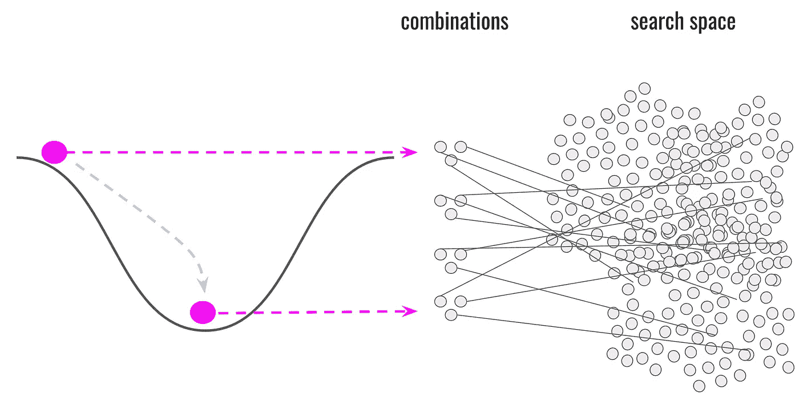

**图 6** 优化是在*实际*时间内解决重要问题的唯一方法。

在优化中，问题由**目标**定义，而不是由例程定义。通过设定一些*目标*来探索可能性空间。更好的解决方案是根据它们与实现目标的接近程度来评估的。更好的解决方案在图 6 中描述为一个球坐在某个误差面的较低位置。球越低，我们的目标和我们计算的结果之间的差距就越小。

这种方法是今天人工智能的核心。人工智能研究人员开始使用启发式方法来解决复杂的挑战，这并非巧合。传统的、基于规则的编程(例程)不能解决重要的问题。像识别人脸或自动驾驶汽车这样的任务的搜索空间太大，例程无法实际解决。

从这一点开始，我将把这两种方法称为**常规解决**和**启发式解决**以区别它们。如果计算机要解决跨越不同复杂程度的问题，它们必须同时采用这两种方法。

> 在计算中也有我们使用**元启发式**的情况。这是当我们有不完整或不完美的信息(和/或有限的计算资源)时。转向元仍然属于优化方法，我们期待“学会如何学习”

下面是一些 P 和 NP 问题的例子:

**例题套路题(P)** :

*   增加
*   整理
*   串匹配

**例题搜索问题(NP)** :

*   因子分解
*   行程安排
*   地图着色
*   蛋白质折叠
*   定理证明
*   包装
*   九宫格游戏
*   旅行推销员

我们可以看到，机器可以处理跨越复杂范围的问题，处理的问题类型决定了计算机将采取的方法。机器如何处理各种复杂问题的重要性对我们使用计算类比来比较人有着重要的意义。如上所述，人们通常反对“机器思维”，因为他们认为计算机只能做出严格、僵化的决策。但这不是计算解决重要问题的方式。

> 人们通常反对“机器思维”，因为他们认为计算机只能做出严格、僵化的决策。但这不是计算解决重要问题的方式。

但不止于此。为了充分理解计算的力量，以及它与人类认知的相关性，我们需要看看普遍性。事实证明，当我们仔细观察 **NP-Hard** 和 **NP-Complete** 复杂性类时，这种现象的第一个迹象就变得明显了。

## 普遍性的暗示

对主要复杂性类别的回顾不仅仅允许我们通过解决问题所需的方法对问题进行分类。一些更基本的东西来自我们对决策问题复杂性的理解。P≦**NP**问题的核心是认识到较低复杂度的类与较高复杂度的问题有某种内在联系。

NP 完全问题代表 NP 中**最难的问题*。让它们“完整”的是*如果* *其中任何一个可以在多项式时间内解决那么****NP 中所有的*** *问题都可以在多项式时间内解决*。换句话说，如果有人找到了一个 NP 完全问题的快速解决方案，那么所有的 NP 问题都可以快速解决(NP 中的每个问题都可以 [*化为*](https://en.wikipedia.org/wiki/Reduction_(complexity)) 为 NP 完全问题)。***

> 问题之间的相似性告诉我们问题的**相对难度**。如果我们可以(有效地)将问题 A 简化为问题 B，那么 A 应该不会比 B 更难解决。这意味着一个 NP 完全问题在所有 NP 问题中是*通用的*。

**图 7** 显示了所有 NP 问题*折叠*成 NP-Complete 的概念。这里我想强调的是这种崩溃对普遍性的意义，而不是讨论 P 对 NP 的通常含义(例如 RSA 加密)。这意味着所有非平凡的决策问题与“更简单”的问题有一些基本的共同点。

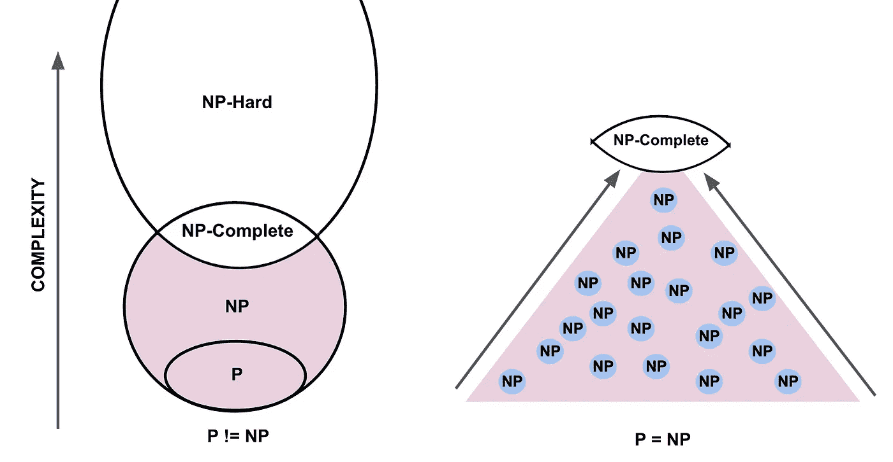

**图 7**NP 中的所有问题，如果有人找到了 NP 完全问题的快速解决方案，都将崩溃为 NP 完全问题类。这意味着所有的问题都有共同点。

问题之间的这种共同性是我们第一次暗示，计算有一个普遍的属性。虽然我们对日常问题的随意感知将它们划分为不同的类型和复杂程度，但它们的核心是所有问题之间不可否认的同一性。

记住，P 类问题是 NP 的子集。因此，NP 和 NP-Complete 之间的共性默认延伸到所有 P 问题。更有趣的是，NP 完全问题是 NP 类中最难的问题，这意味着 NP 中最难的问题通常与挑战性较低的问题相同。更进一步， **NP-Hard** 问题，至少和最难的 NP 问题一样难，所有 NP 问题都可以简化为 *it* 。

> 注意，不同复杂程度的问题之间的共有属性不依赖于 P=NP。可归约性已经证明了跨越所有复杂性类别的问题之间的联系。

> 问题难度更多地与我们对问题的感知有关，而不是问题本身的内在属性。

**需要注意的两件重要事情:**

*   大多数人有兴趣解决的自然问题属于 NP；
*   我们可以**证明**所有的 NP 问题都可以化简为 NP 完全问题，*而不需要知道所有其他 NP 问题*，只需要知道它们在 NP 中。

这两点意义重大。无论你的兴趣领域是什么，你都会面临 NP 类型的问题。但是，在这些挑战中，问题难度的感知差异有些虚幻。尽管这些问题看起来一点也不像，但从某种意义上说，它们都是同一个问题。

说到机器思维，我们知道计算能够解决不同复杂程度的问题。我们知道，解决不同问题的方法随着复杂性的变化而变化。我们也知道问题本身并没有我们想象的那么不同。

我们已经有足够多的东西开始在人类认知和计算之间进行强有力的比较，特别是在个体之间的比较智力方面。但有些人可能仍然觉得这种联系更多的是隐喻而非字面意义。回想一下我在引言中提到短语计算“类比”时引用的话如果你真的想用计算来推理人类的认知，不管你是否同意这种比较，你都必须欣赏*真正*普遍性的全部力量。

# 从符号洗牌到普遍性

计算的真正普遍性远远超过仅仅将问题简化成其他问题。真正的普适性意味着计算机拥有计算任何事物的**表象能力**和*。具体来说，这意味着通用机器可以计算或模拟任何类型的*模式。**

机械是如何捕捉到我们周围的丰富和变化的呢？当我把手伸过水或品尝成熟的草莓时，我看不到任何潜在的算法搅动我所经历的流动现实的迹象。

但是在高层次上，现实确实是某种计算。输入不断地转换成我们观察到的输出；资源从一种形式转换成另一种形式时的持续搅动。来自我之前关于智力的文章:

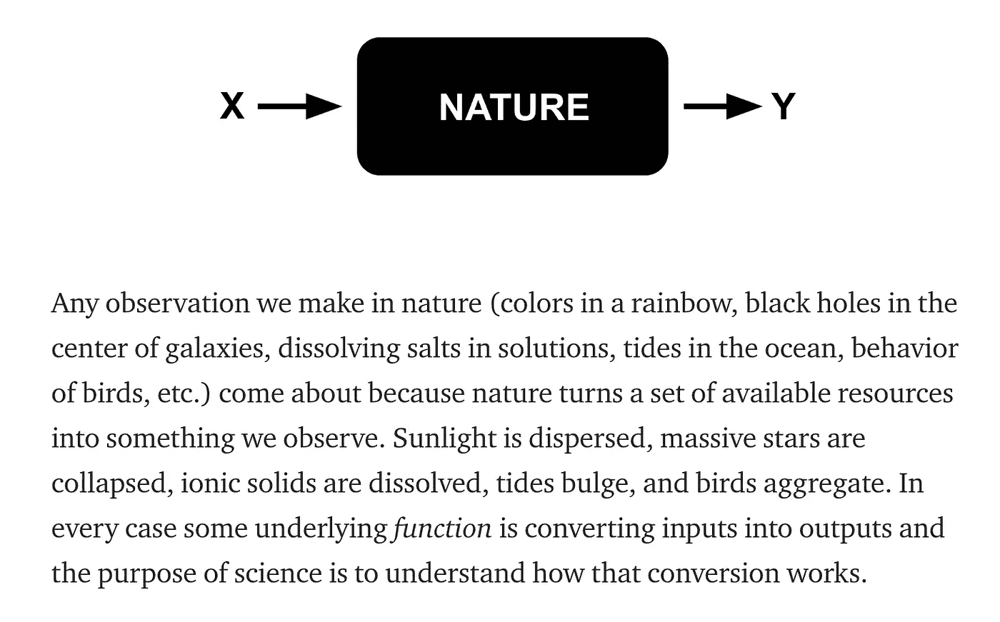

但是为了理解我们所经历的丰富性是如何来自于像原始计算这样看似平凡的事情，我们需要放弃数学和计算是僵化和机械的观念。我们需要了解符号是如何变得比它们本身更有意义的。

## 一切都从哥德尔开始

当我们听到库尔特·哥德尔时，我们显然会想到他的两个不完全性定理。这是数理逻辑的两个定理，展示了每一个能够模拟基本算术的**形式公理系统**的固有**局限性**。它说所有数学的一套完整一致的公理是不可能的。

> **形式系统**是一个配有推理规则的公理系统，它允许人们产生新的定理。公理集要求是有限的或至少是可判定的，也就是说，必须有一种算法(一种有效的方法)使人们能够机械地判定一个给定的陈述是否是公理。

**哥德尔的** **不完全性定理**:

1.  没有一个一致的公理系统能够证明自然数算术的所有真理，该公理系统的定理可以通过有效的程序(即算法)列出。对于任何这样的系统，总会有关于自然数的陈述是正确的，但在系统内是*不可证明的。*
2.  *(…第一个的延伸)表明系统**不能证明它自己的一致性**。*

*一些具体的定义:如果没有一个陈述，使得陈述本身和它的否定在系统中都是可导的，那么某事是**一致的**。一个形式系统是**完备的**如果对于该系统的每一个陈述，该陈述或者它的否定可以在该系统中被导出(即被证明)。*

*哥德尔的两个不完全性定理是现代逻辑中最重要的结果之一，具有多方面的深刻含义。也许最重要的是它所说的数学和计算的普遍性。哥德尔的工作巩固了形式系统所具有的极大灵活性，并最终巩固了计算中丰富的普遍性。为了理解这个重要的结果，我们需要更深入地探究哥德尔完成了什么。*

## *哥德尔编号法*

*映射的概念是哥德尔著名论文的关键。这是数学意义上的“映射”,在这种情况下，两个事物之间存在某种联系。需要映射的原因是因为 Godel 不得不在不使用正式系统的情况下谈论正式系统。这很直观。如果我想评论一个系统的实用性或真实性，我不能用系统本身来做。*

*哥德尔所批评的系统是由伯特兰·罗素和阿尔弗雷德·诺斯·怀特海设计的，叫做数学原理。Bertrand 和 Alfred 试图实现希尔伯特让数学*完整*的梦想，使用没有意义的抽象符号(通过剥离意义，他们确保只展示数学的原始规则*)。*

*哥德尔的映射被称为“哥德尔编号”哥德尔编号可以为形式主义的每个**符号**、**公式**和**证明**分配一个唯一的编号(形式主义中的每个符号都有一个相应的哥德尔编号)。通过使用他的映射方案，哥德尔有效地将项目管理的形式主义算术化。*

***图 8** 显示了哥德尔方法的简化概念。哥德尔用他的元数学来和*谈论*PM 的形式主义，但是以这样的方式，他的元数学与 PM 内部的符号*紧密地**联系在一起。正是通过这一方案，哥德尔可以让首相“谈论自己”，从而立即创造出矛盾的可能性。****

> *任何时候我们进入元，我们就进入了悖论的领域，因为如果你能谈论一个系统，那么这个系统就会显得自相矛盾。康托尔在他的……和波普尔在他的……批判中使用了走向元*

*例如，通过在中文普通话上使用 meta，我可以说“中文普通话中没有普通话这个词。”虽然这毫无意义，但没有什么能阻止我这么说，因为我站在语言本身之外。*

*哥德尔能够做出元陈述，比如“公式 G 不能用 PM 的规则来证明。”这本身并不有趣，但是请记住，由于哥德尔编号，做这个元语句和 PM 做这个语句本身是一样的。这是因为哥德尔证明了元数学陈述和 PM 的形式主义之间有直接的对应关系。*

*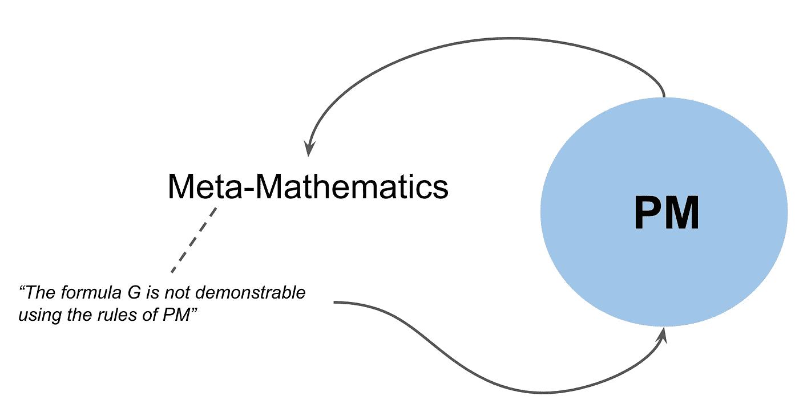*

***图 8** 哥德尔使用元数学是为了走出他所批判的形式主义。但是他的元数学与 PM 内部的符号有着密切的联系。这样，哥德尔可以让首相谈论自己。因此，如果他能证明他的元数学导致了矛盾，这意味着 PM 本身也有矛盾的能力。*

*哥德尔证明了*所有*关于形式主义内部表达式的结构性质的元数学陈述都可以 ***在“形式主义”本身***内部被镜像。哥德尔用他的元陈述证明了 PM(以及任何形式主义)既是*真实的又是形式上不可判定的，因此*是不完整的*。**

*这个结果是巨大的。它对整个数学和认识论都有重大影响。但是哥德尔所展示的局限性与形式主义证明绝对真理的能力有关。**我们在证明世界中失去的东西，我们在计算世界中获得了巨大的收益**。*

*事实证明，哥德尔的工作是形式主义通向极端灵活性的大门。要理解这一点，我们必须理解我称之为限制悖论的东西。*

# *数学和计算的创造力*

*我特意为这篇文章设计了封面。虽然我们倾向于认为数学和计算是严格和机械的，但这种观点太局限了。虽然符号限制了机械操作的形式，但是这些操作**并没有限制符号**所代表的内容。数学和计算是流动的和高度表达的，但是为了理解这是如何可能的，我们必须理解递归和限制的*悖论*之间的关系。*

## *递归和限制悖论*

*如果我告诉你，充分表达自己的唯一方式是给自己设限，会怎么样？这种自相矛盾的说法听起来并不疯狂。如果我限制自己只吃适当的食物和锻炼，我将自由地享受广泛的活动。如果我限制自己每天练习钢琴(而不是和朋友出去玩)，我*会让自己去演奏各种音乐。接受限制打开了大门。**

*这个悖论比我们日常的偶然经历更为根本。数学和计算有限制*打开*它们，在计算中这是通过**表象力量**来实现的。*

*代表力是允许正式系统模拟/计算模式的东西。**图 9** 显示了不完整(*受限*)和完整形式主义之间的概念差异。*

**

***图 9** 不完全形式主义比完全形式主义有更多的自由。不完整意味着形式主义有“活动”的“空间”。一个假设的完全形式主义在计算模式的能力上会受到严重的限制。*

*对你来说什么看起来更灵活？显然是有更多回旋余地的那个。不完整的形式主义获得了他们的代表力量*因为*他们在是*完整的。如果一种形式主义的符号是完全一致和完整的，它们将无法制造普遍性所需的非理性矛盾。**

> *如果一种形式主义的符号是完全一致和完整的，它们将无法制造普遍性所需的非理性矛盾。*

*这意味着形式主义**不需要为了模拟环境而象征性地表达环境**。虽然人们根据哥德尔定理的限制来引用它，但是他们经常把它扩展到更大、更现实的计算世界。这是不正确的。*

## *变得更加*

*只有一种方法可以让本来就有限的东西创造出比它本身更多的东西，那就是递归。一种形式主义必须能够“吃掉自己”，才能创造出超越自身符号的东西。这个事实在某种意义上是显而易见的。看下图:*

**

***图 10** 受限系统通过递归可以创造出比自身更多的*。**

**我们的最终结果是我们从未开始过的。当然，这对于任何求和都是正确的，但是仅仅是求和，我们就会**用尽符号**来使用。世界的模式太丰富了，以至于无法用非引用的静态符号来捕捉。不能递归的不完整的形式主义在试图模拟丰富的模式时会很快遇到一个固有的限制。但是递归消除了这个限制。**

**回忆一下我们对复杂问题的讨论。复杂性意味着大量的组合是可能的。对于一个与这种复杂性相称的程序来说，它必须能够处理类似的复杂问题。通过反复折叠符号，混合和匹配无数组合来近似模式，这是可能的。正是这种循环导致了任何形式主义丰富到足以吞噬自身的巨大代表力量。**

**这就是为什么数学和计算是创造性的。它们不是僵硬和机械的，而是极其流畅和富于表现力的。**

> **“所以数学是创造性的，不是机械性的，数学是生物性的，不是机器！”——格雷戈里·柴丁**

**回想一下哥德尔关于使用元数学来获得一种谈论自身的形式主义的工作。这就是**图 10** 中的递归。一个拥有丰富符号库的形式系统在严格证明时会不完整，但在计算时会非常灵活。**

> **一个拥有丰富符号库的形式系统在严格证明时会不完整，但在计算时会非常灵活。**

## ****哥德尔**-图灵阈值******

****我们已经看到了符号洗牌和递归是如何让一种形式主义呈现出巨大的创造力的。有了足够丰富的自我参照符号，我们就接近了真正普遍性的门槛。道格拉斯·霍夫施塔特将这一点称为**哥德尔-图灵阈值**。正是在这一点上，基本算术从一些无生命的符号系统发展到图灵所说的“通用机器”****

****图灵意识到存在一个计算普适性发挥作用的临界阈值。在这一点上，机器变得足够灵活，能够**描述自己的结构**。图灵的工作很大程度上是基于哥德尔的，他们之间的联系现在应该是显而易见的。****

> ****“没有比万能机器更灵活的了。**普遍性就是你能走多远就走多远。”** —道格拉斯·霍夫施塔特****

****因此，从**哥德尔**我们知道了整数运算的丰富性，从**图灵的**抽象计算理论——该理论随后被像**约翰·冯·诺依曼**这样的人与工程现实相碰撞——我们认识到机器事实上能够成为*通用的*。****

****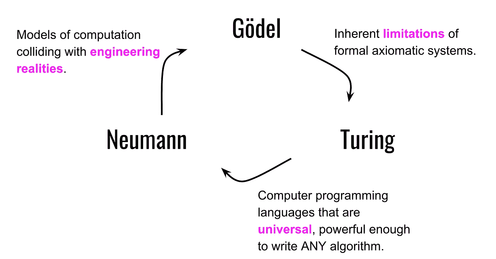****

******图 11** 与计算普适性相关的最重要发现背后的 3 个主要名字。****

> ****“哥德尔发现不完全性，图灵发现不可计算性。但在这个过程中，图灵也发现了完整/通用的编程语言、硬件、软件和通用机器。”——格雷戈里·柴丁****

## ****无处不在的普遍性****

****许多人不知道我们每天都在身边看到普遍性。我们现在处理个人和职业生活的方式很大程度上发生在电脑上。这些机器将输入转换成输出，在这样做的过程中，显示、重定向、连接和捕捉大量的丰富内容。****

****我们很难区分通过机器体验到的东西和被认为是现实的东西。我们认为母亲在电话中的声音是他们真实的声音，或者他们在视频聊天中的面孔是他们真实的面孔。我们观看的电视节目是真实人物的重建模式，CGI 创造了我们熟悉的事物的高度逼真的印象，科学家模拟了各种真实世界的场景。****

****这一切的背后是基本的算术符号洗牌。机器处理数字，使用递归来模拟我们日常经验中几乎无法分辨的模式。我们的现实很大程度上是通过硬件上整数的加法和乘法的感知而发生的。****

> ****“…在所有彩色图片、诱人的游戏和闪电般的网络搜索之下，除了整数运算，什么也没有发生。”道格拉斯·霍夫施塔特****

****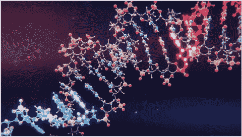****************************

****[https://www.youtube.com/watch?v=4Z4KwuUfh0A](https://www.youtube.com/watch?v=4Z4KwuUfh0A)****

## ****塞尔怎么样？****

****有一个著名的**中文教室论点**最初是由[约翰·塞尔](https://en.wikipedia.org/wiki/John_Searle)提出的，他说*一台执行程序的数字计算机不能被证明有“头脑”、“理解”或“意识”，不管这个程序能让计算机表现得多么智能或像人*。****

****塞尔思想实验的细节我就不赘述了，读者在网上很容易读到。但他的基本前提是，如果数字计算机只能操纵符号，那么它们所能做的就是说服它理解的人。塞尔认为，无论一台机器有多么令人信服，它都不会真正理解。****

****当然，这仅仅是一个开始的论点。塞尔说得好像我们都知道什么是“理解”。但是塞尔论点的真正致命之处在于他对复杂性的完全误解。一个*、【心灵】、【理解】或【意识】*不会从赤裸裸的符号操作中产生，而是通过一些丰富的表达成为可能，自我参照提供了这样的符号。换句话说，我们在复杂现象中观察到的*来自于一个巨大的互动网络。*****

## ****作为紧急事件的程序****

****我以…计算中的符号洗牌是通过*程序*来结束这一节。就像符号不需要显式地捕捉所有模式一样，程序也不需要编码程序能做的所有事情。一个程序的规则和它的行为几乎没有直接关系。****

****我们可以把简单的程序看作是**涌现**的最小例子。程序不仅仅是各个部分的总和。****

# ****论计算类比的有效性****

****现在，我将把话题拉回到特里尚克的最新观点上，即使用计算类比来比较人的“聪明度”。我已经讨论了许多我认为对于理解计算类比的有效性所必需的背景知识。****

## ****我们对计算的了解:****

*   ****信息从**输入转换为**输出；****
*   ******例程**用于解决明确定义的问题；****
*   ******启发式**用于解决复杂问题；****
*   ****所有的**决策问题**在某种意义上都是同一个问题；****
*   ****基本符号具有巨大的代表力；****
*   ****计算机能够被**整形，有创造力**；****
*   ****程序可以变得比它们各部分的总和还要多。****

## ****这都是计算****

****将人类认知视为计算之外的东西，总是会吸引一些近乎“神秘”的东西。虽然人们可以在个人层面上证明他们对超自然的信仰，但没有理由认为认知不是某种计算。人类一直在将输入转化为输出。有信息被过滤、使用和表达。当我们理解了计算的表现能力后，这种认为人类不是“计算机”的需要就失去了很多理由。****

## ****人们使用套路****

****人们使用常规型思维进行肤浅的、可预测的推理。每当我们关注具体的细节时，在可能存在“精确”解决方案的地方，我们都在使用常规。如果你发现自己在使用一个食谱，或者相信有一种“方法”来做某事，这就是常规思维。****

## ****人们使用启发式****

****任何非平凡(复杂)的问题都涉及到启发式的使用。当提到人时，这些被称为**心理捷径**。我们每天处理的绝大多数有趣的问题都太复杂了，无法用食谱来解决(问题的搜索空间对于一个简单程序的应用来说太大了)。当人们利用“直觉”或一般的经验法则时，他们会缩小搜索空间中寻找解决方案的范围。当领域专家把困难的事情变得简单时，他们应用了许多启发法，这些启发法是多年来通过暴露于问题空间而学到的。****

## ****思维类型****

****在回顾主要复杂性类别的决策问题时，我们同时考察了常规方法和启发式方法。所应用的机器“思考”的类型取决于所解决问题的复杂性。如上所述，人们也使用这两种类型的思维。****

****从计算的角度来看显而易见的东西经常被其他人重新标记。例如，[丹尼尔·卡内曼](https://en.wikipedia.org/wiki/Daniel_Kahneman)的*思考快与慢*反映了他关于两种思维模式二分法的论文。**系统 1** 是本能/情感型，而**系统 2** 是较慢/深思熟虑/逻辑型的思维。这些只是我们在计算机中看到的**例程**和**试探法**之间的区别。****

## ****作为通用机器的人类****

****人脑表现出**表象的普遍性**。通过创造抽象概念，我们可以将各种各样的外部现象内在化，只保留复制我们头脑中的模式所必需的信息。机器也是如此。只要我们放弃计算机只能处理一组固定指令的观念，计算类比就成立。****

> ****“……人类的思维尽管灵活而易错，但原则上可以用‘一套固定的指令’来模拟，前提是人们要摆脱先入为主的观念，即建立在算术运算基础上的计算机除了盲目地产生真理、全部真理，除了真理什么也不能做。”道格拉斯·霍夫施塔特****

## ****这是关于目标的****

****我们看到了**启发式**是如何在计算中用来解决复杂问题的。程序使用*目标*来帮助评估他们在可能性空间的搜索情况。目标在计算中的使用与人们在现实世界中应用启发式方法的方式重叠。虽然我们缺乏解决重要问题的具体方法，但我们脑海中经常会有一个**目标**，并反复应用思维捷径，直到我们足够接近我们的目标。****

****这也与[史蒂夫·沃尔夫勒姆](https://en.wikipedia.org/wiki/Stephen_Wolfram)的**计算等价原则**重叠。该原理认为，在自然界中发现的系统可以执行最大(“通用”)计算能力水平的计算(几乎所有不明显简单的过程都可以被视为相当复杂的⁹).计算)****

****这表明，当谈到所谓的智力时，任何事物(不仅仅是人类)之间的唯一区别是所涉及的目标。人类有不同于其他动物的目标，显然也有不同于非生命系统的目标。****

> ****我喜欢引用格言“天气有它自己的想法”。“这听起来太泛灵论和前科学了。但计算等效性原理说的是，实际上，根据最现代的科学，这是真的:天气的流体动力学在计算复杂性上与我们大脑中进行的电过程是一样的。”—史蒂夫·沃尔夫勒姆****

****智力之间的界限可能更多地与所涉及的目标有关。在一个给定的系统中，无论实现什么样的输入到输出计算，都与系统的复杂程度无关，而是与系统的“目标”有关。****

# ****速度即熟悉度****

****这就把我们带到了我的**主** **前提**。有了我所列举的背景，就有可能回到开头提出的问题上来。****

> ****通过在人类认知和计算之间进行类比，可以挽救某些人比其他人更聪明的观点吗？****

****我认为认知**速度**(以及解决方案的质量)并不是某种在机械/推理意义上更快处理的能力，而是归结于**对先前模式的暴露**。归结起来就是**熟悉度**。我之前在一条推特上提到过这个:****

****熟悉包含了速度和正确性的概念。之前接触到问题的潜在模式意味着某些人会更快地找到解决方案。重要的是，普遍性意味着所有人都有能力创造相同的类比。这些类比依赖于个人过去的经历；他们自己丰富的历史导致他们收集现有的内部模式。****

****当类比与启发相结合时，所有人都有同等的执行能力，真正复杂问题的巨大搜索空间被缩小并分解成一个可行的解决方案。一个自然的结论是，通过“聪明”来区分人们的是他们过去的经历与缩小一组给定问题的搜索空间的相关程度。不是用套路更好。它没有更好地使用启发式。这些在个体之间是计算通用的。它将类比引入到解决问题的常规和启发式的普遍使用中。****

> ****通过“聪明”来区分人们的是他们过去的经历与缩小一组给定问题的搜索空间的相关程度。****

## ****认知的结构****

****在引言中，我用引号将与计算相关的“类比”一词括起来。我们经常使用类比这个词，好像它是我们想要描述的现象的二流版本。但是类比不仅仅是一种教学手段。类比是人们如何在看似不同的领域之间建立联系的核心。****

****当人们在解决问题时，他们是在调用他们已经知道的东西。鉴于我们都有丰富的历史，任何问题对*来说都是熟悉的。*****

****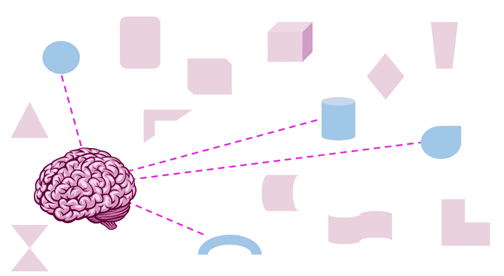****

******图 12** 人类通过类比将不同领域的想法联系起来。当解决问题时，我们调用我们过去的经验来处理类似的事情。****

****每个想法在某种程度上都是一种类比。我们不断地识别模式，即使这些模式不是我们之前看到的模式的精确复制品。它们总是模式之间某种程度的同构。一个**同构**是一个形式化的/严格的类比。计算中的普遍性意味着由数字组成的模式可以与其他任何东西同构。****

> ****“我们应该非常尊重那些看起来最平凡的类比，因为当它们被检验时，它们通常可以被看作是从人类认知的最深层根源中产生并揭示出来的。”道格拉斯·霍夫施塔特****

****道格拉斯·霍夫施塔特将**类比**称为**“认知结构**”****

> ****“无论哪里有一个模式，它都可以被视为代表它自己，或者代表它所同构的任何东西。重要的是，不管最初模式的初衷是什么，没有一种解释比另一种更真实。如果这是对正在发生的事情的正确描述，那么他们都没有特权。”道格拉斯·霍夫施塔特****

****理解的关键是**我们无法知道某人的同构/类比将来自于**。换句话说，没有办法说什么样的生活经历/接触会导致有效解决问题所需的类比的存在。人们会指出“最聪明”的人，但他们只是在评论这样一个事实，即*那个*人的解决方案更快/更好。很少或根本没有透明度，以个人的一套经验，碰巧重叠的问题正在解决。请注意，学校教育是一个测试一个人聪明程度的非常有限的领域*。*****

****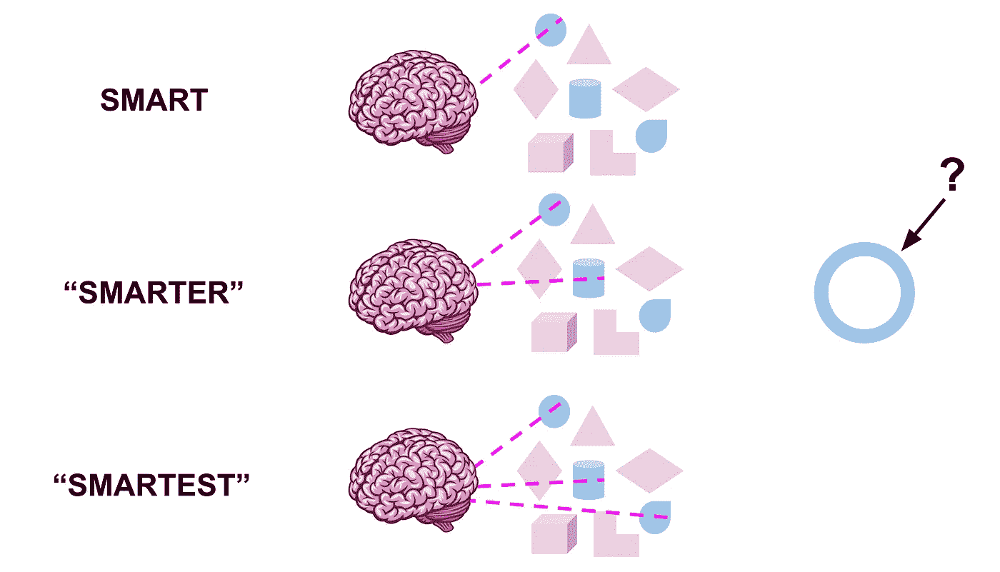****

******图 13** 对一个人来说“更聪明”意味着什么？我认为这可以归结为将过去接触到的模式和新的模式联系起来。****

****正如我们对导致群体“成功”的历史视而不见(想想幸存者偏差)，我们也对个人的模式历史视而不见。虽然琐碎的问题(可以用例程解决)受益于已知的模式(解决一个数学问题将有所帮助，如果你以前见过类似的问题)，但不平凡/复杂的问题可以以未知的方式受益于以前的模式。复杂性的不透明性是根本。****

# ****天才神话****

****这让我们想到了“天才”这个概念这个术语假设个人对他们的发现负主要责任。但是每一个发现都依赖于大量以前的发现和概念。我们对需要多少先前的发现/概念，以及它们之间的关系一无所知。****

****即使在较小的规模上，我们也能在任何组织中看到这种情况。****

****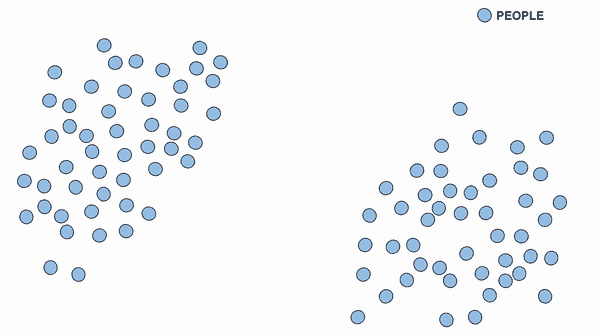****

****虽然我们喜欢谈论人类的进步，好像我们受益于一些个人的重大发现，但这是一种错误的叙述。这些人仅仅是我们发现的名字。历史上有一个巨大的贡献和先前发现的网络。随机的发现，在更多的发现之上，无穷无尽。这个网络很复杂，因此不透明。没有办法以某种线性方式拼凑出发现是如何产生的真实故事。****

> ****没有我们喜欢认为的“天才”。在一长串相互关联的想法中，只有名字附在最后。****

# ****摘要****

****我要感谢 [Trishank](https://twitter.com/trishankkarthik) 和 [Ashlesh](https://twitter.com/ashleshs) 邀请我从智能的计算角度发表意见。我希望我的文章能给读者提供正确使用计算类比所必需的背景知识，不管读者的观点如何。****

# ****参考****

1.  ****智商在很大程度上是一个伪科学骗局****
2.  ****[智力、复杂性和失败的智商“科学”](https://medium.com/@seanaaron100/intelligence-complexity-and-the-failed-science-of-iq-4fb17ce3f12)****
3.  ****[为什么普遍性胜过智商](https://medium.com/tractatus-logico-universalis/why-universality-trumps-iq-f8a685ce0fbe)****
4.  ****[为什么没有人比其他人聪明几倍](https://medium.com/tractatus-logico-universalis/on-why-no-one-is-likely-to-be-exponentially-smarter-than-others-66615846ed97)****
5.  ****[关于“为什么没有人能比别人聪明几倍”](https://medium.com/@danielhogendoorn/on-why-no-one-can-be-exponentially-smarter-than-others-618fe7f73986)****
6.  ****[高级物理模拟](https://www.youtube.com/watch?v=fXZpc1r9jfY)****
7.  ****[指数时间假设](https://en.wikipedia.org/wiki/Exponential_time_hypothesis)****
8.  ****[当前关于 P vs NP 的共识](https://www.cs.umd.edu/users/gasarch/BLOGPAPERS/pollpaper3.pdf)****
9.  ****[一种新的科学](https://www.amazon.com/New-Kind-Science-Stephen-Wolfram-ebook/dp/B01N1I83V8/ref=sr_1_1?gclid=EAIaIQobChMI8pnNpabU5gIVlLfsCh2fbg0wEAAYASAAEgIB8PD_BwE&hvadid=283941659405&hvdev=c&hvlocphy=9001582&hvnetw=g&hvpos=1t1&hvqmt=e&hvrand=773403588827705693&hvtargid=kwd-301750768941&hydadcr=22456_9261632&keywords=a+new+kind+of+science&qid=1577397157&s=books&sr=1-1)****
10.  ****哥德尔的证明(道格拉斯·霍夫施塔特)****
11.  ****证明达尔文:让生物学数学化****
12.  ****[超越计算:P 对 NP 问题——迈克尔·西普瑟](https://www.youtube.com/watch?v=msp2y_Y5MLE)****

****脚注(*)****

1.  ****哥德尔实际上表明，意义并没有完全从 PM 形式主义中去除。****
2.  ****卡尼曼在心理学家中很常见，他从病理学的角度描述了偏见。干扰了更集中的思考。这是对人们如何思考的一种有限的看法，没有考虑到适应如何导致有益的能力。系统 1 是进化的副产品，让我们有能力解决真正复杂的问题，而系统 2 只能应对简单的挑战。****
3.  ****一次尝试很多事情怎么样？本文重点解决问题*依次*。无论机器使用常规还是启发式解决方法，它都是依次采取行动的。事实上，这就是为什么我们必须对非平凡模式使用近似方法。我们将不得不等待太长时间，让程序尝试足够多的组合来找到答案。但是有一种叫做**非确定性图灵机** (NTM)的计算模型，它观察如果可以同时采取行动*会发生什么。这是 Trishank 的[第二篇文章](https://medium.com/tractatus-logico-universalis/on-why-no-one-is-likely-to-be-exponentially-smarter-than-others-66615846ed97)的题目，对一些人提出的论点提出质疑；或许有些人可以把自己的思维当做非确定性的图灵机。正如我在引言中提到的，我对人类获得某种非确定性的问题不太感兴趣。还有许多其他的计算模型，我认为没有理由相信人类正在使用它们。但更重要的是，这并不需要。为了理解为什么我们需要看普遍性。*****