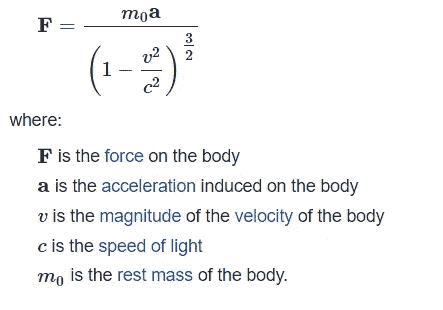
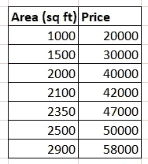
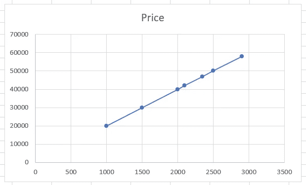

# 人类学习 vs 机器学习

> 原文：<https://towardsdatascience.com/human-learning-vs-machine-learning-dfa8fe421560?source=collection_archive---------37----------------------->

## 开始学习基础知识。

照片由[安迪·凯利](https://unsplash.com/@askkell?utm_source=medium&utm_medium=referral)在 [Unsplash](https://unsplash.com?utm_source=medium&utm_medium=referral) 上拍摄

> 变化是所有真正学习的结果~利奥·巴斯卡利亚

什么是**学**？当我们说我们学到了一些东西，这意味着什么？什么是信息或知识或智慧？

> 当你**观察**一种现象并识别**一种模式**时，学习就发生了。你试着通过找出现象中涉及的**实体**之间是否有任何**关系**来理解这种模式。

让我们试着分解它。以我们每天观察到的一个简单现象为例——昼夜交替。

内森·安德森和艾玛·范·桑特在 Unsplash 上拍摄的照片

有规律吗？是的，有一种模式。在一段固定的时间里，我们暴露在太阳的光和热下，我们称之为白天。然后在另一段固定的时间里，我们被剥夺了来自太阳的光和热。我们称之为夜晚。这种模式一遍又一遍地重复。我们有一个关于现象的观察，我们有一个模式。我们能解释这种模式是如何发生的吗？这次观测涉及到两个实体——太阳和地球。来自太阳的光量(和热量)和地球表面接收到的光量(和热量)之间有关系吗？这种模式表明地球表面交替接收光线——白天接收，晚上不接收。这怎么可能呢？有很多可能性，比如:

1.  不知何故，太阳以交替的时间周期打开和关闭。
2.  太阳不断改变它的位置，围绕地球旋转，在不同的时间段照亮地球的不同表面
3.  地球不断地绕着它的轴旋转，因此在给定的时间，生活在面向太阳的表面上的人经历白天，而生活在不面向太阳的表面上的人经历夜晚。

以上 3 个结论被称为"*"模型，即 ***解释*** 观察到的现象。我们可以将这些模型表述如下:*

*模型 1:日/夜是太阳神奇开关的 ***功能****

*模型 2:日/夜是太阳绕地球公转的一个 ***函数****

*模型 3:日/夜是地球绕轴自转的 ***函数****

*现在的问题是，哪个模型(或函数)更准确？根据历代不同哲学家/科学家的观察/发现，模型 3 是解释昼夜现象最准确的模型。我们可以说，这个模型"**最适合**对这种现象的观察。其他两个模型可以根据许多其他观察结果安全地反驳，这些观察结果不能用它们来解释。*

*一旦一个模型建立起来，它就可以用来**预测那种现象的**未来结果。例如，在我们的例子中，我们的模型可以安全地预测白天/黑夜将继续发生，直到出于某种原因，地球停止旋转或太阳耗尽其能量(地球会停止旋转吗？太阳什么时候会耗尽它所有的能量？—这些问题可以通过使用另一个模型来回答)*

****人类就是这样学习的。****

> *所有人类学习都是——观察某样东西，识别一种模式，建立一种理论(模型)来解释这种模式，并测试这种理论，以检查它是否符合大多数或所有观察结果。*

****每一个学习，从根本上来说，都是一个在一组观察中表达模式的模型。如果没有可以想象的模式，就不会有学习。****

*想想任何数学公式或物理方程式或生物学理论或任何经济学定理或化学方程式。所有这些都解释了物理或自然世界的模式。以牛顿运动定律为例。*

*牛顿研究物理物体的运动，并用作用在物体上的力来解释这种运动。他发现了作用在物体上的力和作为对这些力的反应的运动之间的“模式”或“关系”，并以他的定律(“模型”)的形式表达出来。牛顿第二运动定律在数学上表达如下:*

****力=质量*加速度****

*这个模型准确吗？它符合所有的观察吗？这种模式几乎在所有情况下都有效，但也有一些例外。它开始预测高速运动物体的不准确结果。爱因斯坦提出了另一个模型来解释这种物体的运动。*

**

*[https://proofwiki.org/wiki/Einstein%27s_Law_of_Motion](https://proofwiki.org/wiki/Einstein%27s_Law_of_Motion)*

*这场讨论的中心思想是—*

> ****没有模型或学问反映“真实”或“绝对”的现实*** 。 ***每一个模型或学习都是对观察到的现实的近似。****

*如果我们遇到关于我们正在研究的现象的新观察，我们必须更新我们的模型或学习。*

> *机器是如何学习的？*

**

*阿瑟尼·托古列夫在 [Unsplash](https://unsplash.com?utm_source=medium&utm_medium=referral) 上的照片*

*机器有可能模仿人类学习的过程吗？这是机器学习和人工智能领域正在尝试做的事情。基本思想保持不变。与人类一样，机器也接受观察(数据)。学习算法在幕后试图在数据中找出最符合观察结果的模式。我们举一个很简单的例子。*

*下面是一个虚假的房价数据集，由两个属性组成:房屋面积和价格。*

**

*价格和面积之间有没有模式或者关系？只要目测这些数据并在头脑中进行简单的计算，人们就可以推断出:*

***价格= 20 倍面积***

**

*它不是 10 倍或 12 倍或 15 倍…正好是 20 倍，数据集中的所有房价都符合这个模型。*

*计算机算法能找出这个关系吗(价格是 20 倍面积)？。可以做到。一种算法可以以如下的粗略方式实现它:*

1.  *假设价格是 **w** 乘以面积。从随机取 w 的任意值开始*
2.  *对于面积和 w 的每个值，计算价格。将其与数据中给出的原始价格进行比较。原始价格-计算价格是错误的。取所有计算价格和原始价格的误差平均值。这是由模型引起的平均误差*
3.  *改变 w 的值，继续重复步骤 2，直到平均误差为 0 或非常接近 0，并且没有改善*

*这就是机器学习数据模式的方式。现在，这里介绍的方法过于简单。幕后有大量的复杂性(参考[线性回归](https://en.wikipedia.org/wiki/Linear_regression)算法和[梯度下降](/linear-regression-using-gradient-descent-97a6c8700931)方法)*

*但我试图传达的基本思想是:无论是人类学习还是机器学习，都涉及对一个事物或过程或现象的“观察”。然后，识别这些观察的模式。这个模式的表达就是已经学习过的模型。最常见的是，这个表达式是一个数学公式(函数),它定义了相关变量之间的关系。*

**

*乔治·帕甘三世在 [Unsplash](https://unsplash.com?utm_source=medium&utm_medium=referral) 上的照片*

*人类是本能的模式发现者。寻找模式的基本需求是我们这个物种的基本生存策略。我们总是害怕未知的事物。不确定性很麻烦。模式识别帮助我们减轻这种恐惧，给人安慰。当我们知道一个事件是如何发生的，以及它再次发生的可能性有多大时，我们就可以做好准备。如果我们认识到事件 1 是由“事件 2”引起的，我们可以利用这一知识为我们造福。这就是我们总是在事物、事件和情况之间寻找模式和因果关系的原因。*

*没有模式，就不会有学习——无论是人类还是机器！只是一片混乱。*