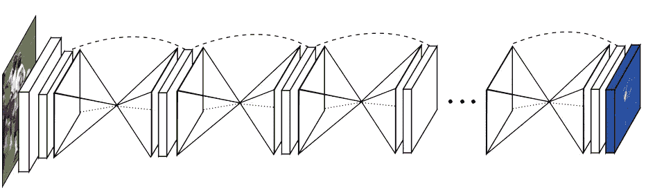
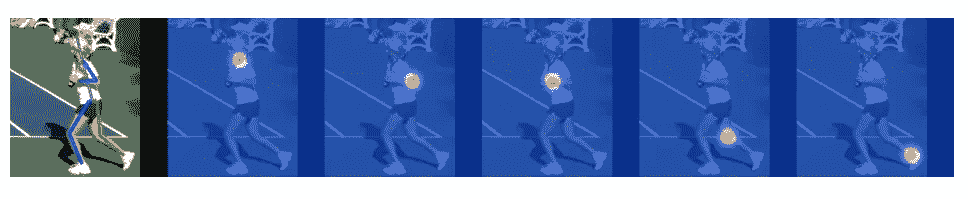
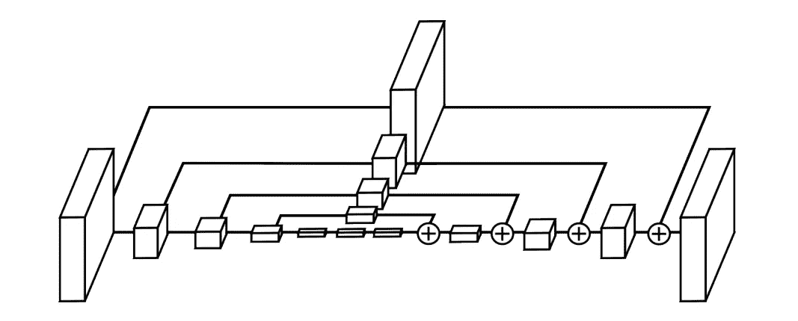
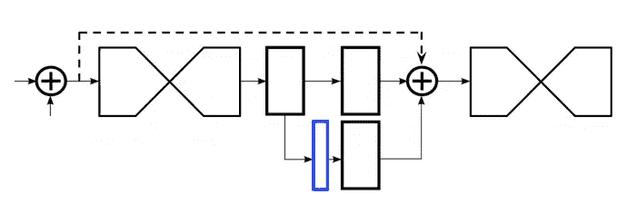
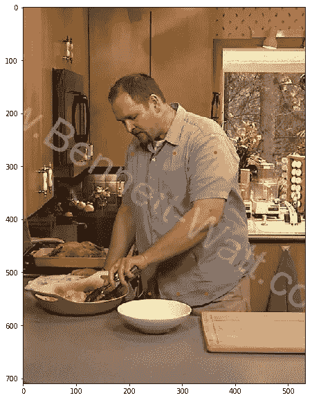
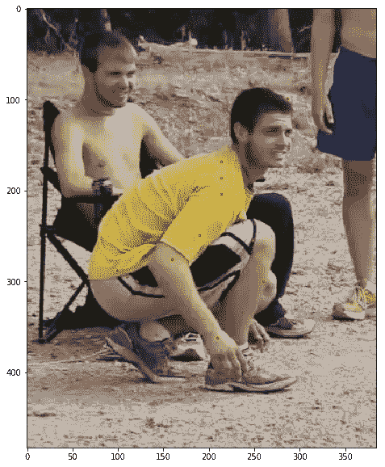
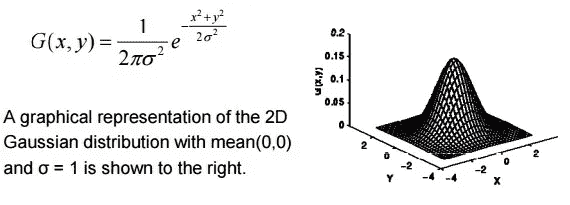
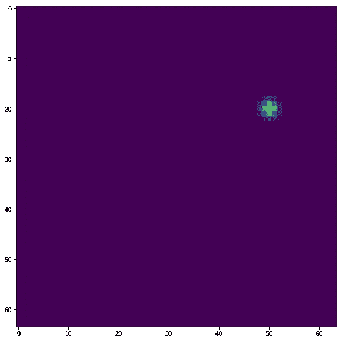
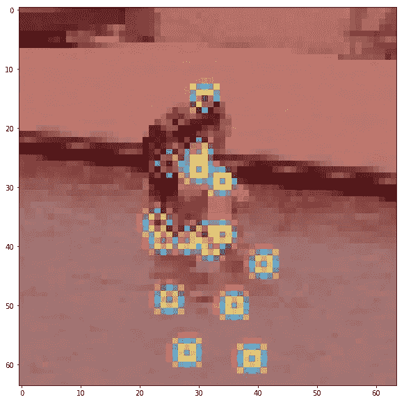
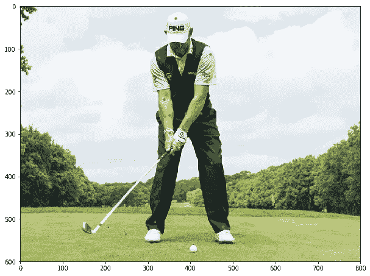

# 基于堆叠沙漏网络和张量流的人体姿态估计

> 原文：<https://towardsdatascience.com/human-pose-estimation-with-stacked-hourglass-network-and-tensorflow-c4e9f84fd3ce?source=collection_archive---------6----------------------->

## 了解经典的姿态估计网络的核心设计，并学习用 TF 2 编码

来自 [Deskcity](http://www.deskcity.org/download/219470-0-0x0.html) 的蓝色沙漏照片

*原载于 2020 年 3 月 14 日*[*https://www . yanjia . Li*](https://yanjia.li/human-pose-estimation-with-stacked-hourglass-network-and-tensorflow/)*。*

> *完整源代码请前往*[*https://github . com/ethanyangali/deep-vision/tree/master/Hourglass/tensor flow*](https://github.com/ethanyanjiali/deep-vision/tree/master/Hourglass/tensorflow)*。我真的很感谢你⭐STAR⭐对我努力的支持。*

人类擅长做出不同的姿势。人类也擅长理解这些姿势。这使得肢体语言成为我们日常交流、工作和娱乐的重要组成部分。不幸的是，姿势有太多的变化，所以计算机从图片中识别姿势不是一件容易的事情…直到我们有了深度学习！

通过深度神经网络，计算机可以学习人类姿势的通用模式，并相应地预测关节位置。堆叠沙漏网络就是这样一种网络，我将向您展示如何使用它来进行简单的人体姿态估计。虽然在 2016 年首次推出，但它仍然是姿态估计领域最重要的网络之一，并广泛应用于许多应用程序。无论你是想开发一个软件来跟踪篮球运动员的动作，还是想根据一个人的姿势制作一个肢体语言分类器，这都将是一个方便的实用教程。

# 网络体系结构

## 概观

简单来说，堆叠沙漏网络(HG)就是沙漏模块的堆叠。它之所以有这个名字，是因为每个沙漏模块的形状都非常像沙漏，正如我们从下图中看到的:

图来自“[用于人体姿态估计的堆叠沙漏网络](https://arxiv.org/abs/1603.06937)

堆叠多个 HG(沙漏)模块而不是形成一个巨大的编码器和解码器网络背后的想法是，每个 HG 模块将为联合预测产生完整的热图。因此，后一个 HG 模块可以从前一个 HG 模块的联合预测中学习。

为什么热图有助于人类姿势估计？这是当今相当普遍的技术。与面部关键点不同，人类姿态数据有许多差异，如果我们只是简单地回归关节坐标，这使得很难收敛。聪明的研究人员想出了一个主意，用热图来表示图像中的关节位置。这保存了位置信息，然后我们只需要找到热图的峰值，并将其用作关节位置(加上一些小的调整，因为热图很粗糙)。对于 256x256 的输入图像，我们的热图将是 64x64。

图片来自“[用于人体姿态估计的堆叠沙漏网络](https://arxiv.org/abs/1603.06937)

此外，我们还将计算每个中间预测的损失，这有助于我们不仅有效地监督最终输出，而且有效地监督所有 HG 模块。这在当时是一个很棒的设计，因为姿势估计依赖于人体各个区域之间的关系。例如，在没有看到身体位置的情况下，很难判断一只手臂是左臂还是右臂。通过使用完全预测作为下一个模块的输入，我们迫使网络在预测新的连接位置时注意其他的连接。

## 沙漏模块

那么这个 HG(沙漏)模块本身是什么样子的呢？让我们来看看原始论文中的另一张图:

图来自“[用于人体姿态估计的堆叠沙漏网络](https://arxiv.org/abs/1603.06937)

在图中，每个框都是一个剩余块加上一些额外的操作，如池化。如果您不熟悉剩余块和瓶颈结构，我建议您先阅读一些 ResNet 文章。一般来说，HG 模块是一个编码器和解码器架构，其中我们首先对特征进行下采样，然后对特征进行上采样以恢复信息并形成热图。每个编码器层都有一个与其对应的解码器层的连接，我们可以堆叠任意多的层。在实现中，我们通常做一些递归，让这个 HG 模块重复自己。

我知道这里看起来仍然太“复杂”,所以阅读代码可能更容易。下面是从我在 Github deep-vision repo 上的[堆叠沙漏实现中复制的一段代码:](https://github.com/ethanyanjiali/deep-vision/tree/master/Hourglass/tensorflow)

这个模块看起来像一个洋葱，让我们先从最外层开始。up1 经过两个瓶颈块，和 up2 加在一起。这代表左边和顶部的两个大方框，以及最右边的加号。整个流程都在空中，所以我们称之为上行通道。在第 17 行，也有一个低通道。这个 low1 通过一些池和瓶颈块，然后进入另一个更小的沙漏模块！在图上，它是大洋葱的第二层。这也是我们在这里使用递归的原因。我们一直重复这个 HG 模块，直到第 4 层，这里你只有一个瓶颈，而不是 HG 模块。最后一层在图表中间的三个小盒子里。

如果你熟悉一些图像分类网络，很明显作者非常大量地借用了跳过连接的思想。这种重复模式将编码器和解码器中的相应层连接在一起，而不是只有一个特征流。这不仅有助于梯度通过，而且让网络在解码时考虑不同尺度的特征。

## 中间监督

现在我们有了一个沙漏模块，我们知道整个网络由多个这样的模块组成，但是我们如何精确地将它们堆叠在一起呢？网络的最后一环来了:中间监管。

图来自“[用于人体姿态估计的堆叠沙漏网络](https://arxiv.org/abs/1603.06937)

从上图中可以看出，当我们从 HG 模块中产生一些东西时，我们将输出分成两条路径。顶部的路径包括更多的卷积来进一步处理特性，然后转到下一个 HG 模块。有趣的事情发生在底部路径。这里，我们使用卷积层的输出作为中间热图结果(蓝框)，然后计算中间热图和地面实况热图之间的损耗。换句话说，如果我们有 4 个 HG 模块，我们总共需要计算 4 个损失:3 个用于中间结果，1 个用于最终结果。

# 准备数据

## MPII 数据集

一旦我们完成了堆叠沙漏网络的代码，我们就该考虑用什么样的数据来训练这个网络了。如果你有自己的数据集，那太好了。但在这里，我想提一个开放的数据集，供那些想先有所训练的初学者使用。它叫做 MPII 数据集([马普信息研究所](https://www.mpi-inf.mpg.de/home/))。你可以在这里找到下载链接。

尽管该数据集主要用于单人姿势估计，但它确实为同一图像中的多人提供了关节注释。对于每个人，它给出了 16 个关节的坐标，如左脚踝或右肩。

来自 MPII 数据集的例子。两幅图像都已被裁剪。

但是原来的数据集标注是 Matlab 格式的，现在真的很难用。我也试着自己解析那个 mat 文件，结果发现有很多错误或警告是 MPII 官方网站没有提到的。另一种方法是使用微软[提供的预处理过的 JSON 格式注释。谷歌驱动链接在这里是](https://github.com/microsoft/human-pose-estimation.pytorch/blob/master/README.md#data-preparation)。下载这个 JSON 注释后，您会看到一个包含如下元素的列表:

“关节可见”表示关节的可见性。在最近的数据集中，我们通常需要区分遮挡关节和可见关节。但是在 MPII，我们只关心关节是否在图像的视图中:1 ->在视图中，0->在视图外。“关节”是关节坐标列表，它们遵循 0-r 脚踝、1-r 膝盖、2-r 臀部、3-l 臀部、4-l 膝盖、5-l 脚踝、6-骨盆、7-胸部、8-上颈部、9-头顶、10-r 手腕、11-r 肘部、12-r 肩部、13-l 肩部、14-l 肘部、15-l 手腕的顺序。

这个 JSON 注释的缺点是它没有原始文件中的头部矩形和单人标志，这可能会在评估过程中造成问题。如果你需要我用这些信息解析的版本，请在我的 deep-vision Github 库中给我留言。

## 种植

不太清晰的部分是“尺度”和“中心”。有时我们可能在图像中有不止一个人，所以我们需要裁剪出我们感兴趣的一个。与 MSCOCO 数据集不同，MPII 没有给我们这个人的边界框。相反，它给了我们一个中心坐标和这个人的大概尺寸。这两个值都不准确，但仍然代表了一个人在图像中的大致位置。请注意，您需要将“比例”乘以 200 像素，以获得一个人的真实高度。但是宽度呢？不幸的是，数据集并没有真正指定它。身体可能有点水平，这使得宽度远大于高度。我之前看到的一个例子是冰壶运动员在地上爬行，如果你只使用高度来修剪，你可能最终会离开他的手臂。

**天真的方式:**经过一些实验，下面是我对裁剪图像的建议:

简而言之，我们首先过滤掉不可见的关节，并从 16 个关节中计算最左侧、最顶部、最底部和最右侧关节的坐标。这四个坐标给了我们一个区域，在这里我们至少可以包含所有可用的关节注释。然后我根据这个人的身高比例填充了这个区域，这个比例也是从“比例”字段计算出来的。最后，我们需要确保这种作物不会流出边境。

**更健壮的方式:**如果你需要提高你的模型的 PCKh 度量，上面的转换可能不是最理想的。为什么？因为单人姿势估计的不为人知的技巧是它极度依赖于中心来确定关节的相对位置。因此，你需要以某种方式将输入图像中的所有身体“标准化”到相同的中心和相同的比例，以充分利用模型。我的解决方案是使用仿射变换。通过这样做，你可以精确地知道中心在哪里来定义平移、旋转和缩放。由于这是一个更高级的主题，请访问我的 deep-vision Github 知识库，在那里进行更多的讨论。

## 高斯的

关于地面实况数据，需要了解的另一件重要事情是高斯分布。当我们策划地面实况热图时，我们不只是为关节坐标分配 1，而为所有其他像素分配 0。这将使基本事实变得过于稀少而难以了解。如果模型预测只差几个像素，我们应该鼓励这种行为。

我们如何在损失函数中模拟这种鼓励？如果你以前上过概率课，你可能记得高斯分布:

[https://www . project Rhea . org/Rhea/index . PHP/Edge _ Detection _ with _ Gaussian _ Blur](https://www.projectrhea.org/rhea/index.php/Edge_Detection_with_Gaussian_Blur)

中心具有最高值，中心周围区域的值逐渐减小。这正是我们所需要的。我们将在全零地面真实画布上绘制这样一个高斯模式，如下图所示。当你把所有 16 个关节放在一个热图中，它看起来就像下面的右图。

自己画的叠加图。右图来自 [MPII 数据集](http://human-pose.mpi-inf.mpg.de/)。

从下面的代码可以看出，我们首先计算面片的大小，当 sigma 为 1 时，大小将为 7，中心将为(3，3)。然后，我们生成一个网格来表示该面片中每个单元的坐标。最后，将它们代入高斯公式。

请注意，生成高斯的最终代码比这更复杂，因为它需要处理一些边界情况。完整代码请看我这里的 repo:[https://github . com/Ethan yanjiali/deep-vision/blob/master/Hourglass/tensor flow/preprocess . py # L91](https://github.com/ethanyanjiali/deep-vision/blob/master/Hourglass/tensorflow/preprocess.py#L91)

# 损失函数

到目前为止，我们讨论了网络架构以及要使用的数据。有了这些，我们可以向前传递一些训练数据，以获得关于输出的感觉。但是现代深度学习是关于反向传播和梯度下降的，这需要我们计算地面真实和预测之间的损失。所以让我们开始吧。

幸运的是，堆叠沙漏的损失函数非常简单。你只需要两个向量之间的均方误差，这可以在一行代码中完成(普通版本)。然而，在现实中，我发现这个模型仍然很难收敛，它学会了通过预测全零来达到局部最优来作弊。我的解决方案(改进版)是给前景像素(我们画的高斯像素)分配一个更大的权重，让网络很难忽略这些非零值。我在这里选择 82，因为在 64x64 热图中，一个 7x7 的补丁的背景像素是前景像素的 82 倍。

# 预言

到目前为止，我们已经讨论了网络、数据和优化目标(损失)。这应该足够你开始自己的训练了。一旦我们完成了培训，得到了一个模型，它仍然没有完成。与直接回归相比，使用热图的一个缺点是粒度。例如，对于 256x256 的输入，我们得到 64x64 的热图来表示关键点的位置。四倍降尺度看起来还不算太差。然而，我们通常首先将一个更大的图像，比如 720x480，调整为 256x256 的输入。在这种情况下，64x64 的热图会过于粗糙。当需要高精度时，研究人员想出了一种缓解这一问题的方法。我们不仅使用具有最大值的像素，还考虑具有最大值的相邻像素。由于相邻像素也具有高值，因此推断实际的关键点位置可能有点朝向相邻像素的方向。听起来很熟悉，对吧？这很像我们的梯度下降，也指向最优解。然而，根据我的经验，对于大多数应用程序来说，占据热图峰值的位置应该足够了。因此，如果您需要实现这个额外的修正，这是您的电话。

我自己画的要点和框架。图像中的人是来自[高尔夫月刊](https://www.golf-monthly.co.uk/videos/golf-swing-tips/lee-westwood-stance-and-ball-position-tips)的李·维斯特伍德

以上是我们网络的预测实例。在左侧，是所有的关节位置。在右边，是骨骼，通过连接这些关节画出来的。虽然结果看起来相当不错，但我不得不承认这是一个简单的例子。在现实中，有很多扭曲的姿势或遮挡的关节，这给我们的网络带来了巨大的挑战。例如，当图像中只有一只脚时，网络可能会通过将左脚和右脚分配到同一位置来混淆自己。我们如何解决这个问题？因为这是一个关于改进的话题，所以我将让您先思考一下，然后再写一篇文章来讨论。

# 结论

祝贺你，你已经到达本教程的结尾。如果你理解了我们上面讨论的所有内容，你应该对现在的理论和主要挑战有一个坚实的理解。要开始在 TensorFlow 中编码，我建议你克隆/分叉我的 repo:[https://github . com/ethanyangali/deep-vision/tree/master/Hourglass/tensor flow](https://github.com/ethanyanjiali/deep-vision/tree/master/Hourglass/tensorflow)，按照说明准备数据集，试一试。要做出预测，你可以参考回购协议中一个名为`demo_hourglass_network`的笔记本。如果您遇到任何问题，请留下 Github 问题，以便我可以查看。同样，如果你喜欢我的文章或我的回购，请⭐star⭐我的[回购](https://github.com/ethanyanjiali/deep-vision/)，这将是对我最大的支持。

# 参考

*   Alejandro Newell，杨，邓佳，[用于人体姿态估计的堆叠沙漏网络](https://arxiv.org/abs/1603.06937)，欧洲计算机视觉会议(ECCV)，2016
*   Sudharshan Chandra Babu，[2019 年深度学习人类姿态估计指南](https://nanonets.com/blog/human-pose-estimation-2d-guide/)，纳米网