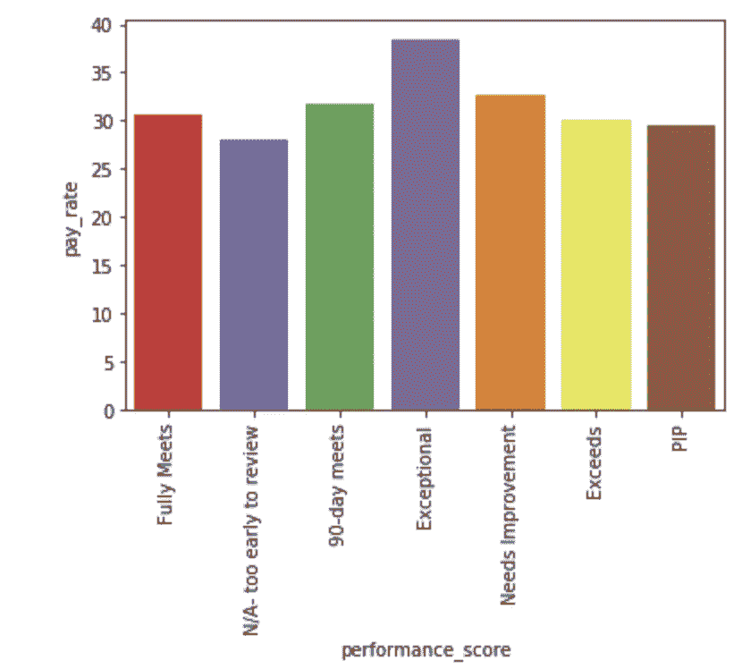
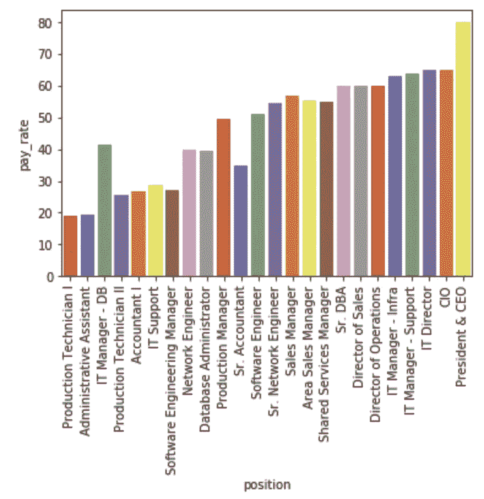
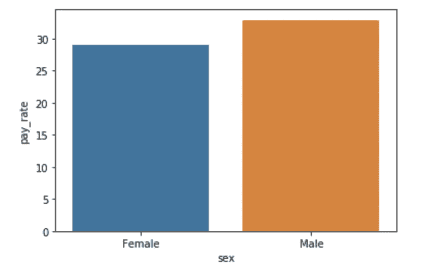
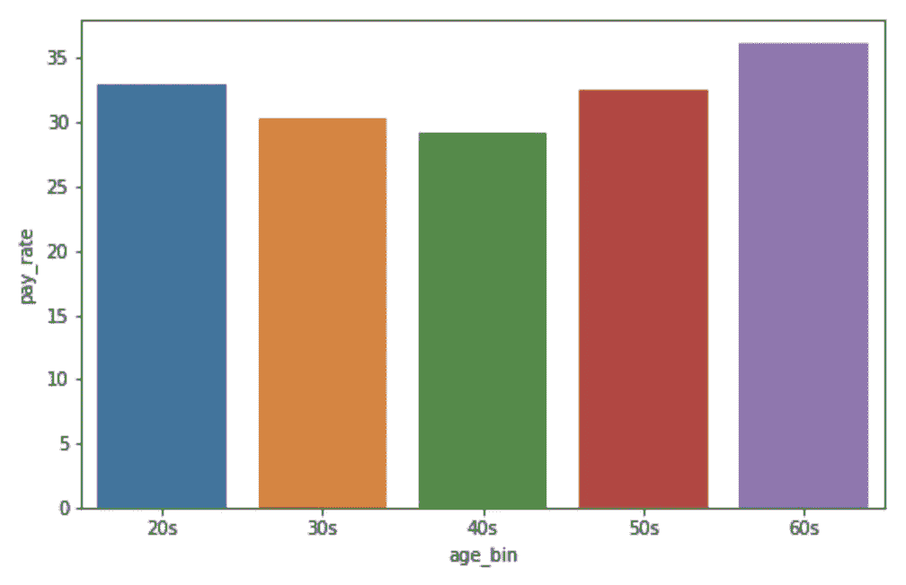
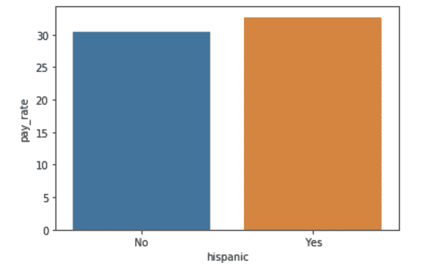
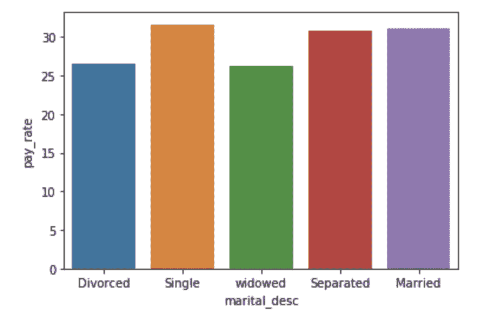

# 人力资源数据化(上)

> 原文：<https://towardsdatascience.com/human-resources-datafication-d44c8f7cb365?source=collection_archive---------34----------------------->

## 数据化意味着使用运营数据来制定业务战略和未来计划。— Viser 公司。

[*米歇尔维纳布尔斯*](https://www.linkedin.com/in/michellevenables21/) *，数据科学家兼机器学习工程师*


**图片来源**:Word Cloud by I[nsyscraft](http://www.insyscraft.com/human-resource.php)

最符合商业活动和人力资本的战略是什么？人力资源(HR)战略是为所有 HR 关键领域设定方向的理念。它是我们使用分析来了解更多有关人员、HR 流程和人口统计数据的能力的提高。这包括招聘、绩效评估、发展和薪酬方面的活动

## 通过数据分析实现人力资源战略的第一步

作为人力资源领域的数据分析师/科学家，我们将制定一项战略来实现整个组织的人力资源目标和洞察力。我们希望从组织内现有的数据开始，从当前的员工开始。这可能涉及整个组织的优势和工作描述。一个好的解决方案是使用交互式组织结构图。

从收集每个人的最新简历、继续教育历史、绩效评估和完成的项目开始。这使您能够识别当前员工的知识、技能和优势。除了基本的工作描述和技能之外，交互式组织结构图也是一种工具。

评估绩效考核使管理层能够确定员工何时愿意并能够承担额外的责任。当员工的排名一直很高时，是时候接受一些更具挑战性的工作了。这个博客旨在描述一些分析公司内部人力资源战略和活动的技巧。

## 关键绩效指标(KPI)

在人力资源分析领域，有几个 KPI 值得一提。对以下 8 个指标进行了定量评估。

1.  人才保留——组织保留员工的能力。这通常是一种统计方法，有时被认为是员工对公司的忠诚度。
2.  招聘效率——组织有几种方法来衡量他们的招聘效率。常见的统计度量可以是 ***招聘时间、招聘质量、招聘来源等。***
3.  员工绩效——工作评定量表是评估员工绩效的常用方法，行为要素如*理解工作任务*和*参与决策*。
4.  员工流动——员工从一个组织转移到另一个组织，也称为流动率。类似于评估留存率。
5.  全面薪酬——这是经理或雇主为了吸引、激励和留住员工而追踪的一种工具。
6.  学习和发展——培训计划让员工在组织中成长和成功。它允许员工在组织内达到更高的知识技能水平。这些可以通过绩效评估或评级来评估和监控(如前所述)。
7.  多元化和包容性——衡量和提高想法和创造力。吸引和获得人才，以形成强大的团队。
8.  人力资源与员工比率—服务交付

我们希望收集和评估这些数据，以确定我们作为一个组织在人力资源方面所处的位置。员工的文化和行为构成了一个组织的团队氛围，而人力资源的工作是建立一个成功的战略。我收集了 Kaggle.com 提供的人力资源数据，以显示对一个组织的评估。[点击此处链接](https://www.kaggle.com/rhuebner/human-resources-data-set)

## **清理和评估我们的数据**

数据科学项目的第一步是确保我们清理和评估我们的数据。清理包括处理空值、评估哪些数据当前对我们可用，以及使用不同的清理技术来组织我们的数据结构。庞大、肮脏、混乱和不兼容的数据源会导致无效的分析模型。我们希望了解我们的数据，以下是几个方法:

```
hr_data.shape
```

我们的输出是 300 行 21 列。

```
hr_data.isna().sum()
```

检查 NA 结果并学习如何处理它们。一种方法可能是用 0:

```
hr_data = hr_data.fillna(0)
```

经过一些基本的清洁技术，我们可以开始分析和评估。我个人喜欢使用 [*Seaborn*](https://seaborn.pydata.org/) 和 [*Matplotlib*](https://matplotlib.org/) 来可视化我的数据。在查看了我们的数据栏后，我认为评估 pay_rate 可能是有益的。我们甚至可能希望根据绩效分数、职位和其他特征来预测新员工的 pay_rate！在尝试解决新员工的问题之前，让我们先看看现有的数据。

```
chart = sns.barplot(x='performance_score', y= 'pay_rate', data=hr_data, palette='Set1', ci=**None**) chart.set_xticklabels(chart.get_xticklabels(),rotation=90)
```



作者图片:[米歇尔维纳布尔斯](https://github.com/michellevenables1/HR_project)

在运行您的代码行之前，确保将 seaborn 作为 sns 导入。我们可以通过什么来分析员工的工资率？

我可能会问一些关于“需要改进”绩效分数的问题…为什么这些员工的工资比“超过”员工绩效分数的员工的工资高。“例外”似乎很准确。

```
chart = sns.barplot(x = 'position', y = 'pay_rate', data=hr_data, palette='Set1', ci = **None**) chart.set_xticklabels(chart.get_xticklabels(),rotation=90)
```



作者图片:[米歇尔维纳布尔斯](https://github.com/michellevenables1/HR_project)

我们的第二张图表显示了基于公司职位的工资水平。显然，总裁和首席执行官的工资比其他雇员高。只要职位/薪酬符合你公司的人力资源战略，它们看起来就是准确的。

我们的下一个图将有助于分析组织内部的一些多样性。在评估我们的人力资源战略时，多元化是一个关键绩效指标。

> 工作场所中的组织多样性指的是员工队伍的总体构成和多样性的数量。多样性指的是各种定义个人特征的差异，如年龄、性别、种族、婚姻状况和许多其他次要品质。

看看下面的一些多样性评估柱状图:



作者图片:[米歇尔维纳布尔斯](https://github.com/michellevenables1/HR_project)

差别不大，但平均来说，男性的工资比女性高。



作者图片:[米歇尔维纳布尔斯](https://github.com/michellevenables1/HR_project)

为了评估基于年龄的多样化，我们根据十年来划分我们的年龄。我们可以看到我们的年龄范围相当多样化。



作者图片:[米歇尔维纳布尔斯](https://github.com/michellevenables1/HR_project)



图片作者:[**米歇尔维纳布尔斯**](https://github.com/michellevenables1/HR_project)

在清理了我们的数据，评估了基于绩效分数、职位和多样性指标的薪酬后，你应该对我们的数据有一个很好的了解。在我们开始建模之前，你总是想清理和评估我们的数据。请继续关注我的下一篇关于预测人力资源分析的博客，并点击下面的 github 链接查看我的代码！

*   [人力资源数据化(下)](https://medium.com/@michellevenables1/human-resources-datafication-part-2-842e3601b10)
*   [HR_Project — Github 链接](https://github.com/michellevenables1/HR_project)
*   [媒体链接](https://medium.com/@michellevenables1)

参考资料:

[1] Bizfluent。"什么是工作场所的组织多样性？"[https://biz fluent . com/info-12076820-organization-diversity-workplace . html](https://bizfluent.com/info-12076820-organizational-diversity-workplace.html)