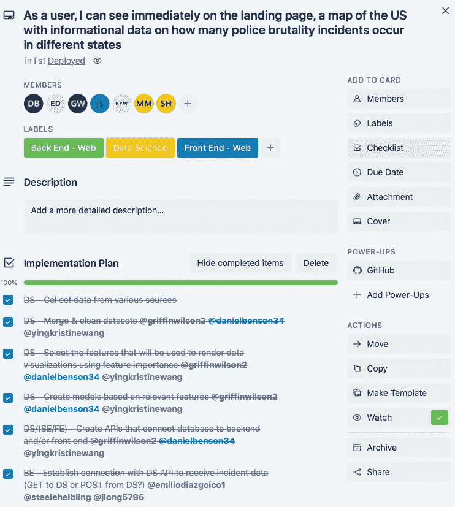
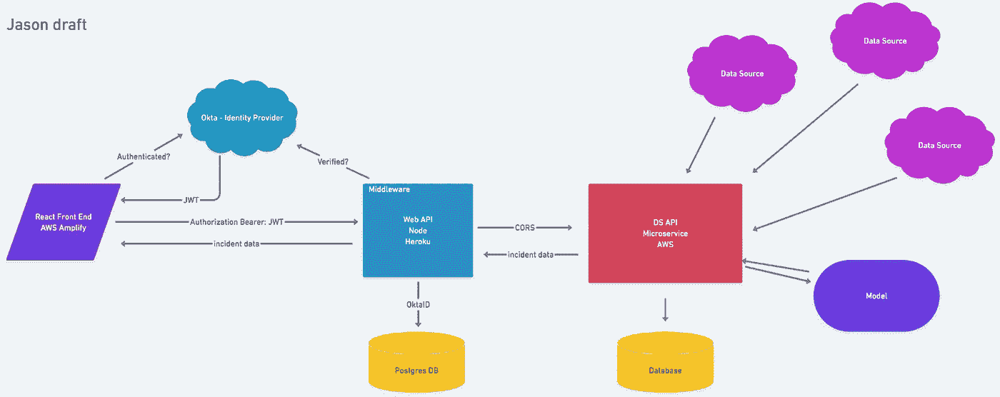
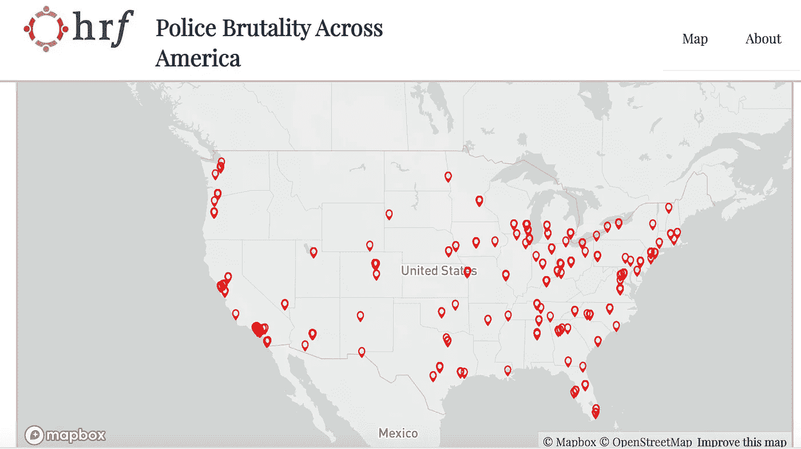
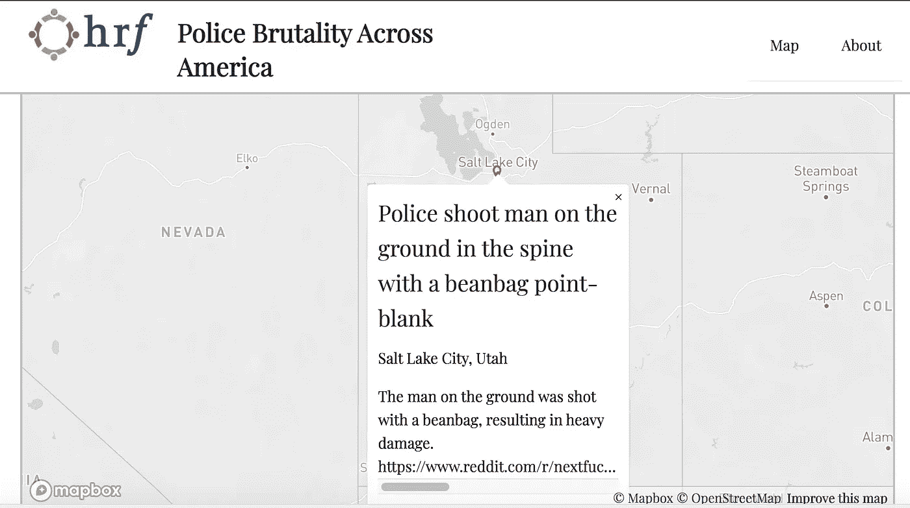

# 人权第一:数据科学方法

> 原文：<https://towardsdatascience.com/human-rights-first-a-data-science-approach-57724b249f32?source=collection_archive---------49----------------------->

## 使用自然语言处理寻找美国警察暴行的实例

## 旅程

人权第一是一个独立的组织，通过政治集思广益、创造性的政策制定、各种运动、数据收集和研究以及大众教育，在美国推动全面人权和平等。在不平等和不公正现象继续猖獗的当今世界，这些人权问题尤其重要。您可以在人权第一组织的网站[人权第一](https://www.humanrightsfirst.org/about)上找到更多信息和帮助该组织的方法。

在一个由一名团队项目负责人、五名网站开发人员和三名数据科学家组成的团队中，我们致力于人权第一组织的一个非常具体的子域，警察暴行。我们的团队项目领导每周与组织的利益相关者会面，以深入了解项目的期望。提出了一些问题，如“当加载登录页面时，用户希望看到什么”，“希望用户获得什么样的交互性”，“希望获得什么样的数据，是精度更重要还是实例数量更重要？”问题摆在我们面前:创建一个网站，用户可以访问并看到一个交互式的美国 choropleth 地图，允许直观地了解哪些州和城市包含警察暴力事件，以及通过链接的文章、视频等提供文本信息。非常注重数据的精确性。

每个团队都继承了一个 GitHub 存储库，这个存储库是由从事同一项目的前一个团队为他们各自的领域创建的。数据科学团队收到了一份报告，其中包括 ipython 笔记本电脑、应用程序目录和文件、预处理基准预测模型以及。包含预先收集的数据的 csv 文件。我们的方法从确定这个知识库内容的有用性和计划我们自己的贡献开始。

## 每一段旅程都始于路径的终点

我们的团队立即开始了规划过程，作为一个完整的团队，每天至少召开一次会议，并在我们特定的现场团队内部每天召开几次会议。在我们的头脑风暴会议中，我们提出了一个被认为对最终产品很重要的任务列表。接下来是创建用户故事，让我们从用户的角度深入了解可视化最终产品的工作原理。使用一个 Trello 板和一个创造性的逻辑思维的集合，我们决定了一个用户故事的最终列表和每个用户故事的子列表。我们解决了一些问题，例如，“作为用户，我可以立即在登录页面上看到一张美国地图，上面有关于不同州发生多少警察暴力事件的信息数据”和“作为用户，我可以放大地图，足以查看单个事件数据”，任务按需要贡献的团队进行标记和排序。



概述最广泛的用户故事及其相关任务的 trello 卡。

在团队的规划阶段，我们通过一系列的头脑风暴会议，为每项任务列出子列表，概述完成这些任务的技术可能性。这包括模型、库、方法和我们觉得可能需要作为工具的潜在编程画布。我们将这些列表实现到一个完整的产品流程图中，通过预期的连接将每个领域(DS、后端、前端)结合起来。



产品工程架构规划出所有预期的连接


人权第一项目的数据科学技术决策大纲

当第一次接近这个项目的开发阶段时，我预料到了两个主要的挑战。第一个是使用自然语言处理作为我们建模过程的一部分，因为我们中没有人使用 NLP 库几个月了。通过探索、研究和继承之前团队使用的相同方法，这种风险得到了相应的处理。这允许我们探索我们所拥有的，并根据需要修改以适应我们自己的模型需求。

下面是用来标记我们的数据的一段代码。

```
*# Create tokenizer functions*

nlp = spacy.load("en")

**def** tokenize(text):
    text = nlp(text)
    tokens = [token.lemma_ **for** token **in** text **if** (token.is_stop != **True**) **and** (token.is_punct != **True**) **and** (token.text != " ")]
    **return** tokens

**def** retoken(text):   
    tokens = re.sub(r'[^a-zA-Z ^0-9]', '', text)
    tokens = tokens.lower().split()
    tokens = str(tokens)

    **return** tokens
```

第二个挑战涉及整个数据科学团队。我们需要确保我们经常有效地合作，以确保我们在建模研究和开发过程、数据收集过程的时间管理以及正确有效地清理数据方面都在同一页上；这一点的重要性在于，这些任务中的每一项都强烈依赖于前一项任务的成功。为此，我们每周工作五天，每天工作八小时以上，以确保准确的沟通。每当进行编码时，我们会以团队和结对程序的形式会面，交换谁在驾驶，谁在循环方式导航。通过这种方式，我们能够避免任何可能因缺乏团队合作和沟通而出现的陷阱。

## 这个旅程既是过程，也是奋斗，更是最终的结果

该项目的数据科学方面包括许多耗时的功能。我们从探索我们从前一个团队继承的笔记本开始，并重新创建和修改他们的工作以获得彻底的理解。我们问了一些问题，比如“他们是如何清理数据的？”、“他们认为哪些功能是重要的？”，“为什么有这些功能？”，“他们用什么参数来创建他们的模型？”，“他们的模型有多准确？”。使用这些问题作为我们探索的布局，我们创建了新的 google colab 笔记本，并逐个重新创建了继承的笔记本，将测试放在一起，并根据需要进行修改，以确保我们彻底理解。这个过程包括使用 reddit API 包装器 PRAW 从“新闻”子编辑中提取新闻文章和 Reddit 帖子，以及从 Reddit、twitter、互联网资源和各种新闻网站预先收集的数据，并根据需要清理数据和执行一些功能工程。

下面是我们用来访问 reddit API 并从“新闻”子编辑中提取前 1000 个热门文章的代码；然后，这些数据被添加到一个名为“数据”的列表中，用于创建一个新的数据帧:

```
*# Grabbing 1000 hottest posts on Reddit* 

data = []

*# Grab the data from the "news" subreddit*
**for** submission **in** reddit.subreddit("news").hot(limit=1000):
  data.append([submission.id, submission.title, submission.score,  
  submission.subreddit, submission.url, submission.num_comments, 
  submission.selftext, submission.created])

*# Create and assign column names*
col_names = ['id', 'title', 'score', 'subreddit', 'url', 
             'num_comments', 'text', 'created']
df_reddit = pd.DataFrame(data, columns=col_names)
```

接下来，我们决定回收前一个团队的数据收集、清理和特征工程，但修改他们的自然语言处理模型，以包括前一个团队遗漏的一些标签。随后，我们使用 TfidVectorizer 和 RandomForestClassifier 以及 RandomizedSearchCV 整合了基线预测模型，用于早期参数调整。使用这些方法，我们能够创建一个 csv 文件，我们可以放心地发送给 web 团队，用于他们的基线 choropleth 图。用于构建我们的模型的代码可以在下面的嵌入中找到。

```
*# Build model pipeline using RFC*

pipeline = Pipeline([
    ('tfidf', TfidfVectorizer()),
    ('classifier', RandomForestClassifier(random_state=42, n_jobs=-1, max_depth=5, n_estimators=45,)),
])
pipeline.fit(X_train,y_train)
predictions = pipeline.predict(X_test)param_distributions = {
   'classifier__max_depth': [1, 2, 3, 4, 5]}

search = RandomizedSearchCV(
   pipeline, 
   param_distributions=param_distributions, 
   n_iter=10, 
   cv=3, 
   scoring='accuracy', 
   verbose=10, 
   return_train_score=**True**, 
   n_jobs=-1
)

search.fit(X_train, y_train);>> Best hyperparameters {'classifier__max_depth': 5}
>> Best Score 0.9075471698113208
```

除了我在探索、清理和建模阶段的贡献之外，我还带头使用了数据科学 API。我们的项目使用 FastAPI 创建并运行数据科学应用程序，并使用 Docker 保存我们应用程序的映像，以便部署到 AWS Elastic Beanstalk。在我的本地环境中，我包含了前面提到的 csv 文件，以及一个包含数据清理和功能工程方法的文件，这些方法是由我、我的一个团队成员和以前的数据科学团队整理的。使用它，我能够创建两个新的 csv 文件，一个包含原始的最终数据，另一个包含为 jsonification 清理和预处理的最终数据。这些数据在被添加到 get 端点以供 web 团队的后端访问之前被转换为 json 对象。为完成此任务而设置的路由器可以在以下嵌入中找到:

```
*from fastapi import APIRouter, HTTPException
import pandas as pd
import numpy as np* # from .update import backlog_path  # Use this when able to get the # backlog.csv filled correctly
from ast import literal_eval
import os
import json
# Create router access
router = APIRouter()@router.get('/getdata')
async def getdata():
    """
    Get jsonified dataset from all_sources_geoed.csv
    """
    # Path to dataset used in our endpoint locs_path = os.path.join(os.path.dirname(__file__), '..', '..', 
                'all_sources_geoed.csv') df = pd.read_csv(locs_path) # Fix issue where "Unnamed: 0" created when reading in the           
    # dataframe df = df.drop(columns="Unnamed: 0") # Removes the string type output from columns src and tags, 
    # leaving them as arrays for easier use by backend for i in range(len(df)):
        df['src'][i] = ast.literal_eval(df['src'][i])
        df['tags'][i] = ast.literal_eval(df['tags'][i]) """
    Convert data to useable json format
    ### Response
    dateframe: JSON object
    """
    # Initial conversion to json - use records to jsonify by 
    # instances (rows) result = df.to_json(orient="records") # Parse the jsonified data removing instances of '\"' making it 
    # difficult for backend to collect the data parsed = json.loads(result.replace('\"', '"')) return parsed
```

我们面临的主要挑战之一是在项目的部署阶段。我能够将数据设置并部署到 AWS Elastic Beanstalk 上，但是有几次数据的 jsonification 出现问题，使得它对 web 团队不可用。首先，返回的数据带有几个不合适的正斜杠“\”和反斜杠“/”。其次，一些数据特征，特别是“src”和“tags”被作为字符串而不是数组返回。DS 团队坐在一起聊天，研究和集思广益如何解决这个问题。在我们的部署中经过多次试验和错误之后，我们找到了确保发送的数据格式正确所需的预处理步骤。可以在下面找到该流程的嵌入式代码:

```
import os
import pandas as pd
import re# set up various things to be loaded outside of the function
# geolocation data
locs_path = os.path.join(os.path.dirname(__file__), 
            'latest_incidents.csv')# Read in the csv file into a dataframe
sources_df = pd.read_csv(locs_path)# Remove instances occurring in which backslashes and newlines are 
# being created together in the data.
sources_df["desc"] = sources_df["desc"].replace("\\n", "  ")# Remove the "Unnamed: 0" column creating when reading in the csv
sources_df = sources_df.drop(columns=["Unnamed: 0"])# Fix instances occurring in which new lines are being created in 
# the data
for i in range(len(sources_df)):
    sources_df["desc"][i] = str(sources_df["desc"][i]).replace("\n",  
    " ")# Create csv file from dataframe
sources_df.to_csv("all_sources_geoed.csv")
```

## 结束不是结束，而是一个新的开始

到目前为止，我们对该产品的贡献已经达到了极限。数据科学团队能够收集、清理、设计和向 web 团队发送可用的数据集，包括过去七个月美国各地的 1177 起警察暴力事件。发送到后端的每个实例都包括以下功能:“src”——一组链接到源视频、文章和/或帖子的 URL，使用 newspaper3k 对其进行了清理，以提取正确的文本——“state”——事件发生的州，这是使用 spaCy 从文本中提取州名的工程——“city”——事件发生的城市， 这是使用 spaCy 从文本中提取城市名称设计的——“desc”——事件的文本描述——“标签”——用于识别故事是否是警察暴力案件的标签。 这是使用自然语言处理设计的——“标题”——事件的描述性标题——“日期”——事件发生的日期——“id”——每个实例的唯一字符串标识符——“lat”——映射事件位置的纬度代码，这是使用州和城市名称以及列出城市、州， 以及地理位置代码(纬度和经度)-和“经度”-映射事件位置的经度代码，这是使用州和城市名称以及列出城市、州和地理位置代码(纬度和经度)的单独 csv 文件设计的。 我们的团队还能够发布一个可用的 API，允许连接到后端，并通过它们连接到前端可视化。下面是发送给后端团队的数据样本:

```
[{"src":["https://www.youtube.com/watch?v=s7MM1VauRHo"],"state":"Washington","city":"Olympia","desc":"Footage shows a few individuals break off from a protest to smash City Hall windows. Protesters shout at vandals to stop.  Police then arrive. They arrest multiple individuals near the City Hall windows, including one individual who appeared to approach the vandals in an effort to defuse the situation.  Police fire tear gas and riot rounds at protesters during the arrests. Protesters become agitated.  After police walk arrestee away, protesters continue to shout at police. Police respond with a second bout of tear gas and riot rounds.  A racial slur can be heard shouted, although it is unsure who is shouting.","tags":["arrest","less-lethal","projectile","protester","shoot","tear-gas"],"geolocation":"{'lat': '47.0378741', 'long': '-122.9006951'}","title":"Police respond to broken windows with excessive force","date":"2020-05-31","date_text":"May 31st","id":"wa-olympia-1","lat":47.0378741,"long":-122.9006951},{"src":["https://mobile.twitter.com/chadloder/status/1267011092045115392"],"state":"Washington","city":"Seattle","desc":"Officer pins protester with his knee on his neck. His partner intervenes and moves his knee onto the individual's back.  Possibly related to OPD Case 2020OPA-0324 - \"Placing the knee on the neck area of two people who had been arrested\"","tags":["arrest","knee-on-neck","protester"],"geolocation":"{'lat': '47.6062095', 'long': '-122.3320708'}","title":"Officer pins protester by pushing his knee into his neck","date":"2020-05-30","date_text":"May 30th","id":"wa-seattle-1","lat":47.6062095,"long":-122.3320708},{"src":["https://twitter.com/gunduzbaba1905/status/1266937500607614982"],"state":"Washington","city":"Seattle","desc":"A couple of police officers are seen beating and manhandling an unarmed man. The officers are throwing punches while he was on the ground and pinned.  Related to Seattle OPA Case 2020OPA-0330.","tags":["beat","protester","punch"],"geolocation":"{'lat': '47.6062095', 'long': '-122.3320708'}","title":"Police beat unarmed man on the ground","date":"2020-05-31","date_text":"May 31st","id":"wa-seattle-2","lat":47.6062095,"long":-122.3320708}, . . . ]
```

网络团队能够利用这些数据，在登陆页面上整合出一个功能性的交互式美国 choropleth 地图。该地图向用户显示多个可点击的图钉，在与图钉交互时，向用户显示一个信息框，该信息框包括事件的标题、事件的城市和州位置、事件的文本描述以及链接到数据收集位置、事件报告位置的 http 源，以及该事件的任何附带视频和新闻源。

 [## 考虑到的人权

### 使用 create-react-app 创建的网站

main.d17v0exvwwwzgz.amplifyapp.com](https://main.d17v0exvwwwzgz.amplifyapp.com) 

附带交互式图钉的 choropleth 地图



点击大头针后显示的犹他州盐湖城事件的信息框示例

产品完成后，未来可能会有许多修改和功能添加。数据科学团队的基线模型在工作和部署时，有输出太多误报的倾向，使其在自动数据收集架构师中的使用不够可靠。未来的团队可以努力显著改进该模型，并使用和修改每 24 小时收集新数据的更新框架，并使用该模型预测警察暴行的实例。对于 web 端，一些可能的未来添加可能包括更新和更具视觉吸引力的地图，访问更多的可视化和数据-这也将涉及额外的数据，可能还包括未来数据科学团队提供的 seaborn 或 plotly 可视化-以及用户按日期、位置等对数据进行排序的能力。

## 旅途终点的奖赏

在整个旅程中，我接触到了大量新的有益的经历。我学到了尽早安排计划的重要性，以及如何作为一个团队和个人高效地完成这个过程。我学到了结对编程的原则和好处；这个项目让我们每周结对编程五天，持续四周，这个时间跨度足以获得大量的见解和挫折。这让我直接进入了下一个也可以说是最重要的学习机会:团队发展和沟通；当从事一个多学科项目时，需要许多不同的人完成许多任务，其中大多数都严重依赖于许多不同任务的完成，作为一个团队紧密合作以建立信任、理解和强大的沟通系统是至关重要的。除此之外，我还学习了许多技术库和方法的细节，包括 FastAPI、AWS Elastic Beanstalk 和 newspaper3k，并获得了更多关于库和方法的经验，如 NLP、spaCy、tokenization、RandomForestClassification、RandomSearchCV、API 如 PRAW 和 TWEEPY 等。

这种产品和经验是我将来能够随身携带的东西，目的是依靠它来收集对 NLP 或数据工程问题的未来方法的洞察力、宝贵的团队合作经验、我的简历、申请和工作面试的参考资料，以及超出我当前有意识思维范围的更多内容。

我叫丹尼尔·本森。我是一名数据科学家和有抱负的机器学习工程师，通过 Lambda School 的数据科学项目接受培训。我目前拥有韦伯州立大学的副学士学位，正在努力完成生物学和神经科学的学士学位。如果你希望阅读更多我的作品，我会努力在 Medium 上每周至少完成一篇博文，概述我曾经或正在进行的项目。如果你想联系我，可以在 LinkedIn 或 T2 Twitter 上找到我，为了更好地了解我的项目方法，你还可以访问我的 T4 GitHub，我在那里储存了我所有的技术项目。最后，如果你想跟踪这个警察暴行产品的开发，你可以咨询[资源库](https://github.com/Lambda-School-Labs/Labs27-C-HRF-DS)、部署的[登陆页面](https://main.d17v0exvwwwzgz.amplifyapp.com/)，或者[人权第一](https://www.humanrightsfirst.org)网站本身。勇敢的读者，谢谢你跟随我踏上这段旅程，请关注下一篇文章。重复一遍，祝编码愉快。