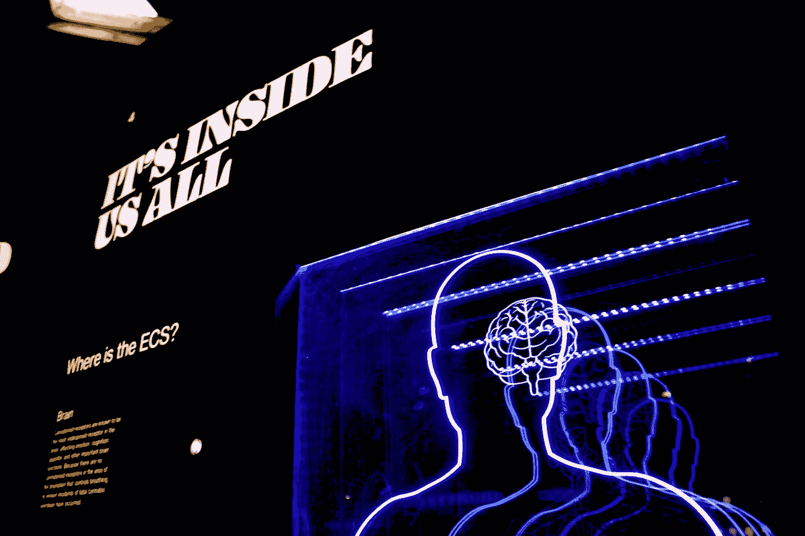

# 人类与人工智能:梦之队

> 原文：<https://towardsdatascience.com/humans-and-ai-the-dream-team-2b05e1c79704?source=collection_archive---------72----------------------->

## 为什么人工智能像人类需要人工智能一样需要人类，尤其是在像全球疫情这样的新奇事件中

Bret Kavanaugh 在 [Unsplash](https://unsplash.com?utm_source=medium&utm_medium=referral) 上拍摄的照片

在某种程度上，每个人都看过某种 clickbait 文章，谈论一些新的人工智能技术或新的机器人将如何最终取代我们人类。或者至少他们会让我们的大部分劳动力过时。当然，正如 clickbait 文章的倾向一样，它们极大地夸大了当前的技术以及某些技术离取代人类劳动有多近。例如，你看了像[这部有线纪录片](https://www.youtube.com/watch?v=ZJixNvx9BAc&list=PLBSpKfM43NsajmTsWHqJ4bbIok5dGUiNL&index=11&t=0s)这样的视频，你会认为自动驾驶汽车随时都可能接管道路。事实上，我认为如果你找一个不参与人工智能/机器学习/数据科学社区的人，问他们当你提到人工智能时，他们想到的是什么样的技术，他们首先想到的可能是自动驾驶汽车。然而，[这篇 Vox 文章](https://www.vox.com/recode/2019/5/17/18564501/self-driving-car-morals-safety-tesla-waymo)引用了加州大学戴维斯分校交通研究所创始主任丹尼尔·斯珀林的话:

> …完全无人驾驶的汽车——完全不需要任何人在车里，可以去任何地方——在很多很多年内都不会发生，也许永远不会发生

正如自动驾驶汽车不会取代人类司机一样，在许多领域，人类也不会像这些文章让你相信的那样被取代。换句话说，人工智能并不像它被认为的那样不会犯错，这一点随着当前的疫情变得更加明显。

现在的新冠肺炎·疫情是现代的一种新奇体验。我们上一次经历如此规模和社会影响的疫情是在 1918 年的流感大流行，正如你想象的那样，来自疫情的数据远没有我们现在拥有的那么详细或完整。此外，由于许多原因，1918 年的世界与我们今天生活的世界大不相同。

所有的预测模型都在一个基本假设下工作，即未来会以与过去相同的方式运行。数据将总是以相同的方式运行，改变的只是不同变量之间的交互方式。模型只知道数据告诉他们的东西，其他一无所知。它没有一般的世界知识，甚至只是一个更大的上下文知识(当然，除非它反映在模型给出的数据中的某个地方)。

正如本文所强调的，所有这些都意味着许多预测模型将会遥遥无期。模型无法解释这种程度的灾难性事件。此外，即使模型中增加了可以解决疫情特有问题的功能，事实是我们真的不知道未来会是什么样子。我们真的不知道我们什么时候会停止社交距离，除了我们可能不会永远这样做的事实，我们也不知道人们什么时候会觉得做他们曾经做过的事情是安全的。此外，正如许多人所说，我们可能永远不会回到过去的样子。如果是这样的话，预测模型，尤其是对数据要求更高的模型，将会在相当长的一段时间内明显失效。

这就是人类的用武之地。我们能够用很少的数据来获取新的事件并做出有根据的预测，因为我们有更广泛的同理心内部数据库和对我们人类行为的理解。一种算法可能无法预测一个人现在会去哪里购物，但人类可以。我们可能会预测有人会去较小的商店，因为那里不太拥挤，或者离家更近。我们可以看到数据的变化，并说，“哦，这对于[在此插入原因]是有意义的。”对于一个无法准确理解疫情以及与之相关的威胁和焦虑如何影响人类行为的算法来说，同样的变化根本没有意义。

所有这些并不是说我们没有桨，所有的算法现在都是无用的。算法仍然可以包含有价值的洞察力，我们可以将这些洞察力与我们自己的知识结合起来。我们可以查看算法的输出，并将其呈现为，“这是根据我们的模型通常会发生的事情，这是目前正在发生的事情，所以如果这些事件在未来发生，这就是我们如何可以预期我们的模型是错误的，以及我们如何可以预期它是正确的。”事实是，人类和人工智能一直相互需要。即使人类创造了人工智能，人工智能仍然需要来自我们的数据，人类可以提供算法无法提供的领域和一般知识。在当今数据驱动的世界中，数据科学已被证明是一种无价的工具。模型可以筛选人类无法筛选的海量数据，但人类更善于适应新的情况。这就是为什么永远不应该是一个取代另一个，而是要利用彼此的优势，齐心协力。