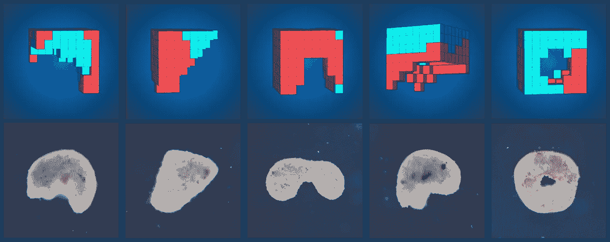
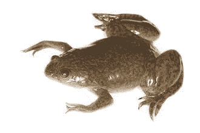
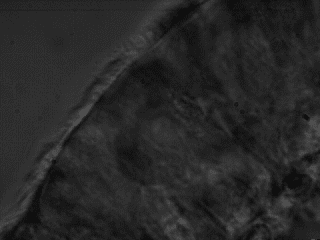
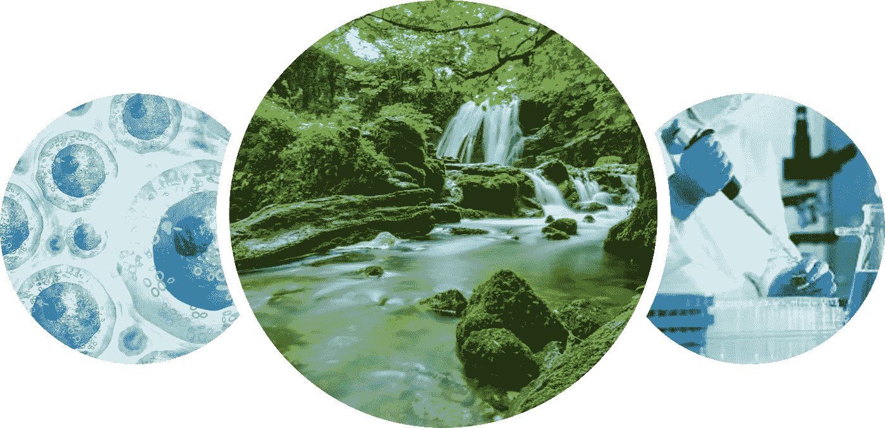

# 人类正在成为生命工程师

> 原文：<https://towardsdatascience.com/humans-are-becoming-life-engineers-c449f65f5dfc?source=collection_archive---------41----------------------->

## 人类正在变得像电影《普罗米修斯》中的“工程师”一样吗？

顶行:计算机生成的设计。底行:实际细胞结构。图片来自[https://cdorgs.github.io/](https://cdorgs.github.io/)

# 介绍

这是激动人心的时刻。

来自佛蒙特[大学](https://www.uvm.edu/)的计算机科学家、教授和研究人员建造了被媒体称为“*第一台生命机器”*。

这些活体机器实际上是计算机设计的有机体，被称为**异种机器人**。

异种机器人是如何被制造出来的一点也不像电影《普罗米修斯》中的“工程师”实际上控制着人类那样酷。但还是很有意思。

电影《普罗米修斯》中的场景

> 这篇文章旨在用通俗的语言解释这些计算机设计的有机体实际上是什么；它们是如何发展的，以及它们如何有益于人类和我们的环境。

## 动机

[图片来自 thoughtco.com](https://www.thoughtco.com/how-rust-works-608461)

参与这些生物机器(异种机器人)开发研究的团队从以下事实中获得了动力:当前人类技术的组成部分是基于对环境和人类本身都有害的降解材料。

异种机器人将自己呈现为材料的完美构建模块。它们的可再生性和生物相容性特征提供了解决我们目前因金属和塑料基构件而面临的各种问题的步骤。

生物机器的设计也激发了对基于细胞的生物和技术在医学、机器人学和其他研究领域的潜在用途的进一步探索和发现。

据佛蒙特大学的博士生、研究小组成员萨姆·克里格曼(Sam Kriegman)说，大自然对可以由生物细胞形成的有机体的可能组合的探索并不广泛，我们需要探索大自然没有探索的领域。

## 起源

让我们后退一步，了解异种机器人的底层构成。

异种机器人由来自青蛙([非洲爪蟾](https://en.wikipedia.org/wiki/African_clawed_frog))的干细胞组成，用作异种机器人的构建模块。皮肤细胞和心肌细胞从青蛙胚胎中积累起来，形成异种机器人的基础。

[非洲爪蛙](https://en.wikipedia.org/wiki/African_clawed_frog)

因此，异种机器人最好被描述为用底层组织细胞建造的活机器人。

研究人员没有利用传统的机器人建筑材料，而是从大自然中寻找建筑材料。

## 告诉我更多

高中生物学告诉我们，两栖动物生命周期的各个阶段包括幼体阶段的蝌蚪。

虽然蝌蚪会发展成有着跳跃的腿的青蛙，但它们最初会游泳。

现在，异种机器人可以进行被称为“行走”的运动。

异种机器人的组成部分处于两栖动物生命周期的胚胎阶段，在幼虫和变态阶段之前。

那么他们怎么能这么早就走路呢？

[纤毛在运动](https://www.ciliopathyalliance.org/cilia)

嗯，研究小组从异种机器人构建细胞中移除了一种叫做[纤毛](https://www.ciliopathyalliance.org/cilia)的东西。

纤毛可以被描述为有节奏的运动毛发，可以归因于游泳运动。

异种机器人的运动能力实际上来自心脏细胞发展收缩肌肉，基本上是心跳运动。

## 算法

组装这些积木的指挥者是一个嵌入了**进化算法**的计算机建模系统。

进化算法随机选择构建异种机器人的不同配置，并基于完成给定目标的成功选择最佳异种机器人结构设计。

但是什么是进化算法呢？

进化算法(EAs)是通过类似或模仿自然选择的方法来优化问题解决方案的过程。

自然选择图片来自[现场科学](https://www.livescience.com/19993-humans-evolving-natural-selection.html)

这一过程涉及一个孤立的环境，环境中的居住者是随机产生的，有一个要实现的内在目标。

经过一段时间后，选择过程开始。这个选择过程从随机产生的群体中挑选合适的候选人，为该过程的下一次迭代产生后代。

该过程重复指定数量的重复或世代，并且一旦满足特定标准就终止。

关于进化算法的更多信息可以在这里找到:

 [## 进化算法

### 进化算法(EAs)是基于群体的元启发式算法，最初受自然进化方面的启发…

arxiv.org](https://arxiv.org/abs/1805.11014) 

现在，回到异种机器人。

设计生物有机体结构的算法在模拟中运行几种结构组合，直到设计出最合适的组合，然后转移到实际有机体的模型中。

## 利益

我们现在对异种机器人有了一些了解。

探索它们能给人类和我们的环境带来什么样的好处，将会让我们看到这些生物的高级版本的未来会是什么样子。

左图:[细胞显微图像](https://www.medicalnewstoday.com/)。中间:[自然](https://www.brexitenvironment.co.uk/)。右:[研究](https://www.brunel.ac.uk/news-and-events/news/articles/Every-1-invested-in-medical-research-returns-25p-per-year-forever)

*   在**医学中，**这种生物可以在患者体内的细胞水平上提供治疗。
*   对于**环境**应用，他们可以支持塑料清洁倡议。
*   为了**研究**的目的，它们可以作为人体细胞药物测试的材料。

一般来说，异种机器人和研究小组的工作仍处于早期阶段，以实现长期利益和利用。

尽管如此，一个由我们想象力的无限边界所引导的愿景将引领我们走向一个积极的可预见的未来。

## 推测

生物和人工智能领域的任何新发展都会带来一些担忧和猜测。

异种机器人的发展涉及到明显的伦理问题。

但更广泛的是人工智能或人工智能控制的生物的发展消灭了人类。

*异种机器人可以被编程用于邪恶目的吗？*

在目前的状态下，答案是否定的。

目前的异种机器人寿命为七天，在合适的条件下，它们可以多活几周或几个月。人类在寿命和长寿的游戏中获胜。

*进化怎么样？*

人类从进化中受益匪浅。异种机器人在目前的状态下不会进化。人类在这方面还是有优势的。

武器化。

这些外星机器人有可能被武器化。Sam Kriegman 表示，通过人工智能创造危险的生物体，并不比一个怀有恶意的生物学家做同样的事情更容易。他还继续支持引入关于异种机器人应用或任何未来版本的法规。

## 结论

简而言之，就是这样，异种机器人。

他们很小，很酷，不是来毁灭人类的。

对于我们人类来说，引入计算机设计的生物体为细胞生物学和人工智能算法领域更稳定的进步和创新铺平了道路。

新十年的开始是多事之秋，但仍将以同样的速度继续下去。新的发展和发现就在眼前，它们将导致技术在我们日常生活中更加创新和直观的应用。

这的确是一个激动人心的时刻。

有关“计算机设计的生物体”的更多信息，请访问以下链接:

 [## 计算机设计的有机体

### 大多数技术是由钢、混凝土、化学品和塑料制成的，它们会随着时间的推移而降解，并会产生…

cdorgs.github.io](https://cdorgs.github.io/)  [## 利用青蛙细胞和人工智能创造出世界上第一台“活机器”

### (图片:道格拉斯·布莱克斯顿，塔夫茨大学)当你从青蛙胚胎中取出细胞并将其培养成…

www.livescience.com](https://www.livescience.com/frogbots-living-robots.html?mod=djemAIPro)  [## 用于设计可重构生物体的可扩展流水线

### 大多数技术是由钢、混凝土、化学品和塑料制成的，它们会随着时间的推移而降解，并会产生…

www.pnas.org](https://www.pnas.org/content/early/2020/01/07/1910837117) 

## 如果你喜欢这篇文章，并想阅读类似的内容，请在 [Medium](https://medium.com/@richmond.alake) 上关注我。在 [LinkedIn](https://www.linkedin.com/in/richmondalake/) 上也可以找到我。