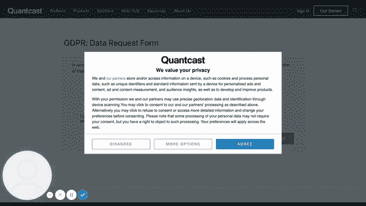
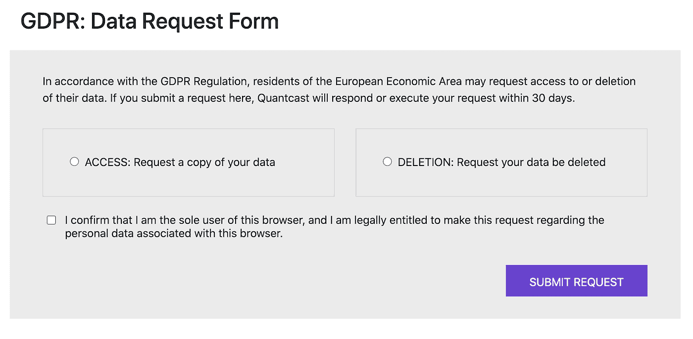
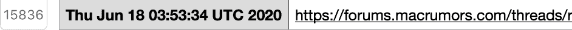
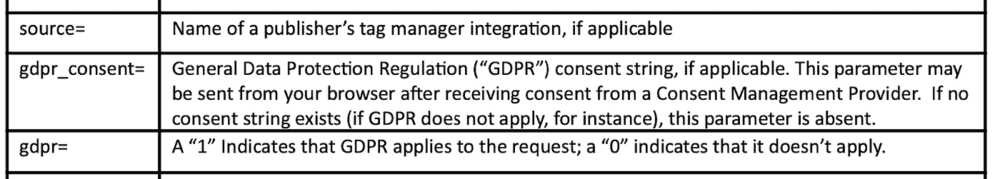

# 数百家公司正在用我的 Cookie 数据开派对，而我没有被邀请

> 原文：<https://towardsdatascience.com/hundreds-of-companies-are-having-a-party-with-my-cookie-data-and-i-wasnt-invited-e7f70837b27?source=collection_archive---------58----------------------->

## 我如何从一家广告情报公司获得 cookie 数据，如何使用我的 cookie 数据追踪错综复杂的第三方网络，以及如何感觉被排除在外。

图片由 [Master1305](https://www.freepik.com/master1305)

随着新法规的出台，产生了一种新的数据类别，赋予个人对其数据的权利，例如，从存在数据的平台请求其数据的权利。

此类个人数据权利在逻辑上包括您使用的平台。此外，这些个人数据权利也延伸到拥有您数据的服务提供商和平台，即使您与他们没有(已知的)关系。

让我们从 cookie 的角度来讨论这些问题，尤其是第三方对 cookie 的数据使用和数据处理。为了检验这一点，我们使用了从 Quantcast 获得的数据，根据[维基百科](https://en.wikipedia.org/wiki/Quantcast)“专门从事人工智能驱动的实时广告、观众洞察和测量。该公司声称，它拥有超过 1 亿个网络目的地的受众测量数据。

第三方饼干派对— [完整视频点击此处](https://www.loom.com/share/7d0c75a6eb3e4df19574dbf91ef789bd)

需要注意的是，cookies 以及与 cookies 相关联的数据往往来源于浏览行为而非个人数据。我没有发现任何个人身份数据(姓名、地址、SSN 等)。)在其中描述的数据集中。

您可以要求 QuantCast 在 CCPA(如果您在加州)或 GDPR(如果您在欧洲)提供您的个人资料的副本[在此](https://www.quantcast.com/privacy/data-subject-rights/)。提交您的请求后，Quantcast 将在 AWS 上为您提供一个 S3 桶，以便在他们处理您的请求后检索您的数据。在我的案例中，他们花了 30 天才完成。

在这篇文章中，我将分析 QuantCast in 收集的关于我的数据内容。我不会讨论其中包含的用例，而是将重点放在使用内容作为整个行业的风向标。

Quantcast 的数据申请表。

作为补充说明，在请求访问您的数据时，QuantCast 不会要求您告诉您是谁，也不会向您提供任何个人详细信息来识别您的身份。鉴于他们正在追踪你浏览器中的“MC”cookie，他们已经知道你是谁了。这无疑定下了基调。在这篇文章中，我将在一个浏览器中检查我收到的与一个 cookie 相关的数据。

*查看您在哪里被跟踪，您的数据在哪里，想知道它为什么在那里，我们是否应该有一些跨部门强制实施的开放默认设置*

30 天后，AWS S3 链接提供了一个档案下载，其中有一个简单的文本记录结构和一个概述 Quantcast 提供的数据的 PDF，并附有一些简单的图例和解释。这些解释对理解内容很有帮助，而且写得很好，否则内容可能看起来像任意的字符串。

归档包含以下文件:

*   **Audience-grid** —关于您如何被第三方划分到一个组中的数据，以及与该划分相关的第三方数据处理；
*   **观众链接**——同上；
*   **数据描述** —这是解释该档案内容的 PDF 文件；
*   **人口统计数据**——这解释了 Quantcast 对你个人的粗略描述，它包括四个维度:家庭中的孩子、收入、性别、位置和教育；
*   **历史存储** —包含您的个人数据，以及这些数据在个性化广告、个性化内容交付和预测分析中的处理方式，包括历史记录、时间戳、可用的使用位置；
*   **Keebler** —已经创建的第一方(本例中为 QuantCast)片段，其中您的浏览器是组合在一起的一组其他浏览器的一部分。

我的直接观察是，在提供的 30 天时间内，我的浏览器中有 15，836 条跟踪此“MC”cookie 的记录(这可能是他们的 cookie 到期时间，整个行业的中值生命周期约为 30 天)。我想知道这是不是很多:30 天内 15，836 条记录？这大约是每天 530 例。我想知道在这个浏览器上我是否访问了更多的页面，是否仅仅是因为我在所有页面上都被跟踪了？这似乎是合理的。

有一些特定产品、服务提供商及其数据段的有趣案例(Datalogix:购物兴趣:心理学和生活方式:夏季季节性购物者:NASCAR Superfans)。在对我进行了那种类型的描述后，我不确定我是否会信任 Datalogix，但这可能解释了为什么我会看到一些向我宣传的内容。

## 外卖食品

这种类型的数据至少可以带来三点有趣的启示:

1.  在您身上生成的数据配置文件的类型。如果准确，它们可能是有帮助的，如果不准确，它们可能是令人不安的，甚至是自我延续的(看到一辆赛车，点击一辆赛车，获得更多的赛车内容，即使对你没有帮助)；
2.  这种剖析在互联网上发生，并且这种剖析可能是未知的、无保证的或不需要的；
3.  什么类型的广告链接到什么数据档案或产品，以及它们在哪里显示。这实际上可以让你追溯到你看到的内容位置上的一些大问号，并推导出它为什么会出现。

数据本身还特别提到了 GDPR 的同意以及 GDPR 是否适用(例如，由于访问的位置)。没有提到其他类似的政策，如 CCPA。

## 关于第三方数据共享和处理的说明

在本例中，用户(我)与 QuantCast 没有已知的关系。然而，我可能在某个时候接受了“MC”cookie 的使用。除此之外，我可以在“观众链接”文件的日志中看到，我的数据已经由 Experian 提供给了 Quantcast，我想这是为了丰富信息。当然，不仅仅是 Experian，还有 AnalyticsIQ、Ixi (Equifax)、Oracle、Datalogix 等公司，以及其他许多公司。

阅读他们对我的分类和简介也很有趣。鉴于我对“斯沃森”的代号一无所知，我不会在这里列出太多的这些部分，除了说我被描述为“复活节糖果买家”、“Bravo 网络爱好者”、“瓶装水”爱好者和“奢侈护发”。作为一个为了更有效率而开始剃光头的人，这些都不太可信。

# 我的结论

似乎这些公司对我的数据比我更感兴趣。我很高兴至少我能看到正在发生的事情，但作为一名数据极客，我想参与其中。

有些公司以跟踪和分析用户的在线行为为生。作为一种媒介，它们有助于了解您的哪些个人数据被跟踪，以及这些数据被用于何处。我们认为有机会为开放协作和公共领域的不同用例设置数据共享的默认值，通过查看数据使用情况，我们可以看到并提出数据共享的开放标准，以便一起讨论和完善。

cookie 是一个重要的数据源和网络，但随着第三方 cookie 在 2022 年的减少，我们看到了市场的空白，这可能是零方数据或[用户控制的 cookie](https://medium.com/prifina/reimagining-the-world-without-cookies-3f01d614be29)的机会。

许多个人数据被锁在筒仓中，因此我们在 Prifina 进行研究，探索和创建自动检索这些数据的方法，使其对个人和开发者有用。你可以在[Prifina——你的数据](https://www.prifina.com/your-data.html)页面上看到更多这样的数据平台，上面有关于如何检索和探索你自己的个人数据的说明。

这个数据集暴露了十几个不同类型的服务提供商，以继续解开第三方数据共享和数据处理。处理一个数据请求的成本大约为 1，400 美元，我正在考虑很多$$$的理由来简化和构建请求处理过程，以便我可以通过 API 或类似的方法 ping 它。去吧，我等着。

具体谈一下这篇文章中描述的 cookie 数据以及与之相关的第三方网络，它如何对创造[新产品](http://dev.prifina.com)有用？对你刚刚看到的广告进行逆向工程？你能想到什么类型的用例？关于这个看似不可见(对用户而言)的 cookie 数据网络，您有兴趣了解什么？

你的数字双胞胎一直在世界各地忙碌。让他们为你工作。