# Tableau 中的混合可视化

> 原文：<https://towardsdatascience.com/hybrid-visualizations-in-tableau-cd031c76a107?source=collection_archive---------46----------------------->

## 结合可视化技术从数据中提取更深层的含义——用三个循序渐进的例子！

# 简短的画面概述

Tableau 对于数据科学家和数据分析师来说是一个非常强大的工具，可以让他们理解数据并产生可视化效果，简称为 **"viz"** 。

简单回顾一下——在 Tableau 中，我们使用显示为蓝色的分类数据**(维度)**，以及显示为绿色的可以聚合的数值数据**(度量)**。通过尺寸和测量的独特组合，以及“标记”卡**(颜色、尺寸、标签和细节)**上的选项，我们可以生成非常健壮的图！

# 混合可视化

使用数据的全部意义(除了它很棒这一事实之外)是为了回答问题以得出一些结论。这些结论可以通过分析 KPI、识别趋势和提取其他有意义的见解来找到。根据这些结论，我们经常采取行动来影响未来的结果。

有时候，见解很容易从数据中提取出来。我们可以简单地用传统的方法来表示这些发现，如柱状图、线图或散点图。但其他时候，我们想要从数据中提取的见解更加细致入微，这些标准情节本身不足以有效而简洁地讲述故事。

当这种情况出现时，我会使用一种混合的可视化方式。我所说的“混合”是指两种或两种以上技术的结合，在多个层次上处理数据，所有这些都在一个层次上进行，即。

例如，我们将使用 Tableau 的**“全球超市”**数据集来处理三种不同的场景。该数据集的 Excel 文件可以在这里找到 [**。**](http://www.tableau.com/sites/default/files/training/global_superstore.zip)

# 混合 Viz 1:树形图+条形图

**创建一个显示每年每季度总销售额和利润的 viz。我们希望将其分为 3 个层次:首先是地区，然后是产品类别，最后是产品子类别。**

哇哦。那是一口。显然，这不能通过简单的条形图来解释。我们必须创造一个比标准更高的 viz。所以让我们一口一口地解决这个问题。

首先，让我们确定需要处理的数据类别。“品类”、“子品类”、“区域”、“下单日期”是我们的维度，而“销售额”、“利润”是我们的衡量标准。

Tableau 允许我们创建一个名为 **tree-map** 的 viz，这本质上是一种使用矩形显示嵌套数据的方式，其中树的每个“分支”都有一个大矩形，这个大矩形被分成更小的矩形，这些矩形就是“叶子”。在我们的例子中，我们最大的分支是“区域”，较小的分支是“类别”，我们的“叶子”是“子类别”。每个枝叶的大小是由“销量”决定的。

为了将“利润”形象化，我们可以分配一个发散的调色板来轻松识别高利润产品和低利润产品。所以，这个树形图照顾到了一切，除了时间方面。“订单日期”呢？

这就是我们混合树形图和柱状图的地方。在构建了树形图之后，如果我们将“订单日期”分配给“行”,那么 Tableau 将为数据集中的每一年创建一个树形图。每个树形图变成一个条形图，其总大小代表该特定年份所有产品类别和所有地区的总销售额。我们还可以按季度进一步细分。

现在，让我们来看看如何在 Tableau 中创建它。

## **第一步:**

首先选择销售、利润和地区，然后使用 Tableau 右上角的“演示”工具，我们制作了一个树形图，其中每个矩形代表一个不同的地区。每个矩形的大小代表每个地区的销售额。每个矩形的颜色代表每个地区的利润。深橙色利润较低，深蓝色利润较高。

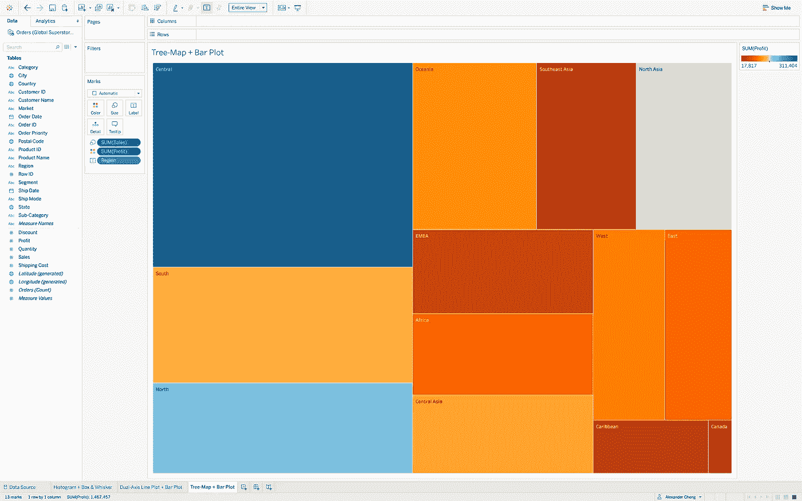

## 第二步:

接下来，我们将“类别”维度添加到标记卡上的“标签”中。现在，我们的树形图显示了每个地区，按产品类别细分。

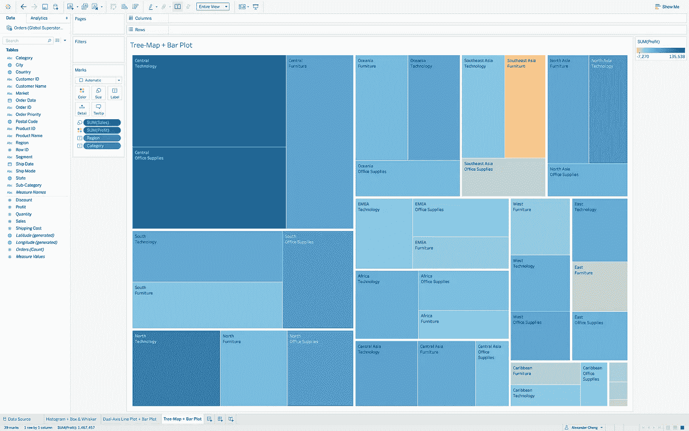

## 第三步:

现在，我们将“子类别”维度添加到标记卡的“标签”中。结果显示每个地区的销售额，首先按产品类别细分，然后再按产品子类别细分。

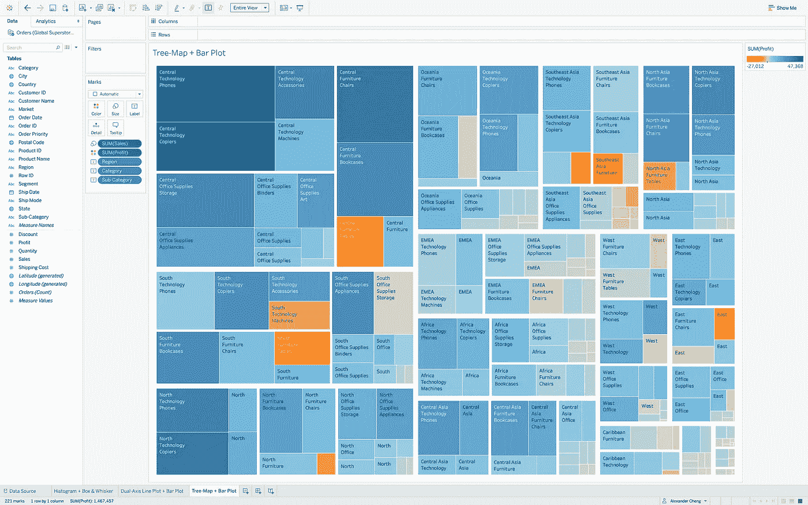

## 第四步:

现在我们介绍时间方面。通过将“订单日期”维度拖动到 Tableau 中的“行”中，我们现在可以看到每个地区的销售额，按产品类别细分，再按产品子类别细分，并拆分为每年一个树形图。我们可以看到，每年我们的整体销售额都在增长！

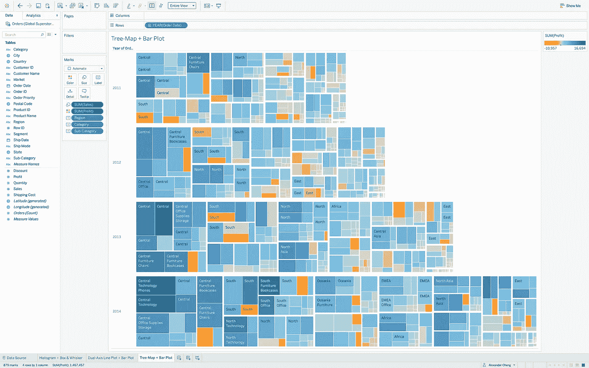

现在我们介绍时间方面。通过将“订单日期”维度拖动到 Tableau 中的“行”中，我们现在可以看到每个地区的销售额，按产品类别细分，再按产品子类别细分，并拆分为每年一个树形图。我们可以看到，每年我们的整体销售额都在增长！

## **第五步:**

最后，我们可以扩展“订单日期”层次结构，以显示每年每个季度的树形图。我们的树形图已经变成了柱状图——最长的柱状图显示的是销售额最高的季度，最短的柱状图显示的是销售额最低的季度。使用发散调色板，利润最高的产品子类别显示为深蓝色，而利润最低的子类别显示为深橙色。似乎有一个明显的趋势，即 Q1 的销售额最低，每个季度都在增长，其中第四季度的销售额最高。

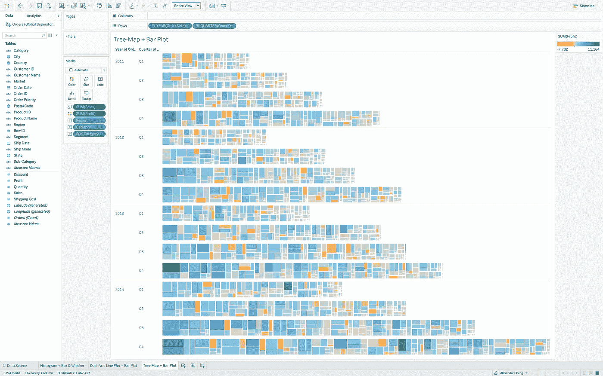

# 混合 Viz 2:双轴条形图+线图

创建一个显示每年每月全球总销售额的 viz，并叠加显示每年每月的总利润。提供一年的销售和利润预测。

好吧，让我们概括一下这个任务。还是那句话，我们感兴趣的是“销量”和“利润”。但是这一次，我们没有用几个分类维度来分解它。我们不需要超精细的可视化。我们只想了解我们的全球超市销售额和利润是如何随时间变化的。

直观传达每月销售额的一种简单方法是使用条形图，x 轴表示“月/年”，y 轴表示“销售额”。但是利润呢？为了从图形上区分“利润”和“销售额”，我们可以在条形图的顶部叠加一个显示一段时间内的利润数据的线图。

除了天气预报，其他的都考虑到了。我们可以提供一年的额外棒线来预测“销售”,并提供一条额外的线来预测“利润”,置信区间为 95%。

让我们开始在 Tableau 中构建第二个混合模型。

## 第一步:

首先，我们为销售数据创建一个简单的条形图。我们在“行”中指定了“销售额”，在“列”中指定了“订单日期”。我们对每年每月的销售额和利润感兴趣，所以我们将“订单日期”从离散改为连续，其颜色从蓝色改为绿色。我给我们的条形图分配了深灰色，以保持 viz 中性，因为我们将在这些条形图的顶部覆盖利润数据。

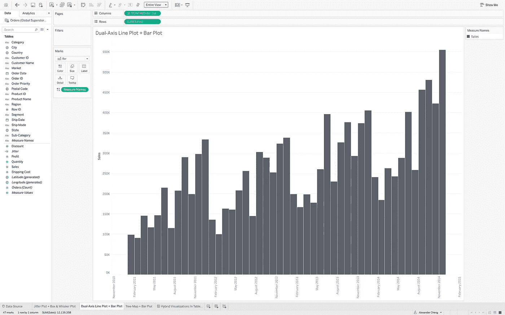

## 第二步:

接下来，我们需要合并我们的利润数据。这将表示为销售条形图顶部的线形图。要做到这一点，我们将按 SUM 聚合的“利润”拖到“行”中，然后单击“利润”药丸上的下拉菜单，并选择“双轴”。这在 viz 的右侧创建了一个新的轴，标记为“利润”。为了使我们的“利润”比例与“销售”比例保持一致，我们右键单击新轴，并选择“同步轴”。现在，这些值在我们的 y 轴上对齐，这使得阅读更加直观。我选择了一条浅蓝色的利润线，与深灰色的销售柱状图形成对比。(注意:我们不想用绿色或红色作为盈利线，因为这些颜色与财务收益和损失相关联。)

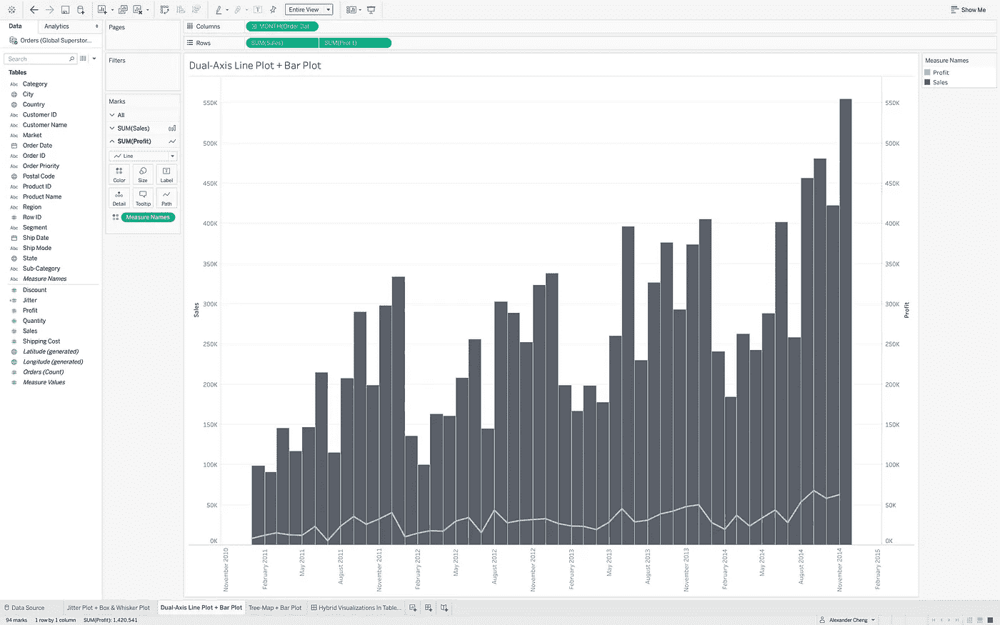

## 第三步:

最后，我们建立预测。在左上角的“分析”选项卡中，我们将“预测”拖放到视图中。在顶部的功能区中，在“分析”—“预测”—“预测选项”下，我们可以定义我们希望准确预测 1 年，并使用触须显示 95%的置信区间。我们将预测的条形图和线条用不同的颜色表示，以表明这些是预测，而不是实际数据。Tableau 默认情况下会自动为您选择一个[指数平滑](https://www.statisticshowto.com/exponential-smoothing/)预测模型。简而言之，“指数平滑”是指时间序列数据:数据越老，数据的权重越小，而较新的数据被认为更重要，被赋予更大的权重。

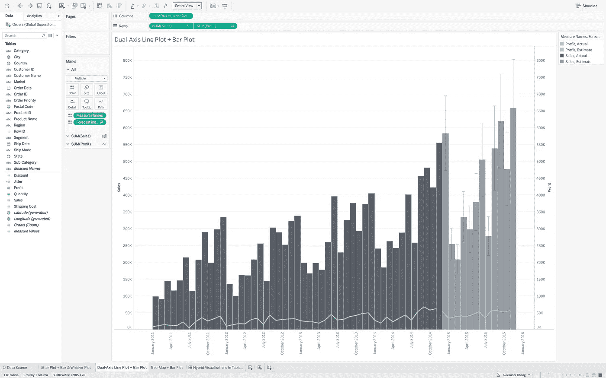

# 混合 Viz 3:抖动图+盒须图

**创建一个显示每份订单利润的 viz，它还显示按地区细分的每份订单的利润分布。过滤以排除异常数据(仅当每份订单的利润介于 0 美元到 1，000 美元之间时)。**

现在我们只关心一个衡量标准:“利润”。我们只关心一个维度:“区域”。没什么可分解的。这里的挑战是以图形方式显示成千上万的订单，过滤数据，并用分布信息覆盖这些数据。这可以通过使用带有盒须图叠加的抖动图来实现。

抖动图随机排列 x 轴上的值，以分散数据，从而更清楚地了解分布情况。在这种情况下，这对我们特别有帮助，因为我们有数千个数据点显示每个地区每个订单的利润。

盒须图叠加为我们提供了关于每份订单利润分布的更具体的分析。它显示了数据的核心所在。“方框”显示了中间的百分之五十的值，即第一个到第三个四分位数，中间有一条线。这被称为“四分位距”或“ [IQR](https://www.statisticshowto.com/probability-and-statistics/interquartile-range/) ”。“胡须”要么延伸到最小值/最大值，要么延伸到 1.5 倍 IQR，这是确定数据中异常值的常用规则。

让我们设计这最后一个场景吧！

## 第一步:

首先，我们需要生成盒须图。我们选择“订单 ID”、“区域”和“利润”，并在“演示”下拉列表中选择盒须图。这显示了在每个地区下单的每个订单的数据点。在标记卡的“颜色”选项卡中，我们可以降低数据点的不透明度，以获得更好的订单密度图形感。我们可以看到我们的盒须图非常紧凑，因为我们有广泛的利润值。显然，我们订单利润值的很大一部分在一个非常窄的范围内。

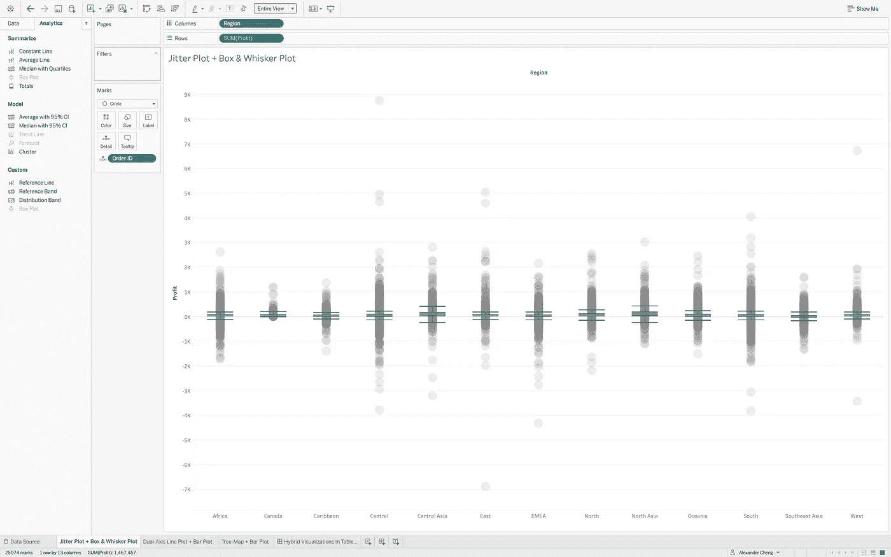

## 第二步:

接下来，我们要过滤数据。我们被告知排除 0 到 1000 美元之间的利润数据。因此，我们将汇总的“利润”拖到过滤器卡上，并相应地调整范围。我们的盒须图会自动更新为过滤值。

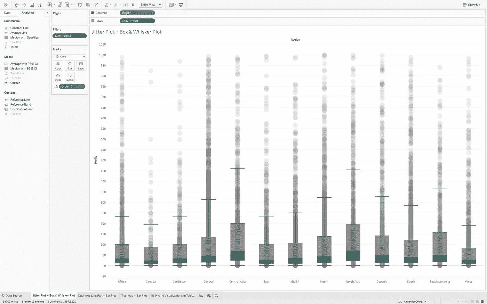

## 第三步:

为了使区域更容易相互区分，我们可以将“色调圆”调色板分配给“区域”。区域是绝对的。当我们处理类别时，我们希望为每个类别使用不同的颜色。我们不想在这里使用单一的颜色或分散的调色板。

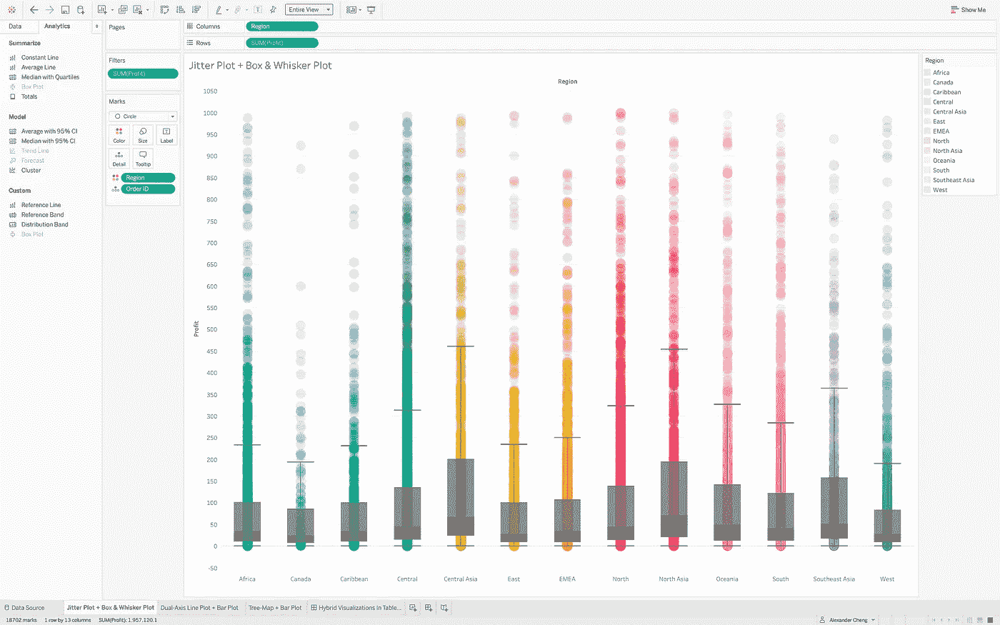

## 第四步:

最后，我们可以沿着每个地区的 x 轴“抖动”我们的数据点，以图形方式查看我们每份订单的利润密度。我们可以通过右键单击“数据”选项卡，然后单击“创建计算字段”来完成此操作。我们将这个新字段命名为“Jitter”，并通过键入“INDEX()%20”来创建这个字段的计算。

这里的 INDEX()函数本质上是在每个区域内创建“抖动列”,我们的数据点被随机分配到这些区域中，以便将它们水平分布，而不是都在一行中。“%20”指定我们想要制作的抖动列的数量。最后，在将新的“Jitter”字段拖到列中后，我们单击“Jitter”字段的下拉菜单，并选择“Compute Using”—即“Order ID”。结果就是你下面看到的！

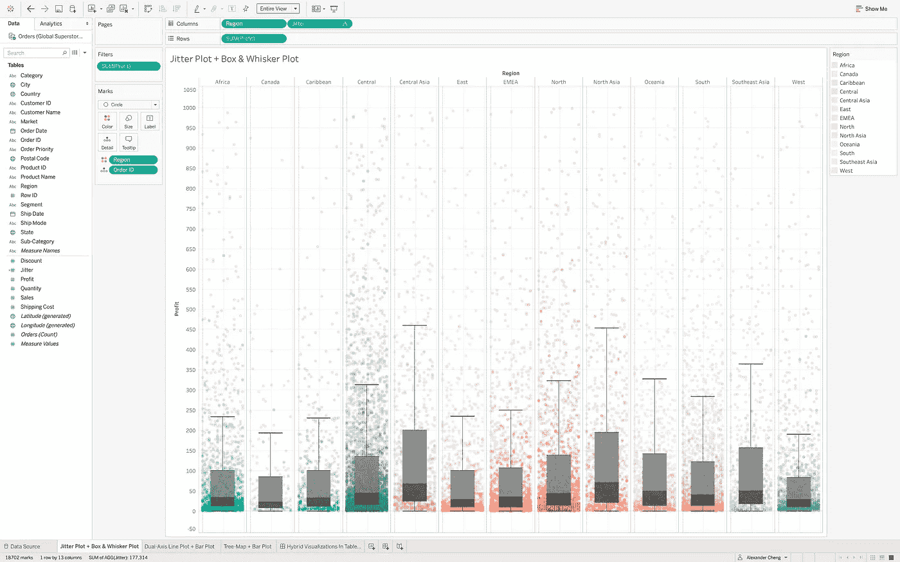

# 结论

我希望这篇教程能激发出更健壮、更有效的方法来可视化数据！如果有一点创造力，了解什么是可能的，并花一些时间练习和使用它，数据是一种强大的资源！本博客中的所有这些可视化内容都可以在 Tableau Public [**这里**](https://public.tableau.com/profile/alexander.cheng#!/vizhome/HybridVisualizationsInTableau/HybridVisualizationsInTableau?publish=yes) 看到并与之互动。

数据很美！