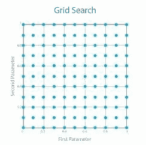
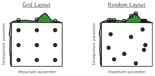
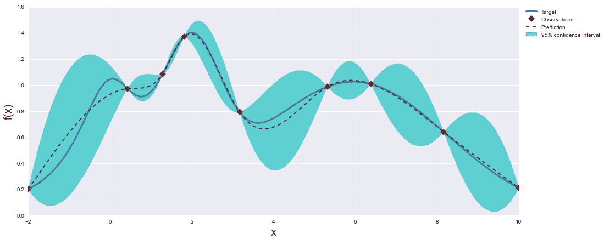
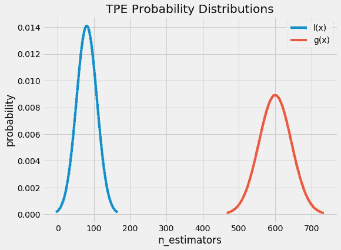
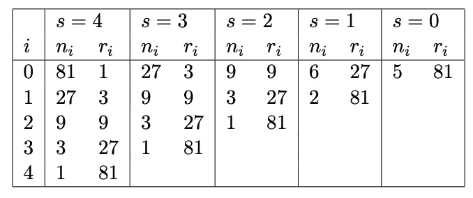
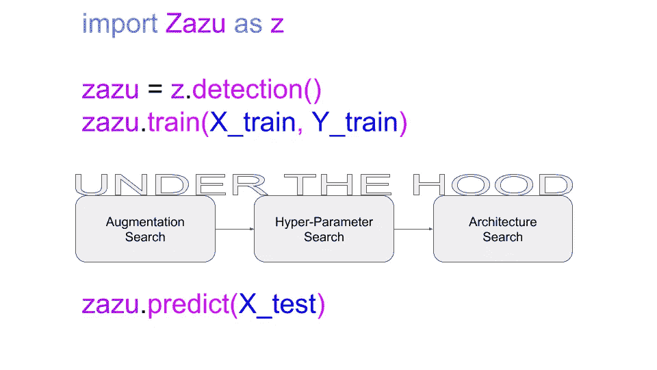

# 超参数调谐—教程

> 原文：<https://towardsdatascience.com/hyper-parameter-tuning-a-tutorial-70dc6c552c54?source=collection_archive---------25----------------------->

## 不使用代码或数学的超级参数调整方法的简单高级概述

在本教程中，我们将介绍 5 种超参数优化方法:

1.  网格搜索
2.  随机搜索
3.  贝叶斯优化
4.  连续减半
5.  超波段

# 网格搜索

从这篇[遗传算法论文](https://www.groundai.com/project/grid-search-random-search-genetic-algorithm-a-big-comparison-for-nas/1)

网格搜索背后的思想非常直观。递增移动一个超参数，同时保持其他参数不变，并记录结果。基本上对所有你怀疑可以优化的超参数都这样做。这是一种非常昂贵和麻烦的优化和调整超参数的方法，今天被认为是进行超参数搜索的效率较低的方法之一。让我们看看如何做得更好。

# 随机搜索

来自[的随机搜索论文](https://jmlr.csail.mit.edu/papers/volume13/bergstra12a/bergstra12a.pdf)

虽然你可能一开始没有想到，但随机选择所有超参数的值实际上是一种更有效的超参数调整方法。在这种情况下，我们不是保持所有超参数不变并以迭代方式调整其中一个，而是在每次试验中随机初始化所有超参数值。这更好，因为事实证明，一些超参数对优化来说比其他的更重要，如果我们不能区分重要的超参数和不重要的超参数，我们能做的下一个最好的事情是在每次试验中随机选择所有的超参数值。这将为重要的超参数提供更高的采样率，因此我们的优化将更加高效。随机搜索与网格搜索的优势在[这篇](https://jmlr.csail.mit.edu/papers/volume13/bergstra12a/bergstra12a.pdf)文章中有所探讨。

# 贝叶斯优化

来自[贝叶斯优化回购](https://github.com/fmfn/BayesianOptimization)

实际上，高层次的概念非常简单，我们试图用贝叶斯优化做同样的事情，我们总是试图在 ML 中做，那是估计函数，函数太复杂而无法公式化。但是现在我们试图逼近的函数是我们的 ML 算法。在这种情况下，我们可能会使用深度学习或其他形式的 ML，我们只能运行有限数量的试验来测试超参数的不同组合。如果我们能够在选择下一个超参数配置之前智能地近似我们的 ML 算法的结果，我们可能会节省大量的时间和金钱。

来自 [TPE 论文](https://papers.nips.cc/paper/4443-algorithms-for-hyper-parameter-optimization.pdf)

有几个贝叶斯优化函数，但其关键思想是使用贝叶斯方法来估计一个更好的超参数配置给定以前的一组配置及其结果。在上图中，我们使用了一种叫做 [TPE](https://papers.nips.cc/paper/4443-algorithms-for-hyper-parameter-optimization.pdf) 的算法，其基本概念是将我们的试验根据其表现分成两组，即得到较好结果的组和得到较差结果的组。然后，我们基于其属于好分布而不是坏分布的概率来挑选下一组超参数。

# 连续减半

在连续减半中，我们开始训练少量时期的大量试验，超参数配置是随机的。然后，我们丢弃表现最差的试验，并且仅继续训练表现最好的试验，我们这样做，直到保留单个超参数配置。

# 超波段

超带是逐次减半算法的扩展。连续减半的问题是，我们通常无法知道试验次数与时期数之间的正确权衡。在某些情况下，一些超参数配置可能需要更长时间才能收敛，因此开始时进行大量试验，但少量的历元并不理想，在其他情况下，收敛速度很快，试验次数是瓶颈。

摘自[超频论文](https://arxiv.org/pdf/1603.06560.pdf)

这就是超级波段的用武之地。Hyperband 本质上只是对最优分配策略的网格搜索。所以在每个单独的试验中，超参数组是随机选择的。

在图像中，您可以看到 hyperband 算法将在 5 次资源分配中连续减半。s=4 以 81 个试验开始其第一轮，为每个试验提供单个历元，然后迭代地丢弃 2/3 的试验，直到剩下一个试验，并训练 81 个历元。在 s=0 时，Hyperband 算法基本上运行一个随机搜索，进行 5 次试验，每次试验都根据最大历元数进行训练。

# 扎祖姆尔

ZazuML 开源项目

ZazuML 是我和一些朋友一直在做的一个开源 AutoML 项目。它混合了几种搜索算法，包括前面提到的超波段和随机搜索。

请查看我们的 [Github](https://github.com/dataloop-ai/ZazuML) ！