# 超参数优化

> 原文：<https://towardsdatascience.com/hyper-parameters-optimization-c2f888515d8f?source=collection_archive---------28----------------------->

了解如何让您的深度学习模型更上一层楼！


[https://unsplash.com/photos/Kl1gC0ve620](https://unsplash.com/photos/Kl1gC0ve620)

# 介绍

本文的目的是学习如何通过选择最佳超参数来优化神经网络。具体来说，我们将探索:

*   网格搜索
*   远视
*   遗传算法

# 网格搜索

网格搜索是在一组参数中寻找最佳参数的最简单方法。本质上是蛮力。让我们看一个简单的例子:

假设我们有一个网格，我们想看看哪些参数是最好的。我们有:

*   下降:可以从 0 到 0.5 变化，间隔为 0.1
*   学习率:可以在 0.1 到 0.001 之间变化，间隔为 x10
*   过滤器数量:从 64 到 256 不等，间隔为 64
*   过滤器尺寸:从 3 到 7 英寸不等(总是方形过滤器)

嗯，网格搜索会做的如下:

```
**# grid definition**
dropouts = [0, 0.1, 0.2, 0.3, 0.4, 0.5]
learning_rates = [0.1, 0.01, 0.001, 0.0001]
n_filters = [64, 128, 192, 256]
filter_sizes = [3, 5, 7]**# variable creation to store the values**
log_accuracies = []from random import uniform
def dummy_net(d, lr, nf, fs):
  print('Executing network with d={}, lr={}, nf={}, fs={}'.format(d, lr, nf, fs))
  return uniform(0,1)**# counter**
i = 1**# grid search**
for d in dropouts:
  for lr in learning_rates:
    for nf in n_filters:
      for fs in filter_sizes:
        result_net = dummy_net(d, lr, nf, fs)
        print('[{}] Resultado: {}'.format(i, result_net))
        log_accuracies.append(result_net)
        i += 1
```

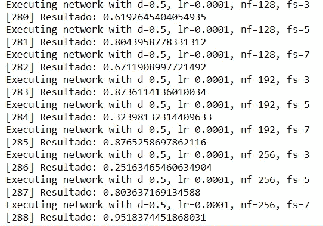

最好的结果是:

```
import numpy as np
idx_max = np.nonzero(log_accuracies==np.max(log_accuracies))
print(idx_max)print('Best execution: {}. Accuracy: {}'.format(idx_max[0][0], log_accuracies[idx_max[0][0]]))
```

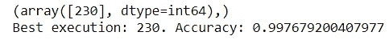

这就是我们如何评估网络配置的最佳结果。

这种方法的问题是我们在网络中有 6×4×4×3 次执行，总共有 288 次执行。如果每次执行最少需要 10 分钟，那么总时间加起来就是 48 小时。

让我们用一个非常简单的网来做一个测试:

```
**# We import the necessary libraries**
from keras.datasets import mnist
from keras.models import Sequential
from keras.layers import Dense, Dropout, Flatten
from keras.layers import Conv2D, MaxPooling2D
from keras import backend as K
from keras.utils import to_categorical
from keras.optimizers import Adam**# To load the data and convert from vectors to images**
img_rows, img_cols = 28, 28
(x_train, y_train), (x_test, y_test) = mnist.load_data()
x_train = x_train.reshape(x_train.shape[0], img_rows, img_cols, 1)
x_test = x_test.reshape(x_test.shape[0], img_rows, img_cols, 1)
input_shape = (img_rows, img_cols, 1)**# to normalize the data**
x_train = x_train.astype('float32')
x_test = x_test.astype('float32')
x_train /= 255
x_test /= 255**# convert class vectors to binary class matrices**
num_classes = 10
y_train = to_categorical(y_train, num_classes)
y_test = to_categorical(y_test, num_classes)def net(do, lr, nf, fs):model = Sequential()
  model.add(Conv2D(nf, kernel_size=fs, activation='relu', input_shape=input_shape))
  model.add(Conv2D(nf, fs, activation='relu'))
  model.add(MaxPooling2D(pool_size=(2, 2)))
  model.add(Dropout(do))
  model.add(Flatten())
  model.add(Dense(128, activation='relu'))
  model.add(Dropout(do))
  model.add(Dense(10, activation='softmax'))model.compile(loss='categorical_crossentropy', optimizer=Adam(lr=lr), metrics=['accuracy'])model.fit(x_train, y_train,
            batch_size=1024,
            epochs=1,
            verbose=0,
            validation_data=(x_test, y_test))score = model.evaluate(x_test, y_test, verbose=0)

  print('Red con d={}, lr={}, nf={}, fs={}. Loss: {}. Acc: {}.'.format(d, lr, nf, fs, score[0], score[1]))      
  return score[1] # accuracy
```


```
**# grid definition**
dropouts = [0, 0.3]
learning_rates = [0.1, 0.01]
n_filters = [32, 64]
filter_sizes = [3, 5]**# variable creation to store the values**
log_accuracies = []**# counter**
i = 1**# grid search**
for d in dropouts:
  for lr in learning_rates:
    for nf in n_filters:
      for fs in filter_sizes:
        result_net = net(d, lr, nf, fs)
        print('[{}] Resultado: {}'.format(i, result_net))
        log_accuracies.append(result_net)
        i += 1

**# the best result will be:**
import numpy as np
idx_max = np.nonzero(log_accuracies==np.max(log_accuracies))
print(idx_max)print('Best execution: {}. Accuracy: {}'.format(idx_max[0][0], log_accuracies[idx_max[0][0]]))
```

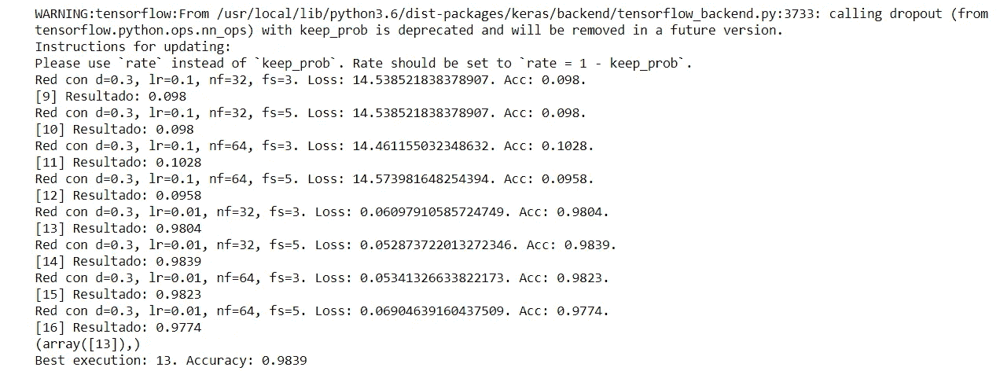

```
**# grid definition with the best values**
dropouts = [0, 0.3]
learning_rates = [0.01]
n_filters = [32, 64, 128]
filter_sizes = [5, 7]**# variable creation to store the values**
log_accuracies = []**# counter**
i = 1**# grid search**
for d in dropouts:
  for lr in learning_rates:
    for nf in n_filters:
      for fs in filter_sizes:
        result_net = net(d, lr, nf, fs)
        print('[{}] Resultado: {}'.format(i, result_net))
        log_accuracies.append(result_net)
        i += 1

**# the best result will be:**
import numpy as np
idx_max = np.nonzero(log_accuracies==np.max(log_accuracies))
print(idx_max)
print('Best execution: {}. Accuracy: {}'.format(idx_max[0][0], log_accuracies[idx_max[0][0]]))
```

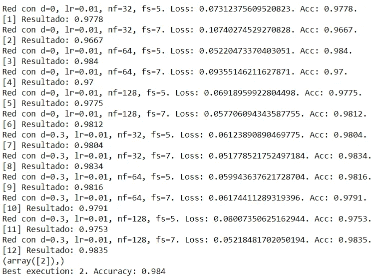

这是一个相当好的结果。虽然用更快的方法或者一些启发式的方法会很棒，而不是蛮力。你很幸运，因为有各种各样的方法:

*   留兰香(蟒蛇皮)
*   BayesOpt(带有 Python 和 Matlab/Octave 接口的 C++)
*   远视(蟒蛇皮)
*   SMAC(爪哇)
*   伦博(Matlab)
*   MOE (C++/Python)

接下来我们将探索超级选项！

# 超级选项

Hyperopt 是一个用 Python 编写的库，它允许您通过更多地关注最有可能提供良好解决方案的值来快速优化函数。

你可以在这里找到完整的方法:分布式异步超参数优化，【https://github.com/hyperopt/hyperopt】T2。

它目前实现了两种算法来做到这一点:

*   随机搜索
*   Parzen 估计树(TPE)

此外，利用 MongoDB，它们可以串行或并行运行。

让我们看一个如何使用它的例子。

让我们找出 x 的最小值:

```
from hyperopt import fmin, tpe, hp**# with 10 iterations**
best = fmin(fn=lambda x: x ** 2,
            space=hp.uniform('x', -10, 10),
            algo=tpe.suggest,
            max_evals=10)print(best)
```

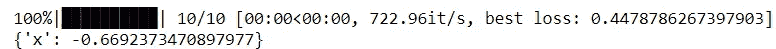

```
from hyperopt import fmin, tpe, hp**# with 100 iterations**
best = fmin(fn=lambda x: x ** 2,
            space=hp.uniform('x', -10, 10),
            algo=tpe.suggest,
            max_evals=100)print(best)
```

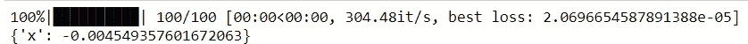

```
from hyperopt import fmin, tpe, hp**# with 1000 iterations**
best = fmin(fn=lambda x: x ** 2,
            space=hp.uniform('x', -10, 10),
            algo=tpe.suggest,
            max_evals=1000)print(best)
```

现在让我们尝试一个更复杂的神经网络:

```
**# we install the necessary packages**
!pip install networkx==1.11 # para instala hyperopt correctamente, si no, da errores
!pip install hyperopt**# necessary imports**
import sys
import time
import numpy as np
from hyperopt import fmin, tpe, hp, STATUS_OK, Trials
from keras.models import Sequential
from keras.layers import Dense, Dropout, Activation, Flatten
from keras.layers import Conv2D, MaxPooling2D
from keras.constraints import max_norm
from keras.optimizers import Adam
from sklearn.model_selection import train_test_split
from keras.utils import to_categorical
from keras.callbacks import EarlyStopping
from keras.datasets import cifar10SEED = 42(X_train, y_train), (X_test, y_test) = cifar10.load_data()
validation_split = 0.1
X_train, X_val, y_train, y_val = train_test_split(X_train, y_train, test_size=validation_split, random_state=SEED)**# Let's convert the data to float and then divide it by 255 to normalize it
# Due to image characteristics they can only get values from 0 to 255**
X_train = X_train.astype('float32') / 255.
X_val = X_val.astype('float32') / 255.
X_test = X_test.astype('float32') / 255.**# let's convert the labels with one-hot encoding**
n_classes = 10
y_train = to_categorical(y_train, n_classes)
y_val = to_categorical(y_val, n_classes)
y_test = to_categorical(y_test, n_classes)**# we define the search space
# we'll vary:
# - the number of filters in our conv layers
# - the dropout percentage
# - the number of neurons in the dense layer**
space = {
    'n_filters_conv': hp.choice('n_filters_conv', [32, 64, 128]),
    'dropout': hp.uniform('dropout', 0.0, 0.5),
    'neurons_dense': hp.choice('neurons_dense', [256, 512, 1024]), 
}def get_callbacks(pars):
  callbacks = [EarlyStopping(monitor='val_loss', min_delta=0.0001, patience=2, verbose=0, mode='auto')]
  return callbacksdef mi_cnn(pars):
  print ('Parameters: ', pars)
  model = Sequential()

 **# First convolutional block**
  model.add(Conv2D(pars['n_filters_conv'], kernel_size=(3, 3), activation='relu', input_shape=(32, 32, 3)))
  model.add(MaxPooling2D(pool_size=(2, 2)))
  model.add(Dropout(pars['dropout']))**# second convolutional block**
  model.add(Conv2D(pars['n_filters_conv'], kernel_size=(3, 3), activation='relu'))
  model.add(MaxPooling2D(pool_size=(2, 2)))
  model.add(Dropout(pars['dropout']))**# third convolutional block**
  model.add(Conv2D(pars['n_filters_conv'], kernel_size=(3, 3), activation='relu'))
  model.add(MaxPooling2D(pool_size=(2, 2)))
  model.add(Dropout(pars['dropout']))**# Classifier block**
  model.add(Flatten())
  model.add(Dense(pars['neurons_dense'], activation='relu', kernel_constraint=max_norm(3.)))
  model.add(Dropout(pars['dropout']))
  model.add(Dense(10, activation='softmax'))**# We compile the model**
  model.compile(loss='categorical_crossentropy',
                optimizer=Adam(lr=0.0001, decay=1e-6),
                metrics=['accuracy'])**# We train the model**
  history = model.fit(X_train, 
                      y_train,
                      batch_size=128,
                      shuffle=True,
                      epochs=5,
                      validation_data=(X_val, y_val),
                      verbose = 0,
                      callbacks = get_callbacks(pars))best_epoch_loss = np.argmin(history.history['val_loss'])
  best_val_loss = np.min(history.history['val_loss'])
  best_val_acc = np.max(history.history['val_acc'])

  print('Epoch {} - val acc: {} - val loss: {}'.format(best_epoch_loss, best_val_acc, best_val_loss))
  sys.stdout.flush()

  return {'loss': best_val_loss, 'best_epoch': best_epoch_loss, 'eval_time': time.time(), 'status': STATUS_OK, 'model': model, 'history': history}trials = Trials()
best = fmin(mi_cnn, space, algo=tpe.suggest, max_evals=10, trials=trials)
print(best)
```

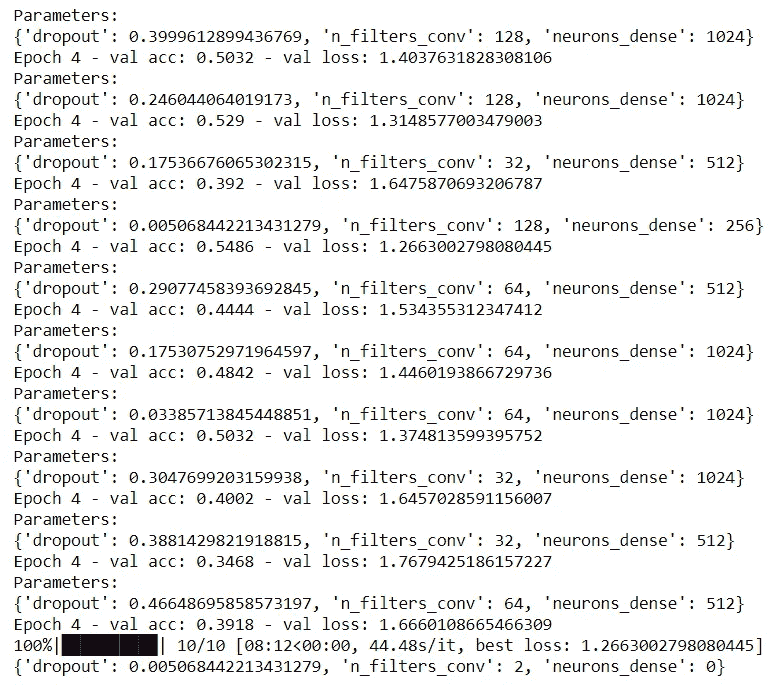

```
trials.results
```

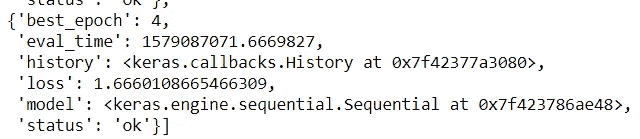

```
trials.losses()
```

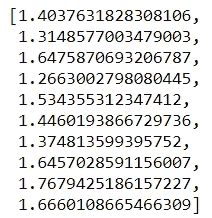

这样，您可以离开您的配置，去做一些比改变参数更有用的事情，直到您找到正确的配置。

但是我们不一定要呆在这里，如果我们想要剩余连接，我们也可以改变层数或设置。是的，这意味着我们也可以改变架构！

这里有一个非常完整的例子:【https://github.com/Vooban/Hyperopt-Keras-CNN-CIFAR-100】T4

还有一个你可能会感兴趣的。

# 遗传算法

本质上，遗传算法是一种受自然进化启发的元启发式研究方法。它们属于进化算法，特别是导向随机搜索算法(进化算法)。

这听起来可能很复杂，但实际上非常简单。让我们用一个例子来理解它们:

想象一下，我们有一个拼图，我们只剩下一块拼图可以拼了。问题是这个谜题非常特别，因为它让我们能够完成我们的作品。为此，我们有几种机制:

*   组合部分片段(交叉或重组)
*   修改那些部分的某些部分(突变)
*   选择我们所做的最好的作品，从新的和更好的作品中建立(选择)

然后，假设我们决定切割 10 块纸板，这是我们最初的 10 块纸板，我们将用它们来测试是否有任何一个完全符合。我们都试过了，在这 10 个中，有 5 个或多或少合适。因此，我们选择了这 5 个，并使用上面解释的机制从中制作了新的:

*   从选择的五个中，我们通过随机选择的方式将最初的五个中的两个部分组合起来，再取五个。
*   在最初的 5 个和我们创造的新的 5 个中，我们通过稍微修改作品的一个尖端，再去掉 5 个

现在我们有 15 个棋子，我们总是想要 10 个，因为如果不是在第 5 次我们这样做了，我们会有很多棋子，所以:

*   我们试了 15 件，找到最合适的，然后随机选择 9 件。

让我们看看如何在实践中应用这个例子:

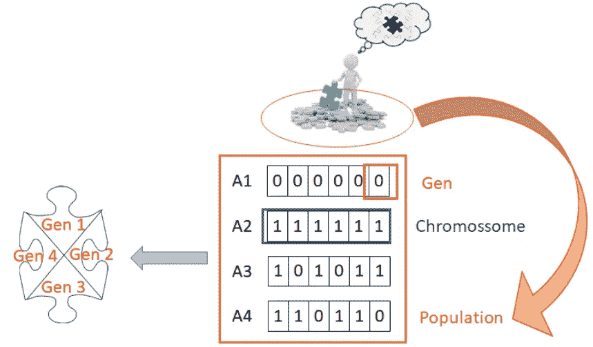

按作者分列的数字

如你所见:

*   我们这组片段(群体)中的每一个片段都是一条染色体
*   我们的每一部分都是一个基因，所以我们的染色体有 4 个基因
*   每个基因可能具有的值或设置被称为等位基因。

这和生物学中的一样，因为这些算法是受自然进化的启发？

好的，让我们把这些单词和我们的例子联系起来:

*   我们需要为我们的拼图洞找到合适的一块
*   我们有一组初始的片段(群体),我们不知道它们是否合适
*   我们检查这些部分配合得有多好(使用适应度函数)
*   如果没有一个片段符合我们的要求，我们就修改这些片段(使用操作符:交叉和变异)
*   我们检查新创建的片段在一起的吻合程度(适应度函数)
*   我们选择我们想要为下一次迭代(选择)保留的片段
*   我们重新开始。直到我们找到一个符合我们要求精度的零件

我们来看看伪算法:

**开始**

*   生成初始群体
*   计算适合度

**重复**

*   选择
*   交叉
*   变化
*   计算适合度

直到种群已经收敛

**停止**

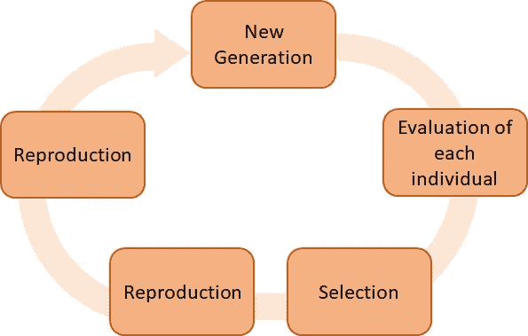

## 但是它们是如何工作的呢？

我们必须理解几个概念:

*   我们的人口如何初始化
*   交叉是如何工作的
*   变异是如何发生的
*   选择是如何工作的
*   我们如何定义我们的适应度函数

首先要明白的是，当我们在现实世界中遇到问题，想要在计算机上解决时，我们需要对它进行编码，以便计算机能够理解它。

比如说:

在现实世界中，染色体是拼图的一部分。在计算机中，染色体是一个有 4 个值的向量(一个表示每个尖端的大小，其中正表示尖端，负表示片上的洞)
这就是所谓的编码。

一旦我们知道了这一点，我们将看到操作符是如何工作的。首先，你应该知道有许多类型的交叉、变异和选择，但是这里我们将只从时间的角度来看最简单的那些。

如果你有兴趣了解更多，网上有很多资料。可以从这里开始:[https://www.tutorialspoint.com/genetic_algorithms/index.htm](https://www.tutorialspoint.com/genetic_algorithms/index.htm)

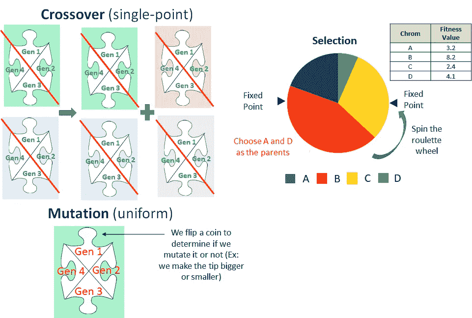

按作者分列的数字

**单点交叉**

我们的染色体是拼图，它有你在图片中看到的 4 个基因。因此，简单的交叉只是从 4 个基因中随机选择一个点，并将这些部分组合成新的染色体，如图所示。

理解这一点很重要，因为我们有原始的和重组的染色体。

**均匀突变**

统一的突变是，对于每个染色体，我们抛硬币。如果很贵，我们就修改随机选择的基因。我们赋予它什么价值？在基因允许的范围内随机选择一个。

**选择**

对于选择，通常使用染色体适应度(也称为可能的解决方案)。在这种情况下，我们将研究随机通用采样，它包括构建一个饼形图，其中每个染色体占据一个与其适应度相对应的空间。然后，我们在“蛋糕”周围建立 N 个固定点，其中 N 是我们要选择的染色体数目。然后，我们“旋转蛋糕”，仿佛是运气轮盘，定点指向的染色体就是被选中的，继续下一次迭代。

你看看，染色体不是从适应度最高到最低排序的。

这一点很重要，因为否则，选择一个高适应性染色体和另一个低适应性染色体的机会将高于选择两个高适应性染色体的机会。毕竟，由于选择点在彼此的前面，选择两条适应度相似的染色体会非常复杂。

这个运算符有几种工作方式。继续我们的 10 染色体群体的例子:

*   我们选择 N=10 条染色体，也就是说，我们用一个完全新的群体替换先前的群体
*   我们选择 N=n 条染色体，其中 N<10\. In other words, we replace only a part of the old chromosomes.

Okay, so if we select all 10 it’s clear, but if we select n, how do we choose which ones to remove?

Well, the two most common ways are:

*   We remove the oldest chromosomes
*   We remove the chromosomes with the worst fitness

Finally, there are times when we select the best chromosome (or the k best) to pass if or when the next iteration, that is, there is elitism. We have to be careful with this, because although a priori it seems that elitism is the best and that we should only stay with the best if we did we would be killing one of the greatest virtues of genetics: that they can escape to local minimums!

Look, here you can see a geneticist in action trying to decide which is the best configuration for a two-wheeled vehicle: [http://rednuht.org/genetic_cars_2/](http://rednuht.org/genetic_cars_2/)

让我们自己实现几个例子？

```
**# example of a GA where we have to find N numbers that add up to X
#** [**https://lethain.com/genetic-algorithms-cool-name-damn-simple**](https://lethain.com/genetic-algorithms-cool-name-damn-simple)from random import randint, random
from operator import add
from functools import reduce
import numpy as npdef individual(length, min, max):
 **# we create an individual**
    return [ randint(min,max) for x in range(length) ]def population(count, length, min, max):   
    **# we create our population**
 **# count: number of individuals of each population
    # length: number of values per individual
    # min: minimum allowed for each individual's value
    # max: maximum allowed for each individual's value**return [ individual(length, min, max) for x in range(count) ]def fitness(individual, target):
    **# we compute the fitness of each individual, the smaller the better**

    sum = reduce(add, individual, 0)
    return abs(target-sum)def grade(pop, target):
    **# we compute the average of the entire population**
    summed = reduce(add, (fitness(x, target) for x in pop))
    return summed / (len(pop) * 1.0)

def find_best_solution(pop, target):
 **# we find the best solution in the current population and prints it**
    res = [fitness(x, target) for x in pop]
    res_min = np.min(res)
    res_min_idx = np.where(res == res_min)[0]
    for n in res_min_idx:
        print('Individual: ', n, 'Valores: ', *pop[n], ' Result: ', np.sum(pop[n]), 'Target; ', target)
    return res_mindef evolve(pop, target, retain=0.2, random_select=0.05, mutate=0.01):
    graded = [ (fitness(x, target), x) for x in pop]
    graded = [ x[1] for x in sorted(graded)]
    retain_length = int(len(graded)*retain)
    parents = graded[:retain_length]

 **# we add individuals randomnly to promote genetic diversity**
    for individual in graded[retain_length:]:
        if random_select > random():
            parents.append(individual)

 **# we mute some**
    for individual in parents:
        if mutate > random():
            pos_to_mutate = randint(0, len(individual)-1)
            individual[pos_to_mutate] = randint(i_min, i_max)

 **# we reproduce (crossover) our chromossomes (individuals, solutions)**
    parents_length = len(parents)
    desired_length = len(pop) - parents_length
    children = []
    while len(children) < desired_length:
        male = randint(0, parents_length-1)
        female = randint(0, parents_length-1)
        if male != female:
            male = parents[male]
            female = parents[female]
            half = round(len(male) / 2)
            child = male[:half] + female[half:]
            children.append(child)        
    parents.extend(children)
    return parents**# exectute the GA**
generations = 20
target = 108
p_count = 20
i_length = 5
i_min = 0
i_max = 100
error_accepted = 1
print('We intiate the population with 20 individuals.')
p = population(p_count, i_length, i_min, i_max)
print('We compute the fitness of those 20 individuals.')
fitness_history = [grade(p, target),]
print('The best individual of the initial population is:')
find_best_solution(p, target)for i in range(generations):
    p = evolve(p, target, retain=0.2, random_select=0.2, mutate=0.4)
    res = grade(p, target)
    fitness_history.append(res)

    res_min = find_best_solution(p, target)
    print('Generation: ', i, ' Average fitness of the population's individuals:', res)

    if res_min < error_accepted:
      break
```

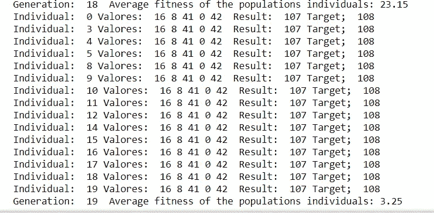

现在让我们通过使用 Github 上可用的实现将它应用于神经网络:【https://github.com/jliphard/DeepEvolve

让我们克隆一个 git 存储库，它已经实现了 GA 来进化神经网络的超参数和架构:

```
!rm -rf DeepEvolve
!git clone [https://github.com/jliphard/DeepEvolve.git](https://github.com/jliphard/DeepEvolve.git)
```

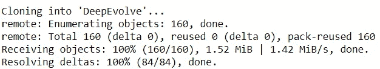

```
!ls
```

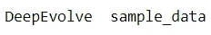

```
!pip install tqdm
```

看一看正在进行搜索以找到最佳组合的参数:

```
if dataset == 'mnist_cnn':
        generations = 8 # Number of times to evolve the population.
        all_possible_genes = {
            'nb_neurons': [16, 32, 64, 128],
            'nb_layers':  [1, 2, 3, 4 ,5],
            'activation': ['relu', 'elu', 'tanh', 'sigmoid', 'hard_sigmoid','softplus','linear'],
            'optimizer':  ['rmsprop', 'adam', 'sgd', 'adagrad','adadelta', 'adamax', 'nadam']
        }
```

现在我们将执行 GA:

```
!python DeepEvolve/main.py
```

# 最后的话

一如既往，我希望你喜欢这个帖子，并且你获得了关于如何优化你的神经网络参数的直觉！

*如果你喜欢这篇文章，那么你可以看看我关于数据科学和机器学习的其他文章* [*这里*](https://medium.com/@rromanss23) *。*

*如果你想了解更多关于机器学习、数据科学和人工智能的知识* ***请关注我的 Medium*** *，敬请关注我的下一篇帖子！*