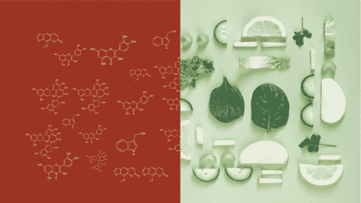
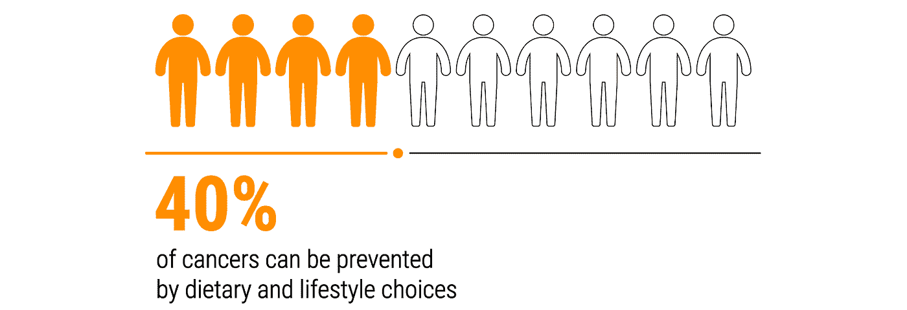
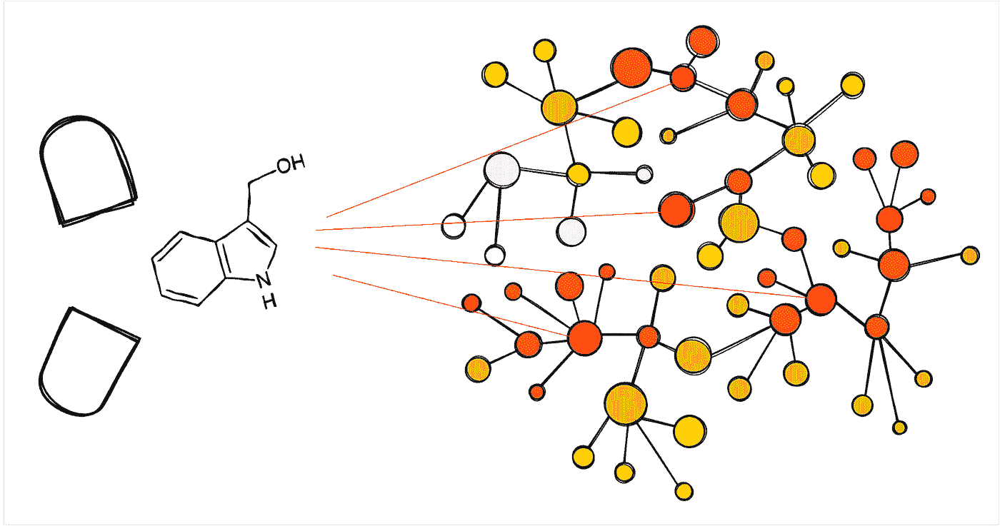
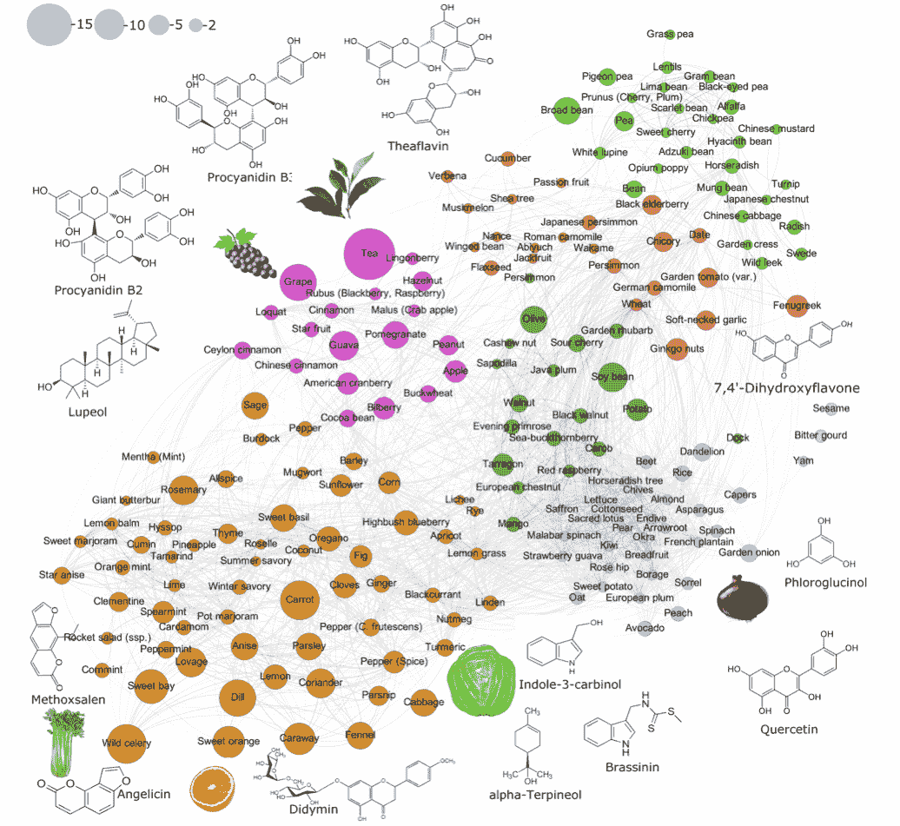
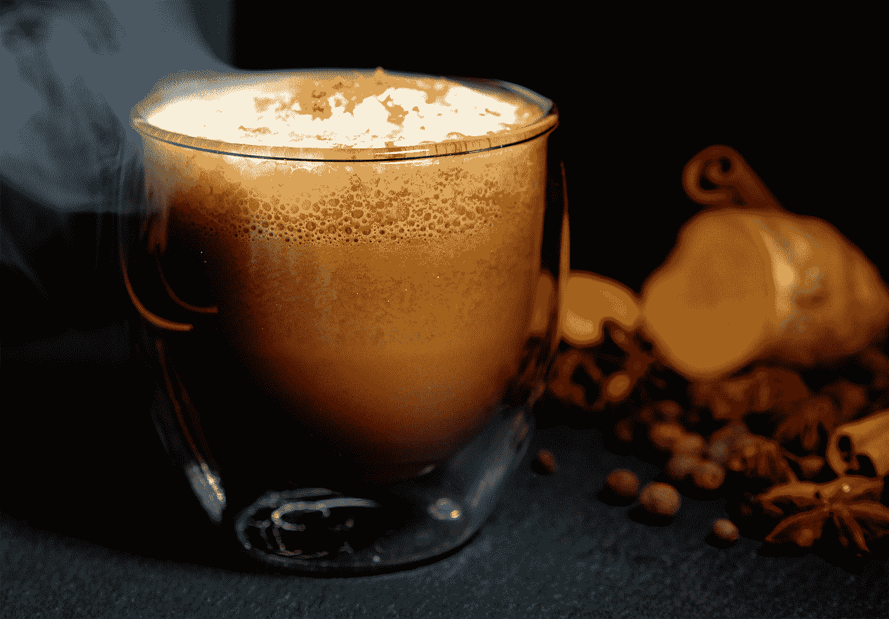
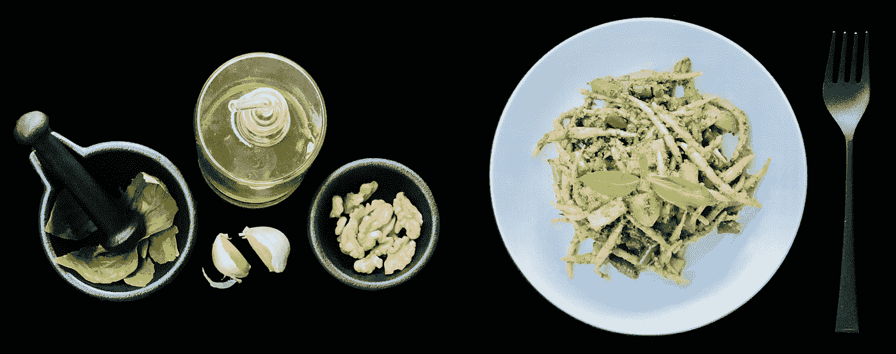
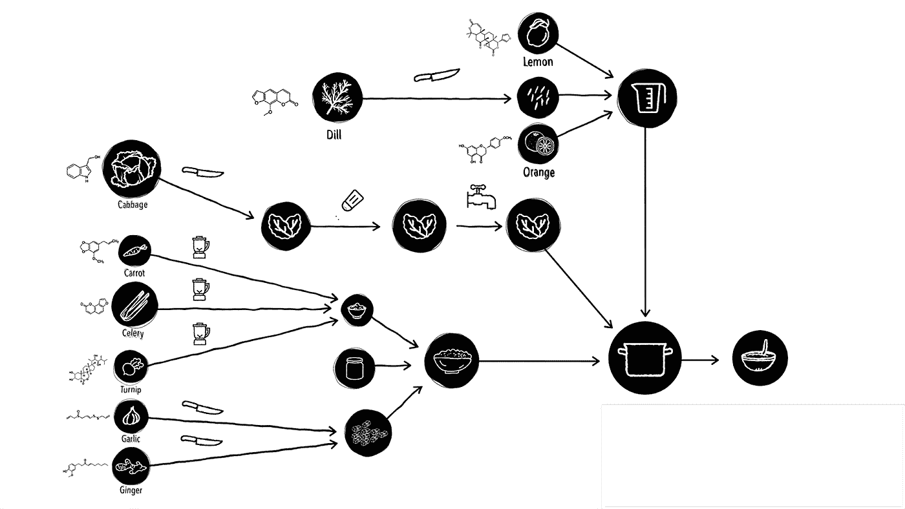

# 人工智能设计的“超级食物”可能有助于预防癌症

> 原文：<https://towardsdatascience.com/hyperfoods-9582e5d9a8e4?source=collection_archive---------17----------------------->

## 让食物成为你的良药

## *我们吃的食物含有成千上万的生物活性分子，其中一些类似于抗癌药物。现代机器学习技术可以发现这种成分，并帮助设计营养，让我们活得更长更健康。*

*插图:比安卡·达盖蒂。*

*本文与*[*Kirill Veselkov*](https://www.imperial.ac.uk/people/kirill.veselkov04)*和 Gabriella Sbordone 合著，基于《自然》杂志科学报告上发表的*[*TEDx Lugano 2019 talk*](https://www.youtube.com/watch?v=dTTJXTVi2l0)*和* [*论文*](https://www.nature.com/articles/s41598-019-45349-y) *。*

我们现在比以往任何时候都活得长。然而，我们并不一定生活得更健康:随着人口的快速老龄化，人们正在经历癌症、代谢、神经和心脏疾病等慢性疾病的持续增长。这使得医疗费用飞涨，给公共卫生系统带来了巨大压力[1]。

很大一部分问题在于糟糕的饮食选择。不健康的饮食杀死的不仅仅是香烟，而且是全球五分之一死亡的原因——2018 年，这相当于近 1100 万条生命。除了明显的罪魁祸首——不健康的高度加工食品——一个不太明显的杀手是健康食品的低摄入量，如全谷物、蔬菜、水果、坚果、种子和豆类[2]。

以癌症为例:正当地考虑现代社会的困境，它将在他们一生中的某一点上影响这篇文章的每一个读者。尽管前景似乎很悲观，但好消息是，仅通过饮食和生活方式的改变，就可以预防近 40%的肿瘤疾病[3]——这一发现鼓励我们更仔细地审视我们所吃的东西，因为饮食可能是癌症最重要的可变风险因素。

# 暗物质

在过去的几十年里，营养科学在分析影响人类健康和疾病的六大营养类别方面取得了卓越的进展:蛋白质、碳水化合物、脂肪、矿物质、维生素和水。国家营养数据库跟踪这些类别中的大约 150 种成分，它们出现在每个食品包装上。

然而，越来越多的证据表明，来自各种化学类别的数千种其他分子——如[多酚](https://en.wikipedia.org/wiki/Polyphenol)、[类黄酮](https://en.wikipedia.org/wiki/Flavonoid)、[萜类化合物](https://en.wikipedia.org/wiki/Terpenoid)和[吲哚](https://en.wikipedia.org/wiki/Indole)——可能有助于预防和对抗疾病，这些分子在植物中大量存在，通常是它们的颜色、味道和气味的天然原因[4]。这些化合物中的大多数仍然基本上没有被专家探索，没有被监管机构跟踪，也不为公众所知，因此名副其实地被称为“营养的暗物质”[5]。

每吃一口食物，我们都会把数百种这样的生物活性化合物放进嘴里。这些分子在我们吞下它们的那一刻就相互作用，随着食物被消化和代谢，还会与我们体内的其他生物分子和我们肠道中的数万亿细菌发生反应。

植物性食物中发现的许多化合物与药物属于同一类化学物质。因此，几乎一半被批准用于抗癌治疗的小分子来自天然产物就不足为奇了。这些药物通常耐受性更好，对健康细胞的毒性更小[6]。

# 药物和食物

传统药物分子旨在结合与特定疾病过程相关的生物分子靶标，其中最重要的涉及蛋白质[7]。经典药物治疗遵循“一种疾病-一种药物-一个靶点”的范式，试图确定一种与疾病相关的“可用药”蛋白质，该蛋白质可以被药物靶向。事实上，药物很少如此具有选择性[8]，蛋白质之间复杂的相互作用网络(或“图形”)产生了一种“网络效应”，可以干扰多种生物过程——就像一张倒下的多米诺骨牌撞掉一整排。

蛋白质-蛋白质相互作用(PPIs) [9]被认为是下一代治疗靶点，大多数制药行业现在已经将其药物发现计划扩展到 PPIs [10]。为了利用现代高通量技术产生的大量分子相互作用数据，机器学习(ML)变得越来越重要。然而，与图像和音频信号不同的是，ML 在过去十年中取得了突破性的成果，网络结构化数据需要一种不同类型的方法，称为“图形 ML”。

Graph ML，也称为“图形表示学习”或“几何深度学习”，是机器学习领域最近的一个热门话题，我在我的[走向数据科学博客](https://towardsdatascience.com/graph-deep-learning/home)中对此进行了广泛的介绍。典型的图形 ML 架构，称为*图形神经网络*在图形上实现某种形式的消息传递，允许不同的节点交换信息。在最简单的公式中，消息传递采取线性扩散或图中“随机漫步”的形式[11]。

在去年发表在《自然科学报告》杂志上的一篇[论文](https://www.nature.com/articles/s41598-019-45349-y)中，我们应用 graph ML 利用蛋白质-蛋白质和药物-蛋白质相互作用图来寻找食物中的抗癌分子【12】。药物与蛋白质的相互作用被表示为 PPI 图上的信号，一个可学习的扩散过程被用于模拟药物的网络效应。

*一种药物通常会影响多个蛋白质靶点(显示为红色)。作为蛋白质相互作用的结果，药物效应波及到生物网络的其他部分(显示在橙色阴影中)。*

我们使用了一个由近 2000 种临床批准的药物组成的训练集，其中约有 10%被标记为抗癌药物，以便训练一个分类器，通过新分子与 PPI 图的相互作用来预测新分子的抗癌药物相似性。然后，我们将大约 8000 种已知蛋白质相互作用的基于食物的分子输入训练好的分类器。我们的模型确定了一百多种抗癌药物样候选物，我们称之为“抗癌分子”。使用 ML 方法的主要优势在于，可以利用大量公开可用的数据集自动发现这些分子。

然后，我们再次求助于机器学习，使用自然语言处理(NLP)技术从医学文献中挖掘已识别分子抗癌效果的实验证据[13]。我们还必须排除毒性过大的化合物。这是依赖于已报道的*体外*和*体内*实验的第一个验证步骤。

# 好东西

关于食物基化合物的现有文献的一个关键限制是它集中于特定的化合物，例如抗氧化剂*孤立的*。你肯定见过被誉为富含抗氧化剂的食物，并且经常以“超级食物”的标签销售。然而，尽管经常食用这类食物可以降低癌症形成的风险(“致癌”)，但其中所含的抗增殖剂在单独作用时似乎并不能始终如一地提供相同水平的益处[14]。

这种现象类似于在医疗实践中同时使用多种药物(技术上称为“多种药物”)，这通常会导致不良副作用以及比每种药物单独使用更强的协同作用[15]。因此，某些食物的抗癌效果是生物活性物质组合的结果，并由它们的拮抗和协同作用以及它们同时作用于不同致癌生物机制的方式决定。

茶和柑橘类水果是满足这两个条件的食物的例子:首先，它们含有多种由我们的 ML 模型确定并从医学文献中证实的抗癌药物样化合物，其次，这些化合物发挥互补的抗癌作用[16]。

食物地图:每个节点是一种食物，它的大小代表抗癌分子的数量。两个节点之间的联系反映了这些食物分子特征的相似性，使我们能够根据它们的分子组成对食物进行分类。图来自[12]。

有了这种认识，我们构建了超过 250 种不同食物成分的抗癌分子图谱，突出了我们称为“超食物”的突出冠军。除了前面提到的茶和柑橘，卷心菜、芹菜和鼠尾草都是相当常见、便宜和容易买到的超级食物。从某种意义上来说，这并不奇怪，因为营养专家提倡这些食物是健康的选择，而且有大量证据表明它们对健康有益。

*姜黄香料热巧克力由厨师约瑟夫·优素福根据他的新* [*超食物食谱*](http://kitchen-theory.com/portfolio-item/hyperfoods-machine-intelligent-mapping-of-cancer-beating-molecules-in-foods/) *设计。图片来源:厨房理论。*

然而，读完这篇文章后，不要急着做卷心菜奶昔，因为你可能会失望——大多数情况下，它会很难吃。我们仍然缺少最后一步，将超食物成分整合到味道和外观都很棒的食谱中。这就是我们利用 Jozef Youssef 的帮助的地方，他是[厨房理论](http://kitchen-theory.com/)【17】的创始人和主厨赞助人，他用我们的 hyperfood 原料创造了简单、实惠、美味的[食谱](http://kitchen-theory.com/portfolio-item/hyperfoods-machine-intelligent-mapping-of-cancer-beating-molecules-in-foods/)。事实上，超级食物不仅仅是米其林餐厅的常客和高级美食的粉丝的专利:许多简单、传统的日常食谱已经包含了抗癌成分。

核桃酱黑麦面包含有许多超食物成分。这道菜是我们在卢加诺 *的* [*TEDx talk 上展示的意大利-瑞士 hyperfood 菜单的一部分。菜肴和图片来源:加布里埃拉·斯博多内。*](https://www.youtube.com/watch?v=dTTJXTVi2l0)

# 后续步骤

我们还需要记住，食物烹饪涉及物理和化学过程，可能会改变其分子内容。例如，如果我们在高温下油炸我们的原料，许多抗癌分子可能会消失。我们可以将食物制备表示为一个计算图，烹饪转换建模为边，并通过选择以最佳方式保留抗癌分子成分的操作来优化它。

第二，除了抗癌分子，食物还含有赋予食物味道、气味和独特风味的分子[18]。许多食物都有多种这样的成分:例如，你会惊讶地发现大蒜和茶有一百多种共同的味道分子。食物搭配的秘诀是将具有相似或互补风味分子特征的成分组合在一起[19]。被认为是顶级厨师的某种“黑魔法”现在可以自动化了——我们可以潜在地使用 graph ML 来生成食谱，在健康、味道甚至美学之间取得最佳平衡。有一天，我们电脑生成的食谱甚至会挑战米其林星级厨师，这并非不可能。

最后但并非最不重要的一点是，当谈到品味时，唯一共同的真理是，正如拉丁谚语所说的那样。食谱设计必须高度个性化，考虑到个人的口味偏好，以及许多其他参数，如饮食限制、遗传、病史和肠道微生物群。我们设想未来每个人都将拥有一个存储个人营养数据的数字“[食物护照](https://www.imperial.ac.uk/news/188371/could-personalised-food-passports-help-boost/)”，这样当你在网上订餐或外出就餐时，你的膳食将根据你的健康和食物状况进行优化。

# 最后的想法

Hyperfoods 首次尝试应用基于图形的 ML 方法，通过模拟食品中生物活性分子与我们体内生物分子相互作用的“网络效应”来预测其对健康的影响。graph ML 方法的使用使我们能够确定哪些食物中含有的成分可能与医学药物的作用方式相似，并有可能预防或战胜疾病。虽然癌症是一类重要的疾病，但同样的方法可以用于发现有助于预防神经退行性疾病、心血管疾病或病毒性疾病的食物[21]。

从更长远的角度来看，我们的目标是在如何“规定”、设计和准备我们的食物方面提供一个巨大的飞跃——让我们所有人过上更健康、更幸福、更美好的生活。

[1] M. J. Prince 等人,《老年人的疾病负担及其对健康政策和实践的影响》( 2015 年),《柳叶刀》385:549–562。

[2] GBD 2017 饮食合作者，[195 个国家饮食风险的健康影响](https://www.thelancet.com/article/S0140-6736(19)30041-8/fulltext) (2019)，Lancet 393:1958–1972 发现，1100 万例死亡可归因于饮食风险因素，其中 300 万例是由于全谷物摄入量低，200 万例是由于水果摄入量低。相比之下，T2 世卫组织估计烟草每年杀死 800 万人。

[3] M. S. Donaldson，[营养与癌症:抗癌饮食证据综述](https://nutritionj.biomedcentral.com/articles/10.1186/1475-2891-3-19) (2004)，营养杂志 3，估计 30%-40%的癌症可以仅通过生活方式和饮食措施来预防，并建议坚持建议的饮食指南(包括十字花科蔬菜、亚麻籽和水果的推荐摄入量)可能导致乳腺癌、结肠直肠癌和前列腺癌减少 60%-70%，肺癌减少 40%-50%，以及类似的减少

[4]实验研究表明，这些分子参与多种机制，有助于预防或治疗各种癌症，包括调节炎症介质和生长因子的活性，抑制癌细胞存活、增殖和侵袭，以及血管生成和转移。例如，参见 A. K. Singh 等人，膳食植物化学物质在对抗癌症中的新兴重要性:在靶向癌症干细胞中的作用(2017)，食品科学和营养学评论 57:3449-3463 或 R. Baena Ruiz 和 P. Salinas Hernandez，膳食植物化学物质的癌症化学预防:流行病学证据(2016)，Maturitas 94:13-19。

[5]这种与物理学中的“[暗物质](https://en.wikipedia.org/wiki/Dark_matter)的类比出现在 R. R. da Silva 等人的《代谢组学中的暗物质》(2015)，PNAS 112(41):12549–12550 以及 A.-L. Barabási 等人的《我们饮食中未映射的化学复杂性》(2019)，《自然食品》1:33–37 中。

[6]许多药物来源于植物，这常常反映在它们的名称中:例如，麻黄素得名于植物属*麻黄*，阿托品取自颠茄属植物*颠茄*，乙酰水杨酸，俗称阿司匹林，取自柳树皮*白柳*，其药性自古就为人所知。在肿瘤医学中，突出的例子是天然化合物[喜树碱](https://en.wikipedia.org/wiki/Camptothecin)的类似物，它是从*喜树*中提取的，在传统医学中也是众所周知的。四种这样的分子——拓扑替康、伊立替康、贝洛替康和曲妥珠单抗 deruxtecan——被广泛用于癌症化疗。D. J. Newman 和 G. M. Cragg，1981 年至 2014 年(2016 年)天然产物作为新药的来源，《天然产物杂志》79(3):629–661 报道，几乎一半的抗癌疗法源自天然产物。

[7]蛋白质是活细胞的动力源泉，从字面上看是“生命分子”，因为我们目前还不知道任何不是以蛋白质为基础的生命形式。在我们的身体中，蛋白质负责催化化学反应(酶)，为组织提供结构(胶原蛋白)，运输氧气(血红蛋白)，保护我们免受病原体(抗体)的侵害，等等。蛋白质是在细胞中通过一种特殊的化学机制合成的，这种机制读出遗传密码并将其翻译成氨基酸序列:称为“[密码子](https://en.wikipedia.org/wiki/Genetic_code)的 DNA 核苷酸短序列编码 20 种蛋白质氨基酸。我们的基因组中编码了大约 20，000 种蛋白质，这些蛋白质相互作用，并与其他分子相互作用。由于蛋白质在生物化学过程中的关键作用，它们被用作药物靶标:典型的药物是小分子，其设计方式使得它们可以化学附着(“结合”)到特定的蛋白质上。

[8]据估计，一个药物分子可以结合近 50 种蛋白质，参见 B. Srinivasan 等人[对八种蛋白质的 FINDSITE(comb)虚拟配体筛选结果的实验验证产生了新的纳摩尔和微摩尔结合物](https://pubmed.ncbi.nlm.nih.gov/24936211/) (2014)，Cheminformatics 6:16，因此一种药物-一个靶标的假设与现实相差甚远。

[9]蛋白质-蛋白质相互作用是“[网络医学](https://en.wikipedia.org/wiki/Network_medicine)”中利用的图表的一个例子，该术语由 A.-L. Barabási 在《网络医学——从肥胖到“疾病体”(2007)，新英格兰医学杂志 357:404–407 中创造并普及。

[10] A. Mullard，蛋白质-蛋白质相互作用抑制剂进入凹槽(2012)。自然评论药物发现 11(3):173–175 称 PPI 目标为“未开采的黄金储备”。大环是药物样小分子的一个例子，它破坏蛋白质-蛋白质相互作用并加速癌细胞死亡。尽管它们的治疗相关性和未开发的丰富性，但它们的采用受到技术障碍的阻碍，参见 T. L. Nero 等人，致癌蛋白质界面:小分子，大挑战(2014)，自然评论癌症 14(4):248-262 和 D. E. Scott 等人，小分子，大目标:药物发现面临蛋白质-蛋白质相互作用的挑战(2016)，自然评论药物发现 15:533-550。

[11]参见 M. M. Bronstein 等人的[几何深度学习:超越欧几里德数据](https://arxiv.org/abs/1611.08097) (2017)，IEEE Signal Processing Magazine 34(4):18–42 和我的[关于这个主题的博文](https://towardsdatascience.com/graph-deep-learning/home)。

[12] K. Veselkov 等人， [HyperFoods:食品中抗癌分子的机器智能图谱](https://www.nature.com/articles/s41598-019-45349-y) (2019)，科学报告 9。

[13]关于癌症的科学文献数量巨大，平均每 3 到 4 分钟就有一篇论文发表,即使是最勤奋的人类科学家也无法消化。我们使用了 D. Galea 等人早期开发的用于命名实体识别的 NLP 系统，[开发和评估用于监督生物医学命名实体识别的多源数据](https://academic.oup.com/bioinformatics/article/34/14/2474/4925744) (2018)，生物信息学 34(14):2474–2482。我们论文的[补充材料](https://static-content.springer.com/esm/art%3A10.1038%2Fs41598-019-45349-y/MediaObjects/41598_2019_45349_MOESM1_ESM.pdf)提供了在食物中发现的化合物的详细列表以及它们抗癌作用的实验证据。

[14]苹果是一个很好的例子，说明为什么人们必须考虑多种化合物的拮抗或协同作用:苹果提取物含有生物活性化合物，已被证明在体外抑制肿瘤细胞生长*。然而，这种效果因苹果皮是否保存而有很大差异:带皮的苹果抑制结肠癌细胞增殖达 43%,而不带皮的苹果仅抑制 29%,参见 M. V. Eberhardt 等人的《新鲜苹果的抗氧化活性》( 2000 年), Nature 405:903–904。*

*[15] M. Zitnik 等人，[用图卷积网络对多药副作用建模](https://academic.oup.com/bioinformatics/article/34/13/i457/5045770) (2018)，生物信息学 34(13):457–466，将图 ML 应用于蛋白质-蛋白质和蛋白质-药物相互作用图，以预测多药的[副作用](https://news.stanford.edu/2018/07/10/ai-predicts-drug-pair-side-effects/)。*

*[16]茶是儿茶素(表没食子儿茶素没食子酸酯)、萜类化合物(羽扇豆醇)和单宁(原花青素)的丰富来源，它们分别通过保护活性氧化物质诱导的 DNA 损伤、抑制炎症、诱导凋亡和癌细胞周期停滞而发挥强大的互补抗癌作用。最近的几项荟萃分析表明，饮用绿茶可延迟癌症发作，降低治疗后癌症复发率，并增加长期癌症缓解率，参见 V. Gianfredi 等人[绿茶饮用与乳腺癌和复发风险-观察性研究的系统综述和荟萃分析](https://www.mdpi.com/2072-6643/10/12/1886) (2018)，营养素 10，以及 Y. Guo 等人:[绿茶与前列腺癌风险:](https://journals.lww.com/md-journal/Fulltext/2017/03310/Green_tea_and_the_risk_of_prostate_cancer__A.17.aspx) (2017)，医学 96(13)。第二个例子是甜橙，这是一种柑橘类水果，含有化合物 dydimin(柑橘类黄酮)、obacunone(柠檬苦素样葡萄糖)和β-榄香烯，以其强抗氧化、促凋亡和化学敏化作用而闻名。S. Cirmi 等人[的《柑橘类果汁及其提取物的抗癌潜力:临床前和临床研究的系统综述》](https://www.frontiersin.org/articles/10.3389/fphar.2017.00420/full) (2017)，药理学前沿 8。*

*[17]我第一次见到基里尔是在 2015 年的[世界经济论坛](https://www.weforum.org/press/2015/09/world-economic-forum-honours-its-2015-young-scientists-community-at-annual-meeting-of-the-new-champions/)会议上。我们很快成为朋友，部分是因为我们共同的俄罗斯背景，然后在我 2018 年加入帝国理工学院时成为同事。基里尔是在 2018 年[计算与食品](https://www.imperial.ac.uk/news/188371/could-personalised-food-passports-help-boost/)未来的会议上认识乔泽夫的。Jozef 是厨房理论(Kitchen theory)的主厨赞助人，这是一家看起来像化学实验室的高端餐厅，客人们被邀请参加心理物理实验，比如一边听着嘎吱嘎吱的声音一边吃水母(这改变了对食物味道的感知)。*

*[18] [FlavorDB](https://cosylab.iiitd.edu.in/flavordb/) 是一个在线资源，允许我们探索近 1000 种食物中超过 25000 种风味分子的含量。*

*[19] Y.-Y. Ahn 等，[风味网络与食物搭配原则](https://www.nature.com/articles/srep00196) (2011)。科学报告 1 通过分析共享风味分子图显示，西方烹饪倾向于使用具有共同风味化合物的配料对，而东亚烹饪倾向于避免共享化合物的配料。*

*[20]我们并不是第一个致力于自动菜谱生成的人:已经做了多次尝试，最著名的是 [IBM 认知烹饪](https://www.ibm.com/blogs/research/2014/03/cognitive-cooking-applying-computational-creativity-to-recipe-generation/)项目。然而，据我所知，我们是第一个超越味道并试图解释生物活性分子的人。*

*[21]graph ML 的使用在针对新疾病重新调整现有药物的用途方面似乎非常有前途([药物重新定位](https://en.wikipedia.org/wiki/Drug_repositioning))，这可以显著降低开发新疗法的成本和时间。作为药物和冠状病毒项目的一部分，我们目前正在使用沃达丰分布式计算平台寻找食品和现有药物组合中的抗病毒化合物，这些化合物可能对癌症和新冠肺炎有治疗作用。我还担任医药创业公司 [Relation Therapeutic](https://www.relationrx.com) 的科学顾问，该公司与 [Mila](https://mila.quebec/en/) 和[盖茨基金会](https://www.gatesfoundation.org/)合作，将 graph ML 与主动学习技术相结合，寻找针对新冠肺炎的[组合疗法。](https://markets.ft.com/data/announce/detail?dockey=600-202009010447BIZWIRE_USPRX____BW5503-1)*

*非常感谢费比诺·弗拉斯卡、卢卡·斯博多内和大卫·西尔弗对这篇文章的校对。Hyperfoods 是帝国理工学院的一个项目，由 Kirill Veselkov 领导，与沃达丰基金会和厨房理论合作。这篇文章无意作为医学建议:食物和疾病之间的关系仍然是一个新兴的研究领域，仍然缺乏系统的临床验证。厨师 Jozef Youssef 的食谱可在第一本 [*Hyperfoods 食谱*](http://kitchen-theory.com/portfolio-item/hyperfoods-machine-intelligent-mapping-of-cancer-beating-molecules-in-foods/) *中在线获得。关于图形深度学习的其他文章，请参见我的* [*博客*](https://towardsdatascience.com/graph-deep-learning/home) *关于走向数据科学，* [*订阅*](https://michael-bronstein.medium.com/subscribe) *我的帖子，获取* [*中等会员*](https://michael-bronstein.medium.com/membership) *，或者关注我的*[*Twitter*](https://twitter.com/mmbronstein)*。**