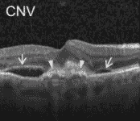
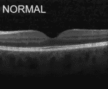
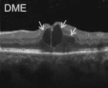
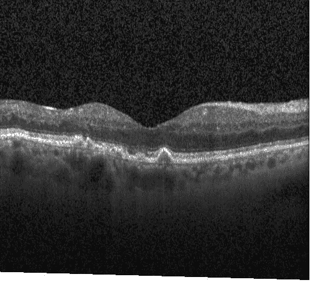
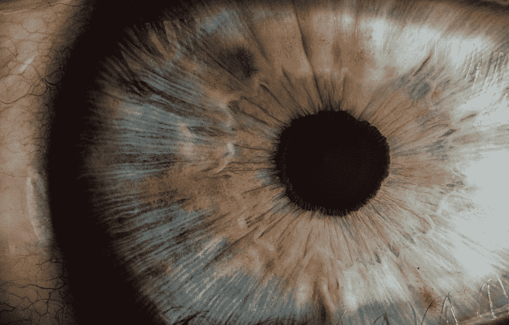

# 用于视网膜 OCT 图像分类的超参数分析

> 原文：<https://towardsdatascience.com/hyperparameter-analysis-for-classification-of-retinal-oct-images-94254f67d914?source=collection_archive---------50----------------------->

## 通过使用 Monk，一个低代码深度学习工具和计算机视觉的统一包装器，使您的分类模型更好

超参数是在系统的训练过程之前指定的预定义参数。这些参数通常包括时期数、学习率和优化器等。它们识别机器学习模型的整体属性，并且可以被调整以控制机器学习算法的行为。

因此很容易猜测，设置最佳超参数意味着从您的模型中获得最大收益。通常，超参数优化涉及独立的过程，如 GridSearchCV 和 RandomizedSearchCV。在这里，我将向您展示优化超参数的最简单方法，使用 Monk 库中的内置函数。



CNV 受影响的眼睛的十月

视网膜光学相干断层扫描(OCT)是一种用于捕捉活着的患者的视网膜的高分辨率横截面的成像技术，并且这些图像的分析和解释占用了大量时间。我们的工作是将这些 OCT 图像分类为正常或 3 种疾病类型之一，即玻璃疣、CNV 或 DME。

# 目录

1.  **安装**
2.  **建立模型**
3.  **超参数分析**
4.  **验证和推理**

# 装置

安装 Monk，一个低代码深度学习工具，也是计算机视觉的统一包装器。

**注意 *:*** *我将在 Kaggle 上运行我的笔记本，我将使用的数据集是*[https://www.kaggle.com/paultimothymooney/kermany2018](https://www.kaggle.com/paultimothymooney/kermany2018)*因此我将安装来自 Monk 的 Kaggle 需求。如果您希望在启用 CUDA 的系统上运行它，那么您应该安装 cu9 需求或 cu10 需求*

```
*# Cloning the monk repository*
$ git clone [https://github.com/Tessellate-Imaging/monk_v1.git](https://github.com/Tessellate-Imaging/monk_v1.git)*# Installing the dependencies for Kaggle required by Monk*
$ pip install -r monk_v1/installation/Misc/requirements_kaggle.txt
```

如果您想在自己的系统上运行它，请将第二行替换为，

```
*# Installing the dependencies for CUDA 9 required by Monk*
$ pip install -r monk_v1/installation/Linux/requirements_cu9.txt*# Installing the dependencies for CUDA 10 required by Monk*
$ pip install -r monk_v1/installation/Linux/requirements_cu10.txt
```

# 建立模型

首先，我们将为我们的模型选择后端，在这种情况下，我将使用 MXNet 后端，

```
$ from gluon_prototype import prototype
```

然后，我们继续为我们的培训、测试和验证数据集定义路径。在我的例子中，它们在我的 Kaggle 工作目录中，在你的例子中，只需将路径粘贴到数据集中相应的文件夹中。

现在我们需要初始化我们的 Monk 原型，它将为项目建立一个工作目录

```
$ gtf = prototype(verbose=1)
$ gtf.Prototype("Retina-OCT", "Hyperparameter-Analyser")
```

现在可以用期望的基本模型、时期数和训练数据的位置来设置原型

```
$ gtf.Default(dataset_path=train_path,
           model_name="densenet121",
           freeze_base_network=False,
           num_epochs=5)
```

总之，设置的代码应该如下所示



**正常眼的 OCT 对比 DME 患眼的 OCT**

# 超参数分析

转到主要焦点，优化我们模型的超参数。调整超参数对模型的性能有明显的影响，因此优化是必要的。

我们将使用 Monk 的内置超参数分析仪，这使我们的工作变得非常容易。首先，给分析项目起一个名字，并定义您想要分析的所有超参数。

在 Monk 的内置超参数分析器中，您可以选择分析以下超参数:

1.  **学习率** : *控制模型适应问题的速度*
2.  **批量** : *指训练*的一次迭代中抽取的样本数
3.  **优化器** : *更新权重参数以最小化损失函数*

您还可以分析历元数、输入大小和基础模型。

```
# Analysis Project Name$ analysis_name = "analyse_hyperparameters"
$ lrs = [0.1, 0.05, 0.01, 0.005, 0.0001] # learning rates
$ batch_sizes = [2, 4, 8, 12] # Batch sizes
$ models = [["densenet121", False, True], ["densenet169", False, True], ["densenet201", False, True]] # models
$ optimizers = ["sgd", "adam", "adagrad"] # optimizers
$ epochs=10 # number of epochs
$ percent_data=5 # percent of data to use
```

要分析每个超参数，使用内置函数开始分析，并输入与该超参数对应的列表。因此，如果您从学习率的分析开始，输入将是学习率列表 *lrs*

```
*# Analysis of learning rates*
$ analysis = gtf.Analyse_Learning_Rates(analysis_name,lrs,
           percent_data,num_epochs=epochs, state="keep_none")
```

所以为了分析所有的超参数

# 验证和推理

现在我们的模型已经完全优化了，我们可以用它来验证和推断我们的验证和测试数据集。

当然，在这之前，我们需要训练我们的模型。Monk 中的训练过程再简单不过了，它只是一行代码。

```
$ gtf.Train()
```

在等待该培训完成后，我们可以继续获取该模型的准确性。因此，我们再次初始化我们的原型，但是这次用 *infer-eval* 标志为真，这样模型就处于预测模式。

```
# Set flag eval_infer as True 
$ gtf = prototype(verbose=1)
$ gtf.Prototype("Retina-OCT","Hyperparameter-Analyser", 
              eval_infer = True)
```

加载验证数据集，对整个数据集运行预测并显示结果

```
# Load the validation dataset 
$ gtf.Dataset_Params(dataset_path=val_path)
$ gtf.Dataset()# Run validation
$ accuracy, class_based_accuracy = gtf.Evaluate()
```

现在，我们将对测试图像运行一个样本推断，然后对整个测试数据集进行预测

```
# Running sample inference$ img_name = test_path +"/DRUSEN/DRUSEN-1786810-3.jpeg"
$ predictions = gtf.Infer(img_name=img_name)#Display 
$ from IPython.display import Image
$ Image(filename=img_name)# Load the test dataset
$ gtf.Dataset_Params(dataset_path=test_path)
$ gtf.Dataset()# Run inference on test data
$ accuracy, class_based_accuracy = gtf.Evaluate()
```

推断和验证的完整代码看起来有点像这样

# 结果

优化后的模型给出了惊人的结果，在验证数据集上的准确率为 *100%* ！

```
Result
        class based accuracies
            0\. CNV - 100.0 %
            1\. DME - 100.0 %
            2\. DRUSEN - 100.0 %
            3\. NORMAL - 100.0 %
        total images:            32
        num correct predictions: 32
        Average accuracy (%):    100.0
```

这是一个关于测试图像的示例推断，

```
Prediction
    Image name:         ../input/kermany2018/OCT2017 /test/DRUSEN/DRUSEN-1786810-3.jpeg
    Predicted class:      DRUSEN
    Predicted score:      5.612982273101807
```



玻璃疣受累眼的 OCT

在测试数据集上给出了 99.17% 的准确率。

你可以在 [Kaggle](https://www.kaggle.com/synysterjeet/retinal-oct-classification-using-monkai/) 上找到完整的笔记本

如果有任何问题，可以联系 [Abhishek](https://www.linkedin.com/in/abhishek-kumar-annamraju/) 和 [Akash](https://www.linkedin.com/in/akashdeepsingh01/) 。请随意联系他们。

我是 [Monk](https://github.com/Tessellate-Imaging/Monk_Object_Detection) Libraries 的开源贡献者。



由 [Unsplash](https://unsplash.com/s/photos/eye?utm_source=unsplash&utm_medium=referral&utm_content=creditCopyText) 上的 [v2osk](https://unsplash.com/@v2osk?utm_source=unsplash&utm_medium=referral&utm_content=creditCopyText) 拍摄的照片