# 最佳变压器模型的超参数优化

> 原文：<https://towardsdatascience.com/hyperparameter-optimization-for-optimum-transformer-models-b95a32b70949?source=collection_archive---------15----------------------->

## 如何使用简单的转换器调整超参数，以实现更好的自然语言处理。


格伦·汉森在 [Unsplash](https://unsplash.com?utm_source=medium&utm_medium=referral) 拍摄的照片

任何深度学习模型的目标都是接受输入并生成正确的输出。这些输入和输出的性质在不同的应用程序之间有很大的不同，这取决于模型应该执行的特定工作。例如，狗品种分类模型可以将图像作为其*输入*，并生成狗品种的名称(或对应于该品种的数字标签)作为*输出。*另一个模型可能接受一条狗的文本描述作为其*输入*，并生成狗的品种名称作为其*输出*。第一个模型是*计算机视觉*模型的一个例子，而后者是*自然语言处理(NLP)* 模型的一个例子。

## 参数与超参数

这两个模型的内部都将包含许多花哨的部分(卷积层、注意力机制等)。)，每个都是为他们的特定任务量身定制的。从高层次的角度来看，所有这些组件构成了一组*参数*(或*权重*)，它们决定了任何给定输入的输出。训练深度学习模型是为这些*参数*寻找一组值的过程，这些值在给定的任务中产生最佳结果。

相比之下，*超参数*是控制训练过程本身的因素。*学习速率*、训练时期/迭代次数和*批量*是常见*超参数*的一些例子。为*超参数*选择的值对学习到的*参数*有重大影响，并进而影响模型的性能。

简而言之，*参数*是模型学习的内容，*超参数*决定了模型学习的好坏。

## 超参数优化

就像我们有各种技术来训练模型*参数*，我们也有方法找到最佳*超参数*值。寻找最佳*超参数*值的过程是**超参数优化**，该过程使模型能够发现执行给定任务的最佳*参数组*。

作为一个松散的类比，考虑超频一个 CPU。通过优化电压、温度、时钟频率等。*(超参数)*，你可以在不改变 CPU 架构*(型号)*，或者 CPU 的组件*(型号的参数)*的情况下，让 CPU 以更高的速度运行。

知道了什么是超参数优化，您可能想知道在训练模型时是否需要它。毕竟，我们中的许多人都不会考虑超频我们的 CPU，因为它们通常开箱即用。就像现代的 CPU 一样，最先进的深度学习模型即使没有超参数优化，通常也能表现良好。只要你坚持*明智的默认*，SOTA 预训练模型结合迁移学习的力量足以产生一个性能令人满意的模型。

但是，当您认为“足够好”还不够好时，超参数优化是您工具箱中的一个重要工具，可以帮助您的模型走得更远。

# 简单变压器的超参数优化

[Simple Transformers](https://github.com/ThilinaRajapakse/simpletransformers) 是一个库，旨在使变压器模型的训练和使用尽可能简单。根据这一想法，它通过 [W & B](https://www.wandb.com/) 扫描特性为超参数优化提供了本机支持。

简单的变形金刚是建立在令人难以置信的变形金刚库之上的，拥抱脸为 NLP 的普及做出了巨大的贡献！

本文将重点关注使用简单的 Transformers 库，以及 W&B 扫描，对识别 [SuperGLUE](https://super.gluebenchmark.com/) [2】基准的[文本蕴涵](https://aclweb.org/aclwiki/Recognizing_Textual_Entailment) [1】任务执行超参数优化。任务是对句子对进行二元分类，如下所述。

> [**文本蕴涵**](https://aclweb.org/aclwiki/Textual_Entailment) 识别最近被提出作为一种通用任务，其捕获许多 [NLP](https://aclweb.org/aclwiki/index.php?title=Natural_Language_Processing&action=edit&redlink=1) 应用的主要语义推理需求，例如[问题回答](https://aclweb.org/aclwiki/index.php?title=Question_Answering&action=edit&redlink=1)、[信息检索](https://aclweb.org/aclwiki/index.php?title=Information_Retrieval&action=edit&redlink=1)、[信息提取](https://aclweb.org/aclwiki/Information_Extraction)和[文本摘要](https://aclweb.org/aclwiki/Text_Summarization)。这个任务需要识别，给定两个文本片段，一个文本的含义是否是从另一个文本中推导出来的。
> 
> — [识别文本蕴涵](https://aclweb.org/aclwiki/Recognizing_Textual_Entailment) —

在本指南中，我们将执行三项主要任务来强调超参数优化的价值，并了解如何定制优化流程。

1.  用*合理的默认值*训练一个模型。
2.  进行扫描以优化*基本超参数*。
3.  进行扫描以获得更多*高级超参数优化*。

对于每项任务，我们将在 RTE 数据集上训练 RoBERTa-Large [3]模型。让我们设置好开发环境并下载数据集，这样我们就可以开始培训了！

## 设置

1.  从[这里](https://www.anaconda.com/distribution/)安装 Anaconda 或 Miniconda 包管理器。
2.  创建新的虚拟环境并安装软件包。
    `conda create -n simpletransformers python pandas tqdm wandb`
    `conda activate simpletransformers`
    `conda install pytorch cudatoolkit=10.2 -c pytorch` *注意:选择您系统上安装的 Cuda 工具包版本。*
3.  如果您使用 fp16 培训，请安装 Apex。请遵循此处[的说明](https://github.com/NVIDIA/apex)。
4.  安装简单的变压器。
    `pip install simpletransformers`

## 数据准备

1.  从[这里](https://dl.fbaipublicfiles.com/glue/superglue/data/v2/RTE.zip)下载数据。
2.  将档案文件解压到`data/`。(应包含 3 个文件，`train.jsonl`、`val.jsonl`、`test.jsonl`)

下面给出的函数可用于读取这些`jsonl`文件，并将数据转换成简单的变压器[输入格式](https://simpletransformers.ai/docs/classification-data-formats/#sentence-pair-data-format)(带有三列`text_a, text_b, labels`的熊猫数据帧)。

因为我们将在许多地方使用这个函数，所以将它添加到项目根目录下的文件`utils.py`中，这样就可以根据需要导入它。

RTE 数据集包含三个子数据集。

1.  训练集(带标签)-用于训练模型。
2.  验证集(已标记)—用于验证(超参数优化、交叉验证等)。)
3.  测试集(未标记)-可以提交对该集进行的预测进行评分。

为了避免提交预测来测试我们的最终模型，我们将把验证集分成两个随机部分，一个用于验证(`eval_df`)，另一个用于测试(`test_df`)。

运行上面显示的`data_prep.py`文件将创建`eval_df`和`test_df`，我们将使用它们来验证和测试我们的模型。

# 用合理的默认值训练模型

有了经验，大多数人倾向于对重要的*超参数*以及哪些值对那些*超参数*有效产生直觉。根据我的经验，在 NLP 任务中训练 Transformer 模型时要考虑的两个最重要的超参数是*学习速率*和*训练时期数。*

训练太多的历元或使用太高的*学习率*通常会导致*灾难性遗忘*，模型通常会对任何给定的输入生成相同的输出/标签。另一方面，训练历元数量不足或太低的*学习率*会导致低于标准的模型。

我对这两个超参数的定位值通常是`5e-5`和`2`的*学习率*或`3`或*训练时段*(我增加了较小数据集的训练时段数量)。

然而，当我在 RTE 数据集上应用这些值训练模型时，我发现我的直觉让我失望了。该模型最终预测所有输入的标签相同，这表明*学习率*过高。将*学习率*降低到`1e-5`足以避免这个问题。

下面的脚本展示了如何用*合理的默认值*训练一个模型。

*关于* `*model_args*` *属性的详细信息，可以根据需要参考变形金刚的简单文档(* [*此处*](https://simpletransformers.ai/docs/usage/#configuring-a-simple-transformers-model) *和* [*此处*](https://simpletransformers.ai/docs/classification-models/#configuring-a-classification-model) *)。*

由于 RTE 任务使用*准确性*作为 SuperGLUE 基准测试中的度量，我们也将这样做。

使用*可感知的默认*超参数值，该模型达到了 **0.8116** 的精度。模型的混淆矩阵如下所示。

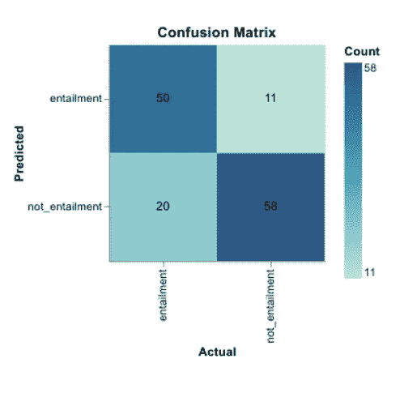

用合理的默认值训练的模型的混淆矩阵

*您还可以在这里* *看到完整的训练进度以及其他指标* [*。*](https://app.wandb.ai/thilina/RTE%20-%20Hyperparameter%20Optimization/runs/1bxg7keb?workspace=user-thilina)

还不错，不过还是看看超参数优化能做什么吧。

# 基本超参数优化

简单变压器中的 W&B Sweeps [4]集成简化了超参数优化过程。

可以通过 Python 字典定义扫描配置，该字典指定要优化的度量、要使用的搜索策略和要优化的超参数。

*我强烈推荐浏览* [*文档*](https://simpletransformers.ai/docs/usage/#hyperparameter-optimization) *了解更多关于如何配置扫描的信息。*

对于我们的基本超参数优化，我们将关注与前面部分相同的两个超参数，即*学习率*和*训练时期数*。

扫描配置可定义如下。

*注意:你可以使用简单变压器模型的* [*配置选项*](https://simpletransformers.ai/docs/usage/#configuring-a-simple-transformers-model) *中的任何一个作为扫描时要优化的参数。*

这里，我们使用`bayes`(贝叶斯优化)搜索策略来优化超参数。

> 贝叶斯优化使用高斯过程来模拟函数，然后选择参数来优化改进的概率。
> 
> — [W & B 文档](https://docs.wandb.com/sweeps/configuration#search-strategy)

我们想要优化的指标是`accuracy`，目标显然是最大化它。请注意，要优化的指标必须记录到 W & B 中。

需要优化的参数是`learning_rate`和`num_train_epochs`。这里，学习率可以取从`0`到`4e-4`的任何值，而训练时期的数量可以是从`1`到`40`的任何整数。

W&B 扫描还可以通过终止任何表现不佳的运行来加速超参数优化(`early_terminate`)。这使用了超波段算法，如这里的[所解释的](https://docs.wandb.com/sweeps/configuration#stopping-criteria)。

扫描的最后一个要求是一个函数，可以调用该函数用一组给定的超参数值来训练模型。

该函数将初始化`wandb`运行，建立简单的 Transformers 模型，训练模型，最后同步结果。

当前运行的一组超参数值包含在`wandb.config`中，可以传递给一个简单的变压器模型。所有简单的变形金刚模型都接受一个`sweep_config`关键字参数，并将根据传递给`sweep_config`的`wandb.config`自动更新`model_args`。

我们还确保在训练模型时，在验证集(`eval_df`)上计算`accuracy`指标。简单转换器中的所有`eval_model()`和`train_model()`方法都接受由指标名和指标函数名组成的关键字参数。这里用来计算`eval_df`上的`accuracy`。*(更多信息在* [*文档*](https://simpletransformers.ai/docs/usage/#additional-evaluation-metrics) *)*

将所有这些放在一个 Python 文件中，我们得到了下面的脚本。

现在我们让它跑吧！

W&B 仪表板提供了许多图表和可视化效果，其中包含了大量有价值的信息。下图描绘了在扫描过程中(48 次运行约 13 小时)每个模型获得的精度。

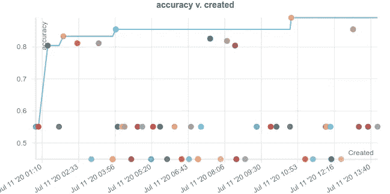

[准确度 vs 创造的](https://app.wandb.ai/thilina/RTE%20-%20Hyperparameter%20Optimization/sweeps/10e2ucii?workspace=user-thilina)

根据达到的精度对这 48 次运行进行细分，我们得到以下结果:

*   10 次运行获得的准确度*大于* **0.8**
*   23 次运行达到了*精确到*0.5507 的精度
*   15 次运行达到的精度为*精确到*0.4493

这些结果可能看起来有点奇怪(使用*精确的*相同的准确度分数进行多次运行)，直到您考虑到这样一个事实，即当使用错误的*超参数*值进行训练时，变压器模型可能会完全崩溃。这导致模型对任何输入预测相同的标签，解释具有相同准确度分数的模型(由于测试集中不平衡的标签，有两种可能的准确度)。

这个假设在参数[重要性](https://docs.wandb.com/app/panels/parameter-importance)可视化中得到证实。

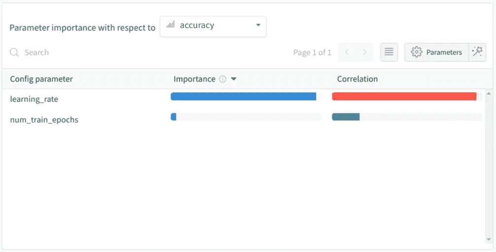

基本超参数优化的参数重要性

这里，我们有两个超参数对最终精度的影响。`learning_rate`与准确度有很高的负相关性，因为高学习率导致模型预测所有输入的标签相同。

下面的平行坐标图证实了同样的理论。

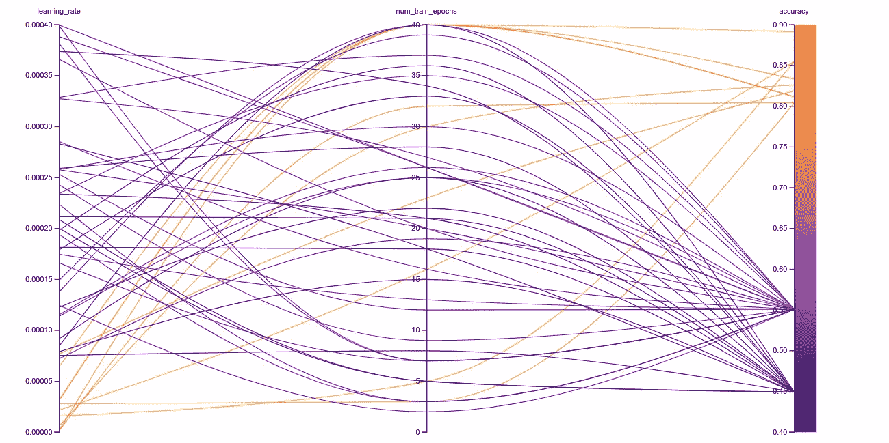

基本超参数优化的平行坐标图

专注于准确度高于 0.8 的运行进一步强化了这一想法。

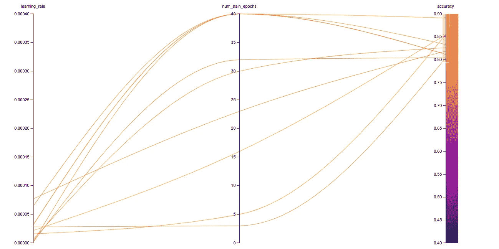

基本超参数优化的平行坐标图(精度> 0.8)

有趣的是，当在这个范围内使用*学习率*值时，训练时期的*数量*也开始发挥更重要的作用。

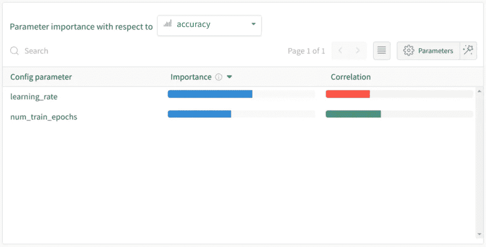

基本超参数优化的参数重要性(精确度> 0.8)

在这里随意挖掘扫描结果[！](https://app.wandb.ai/thilina/RTE%20-%20Hyperparameter%20Optimization/sweeps/10e2ucii?workspace=user-thilina)

现在，让我们看看用这些超参数训练的模型在测试集上的表现。

*提醒:模型在训练集上训练，扫描在验证集(* `*eval_df*` *)上评估，最终模型(使用最佳超参数值)将在测试集(* `*test_df*` *)上评估。*

该脚本使用扫描过程中在`eval_df`上产生最佳精度的超参数值。

```
learning_rate = 0.00003173
num_train_epochs = 40
```

用这些超参数值训练的模型获得了 **0.8768** 的精度，比*敏感默认值*模型( **0.8116** )有了显著提高。

查看测试集预测的混淆矩阵:

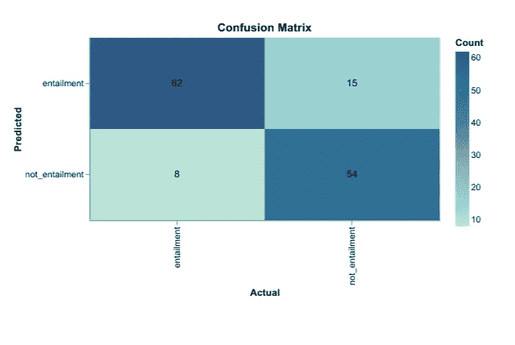

用基本超参数优化训练的模型的混淆矩阵

显然，我们的超参数优化取得了成效！

*您还可以在这里* *看到完整的训练进度以及其他指标* [*。*](https://app.wandb.ai/thilina/RTE%20-%20Hyperparameter%20Optimization/runs/1epxu37u?workspace=user-thilina)

# 高级超参数优化

在上一节中，我们看到了*学习率*在一个经过训练的模型的性能中起着至关重要的作用。具有太高的*学习率*会导致模型损坏，而训练具有太低的*学习率*的模型会导致模型拟合不足或模型陷入局部最小值。

这个难题的一个潜在解决方案依赖于这样一个事实，即*学习率*似乎并不平等地影响模型的所有部分。例如，添加在 Transformer 模型层之上的*分类层*在更高的*学习速率下更不容易被破坏。*这可能是因为*分类层*在微调预训练模型时被随机初始化。即*分类层*不是预训练层，因此没有任何获得的知识会因*灾难性遗忘而丢失。*另一方面，*分类层*更有可能陷入局部最小值(具有低*学习率*)，这正是因为它是随机初始化的。

当比较*学习速率*对早期层和后期层的影响时，可以观察到相同的现象，尽管程度较低(且一致性较低)。早期层比最终层更容易发生灾难性遗忘。

对于简单的变压器，我们可以为变压器模型中每个名为*的*参数定义[不同的学习速率](https://simpletransformers.ai/docs/usage/#custom-parameter-groups-freezing-layers)。方便的是，我们还可以为模型中的任何给定层设置*学习速率*(RoBERTa-LARGE 为 24 层)。让我们看看是否可以将这一特性与我们对*学习率*的影响的了解结合起来，以推动我们的模型达到更好的性能。**

*虽然我们可以尝试分别优化每一层的*学习速率*，但我选择将这些层捆绑成四个相等的组，每个组包含六个连续的层。这将使我们更容易看到扫描结果，也可能使扫描更容易优化超参数，因为变量更少。*

*RoBERTa 模型的*分类层*有四个命名的*参数*，每个参数将被单独优化。或者，这些也可以组合成一个组(这可能是更合理的选择)，但是出于演示的目的，我将它们分开。*

**提示:所有简单的变形金刚模型都有一个* `*get_named_parameters()*` *方法，该方法返回模型中所有参数名称的列表。**

*同样，我们将从设置扫描配置开始。*

*我们正在使用从基本超参数优化中获得的见解，为变压器模型层的*学习率*设置一个较小的最大值，同时为*分类层参数*提供更多的余地。*

***关于使用自定义参数组和改编自文档的简单变压器的快速补充说明:***

*简单变形金刚模型的`model_args`(在本例中是一个`ClassificationArgs`对象)有三个与配置自定义*参数*组相关的属性。*

1.  *`custom_layer_parameters`*
2.  *`custom_parameter_groups`*
3.  *`train_custom_parameters_only`*

## *自定义图层参数*

*`custom_layer_parameters`为给定层或层组设置(PyTorch)优化器选项更加方便。这应该是一个 Python 字典列表，其中每个字典包含一个`layer`键和任何其他与优化器接受的关键字参数匹配的可选键(例如`lr`、`weight_decay`)。`layer`键的值应为指定层的`int`(必须是数字)(如`0`、`1`、`11`)。*

*例如:*

## *自定义参数组*

*`custom_parameter_groups`提供最精细的配置选项。这应该是一个 Python 字典列表，其中每个字典包含一个`params`键和任何其他与优化器接受的关键字参数匹配的可选键(例如`lr`、`weight_decay`)。`params`键的值应该是一个命名参数列表(例如`["classifier.weight", "bert.encoder.layer.10.output.dense.weight"]`)。*

*例如:*

## *仅训练自定义参数*

*`train_custom_parameters_only`选项仅用于方便特定参数的训练。如果`train_custom_parameters_only`设置为`True`，则只训练`custom_parameter_groups`或`custom_layer_parameters`中指定的参数。*

***返回超参数优化:***

*虽然您可以使用简单变压器模型中可用的任何配置选项作为要优化的超参数，但 W&B Sweeps 目前不支持具有嵌套参数的配置。这意味着配置选项中预期的数据类型是集合(字典、列表等。)不能在扫描配置中直接配置。但是，我们自己可以轻松处理这个逻辑。*

*查看我们之前定义的`sweep_config`，我们可以观察到没有一个参数是嵌套的，尽管我们想要具有相同*学习速率的多个层。**

*扫描将为配置中定义的每个参数提供一个值(每次运行)。我们将在扫描的`train()`函数中把它转换成简单转换器所期望的格式。*

*选择`sweep_config`中的参数名称是为了使转换相对简单。*

*   *层组的名称格式为`layer_<start_layer>-<end_layer>`。*
*   *参数组(分类器参数)的名称格式为`params_<parameter name>`。*

*基于这个命名约定，让我们看看如何解析`sweep_config`来提取适当的超参数值。*

*首先，我们获取分配给当前运行的超参数值。这些可以通过 Sweep 的`train()`方法中的`wandb.config`对象来访问。幸运的是，我们可以将`wandb.config`转换成易于解析的 Python 字典。*

*我们还移除了`_wandb`键，并将其他字典条目重新排列成从*参数*名称到其当前值的直接映射。*

*接下来，我们遍历字典中的每一项，并以简单转换器所期望的格式构建一个字典。最后，我们用字典值更新`model_args`(一个`ClassificationArgs`对象)。*

*将所有这些整合到一个 Python 脚本中，我们就可以开始比赛了！*

*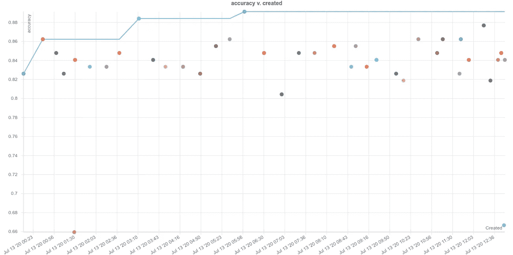*

*[精确度与为高级超参数优化创建的](https://app.wandb.ai/thilina/RTE%20-%20Hyperparameter%20Optimization/sweeps/nx4f206f?workspace=user-thilina)*

*在高级超参数优化扫描中，四十(40)次运行中有三十八(38)次达到了高于 **0.8** 的精度(相比之下，基本优化中为 48 次运行中的 10 次)。*

*当我们包括所有运行时，平行坐标图有点难以可视化，但我们可以专注于单个组以获得更清晰的图片。*

*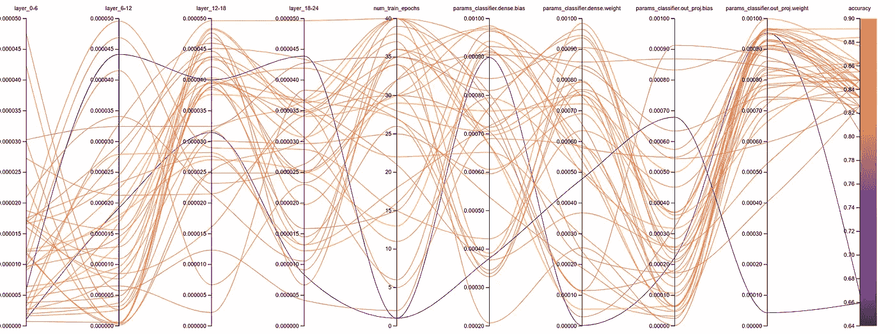*

*高级超参数优化的平行坐标图*

*我推荐你亲自去看看平行图([这里](https://app.wandb.ai/thilina/RTE%20-%20Hyperparameter%20Optimization/sweeps/nx4f206f?workspace=user-thilina))，因为它有许多互动功能，比单独的图像更好地可视化扫描。*

## *第 0 层至第 6 层*

*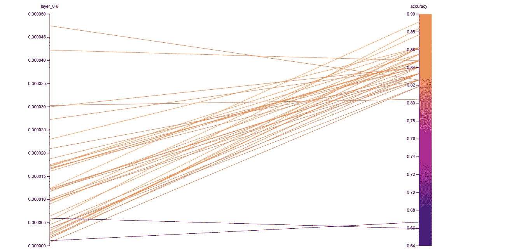*

*0–6 层的平行坐标图*

## *第 6 至 12 层*

*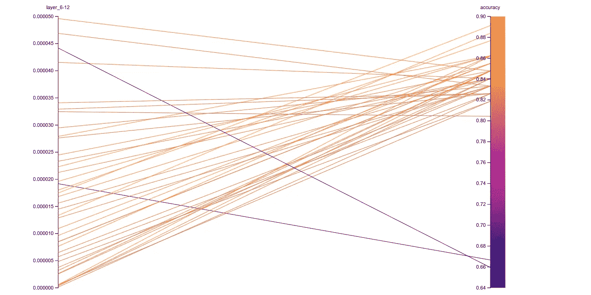*

*第 6-12 层的平行坐标图*

## *第 12 至 18 层*

*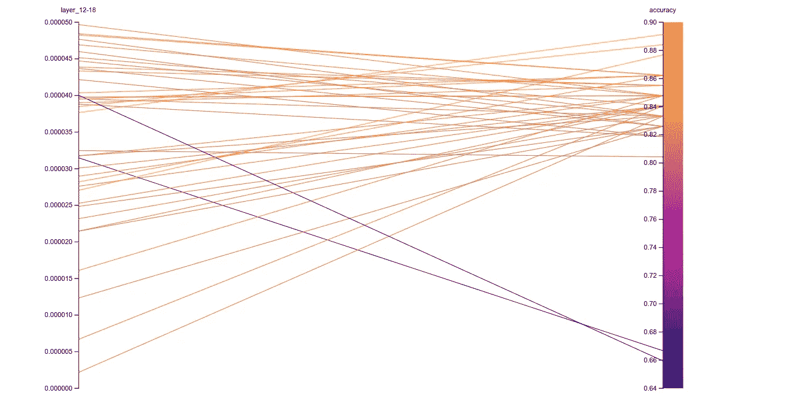*

*12-18 层的平行坐标图*

## *第 18 至 24 层*

*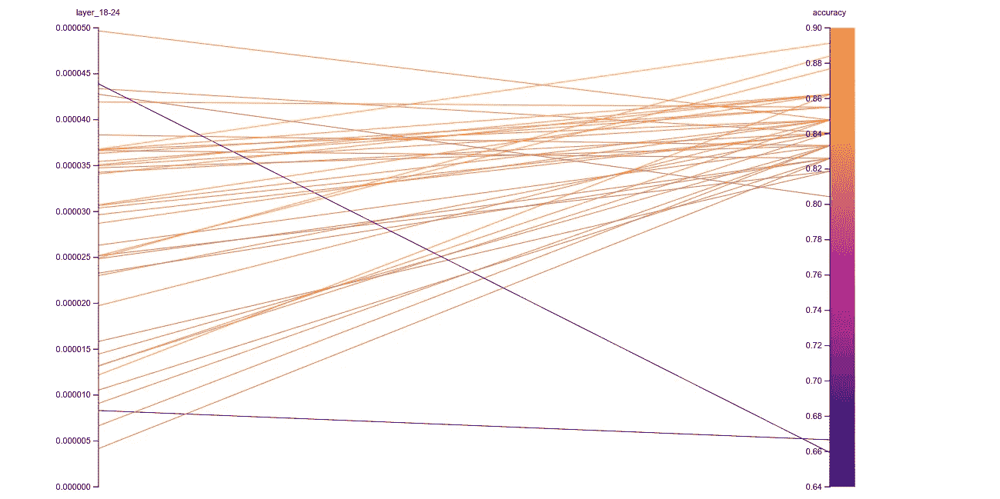*

*18-24 层的平行坐标图*

## *精确度> 0.8 的运行的第 0-24 层*

*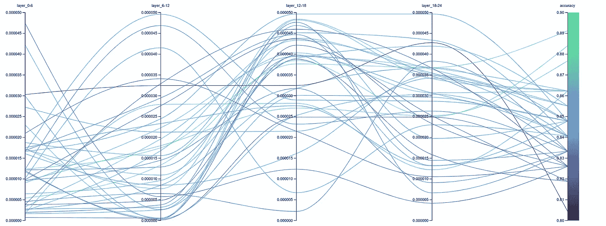*

*对于精度> 0.8 的运行，0-24 层的平行坐标图*

*虽然这个图确实有点嘈杂，但我们仍然可以看到，较好的模型(浅绿色)在 24 层的前半部分确实具有较低的*学习率*，而在另一半部分具有较高的*学习率*。*

## *精确度> 0.8 的运行的分类层*

*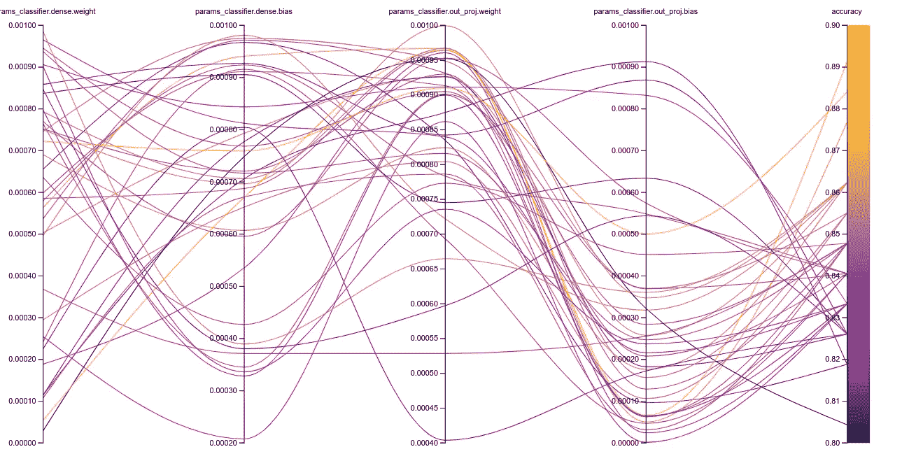*

*准确度> 0.8 的运行分类层的平行坐标图*

**分类层*的平行坐标图似乎比变压器模型层的图更嘈杂。这可能表明*分类层*相对更健壮，并且只要*学习率*足够高以避免陷入局部最小值，就可以学习良好的权重。*

*最后，让我们看看用从高级扫描中找到的最佳超参数训练的模型将如何在测试集上执行。*

*要下载包含最佳运行超参数的 CSV 文件，请转到 W&B 仪表板中的扫描表，搜索`deep-sweep`(最佳运行的名称)，然后单击下载按钮(右上角)。创建一个目录`sweep_results`并将 CSV 文件保存为`sweep_results/deep-sweep.csv`。*

*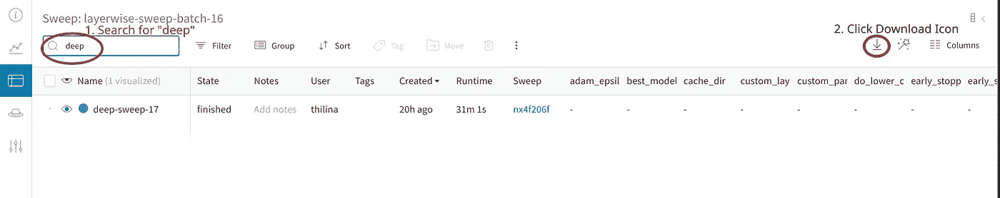*

*从最佳运行下载超参数值*

*下面的脚本将训练模型并根据测试集对其进行评估。*

*从`deep-sweep.csv`提取的超参数值如下所示。*

*该模型在测试集上的最终精度得分为 **0.8913** 。*

*查看测试集预测的混淆矩阵:*

*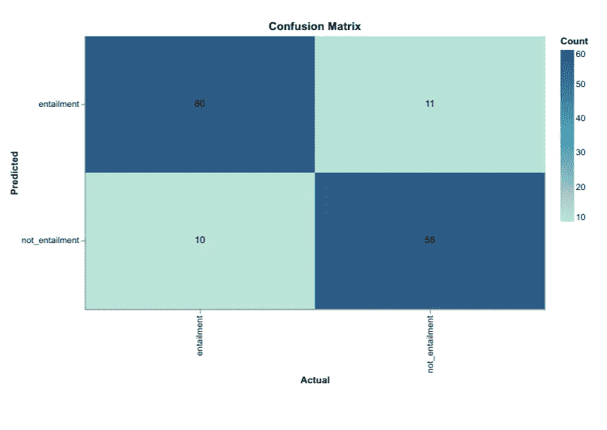*

*用高级超参数优化训练的模型的混淆矩阵*

*与从*基本超参数优化* vs *敏感默认值*(**0.8768**vs**0.8116】**)获得的精度增益相比，从*高级超参数优化* vs *基本超参数优化*(**0.8913**vs**0.8768】**获得的精度增益要小得多。然而，这仍然是对*基本超参数优化*的显著改进。*

# *结果*

## *准确(性)*

## *混淆矩阵*

# *总结*

*   *超参数优化可用于训练具有显著更好性能的模型。*
*   **学习速率*和*训练时期数*是训练变压器模型时要考虑的两个最关键的超参数。*
*   *通过对模型的不同层使用(并优化)不同的*学习速率*，可以进一步提高性能增益。*
*   *在任务复杂且模型难以学习的情况下，*高级超参数优化*可能会更加出色。*
*   *超参数调谐可用于找到临界*超参数*的良好值范围，然后可用于寻找更好的值。*
*   *如果您想阅读更多关于超参数调整和相关算法的内容，[这篇文章](https://neptune.ai/blog/hyperparameter-tuning-in-python-a-complete-guide-2020)非常值得一读！*

# ***参考文献***

*[1]詹皮科洛博士、马尼尼博士、达甘博士和多兰博士，2007 年。第三个帕斯卡认识到文本蕴涵的挑战。在*ACL-PASCAL 关于文本蕴涵和释义的研讨会会议录*(第 1-9 页)。*

*[2]王敬实、亚大·普鲁克萨奇昆、尼基塔·南吉亚、阿曼普里特·辛格、朱利安·迈克尔、菲利克斯·希尔、奥梅尔·利维和塞缪尔·鲍曼 2019。强力胶:通用语言理解系统的一个更棘手的基准。 *arXiv 预印本 1905.00537* 。*

*[3]刘，y .，奥特，m .，戈亚尔，n .，杜，j .，乔希，m .，陈，d .，列维，o .，刘易斯，m .，泽特勒莫耶，l .和斯托扬诺夫，v .，2019。Roberta:稳健优化的 bert 预训练方法。 *arXiv 预印本 arXiv:1907.11692* 。*

*[https://docs.wandb.com/sweeps](https://docs.wandb.com/sweeps)*