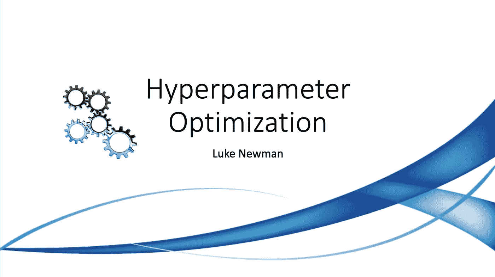
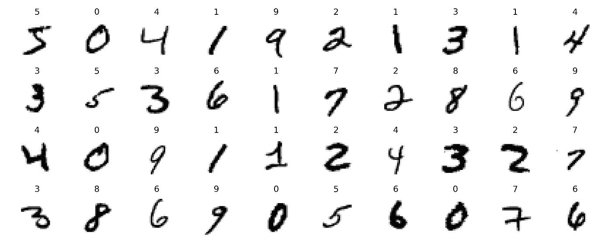
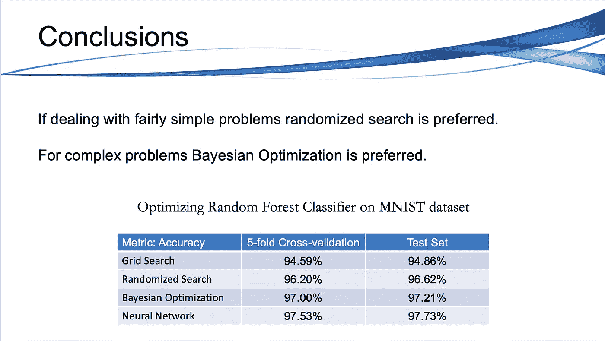

# 利用 Scikit-Learn、Scikit-Opt 和 Keras 优化超参数

> 原文：<https://towardsdatascience.com/hyperparameter-optimization-with-scikit-learn-scikit-opt-and-keras-f13367f3e796?source=collection_archive---------10----------------------->

## 探索使用网格搜索、随机搜索和贝叶斯优化来优化模型超参数的实用方法。



超参数优化通常是数据科学项目的最后步骤之一。一旦你有了一个有前途的模型的候选名单，你会想要微调它们，使它们在你的特定数据集上表现得更好。

在本文中，我们将介绍三种用于寻找最佳超参数的技术，并举例说明如何在 Scikit-Learn 中的模型上实现这些技术，最后介绍 Keras 中的神经网络。我们将讨论的三种技术如下:

*   网格搜索
*   随机搜索
*   贝叶斯优化

你可以在这里查看 jupyter 笔记本。

# 网格搜索

一种选择是手动调整超参数，直到找到优化性能指标的超参数值的最佳组合。这将是非常乏味的工作，你可能没有时间探索许多组合。

相反，你应该让 Scikit-Learn 的`GridSearchCV`为你做这件事。你要做的就是告诉它你要试验哪些超参数，要试验哪些值，它会用交叉验证来评估超参数值的所有可能组合。

让我们来看一个例子，在这个例子中，我们使用`GridSearchCV`为使用流行的 MNIST 数据集训练的 RandomForestClassifier 搜索超参数值的最佳组合。

为了让您对分类任务的复杂性有所了解，下图显示了 MNIST 数据集中的一些影像:



为了实现`GridSearchCV`,我们需要定义一些东西。首先是我们想要试验的超参数和我们想要尝试的值。下面我们在一本名为`param_grid`的字典中对此进行详细说明。

`param_grid`告诉 Scikit-Learn 评估指定的`bootstrap`、`max_depth`、`max_features`、`min_samples_leaf`、`min_samples_split`和`n_estimators`超参数的 1 x 2 x 2 x 2 x 2 x 2 = 32 种组合。网格搜索将探索 RandomForestClassifier 的超参数值的 32 种组合，并且它将训练每个模型 5 次(因为我们正在使用五重交叉验证)。也就是说，总而言之，会有 32 x 5 = 160 轮的训练！这可能需要很长时间，但完成后，您可以获得如下超参数的最佳组合:

```
forest_grid_search.best_params_
```

由于 n_estimators=350 和 max_depth=10 是评估的最大值，您可能应该尝试用更高的值再次搜索；分数可能会继续提高。

你也可以直接得到最佳估计量:

```
forest_grid_search.best_estimator_
```

当然，评估分数也是可用的:

```
forest_grid_search.best_score_
```

我们在这里的最好成绩是 94.59%的准确率，这对于这样一个小参数网格来说已经不错了。

# 随机搜索

当您探索相对较少的组合时，网格搜索方法很好，就像前面的例子一样，但是当超参数空间很大时，通常最好使用`RandomizedSearchCV`来代替。这个类的使用方式与`GridSearchCV`类非常相似，但是它不是尝试所有可能的组合，而是通过在每次迭代中为每个超参数选择一个随机值来评估给定数量的随机组合。这种方法有两个主要好处:

*   如果让随机搜索运行 1000 次迭代，这种方法将为每个超参数探索 1000 个不同的值(而不是网格搜索方法中每个超参数只有几个值)。
*   只需设置迭代次数，您就可以更好地控制分配给超参数搜索的计算预算。

让我们像以前一样浏览同一个例子，但是使用`RandomizedSearchCV`。由于我们使用了`RandomizedSearchCV`，我们可以搜索比使用`GridSearchCV`更大的参数空间:

同上，我们可以看到探索的最佳超参数:

```
forest_rand_search.best_params_
```

也是最好的评估者:

```
forest_rand_search.best_estimator_
```

并查看最佳分数:

```
forest_rand_search.best_score_
```

我们最好的表现是 96.21%的准确率，比`GridSearchCV`高出 1.5%。如你所见，`RandomizedSearchCV`允许我们在相对相同的时间内探索更大的超参数空间，并且通常比`GridSearchCV`输出更好的结果。

现在，您可以保存这个模型，在测试集上对它进行评估，如果您对它的性能满意，就可以将它部署到生产环境中。使用随机搜索并不太难，对于许多相当简单的问题来说，它工作得很好。

然而，当训练很慢时(例如，对于具有较大数据集的更复杂的问题)，这种方法将只探索超参数空间的很小一部分。您可以通过手动协助搜索过程来部分缓解这个问题:首先，使用大范围的超参数值运行快速随机搜索，然后使用以第一次运行中找到的最佳值为中心的较小范围的值运行另一次搜索，以此类推。这种方法有望放大一组好的超参数。然而，这非常耗费时间，而且可能不是对时间的最佳利用。

# 贝叶斯优化

幸运的是，有许多技术可以比随机更有效地探索搜索空间。他们的核心思想很简单:当空间的一个区域被证明是好的，它应该被更多地探索。这种技术为您处理“缩放”过程，并在更短的时间内产生更好的解决方案。

其中一种技术叫做贝叶斯优化，我们将使用 Scikit-Optimize(Skopt)[https://scikit-optimize.github.io/](https://scikit-optimize.github.io/)来执行贝叶斯优化。Skopt 是一个通用优化库，它使用一个类似于`GridSearchCV`的接口，用它的类`BayesSearchCV`执行贝叶斯优化。

如果您还没有安装 Skopt，请在您的虚拟环境中运行下面一行代码:

```
! pip install scikit-optimize
```

使用 Skopt 的`BayesSearchCV`进行贝叶斯优化有两个主要区别。首先，在创建你的搜索空间时，你需要把每个超参数的空间做成一个概率分布，而不是使用像`GridSearchCV`这样的列表。Skopt 通过他们的库 skopt.space 使这一点变得简单，它允许我们导入实数、整数和分类数来创建概率分布。

*   **实**:连续超参数空间。
*   **整数**:离散超参数空间。
*   **分类**:分类超参数空间。

下面你可以看到使用分类函数和整数函数的例子。对于分类空间，只需在函数中输入一个列表。对于整数空间，输入您希望`BayesSearchCV`探索的最小值和最大值。

函数`on_step`允许我们实现一种提前停止的形式，并在每次迭代后打印出分数。在这里，我们指定在每次迭代之后，我们要打印最好的分数，如果最好的分数大于 98%的准确度，就不再需要训练。

就像在 Scikit-Learn 中一样，我们可以查看最佳参数:

```
forest_bayes_search.best_params_
```

最好的估计是:

```
forest_bayes_search.best_estimator_
```

最好的成绩是:

```
forest_bayes_search.best_score_
```

贝叶斯优化让我们在与随机搜索相同的迭代次数下，将准确率提高了整整一个百分点。我希望这能说服你使用`GridSearchCV`和`RandomizedSearchCV`离开你的舒适区，尝试在你的下一个项目中实现像`BayesSearchCV`这样的新事物。超参数搜索可能会很繁琐，但是有一些工具可以为您完成这项繁琐的工作。

# 微调神经网络超参数

神经网络的灵活性也是其主要缺点之一:有许多超参数需要调整。您不仅可以使用任何可以想象的网络架构，而且即使在一个简单的 MLP 中，您也可以更改层数、每层神经元的数量、每层中使用的激活函数的类型、权重初始化逻辑等等。很难知道什么样的超参数组合最适合您的任务。

一种选择是简单地尝试超参数的许多组合，看看哪一个在验证集上效果最好(或者使用 K-fold 交叉验证)。例如，我们可以使用`GridSearchCV`或`RandomizedSearchCV`来探索超参数空间。为此，我们需要将 Keras 模型包装在模仿常规 Scikit-Learn 分类器的对象中。第一步是在给定一组超参数的情况下，创建一个将构建和编译 Keras 模型的函数:

此函数使用给定的输入形状和给定的隐藏层和神经元数量为多类分类创建一个简单的顺序模型，并使用配置了指定学习速率的 SGD 优化器对其进行编译。

接下来，让我们基于这个`build_model()`函数创建一个 KerasClassifier:

```
keras_clf = keras.wrappers.scikit_learn.KerasClassifier(build_model)
```

`KerasClassifier`对象是使用`build_model()`构建的 Keras 模型的一个薄薄的包装器。这将允许我们像使用常规 Scikit-Learn 分类器一样使用这个对象:我们可以使用它的`fit()`方法训练它，然后使用它的`score()`方法评估它，并使用它的`predict()`方法进行预测。

我们不想像这样训练和评估单个模型，我们想训练数百个变体，看看哪一个在验证集上表现最好。由于有许多超参数，最好使用随机搜索而不是网格搜索。让我们尝试探索隐藏层的数量、神经元的数量和学习率:

现在，我们可以像在 Scikit-Learn 中一样访问最佳参数、估计值和分数:

```
keras_rand_search.best_params_
```

```
keras_rand_search.best_score_
```

我们的准确率又提高了 0.5%！最后一步是观察每个模型在测试集上的表现(见下文)。

# 结论

超参数调整仍然是一个活跃的研究领域，目前正在产生不同的算法。但是在你的口袋里有基本的算法可以减轻许多寻找最佳超参数的繁琐工作。

请记住，随机搜索几乎总是比网格搜索更可取，除非您需要探索的超参数非常少。如果您在使用更大的数据集时遇到了更复杂的问题，您可能希望求助于一种更有效地探索搜索空间的技术，如贝叶斯优化。



一如既往，非常感谢任何反馈和建设性的批评。

如果您想查看演示幻灯片或 jupyter 笔记本，并在此处查看完整的代码和描述，请随意查看 Github 资源库。

## 额外资源

 [## scikit-optimize:Python-scikit-optimize 0 . 7 . 3 中基于顺序模型的优化…

### 编辑描述

scikit-optimize.github.io](https://scikit-optimize.github.io/stable/) 

这篇文章涵盖了两个不同的能够执行贝叶斯优化的库，绝对值得一看:

[](https://neptune.ai/blog/optuna-vs-hyperopt) [## Optuna vs Hyperopt:应该选择哪个超参数优化库？-海王星，我

### 思考应该选择哪个库进行超参数优化？使用远视有一段时间了，感觉像…

海王星. ai](https://neptune.ai/blog/optuna-vs-hyperopt) [](/a-conceptual-explanation-of-bayesian-model-based-hyperparameter-optimization-for-machine-learning-b8172278050f) [## 机器学习的贝叶斯超参数优化的概念解释

### 使用贝叶斯优化的高效超参数调整背后的概念

towardsdatascience.com](/a-conceptual-explanation-of-bayesian-model-based-hyperparameter-optimization-for-machine-learning-b8172278050f)