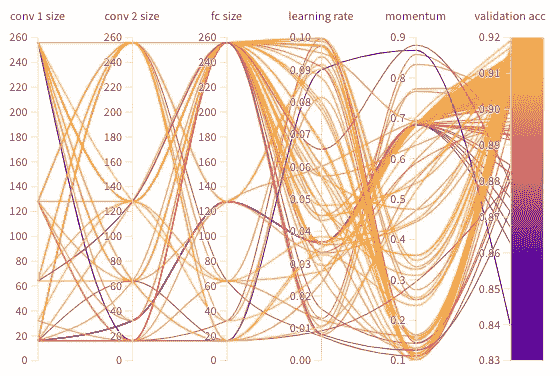
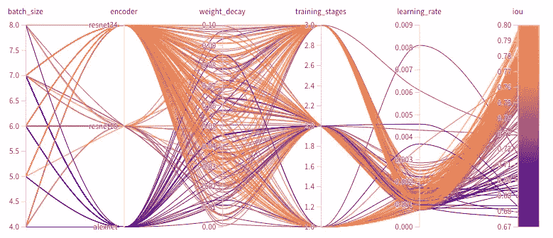
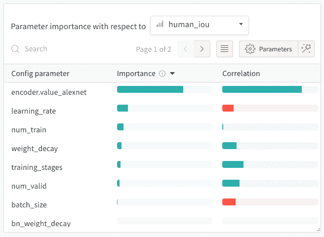

# 迭代扫描超参数搜索

> 原文：<https://towardsdatascience.com/hyperparameter-search-with-iterative-sweeps-3799df1a4d45?source=collection_archive---------42----------------------->

如何在深度学习模型上运行有效的超参数搜索，使用来自 Weights & Biases 的特定可视示例

我花了几年时间来复制和优化各种深度学习模型，主要是针对计算机视觉和 NLP，通常有极短的期限。我提炼的超参数搜索的高级策略是有界探索(用更少的变量尝试更大范围的值)和更快的迭代(更多的探索阶段建立在彼此之上)。我希望这个超参数搜索的概述可以帮助你更快地调整深度学习模型，不管你使用的是什么框架或工具。

# 什么是超参数搜索？

超参数搜索——或调整，或优化——是为学习算法寻找最佳超参数的任务。这种调整可以完全手动完成:运行一个受控实验(保持所有超参数不变，只有一个除外)，分析单个值变化的影响，基于此决定接下来要改变哪个超参数，运行下一个实验，并重复。当然，对于卷积或递归神经网络等深度学习算法来说，这将是非常缓慢的:每个实验(超参数值的一个组合)都需要端到端地训练模型。我们可以通过在手动搜索中使用 meta 来使这个过程更易于管理。

一个示例在权重和偏差 UI 中扫描工作空间。图片作者。

# 方法:手动、网格、随机

算法或自动化超参数调优的核心承诺是更明智地选择下一个实验。如果我们无论如何都需要为一系列不同的超参数尝试一系列不同的值，我们如何才能最佳地选择下一个组合——并运行更少的实验，浪费更少的计算资源，甚至更快地获得结果？这方面的标准方法是**网格**、**随机**和贝叶斯或**贝叶斯**(尽管您会听到这个领域中其他术语和策略的长尾效应，尤其是基于模型的优化)。网格搜索会尝试所有可能的组合——可以把它想象成一个嵌套的 for 循环，其中实验的总数大约是超参数的数量乘以每个超参数的可能值的数量。如果您的搜索空间很小，并且希望确保找到最佳选项，这将非常有用。随机搜索通常更快，如果你有更大的搜索空间，特别推荐使用随机搜索，因为它会对更大范围的组合进行采样，并比网格搜索更快地给你一种可能性的感觉。但是，不能保证找到最佳组合。

# 贝叶斯

贝叶斯优化建立了一个概率模型，或有根据的猜测，从您的超参数选择到您的性能的目标测量，通常是验证准确性的函数映射。您正在训练的实际模型的贝叶斯模型基于迄今为止看到的所有值和结果，预测接下来要尝试什么值。该过程旨在平衡探索-利用的权衡，根据预设的目标，尝试它不确定获得关于空间的更多信息的值和它期望接近最优的值。在实践中，贝叶斯优化比网格和随机更快，因为它运行的“坏”实验更少。贝叶斯确实需要目标度量来优化，这可以默认为模型的验证损失。你可以点击阅读[关于贝叶斯优化的更详细的介绍。](/a-conceptual-explanation-of-bayesian-model-based-hyperparameter-optimization-for-machine-learning-b8172278050f)

# 其他方法的长尾效应

其他方法包括基于梯度的优化，以明确地计算关于某些超参数的梯度，早期停止以避免在没有希望的运行上浪费时间，以及应用于连续的所选超参数集的进化优化。还有基于群体的训练，其中多个独立的过程同时学习超参数值和网络权重。这里有很多选项——包括[算法细节](https://medium.com/criteo-labs/hyper-parameter-optimization-algorithms-2fe447525903)和黑盒优化服务——我无法一一介绍。一旦你研究了这些细节和权衡，我会问自己，我是否已经考虑了我正在调优的特定模型和我正在解决的特定问题，并得出结论说我没有其他聪明的办法可以做——我只想用 GPU 来完成这项任务？如果是的话，我会建议使用一些优化，比如贝叶斯，因为这很可能会更快地工作，并去考虑其他事情。但是以我的经验来看，更有趣、更有挑战性、更有回报的超参数调整工作发生在*这个阶段之前*，我们还没有很好的算法来解决这个问题——这就是为什么我们中的许多人仍然从事机器学习的工作。因此，让我们深入了解这一部分！

# 超参数编码谱

在您开始尝试不同的超参数之前，您需要决定什么是超参数。在网络的常规参数和超参数之间有一个重要的区别，常规参数如模型权重和偏差，它们本身是学习的，或者在训练过程中反复改进，而超参数在训练过程之外配置，并且通常在其持续时间内是固定的(尽管有些可以是自适应的，如学习速率)。对于给定的网络，这些可以包括训练时期的数量、学习优化器类型、批量大小、权重衰减等等。网络架构本身可能是一个超参数:我是从像 Inception 或 ResNet 这样的知名基础网络开始的吗？相对于微调，我冻结了多少层？如果我正在从头开始设计一个网络，那么层的数量、大小、类型和连接模式，以及卷积中滑动窗口的维度，都可以是超参数。要决定给定的超参数是固定的还是可变的，您可能需要考虑如何提前预测它的影响，以及它将如何影响搜索的整体运行时间和复杂性。

# 纪元

epochs——或通过整个训练数据的次数——是一个非常好理解的超参数。当我运行重复的实验时，我希望将这个值设置得足够高，以看到明确的改进，但又不要高到在非常缓慢收敛的曲线上浪费时间。我通常尝试 10 次左右，如果我能逃脱的话——只要我能看到损失减少并开始渐近。看到验证损失的改善对于确保模型不仅仅是记忆训练数据是特别重要的。

# 资料组

你的训练数据的大小，以及你用多少例子来验证你的训练，是另一个被充分探索的超参数。假设您的数据和分割是有代表性的无偏样本，数据集越大，性能越好-当然，每个假设的测试时间也越长。我遵循 80/10/10 分割的传统智慧，在所有训练和调优完成之前保留 10%的数据，以获得模型泛化能力的最佳感觉。在手动模式下，我训练 80%，在每个时期后验证 10%。在实践中，每次 80%的实验训练和 10%的验证对于超参数搜索来说太慢了。我降低了这些要求，将每次分割的 20-50%作为每次实验的标准。我试图将一个实验的运行时间缩短到几分钟。

在每组实验运行之后——它们一起形成一个*扫描—* ,您可以使用完整的训练和验证集进行测试。希望观察到的模式保持不变，甚至可能略有增加。如果添加更多的数据没有帮助或伤害，我可能会适得其反，可能需要增加每次扫描所用数据的百分比。验证数据在这里尤其棘手，因为小得多的样本可能噪声太大，不具有代表性。一个解决方案是每次随机选择一个验证子集，记住，如果有的话，你正在解决一个更难的问题。

# 迭代扫描

对于超参数搜索过程来说，这是一个很好的框架:迭代扫描，或者在一个小的子集上重复调优阶段，然后在完整的训练和验证集上进行测试。在每一次扫描中，您可能隐含地决定，哪些超参数在代码中保持固定，哪些将通过改变它们来测试。因此，您的首要选择之一是一次改变多少:如果您对每个可能的设置进行扫描，或者如果您对一个超参数测试了太多的值，您需要等待几天才能得到结果。

# 可管理的探索

一般的策略是，尤其是在时间紧迫的情况下，从简单的架构或现有的最佳解决方案开始。运行一些手动测试来选择一个好的历元计数和训练/验证大小。尝试对一小组超参数(比如 3-10)进行探索性扫描。开始的超参数越多，这个阶段就越长。对于每个超参数，在更宽的范围内采样*更少的值*——即使一些运行失败，您也会对搜索空间有更好的感觉。在这一点上，我不会进入非常精确或不寻常的值——常见的默认值是好的，例如，批量大小为 2 的幂，并且每个超参数也不要太多——我可以在后面的扫描中缩小我的关注范围。

**调音的第一人选**

我发现，探索训练动态——网络学习的快慢——是一个可靠的第一关:在这里，你可以通过落入正确的范围来轻松获胜。例如，通过学习速率和批量大小，我可以只对几个值进行采样，以获得关于网络对该超参数的敏感度的大部分信息。获得正确的学习率数量级:比如说，0.01 比 0.001 比 0.0001，通常比获得 0.0001 比 0.00015 的完美值更有影响力。优化器将与学习速度和批量大小高度相关，但它们也会对收敛产生巨大影响，并且值得探索(例如，Adam 对于许多应用程序来说都很棒，但我见过 SGD 大大优于 Adam 的项目)。

**调整的下一个候选对象**

一旦我在训练动力学中为更容易的候选者设置了一些范围，我就挑选一些更高级的细节，比如层大小或过滤器的数量。总体网络架构很适合在这里探索，但我会避免一次进行太多的更改或一次尝试太多详细的假设，因为这样会产生更多的案例需要测试。例如，我会构建两个或更多的架构来捕捉我的想法之间的一般差异——比方说，一个常规的 RNN 和一个鸟瞰 RNN，或者一个具有最大与平均池的 CNN，并使用这些作为分类变量。另一种方法是参数化卷积块的数量。但是，如果一个超参数是卷积块的数量，另一个是每个卷积层中的滤波器数量，另一个是最大或平均池，我会遇到组合爆炸，我试图通过将这些扫描限制在紧凑、可管理的迭代来避免这种爆炸。在这一点上，辍学可以很好地测试，但通常是在我已经学得很好之后——当我在探索过程中过早地增加辍学时，我的跑步中有很大一部分根本没有学到很多东西。你可以在这里加入其他细节，比如体重衰减、学习率时间表、训练阶段、冻结层数等等。可能性是无穷无尽的，我的主要建议是，不要试图太快捕捉太多——首先坚持比你可能想要的更简单的扫描，然后看看你能学到什么。

# 保姆和被完成

你如何判断你的清扫表现如何，何时停止？我经常着迷地刷新我的终端输出，以查看缓慢运行的统计数据。有了像[权重&偏差](https://www.wandb.com/sweeps)这样的工具，这部分就更令人愉快了，因为我可以看到我的损耗和精度的实时图。尽管如此，这并不是对人类超参数调节能力的有效利用。对于我运行超参数扫描的任何模型，我已经验证了训练和验证损失通常会减少，并且训练和验证准确性(或任何其他性能指标)通常会增加。一旦您调试了代码，并且确定扫描运行正确，并且在某个地方记录了结果，我强烈建议不要刷新它，如果您能够抵制改进指标的诱惑的话。与手动探索模式不同，实验 B 不再以查看实验 a 中的假设如何实现为条件。相反，我们让自动超参数调整*为我们工作*。假设单次运行可以限制在几分钟内，一个小时或几个小时通常足够进行一次扫描。有了权重&偏差，[缩放扫描](https://docs.wandb.com/sweeps)也很容易。在另一台机器上运行相同的启动命令，管理超参数的下一个选择的逻辑将在两台机器或代理上并行化。这使您可以在尽可能多的 GPU 上运行一次扫描，而没有跟踪哪个实验在哪个机器上的认知开销。

# 设置约束

提前设定一个限制是有用的，比如我想尝试的实验总数，或者我想花费的计算量或时间，这既是为了效率，也是为了我自己的理智。我已经浪费了比我愿意承认的更多的时间来观看清扫，希望有一个神奇的组合就在眼前。真的没有最优答案——我的启发是这样的，如果结果的模式看起来没有变化或者不会很快产生任何令人惊讶的东西，就停止。在最坏的情况下，如果我已经跑了两倍的时间来获得最后的最佳值，我就会停下来。

# 了解您的结果

现在进行分析。这一阶段至关重要——深入研究结果，最好以书面形式总结任何模式，尤其是你观察到的关系。例如，降低学习率会增加验证的准确性吗？增加辍学有帮助吗，但只有在至少有三层的情况下？考虑哪些实验会证实或反驳你的观察，以及你下一步想做什么。我做的笔记越具体，我就越容易有意识，未来的自己——更不用说队友或更广泛的观众——就越容易理解过去的自己到底在做什么，为什么。

**平行坐标图**

可视化所有超参数如何与目标指标交互非常有帮助。重量和偏差平行坐标图是一种特别方便的方法。最右边的一列绘制了一次扫描中每次运行的结果指标(如认证准确度、认证损失)。一条波浪线将该结果与该特定实验的所有相应超参数值联系起来:这些是波浪线与其他每条垂直数字线的交叉点(例如，学习率、批量、辍学率)。因此，每条波浪线代表一个实验，并根据结果进行着色(例如，准确度越低，紫色越多，准确度越高，黄色越多)。这让你一眼就能看出相关性。在下面的示例中，动量的中间值更好，将学习率和动量都设置得较高会导致验证准确度较低。你可以在这里阅读更多关于和[互动探索这个图，以及在这个](https://app.wandb.ai/stacey/fmnist_sweep/reports/Hyperparameter-Relationships-in-Fashion-MNIST--VmlldzozNjY3NA)[关于在超参数搜索中量化显著性](https://app.wandb.ai/stacey/pytorch_intro/reports/Meaning-and-Noise-in-Hyperparameter-Search--Vmlldzo0Mzk5MQ)的更长报告中。

可视化 138 CNNs 时尚培训-MNIST。图片作者。

**参数重要性面板**

权重和偏差参数重要性面板使这些视觉相关性更加具体。它在你的扫描过程中运行一个随机森林(即哪些超参数值导致了哪些结果),以计算每个超参数对结果度量的重要性和相关性。额外的好处是，这个指标不一定是您在扫描中试图优化的指标。下面，我展示了在 Fastai 中训练的用于驾驶场景语义分割的 [UNet 的平行坐标图和两个参数重要性面板](https://app.wandb.ai/stacey/deep-drive/reports/The-View-from-the-Driver's-Seat--Vmlldzo1MTg5NQ)(将每个像素识别为属于汽车、人、自行车、建筑物、人行道等，总共 20 个类别)。我的性能指标是 IOU:所有类的交集/并集平均值，当我的模型的预测区域与地面实况标注完全重叠时，该值最高，当我的预测区域与地面实况不匹配时，该值较低。第一个图清楚地表明，ResNets 是比 Alexnet 更好的编码器来增加 IOU，而学习率的效果是不确定的。

学习速度的影响很难理清。图片作者。

当我参考参数重要性面板关于所有班级的 IOU 时，我发现学习率有很强的负相关性:我应该将学习率设置得更低，以增加平均 IOU。然而，如果我查询相对于*人类* IOU 的参数重要性——仅针对人类类别的 IOU——我发现使用 Alexnet 作为编码器要重要得多，如果我的目标是检测人类，这是最佳选择。你可以[阅读这份报告了解更多细节](https://app.wandb.ai/stacey/deep-drive/reports/The-View-from-the-Driver's-Seat--Vmlldzo1MTg5NQ):基本上，Alexnet 倾向于预测更大的误报区域，改善了像人类这样的罕见类别的 IOU，但削弱了整体性能。

相对于总体平均 IOU(左)和仅人类 IOU(右)的超参数重要性。作者图片。

# 扫过，想象，重复

一旦您分析了您的扫描，记录了您的发现，并制定了下一步的计划，您就可以运行更多的手动测试或尝试另一次扫描。我建议在推荐的方向上扩大窗口(例如，如果较低的学习率增加了验证准确性，则尝试更低的值)或在更有成效的超参数上增加精度(在最佳值附近更紧密地采样)。如果任何超参数设置明显很好，请注意并考虑将它们提升为常量:保持这些已经调好的值不变，也许可以在代码中添加注释来解释原因。另一方面，如果有任何设置由于异常值而破坏了脚本(例如，过大的批处理大小导致 OOM 错误)，请缩小未来运行的范围。您还可以添加一些新的超参数来探索，并且您已经准备好重复这个过程了！在 Weights & Biases 中，你甚至可以[从现有跑步中开始一次清扫](https://docs.wandb.com/sweeps/add-to-existing#seed-a-new-sweep-with-existing-runs):从你刚刚完成的清扫中标记出一些你最好的跑步，作为你下一次清扫配置的灵感或草稿。创建扫描时会考虑它们，并且在运行下一次扫描时不会重复它们的配置。

我希望这个概述可以帮助您更快地调整深度学习模型，而不管您使用的是什么框架或工具。在高层次上，我推荐有约束的探索(用更少的超参数获得更大范围的值)和尽可能收紧你的反馈回路(更短的实验，更小的扫描，在更多的迭代中完成)。这里有[更多资源来开始使用权重&偏差扫描](https://www.wandb.com/sweeps)。我很想听听你的意见，我们如何让 W & B 扫描更好地为你的用例服务。