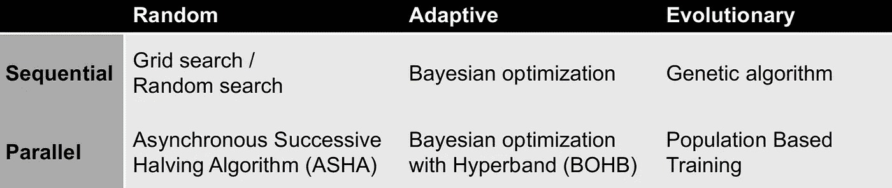
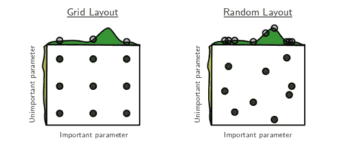
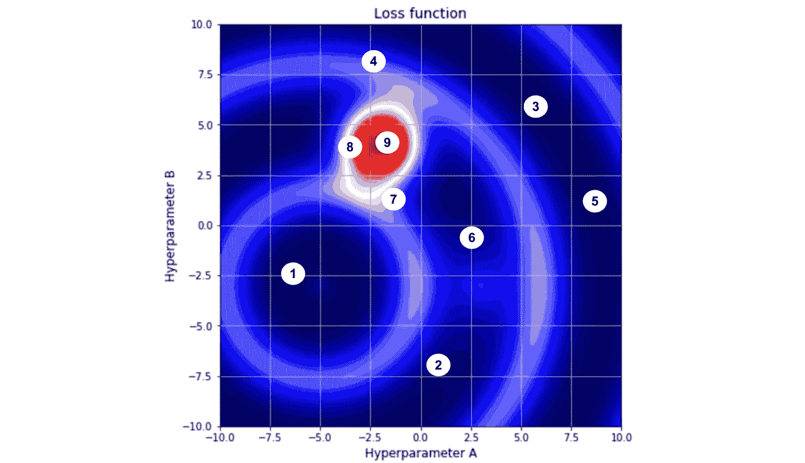
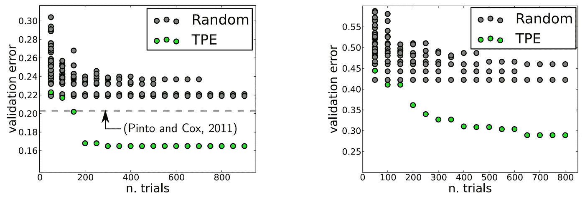
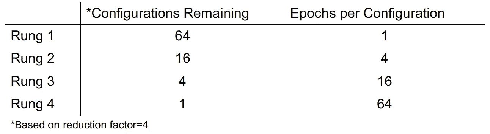
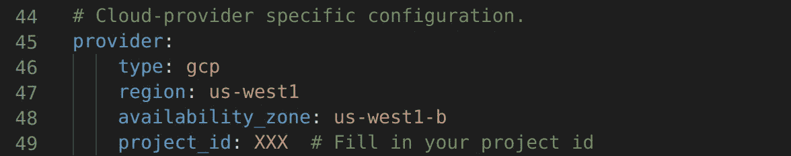
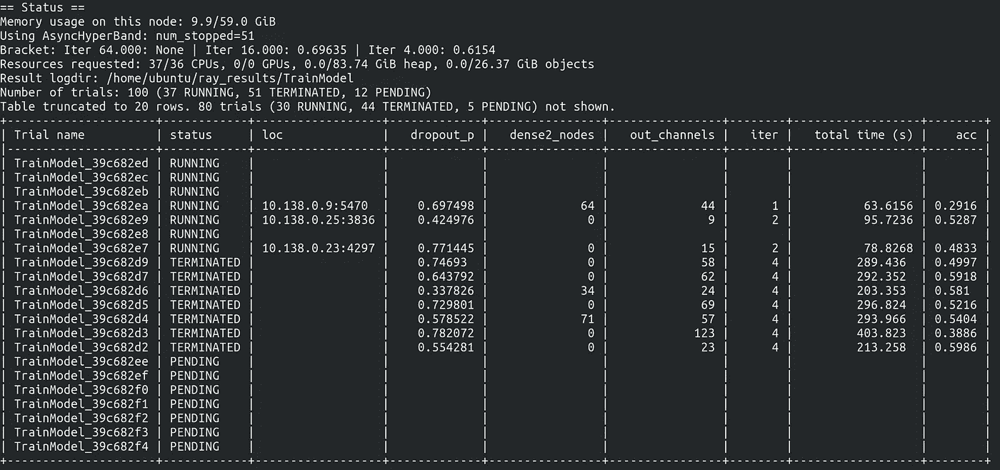
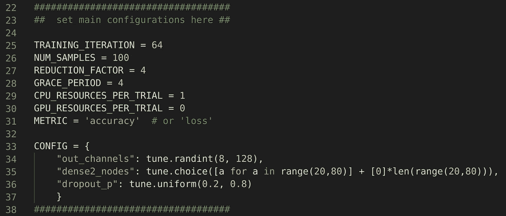
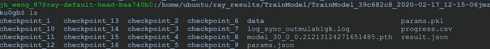

# 超参数调谐:实用指南和模板

> 原文：<https://towardsdatascience.com/hyperparameter-tuning-a-practical-guide-and-template-b3bf0504f095?source=collection_archive---------18----------------------->


FreeImages.com[上](https://www.freeimages.com/photo/mixpanel-1241075)[哈蒙·德夫](https://www.freeimages.com/photographer/nemrah-42227)的照片

Y 你已经煞费苦心地完成了你的[探索性数据分析](/exploratory-data-analysis-eda-a-practical-guide-and-template-for-structured-data-abfbf3ee3bd9)，数据处理和最后😎，该造型了！但是你很快意识到，你有相当多的[超参数](https://en.wikipedia.org/wiki/Hyperparameter_(machine_learning))需要调整，你可能要花上一千年的时间在这个巨大的超参数空间中搜索最优设置。

生命短暂，因此，懒惰的我决定编写不止一个，而是两个代码模板，以自动化和加快机器学习和深度学习模型的超参数调整过程。点击[此处](#b597)获取代码链接(或滚动至底部)，但请继续阅读，了解更多关于超参数调整的信息，并理解代码的作用。

# 超参数调谐的情况有哪些

在我们深入研究这两个代码模板之前，有必要首先列出我们可能面临的超参数调优的背景。

本质上有两种情况:

1.  试验次数>超参数次数；和
2.  试验次数

其中每个试验都是对一组超参数的评估。

情况 1 通常(但不总是)适用于机器学习。训练时间不是特别长，因此我们可以进行大量试验来覆盖超参数空间(即，探索超参数的许多可能组合)。面临的挑战是，如果超参数空间很大，我们可能仍然需要大量的试验和很长时间才能达到最佳设置。因此，如果算法能够智能地操纵超参数空间，将有助于加快优化。

然而，在深度学习中，训练时间通常要长得多；可能几天甚至几周。因此，我们没有能力进行多次试验，这就是情况 2。在这种情况下，我们需要通过并行运行许多试验来提高我们的能力，而不是针对全部数量的时期训练所有试验，该算法应该在训练期间尽早淘汰最没有希望的试验候选，以将计算资源重新分配给其他更有希望的试验。

考虑到上述情况，我们现在来看看各种超参数调整算法以及为我们的目的而选择的算法。

# 超参数调整算法

下表显示了超参数调整算法的高级概述。



我们不会详细讨论每一个算法，但是如果你有兴趣了解更多，下面有其他资源的链接供你参考。

## 网格搜索和随机搜索

网格搜索系统地评估网格中指定的每个超参数组合的模型，而随机搜索从可能参数值的分布中对每个超参数集进行采样。



来源:[伯格斯特拉等人(2012 年)](http://jmlr.csail.mit.edu/papers/volume13/bergstra12a/bergstra12a.pdf)

在上面由 James Bergstra 和 Yoshua Bengio 在他们的 [2012 年论文](http://jmlr.csail.mit.edu/papers/volume13/bergstra12a/bergstra12a.pdf)中的著名图表中，我们看到左边的网格搜索和右边的随机搜索，都有九个试验(黑点)和两个参数。每个方块上方的绿色区域显示了通过改变重要参数值的函数增益，每个方块左侧的黄色区域显示了由不重要参数引起的增益。该图说明了随机搜索可能更彻底地探索参数空间，并导致发现更优的设置。

## 贝叶斯优化(Parzen 估计器树)

虽然随机搜索比网格搜索好，但还是有可能做得更好。

请注意，在超参数空间中，同一区域中的点往往会返回相似的性能。贝叶斯优化利用了这一事实，并以较高的可能性对性能较好的点的区域进行采样。Parzen 估计树(TPE)是采用贝叶斯优化方法的算法之一。



上图说明了贝叶斯优化搜索超参数空间的方式。假设红色区域是最佳损失发生的地方，每个白色圆圈是一次尝试，数字代表搜索的顺序。最初，超参数搜索类似于随机搜索，但随着贝叶斯优化算法用过去试验提供的信息更新自身，搜索逐渐开始向红色区域移动。这本质上是贝叶斯优化优于随机搜索的直觉。

在 T4 的一篇论文中，作者也是 James Bergstra 等人，TPE 算法被证明能够找到比随机搜索更好的超参数配置。



来源:[伯格斯特拉等人(2013 年)](http://proceedings.mlr.press/v28/bergstra13.pdf)

上图中的灰点表示使用随机搜索的 n 次试验中的最低误差，而绿点是 TPE 算法对于相应的 n 次试验的最低误差。因此，该论文在他们的实验中显示，TPE 通常发现超参数配置，这些配置返回比随机搜索更低的验证错误。

## 异步连续减半算法(ASHA)

然而，以并行的方式运行贝叶斯优化是很重要的。在深度学习中，模型训练通常需要很长时间，并行计算尤其重要，ASHA 利用了这一点。

为了理解 ASHA 是如何工作的，我们需要介绍两个组件。第一，连续减半算法(SHA ),第二，异步方面。

***【SHA】***逐次减半算法

假设有 64 个超参数配置需要评估，SHA 将以如下方式制定策略。



对于每个梯级，将剩余 1/配置缩减系数

参考上表，SHA 将首先评估所有 64 个超参数配置，每个配置 1 个历元。这 64 项试验的性能将相互比较，试验的前 1/缩减系数将被“提升”。在我们的示例中，我们任意将缩减因子设置为 4，因此 1/4 * 64 = 16 次试验将被“提升”到下一个梯级，在那里将运行另外 3 个时期。在每个下一个梯级进行类似的比较，直到只剩下 1 次试验。

来自 SHA 的关键见解是，我们不需要完全评估全部 64 个时期的所有试验来选择最佳超参数配置。通常情况下，最没有希望的试验可以在几个时期后确定，我们可以提前停止这些试验，将我们的资源重新分配给其他更有希望的试验。

***异步算法***

不幸的是，由于 SHA 需要等待一个梯级中的所有试验完成后才能继续下一个梯级，因此在存在掉队者(即运行速度比其他试验慢的试验)的情况下，很难实现最佳并行化。并且假设我们有 10 个计算节点，并且每次试验分配一个计算节点，SHA 也将导致越来越多的剩余计算节点没有被利用，因为对于更高的梯级，试验的数量减少(例如，梯级 3 处的 6 个空闲节点)。

因此，ASHA 通过尽可能提升配置来调整 SHA 算法，而不是等待所有试验都在一个梯级中完成。参考上表中的相同示例，ASHA 将每评估 4 次试验，就将一次试验提升至下一级。

根据本文[的研究](https://arxiv.org/pdf/1810.05934.pdf)，与其他可以在并行环境中运行的现有算法相比，ASHA 的性能通常不亚于甚至更好。

我从论文中得到的直觉是，ASHA 可能会表现得更好，因为它能够充分利用并行计算来评估给定时间范围内尽可能多的配置。对于其他算法，它们可能无法在掉队的情况下充分利用并行计算。

## 进化算法

其他类型的算法包括基于进化的算法，如基于群体的训练。欲知详情，请参考 [DeepMind 的博文](https://deepmind.com/blog/article/population-based-training-neural-networks)。

# 我们的代码模板

在回顾了关于超参数调优算法的现有文献并回忆了我们的两种情况后，我决定为每种情况使用两个单独的代码模板。

第一个代码模板适合更简单的情况 1，我们不需要并行计算，所以我写了一些可以在 Google Colab 中轻松运行的东西。第二个代码模板将迎合情况 2，利用 Google 云平台进行分布式试验。

在算法方面，第一个代码使用贝叶斯优化，而第二个代码使用 ASHA。

# 情况 1 的代码模板


**Hyperopt** 是一个超参数优化库，实现了贝叶斯优化的 TPE。远视的主要贡献者之一是詹姆斯·伯格斯特拉。

[我们的代码模板](https://colab.research.google.com/drive/1NanPjXhgXgxiOtoV7ltGA4hKS-6z-3cX)使用 Hyperopt 库，可以很容易地在 Google Colab 中运行，有两个主要部分。

***1。*车型配置探究**

在本节中，我们将设置我们想要研究的模型的配置。例如，下面的代码块为 XGBoost 分类器设置超参数空间。

```
# XGB Classifier parametersmodel_params = {
'learning_rate': hp.choice('xgbc.learning_rate', np.arange(0.05, 0.31, 0.05)),'max_depth': hp.choice('xgbc.max_depth', np.arange(5, 16, 1, dtype=int)),'min_child_weight': hp.choice('xgbc.min_child_weight', np.arange(1, 8, 1, dtype=int)),'colsample_bytree': hp.choice('xgbc.colsample_bytree', np.arange(0.3, 0.8, 0.1)),'subsample': hp.uniform('xgbc.subsample', 0.8, 1),'n_estimators': 100,
}
```

为了方便起见，我们为 3 个主要模型设置了模板，每个模型都有一个分类器和回归器:

*   XGBoost
*   LightGBM
*   随机森林

要根据您的目的修改代码模板，只需相应地修改相关的代码块。

***2。远视类对象***

这一部分包含我们的主要代码。

要执行超参数优化，只需实例化 *HyperOpt* 类对象并调用 *optimize* 方法。此外，您还可以通过在 *experiment_space* 字典中包含其他模型来执行模型搜索。

```
# set dictionary containing hyperparameter space defined
experiment_space = {'model_type': hp.choice('model_type',[rf_clf_params, xgb_clf_params, lgbm_clf_params])}# Perform optimal model search
param_search = HyperOpt(X, y, cv=5)
param_search.optimize(space=experiment_space, max_evals=2)
```

例如，在上面的代码中，我们已经将 *max_evals* 设置为 2，但是您也可以将其设置为其他的试验次数。或者，将其设置为*‘auto’*，让代码搜索最佳设置，直到损失度量在预定义的试验次数内没有改善。

# 情况 2 的代码模板


**Ray Tune** 是一个 Python 库，用于任何规模的超参数调谐，允许我们轻松地执行多节点分布式计算，以同时评估各种超参数配置。

我们的代码参考了 Ray Tune 的 GitHub，由两个文件组成，可以在这里[下载](https://github.com/jiahao87/ray_tune_hyperparameter_tuning)。

1.  *cluster_config_cpu.yml* (分布式集群的配置)
2.  *tune_cifar10.py* (超参数调整脚本)

我们将利用谷歌云进行分布式计算，并以 CIFAR-10 为例。请注意，谷歌云为新客户提供了[免费试用](https://cloud.google.com/free/docs/gcp-free-tier)。

在我们的 CIFAR-10 示例中，我们能够在一个小时内使用 40 个 CPU 评估 100 个配置，而这通常需要一天的时间。所有这些都是在创建谷歌云账户后通过 5 个主要步骤实现的。

1.设置 Google 云端认证

*   [创建服务帐户](https://cloud.google.com/docs/authentication/getting-started#creating_a_service_account)并下载包含您的密钥的 JSON 文件
*   [设置环境变量](https://cloud.google.com/docs/authentication/getting-started#setting_the_environment_variable)指向下载的 JSON 文件的目录

2.启用以下 API:

*   [云资源管理器 API](https://support.cloudability.com/hc/en-us/articles/360022463493-Enabling-Google-s-Cloud-Resource-Manager-API)
*   身份和访问管理(IAM) API
*   计算引擎 API

3.将项目 ID 复制粘贴到 *cluster_config_cpu.yml* 配置文件中的 *project_id*



在配置文件的 project_id 下填写您的项目 ID

4.通过在终端中运行来启动集群:

```
ray up -y cluster_config_cpu.yml
```

5.通过在终端中执行以下命令开始超参数调整试验:

```
ray submit cluster_config_cpu.yml tune_cifar10.py# To trial run scripts, add argument smoke-test
# ray submit cluster_config_cpu.yml tune_cifar10.py --smoke-test
```

在超参数调整过程中，您将在终端中看到状态更新，如下图所示。每次迭代( *iter* )后，将为每次试验报告指标( *acc，总时间*)。



在我们的示例中，我们调整了三个超参数:

*   丢弃层将元素设置为零的概率( *dropout_p* )
*   第二全连接层中的节点数( *dense2_nodes*
*   第二卷积层输出的通道数(*输出通道*)

超参数空间可以在脚本顶部的 *tune_cifar10.py* 中与其他主要配置一起设置。



要在 tune_cifar10.py 中设置的主要配置

为了使代码适合您的目的，您可能希望修改 *ConvNet* 类(用于模型架构)和 *get_data_loaders* 函数(用于数据集加载)。

要设置使用的 cpu 类型和数量，请修改 *cluster_config_cpu.yml* 中的 *head_node* 、 *worker_nodes* 和 *max_workers* 。或者，要启动 gpu，请参见 *cluster_config_gpu.yml* 。

在超参数调优过程结束时，将报告最佳配置，并且可以从 Google 云集群的头节点下载相应的模型检查点。



每个试验的最佳模型将作为 model_xxx.pth 保存在头群集节点的/home/Ubuntu/ray _ results/train model 下的每个试验文件夹中

快速提示:

*   如果您正在启动大量的 CPU，请确保您的 head 节点是足够强大的机器类型。
*   默认情况下，Google Cloud 对您可以启动的 CPU 和 GPU 数量有配额限制。但是您可以[编辑您的配额](https://cloud.google.com/compute/quotas#request_quotas)。

通过上面的插图，我们希望展示如何为机器学习和深度学习模型执行超参数调整。

如果您错过了代码模板链接，它们也在这里:

*   [Google Colab 笔记本](https://colab.research.google.com/drive/1NanPjXhgXgxiOtoV7ltGA4hKS-6z-3cX)针对情况 1
*   [情况 2 的 Github 存储库](https://github.com/jiahao87/ray_tune_hyperparameter_tuning)

感谢阅读，我希望代码和文章是有用的。如果您有任何问题或建议，请随时发表评论。

# 参考

*   [http://jmlr . csail . MIT . edu/papers/volume 13/bergstra 12a/bergstra 12a . pdf](http://jmlr.csail.mit.edu/papers/volume13/bergstra12a/bergstra12a.pdf)
*   [http://proceedings.mlr.press/v28/bergstra13.pdf](http://proceedings.mlr.press/v28/bergstra13.pdf)
*   [https://blog . ml . CMU . edu/2018/12/12/massively-parameter-optimization/](https://blog.ml.cmu.edu/2018/12/12/massively-parallel-hyperparameter-optimization/)
*   [https://github.com/hyperopt/hyperopt](https://github.com/hyperopt/hyperopt)
*   [https://ray.readthedocs.io/en/latest/tune-usage.html](https://ray.readthedocs.io/en/latest/tune-usage.html)