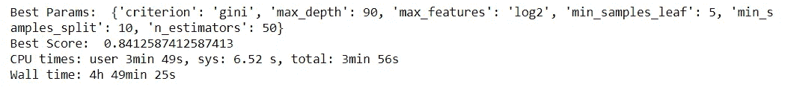
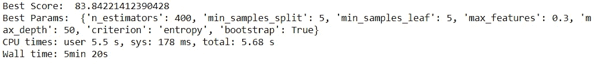
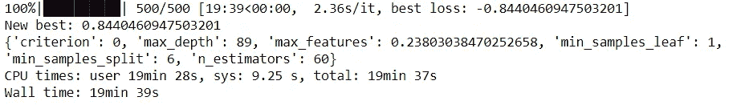

# 机器学习模型的超参数调整

> 原文：<https://towardsdatascience.com/hyperparameter-tuning-for-machine-learning-models-1b80d783b946?source=collection_archive---------3----------------------->

## 使用随机搜索、网格搜索和超点优化方法提高机器学习模型的准确性


照片由[乔·凯恩](https://unsplash.com/@joeyc?utm_source=medium&utm_medium=referral)在 [Unsplash](https://unsplash.com?utm_source=medium&utm_medium=referral) 拍摄

# **简介**

本文介绍了使用 Sci-kit learn 和 HyperOpt 库对机器学习模型的超参数调整进行随机搜索、网格搜索和贝叶斯优化方法的比较和实现。超参数调整至关重要，因为它们控制机器学习模型的整体行为。每个机器学习模型都有不同的可以设置的超参数。

> 超参数是在学习过程开始之前设置其值的参数。

我将使用来自 Kaggle 的 [Titanic 数据集](https://www.kaggle.com/c/titanic/data)进行比较。本文的目的是探索随机森林模型的性能和计算时间如何随着各种超参数调整方法而变化。毕竟，机器学习就是要在计算时间和模型性能之间找到正确的平衡。

## 具有默认参数的基线模型:

```
random_forest = RandomForestClassifier(random_state=1).fit(X_train, y_train)
random_forest.score(X_test,y_test)
```

当在测试装置上使用时，该模型的精度为 **81.56** 。

我们可以使用命令获取用于模型的默认参数。`**randomforest.get_params()**`

```
**The default parameters are:** {'bootstrap': True, 'ccp_alpha': 0.0,  'class_weight': None,  'criterion': 'gini',  'max_depth': None,  'max_features': 'auto',  'max_leaf_nodes': None,  'max_samples': None,  'min_impurity_decrease': 0.0,  'min_impurity_split': None,  'min_samples_leaf': 1,  'min_samples_split': 2,  'min_weight_fraction_leaf': 0.0,  'n_estimators': 100,  'n_jobs': None,  'oob_score': False,  'random_state': 1,  'verbose': 0,  'warm_start': False}
```

如果您不知道这些参数以及它们的使用方法，也不必担心。通常，关于所有参数的信息可以在模型的 Scikit 文档中找到。

**随机森林中的一些重要参数:**

1.  ***max_depth: int，default=None*** 该选项用于选择你希望森林中每棵树的深度。树越深，它就有越多的分支，它就能获取更多的数据信息。
2.  ***判据*** *:{"Gini "，" entropy"}，default=" Gini":* 衡量每个拆分的质量。“基尼系数”使用基尼系数杂质，而“熵”则根据信息增益进行分割。
3.  ***max_features: {"auto "，" sqrt "，" log2"}，int 或 float，default=" auto":*** 这表示在寻找最佳分割时，在分割前级别上考虑的特征数量。这提高了模型的性能，因为每个树节点现在都在考虑更多的选项。
4.  **min _ samples _ leaf*:**int 或 float，default=1:*** 该参数帮助确定在随机森林中的每个决策树节点的末端对其进行拆分所需的最小观察次数。
5.  **min_samples_split *:***
6.  **n_estimators *: int，default=100:*** 这可能是最重要的参数。这表示在计算预测值之前，要在随机森林中构建的树的数量。通常，数字越高越好，但是这在计算上更昂贵。

关于其他参数的更多信息可以在随机森林分类器模型[文档](https://scikit-learn.org/stable/modules/generated/sklearn.ensemble.RandomForestClassifier.html)中找到。

# 网格搜索

执行超参数调整的一种传统且流行的方法是使用 Scikit learn 的穷举网格搜索。该方法尝试每组超参数的每种可能的组合。使用这种方法，我们可以在参数搜索空间中找到最佳的一组值。这通常使用更多的计算能力，并需要很长时间来运行，因为这种方法需要尝试网格大小中的每个组合。

参数网格大小将是所有参数的乘积。即，对于我们模型中的以下参数，网格大小将是 10*2*4*5*3*5 = 12000

```
parameters ={'max_depth': [10, 20, 30, 40, 50, 60, 70, 80, 90, 100],
     'criterion' : ['gini', 'entropy'],
     'max_features': [0.3,0.5,0.7,0.9],
     'min_samples_leaf': [3,5,7,10,15],
     'min_samples_split': [2,5,10],
     'n_estimators': [50,100,200,400,600]}**from** sklearn.model_selection **import** ParameterGrid
param_size = ParameterGrid(parameters)
len(param_size)**Output:
12000**
```

使用 sklearn 的`GridSearchCV`，我们可以搜索我们的网格，然后运行网格搜索。

```
%%time**from** sklearn.model_selection **import** GridSearchCV
grid_search = RandomForestClassifier()grid_search = GridSearchCV(
    grid_search, 
    parameters, 
    cv=5,
    scoring='accuracy',n_jobs=-1)

grid_result= grid_search.fit(X_train, y_train)
**print**('Best Params: ', grid_result.best_params_)
**print**('Best Score: ', grid_result.best_score_)
```

## 输出



与基线模型相比，网格搜索 CV 模型的交叉验证分数从 81.56%提高到 84.12%。这是 3.3%的改进。计算时间几乎是 5 小时，这对于这样一个简单的问题是不可行的。

关于实现 Gridsearch 的不同方法的更多信息可以在这里找到。

# 随机搜索

与 GridCV 相比，RandomizedSearch CV 的主要区别在于，它不是尝试每个可能的组合，而是从网格空间中随机选择超参数样本组合。因为这个原因，不能保证我们会像网格搜索一样找到最好的结果。但是，这种搜索在实践中非常有效，因为计算时间非常少。

计算时间和模型执行主要取决于`n_iter`值。因为该值指定了模型应该搜索参数的次数。如果这个值很高，就有更好的机会获得更高的精度，但这也带来了更多的计算能力。

我们可以通过使用 sklearn 的库来实现`RandomizedSearchCV`。

```
%%time
**from** sklearn.model_selection **import** RandomizedSearchCV
random_search=RandomizedSearchCV(estimator = RandomForestClassifier(), param_distributions=parameters,verbose=1, n_jobs=-1,
                            n_iter=200)
random_result = random_search.fit(X_train, y_train)
print('Best Score: ', random_result.best_score_*100)
print('Best Params: ', random_result.best_params_)
```

## 输出



与基线模型相比，使用随机搜索 CV 模型，我们的交叉验证分数从 81.56%提高到 83.57%。这是 2.5%的改进，比 Grid CV 少 0.8%。但计算时间不到 5 分钟，几乎快了 60 倍。对于大多数简单的问题，这种随机搜索将是超参数调整的最可行的选择。

更多关于实现随机搜索的不同方法的信息可以在[这里](https://scikit-learn.org/stable/modules/generated/sklearn.model_selection.RandomizedSearchCV.html)找到。

# **使用 HyperOpt 的贝叶斯模型优化**

为了在 Hyperopt 中公式化优化问题，我们需要一个**目标函数**，该函数接受一个输入并返回一个损失以最小化模型。以及一个**域空间**对于超参数类似于网格搜索，我们要用输入值的范围创建一个参数空间来评估。

函数可以简单到 f(x) = sin(x)，也可以复杂到深度神经网络的误差。该模型根据前面的步骤选择超参数。

**这个模型的工作过程很简单:**

1.  创建目标函数的替代概率模型。
2.  找到在代理模型上表现最好的超参数。
3.  在真实模型上使用这些值来返回目标函数并更新代理模型。
4.  重复步骤 2 和 3，直到达到最大评估值。

简单来说，如果我们想找到精度最高的超参数。计算精度的函数称为**目标函数**。

```
%%time
import **numpy** as **np**
from **hyperopt** import **hp**, **tpe**, **fmin**,**STATUS_OK**,**Trials****def** accuracy_model(params):
   clf = RandomForestClassifier(**params)
   **return** cross_val_score(clf, X_train, y_train).mean()param_space = {'max_depth': hp.choice('max_depth', range(10,100)),
'max_features': hp.uniform('max_features', 0.1,1),
'n_estimators': hp.choice('n_estimators', range(50,500)),
'min_samples_leaf': hp.choice('min_samples_leaf',range(3,5)),
'min_samples_split': hp.choice('min_samples_split',range(2,10)),
'criterion': hp.choice('criterion', ["gini", "entropy"])}best = 0
**def** f(params):
    global best
    acc = accuracy_model(params)
    if acc > best:
       best = acc
    **return** {'loss': -acc, 'status': STATUS_OK}Trials = Trials()
best_params = fmin(f, param_space , algo=tpe.suggest,max_evals=500, trials= Trials)**print**('New best:', best, best_params)
**print**(best_params)
```

## 输出



我们使用贝叶斯优化的交叉验证交叉为 84.44%，优于随机搜索和网格搜索。计算时间为 20 分钟，考虑到这种方法的性能最好，这是合理的。

使用[贝叶斯优化](https://en.wikipedia.org/wiki/Bayesian_optimization#:~:text=Bayesian%20optimization%20is%20a%20sequential,expensive%2Dto%2Devaluate%20functions.)模型的另一个好处是不同于随机搜索或网格搜索；我们可以跟踪用于形成概率模型的所有过去的评估模型，该概率模型将超参数映射到目标函数的得分概率。

关于安装和实现 Hyperopt 库的更多信息可以在[这里](https://hyperopt.github.io/hyperopt/)找到。

## 结论

超参数调整对于提高机器学习模型的准确性非常有利。在我们的例子中，随机森林模型在预测存活率方面已经很好了，所以使用超参数调整方法在准确性方面没有太大的提高。

总之，使用网格搜索选择最佳超参数可能非常耗时。随机搜索速度快但不可靠。然而，即使这些方法也比贝叶斯优化效率低，因为它们不基于先前的结果选择下一个超参数来评估。由于这个原因，这些方法消耗更多的时间来评估无用的参数。

## 额外资源

除了随机搜索、网格搜索和贝叶斯优化，还有一些高级方法，如超波段和 BOHB，它们结合了超波段和贝叶斯优化，更适合超参数调整。关于它们的详细解释在 n **eptune.ai** 的精彩博客中有所涉及，可以在[这里](https://neptune.ai/blog/hyperband-and-bohb-understanding-state-of-the-art-hyperparameter-optimization-algorithms)找到

完整的数据和代码可以在我的 [Github 库](https://github.com/JaswanthBadvelu/hypermater_tuning)中找到。

希望那有用！非常感谢你读到这里。如果你对这篇文章有任何问题，或者想要联系和交谈，请随时[在 LinkedIn 上直接给我发消息](https://www.linkedin.com/in/jaswanth-badvelu/)。我非常乐意和你聊天，并尽我所能提供帮助。