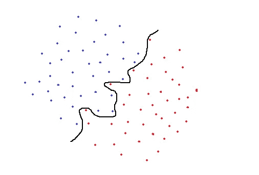
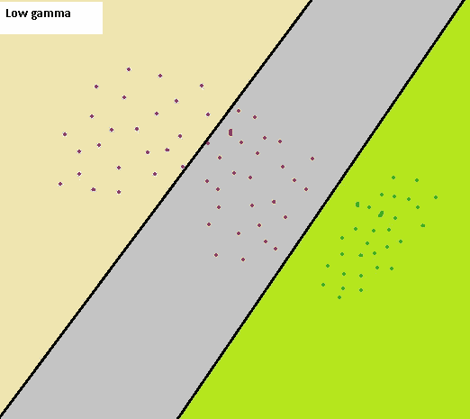
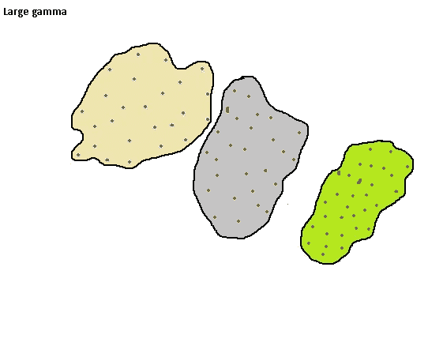

# 支持向量机的超参数调整— C 和 Gamma 参数

> 原文：<https://towardsdatascience.com/hyperparameter-tuning-for-support-vector-machines-c-and-gamma-parameters-6a5097416167?source=collection_archive---------2----------------------->

## 理解支持向量机的超参数

照片由 [Unsplash](https://unsplash.com/s/photos/balance?utm_source=unsplash&utm_medium=referral&utm_content=creditCopyText) 上的 [Aziz Acharki](https://unsplash.com/@acharki95?utm_source=unsplash&utm_medium=referral&utm_content=creditCopyText) 拍摄

支持向量机(SVM)是一种广泛使用的监督机器学习算法。它主要用于分类任务，但也适用于回归任务。在这篇文章中，我们将深入探讨支持向量机的两个重要参数:T4 C 和伽马。所以我假设你对算法有一个基本的了解，并关注这些参数。

大多数机器学习和深度学习算法都有一些可以调整的参数，称为**超参数**。我们需要在训练模型之前设置超参数。超参数在构建稳健而精确的模型时非常关键。它们帮助我们找到偏差和方差之间的平衡，从而防止模型过拟合或欠拟合。为了能够调整超参数，我们需要理解它们的含义以及它们如何改变模型。随机尝试一堆超参数值将是一项单调乏味且永无止境的任务。

我们强调了超参数的重要性。让我们开始讨论 **C** 和**伽马**。SVM 创建了一个**决策边界**来区分两个或更多的类。如何绘制或确定决策边界是 SVM 算法中最关键的部分。当不同类中的数据点是线性可分的时，就很容易画出决策边界。

线性可分数据点

然而，真实数据是有噪声的，并且在大多数情况下不是线性可分的。一个标准的 SVM 试图将所有的正面和负面例子(即两个不同的类)分开，不允许任何点被错误分类。这导致过度拟合模型，或者在某些情况下，无法使用标准 SVM 找到决策边界。

考虑以下二维空间中的数据点:

标准 SVM

标准的 SVM 会使用黑色曲线作为判定边界来区分蓝色和红色等级。然而，这是一个过于具体的分类，很可能以过度拟合而告终。过度拟合的 SVM 在训练集上取得了很高的精度，但在新的、以前未见过的样本上表现不佳。该模型对噪声非常敏感，即使数据点值中非常小的变化也可能改变分类结果。使用这条黑线作为决策边界的 SVM 不适用于该数据集。

为了解决这个问题，1995 年，Cortes 和 Vapnik 提出了“**软余量**”SVM 的概念，它允许一些例子被错误分类或位于决策边界的错误一侧。软边际 SVM 通常会产生更好通用模型。在我们的示例中，软利润 SVM 的决策边界可能看起来像黑色直线，如下所示:

软利润 SVM

有一些错误的分类点，但我们最终有一个更一般化的模型。当确定决策边界时，软裕度 SVM 试图解决具有以下目标的优化问题:

*   增加决策边界到类别(或支持向量)的距离
*   最大化训练集中正确分类的点数

这两个目标之间显然有所取舍。决策边界可能必须非常接近一个特定类，才能正确标记训练集中的所有数据点。然而，在这种情况下，测试数据集的准确性可能会较低，因为决策边界对噪声和独立变量的微小变化过于敏感。另一方面，决策边界可能被放置在尽可能远的每个类，代价是一些错误分类的异常。这种权衡由 **c 参数控制。**

**C 参数**为每个错误分类的数据点增加一个惩罚。如果 c 很小，则对误分类点的惩罚也很低，因此以更大数量的误分类为代价选择了具有大余量的决策边界。如果 c 很大，SVM 试图最小化由于高惩罚导致的错误分类的例子的数量，这导致了具有较小裕度的决策边界。对于所有错误分类的例子，惩罚是不同的。它与到决策边界的距离成正比。

在介绍 **gamma** 参数之前，我们需要先说一下内核的诀窍。在某些情况下，不可线性分离的数据点会使用核函数进行变换，以便它们变得可线性分离。核函数是一种相似性度量。输入是原始特征，输出是新特征空间中的相似性度量。这里的相似性是指接近的程度。将数据点实际转换到高维特征空间是一个代价很高的操作。该算法实际上并不将数据点转换到新的高维特征空间。内核化 SVM 根据高维特征空间中的相似性度量来计算决策边界，而不实际进行变换。我想这就是为什么它也被称为**内核把戏**的原因。

常用的核函数之一是径向基函数(RBF)。RBF 的 Gamma 参数控制单个训练点的影响距离。低 gamma 值表示较大的相似性半径，这将导致更多的点被组合在一起。对于高 gamma 值，这些点需要彼此非常接近，才能被视为在同一组(或类)中。因此，gamma 值非常大的模型往往会过度拟合。以下可视化更好地解释了这个概念:

第一幅图像代表低伽马值的情况。相似性半径很大，因此彩色区域中的所有点都被认为属于同一类。例如，如果我们有一个点的右下角，它被归类为“绿色”类。另一方面，第二个图像是具有大伽马的情况。对于要分组到同一类中的数据点，它们必须落在紧有界区域中。因此，一个小的噪声可能导致数据点脱离类别。大的伽玛值可能会导致过度拟合。

随着灰度系数的降低，分隔不同类别的区域变得更加一般化。非常大的 gamma 值会导致太特定的类别区域(过度拟合)。

# 伽马与 C 参数

对于线性核，我们只需要优化 c 参数。然而，如果我们想要使用 RBF 核，则需要同时优化 c 和γ参数。如果γ很大，c 的影响可以忽略不计。如果 gamma 很小，c 会像影响线性模型一样影响模型。c 和γ的典型值如下。然而，根据应用可能存在特定的最佳值:

0.0001

0.1 < c < 100

> 对于 SVM 来说，记住输入数据需要进行归一化以使要素具有相同的比例和兼容性是非常重要的。

感谢您的阅读。如果您有任何反馈，请告诉我。