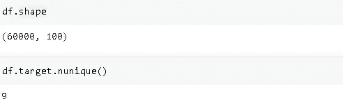

# 超参数调整减少过度拟合— LightGBM

> 原文：<https://towardsdatascience.com/hyperparameter-tuning-to-reduce-overfitting-lightgbm-5eb81a0b464e?source=collection_archive---------7----------------------->

## 用例子演示


安德烈斯·达利蒙提在 [Unsplash](https://unsplash.com/s/photos/cockpit?utm_source=unsplash&utm_medium=referral&utm_content=creditCopyText) 上的照片

对大量数据的轻松访问和高计算能力使得设计复杂的机器学习算法成为可能。随着模型复杂性的增加，训练模型所需的数据量也会增加。

数据不是模型性能的唯一因素。复杂模型有许多超参数，需要正确地调整或调整，以便充分利用它们。

例如，XGBoost 和 LightGBM 的性能高度依赖于超参数调优。这就像以每小时 50 英里的速度驾驶法拉利，在不仔细调整超参数的情况下实现这些算法。

在本帖中，我们将实验 LightGBM 的性能如何根据超参数值而变化。重点是有助于推广模型的参数，从而降低过度拟合的风险。

让我们从导入库开始。

```
import pandas as pd
from sklearn.model_selection import train_test_split
import lightgbm as lgb
```

数据集包含 60 k 个观测值、99 个数字特征和一个目标变量。



(图片由作者提供)

目标变量包含 9 个值，这使其成为多类分类任务。

我们的重点是超参数调优，因此我们将跳过数据争论部分。下面的代码块将数据集分为训练和测试子集，并将它们转换为适合 LightGBM 的格式。

```
X = df.drop('target', axis=1)
y = df['target']X_train, X_test, y_train, y_test = train_test_split(X, y, test_size = 0.33, random_state=42)lgb_train = lgb.Dataset(X_train, y_train)
lgb_test = lgb.Dataset(X_test, y_test)
```

我们将从一组新的基本超参数开始，并逐步引入新的超参数。

```
params = {
'boosting_type': 'gbdt',
'objective': 'multiclass',
'metric': 'multi_logloss',
'num_class':9
}
```

我们现在可以训练模型，并根据指定的评估指标查看结果。

```
gbm = lgb.train(
params,
lgb_train,
num_boost_round=500,
valid_sets=[lgb_train, lgb_test],
early_stopping_rounds=10
)
```

评价标准是多级测井曲线损失。这是训练集和验证集的结果。


(图片由作者提供)

助推轮数设置为 500，但出现了提前停止。如果在指定的回合数内成绩没有提高，early_stopping_rounds 将停止训练。

因为在训练集和验证集的损失之间存在显著的差异，所以该模型似乎高度过度适合训练集。

min_data_in_leaf 参数是一种减少过度拟合的方法。它要求每片叶子都有指定数量的观察值，这样模型才不会变得太具体。

```
'min_data_in_leaf':300 #added to params dict
```


(图片由作者提供)

验证损失几乎相同，但差异变小，这意味着过度拟合的程度降低。

防止模型过于具体的另一个参数是 **feature_fraction** ，它表示在每次迭代中随机选择的特征的比率。

```
'feature_fraction':0.8 #added to params dict
```

现在模型在每次迭代中使用 80%的特性。这是结果。


(图片由作者提供)

过度拟合进一步减少。

Bagging_fraction 允许在每次迭代中使用随机选择的行样本。它类似于 feature_fraction，但用于行。bagging_freq 指定更新所选行的迭代频率。

```
#added to params dict
'bagging_fraction':0.8,
'bagging_freq':10
```


(图片由作者提供)

训练损失和验证损失之间的差异正在减小，这表明我们在正确的轨道上。

LightGBM 是一种使用 boosting 技术组合决策树的集成方法。单个树的复杂性也是过度拟合的决定因素。它可以通过 max_depth 和 num_leaves 参数来控制。max_depth 决定了一棵树的最大深度，而 num_leaves 限制了一棵树可以拥有的最大叶子数。因为 LightGBM 适应逐叶的树生长，所以一起调整这两个参数很重要。

另一个重要的参数是 learning_rate。较小的学习速率通常更好，但它会导致模型学习更慢。

我们还可以添加一个正则项作为超参数。LightGBM 支持 L1 和 L2 正则化。

```
#added to params dict
'max_depth':8,
'num_leaves':70,
'learning_rate':0.04
```


(图片由作者提供)

我们进一步降低了训练和验证损失之间的差异，这意味着更少的过度拟合。

迭代次数也是模型训练的一个重要因素。更多的迭代导致模型学习更多，因此模型在一定数量的迭代之后开始过度拟合。

您可能需要花费大量时间来调优超参数。最终，你会创造出你自己的方法或策略来加速调整的过程。

有很多超参数。有些在准确性和速度方面更重要。其中一些主要用于防止过度拟合。

交叉验证也可以用来减少过度拟合。它允许在训练集和验证集中使用每个数据点。

我们只关注减少过度拟合。然而，如果精度或损失不令人满意，消除过拟合没有多大关系。您还可以调整超参数以在一定程度上提高精度。提高模型性能的一些方法有:

*   特征工程
*   特征抽出
*   集成多个模型

感谢您的阅读。如果您有任何反馈，请告诉我。