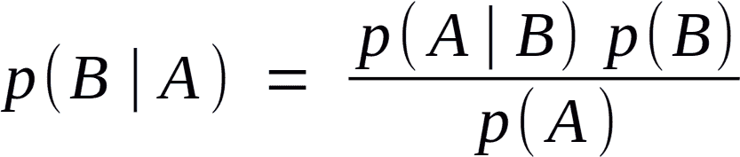

# 基于信息搜索的超参数调整

> 原文：<https://towardsdatascience.com/hyperparameter-tuning-with-informed-searching-37ed58d331f8?source=collection_archive---------31----------------------->


威尔·弗朗西斯在 [Unsplash](https://unsplash.com/s/photos/radio?utm_source=unsplash&utm_medium=referral&utm_content=creditCopyText) 上的照片

咻…已经几个星期了，但是很高兴赶上了！这些帖子的目标是希望找到一些对我来说是新的东西，这样我就可以“向前支付”。你们中的许多人可能听说过 GridSearchCV，甚至可能听说过 RandomSearchCV，但是知情搜索呢？

使用信息搜索技术的优势在于超参数是通过顺序学习来调整的。GridSearch 和 RandomSearch 都很棒，但它们只深入一层。知情搜索从先前的超参数调整中学习，以优化调整过程。有三种方法是我知道的，请随意分享其他方法！


伊恩·施耐德在 [Unsplash](https://unsplash.com/s/photos/sanding?utm_source=unsplash&utm_medium=referral&utm_content=creditCopyText) 上的照片

## 粗调至微调

这是微调超参数最明显的方法。只有四个步骤:

1.  执行随机搜索(或网格搜索)。
2.  查看结果。
3.  根据检查结果定义新的参数范围。
4.  继续，直到获得最佳得分。

现在，这是非常明显的，但最容易实现，无需安装任何软件包。这也是最耗时的。



贝叶斯定理

## 贝叶斯调谐

是的，贝氏又来了！该方法将采用一系列超参数，并利用贝叶斯信念原则来迭代超参数，以提供最佳结果。[hyperpt](https://github.com/hyperopt/hyperopt)套装提供您需要的一切！Parzen 估计器的[树](https://papers.nips.cc/paper/4443-algorithms-for-hyper-parameter-optimization.pdf) (tpe.suggest)是函数中的算法。此外，还创建了一个目标函数来迭代参数并测量损失。

下面是一个例子:

```
from hyperopt import hp, space, fmin, tpe
# Set up space dictionary with specified hyperparameters
space = {'max_depth': hp.quniform('max_depth', 2, 10, 2),'learning_rate': hp.uniform('learning_rate', 0.001,0.9)}

  # Set up objective function
def objective(params):
    params = {'max_depth': int(params['max_depth']),'learning_rate': params['learning_rate']} # model can be set - scoring must be 'accuracy'
    gbm_clf = GradientBoostingClassifier(n_estimators=100, **params) 
      best_score = cross_val_score(gbm_clf, X_train, y_train, scoring='accuracy', cv=2, n_jobs=4).mean()
    loss = 1 - best_score
    return loss# Run the algorithm - test max evals
best = fmin(fn=objective,space=space, max_evals=20, rstate=np.random.RandomState(42), algo=tpe.suggest)
  print(best)#Sample output:
 0%|          | 0/20 [00:00<?, ?it/s, best loss: ?]
  5%|5         | 1/20 [00:00<00:04,  4.16it/s, best loss: 0.26759418985474637]
 10%|#         | 2/20 [00:00<00:04,  4.32it/s, best loss: 0.2549063726593165] 
 15%|#5        | 3/20 [00:00<00:03,  4.60it/s, best loss: 0.2549063726593165]
 20%|##        | 4/20 [00:00<00:03,  4.82it/s, best loss: 0.2549063726593165]
 25%|##5       | 5/20 [00:01<00:04,  3.64it/s, best loss: 0.2549063726593165]
 30%|###       | 6/20 [00:01<00:03,  3.71it/s, best loss: 0.2549063726593165]
 35%|###5      | 7/20 [00:01<00:03,  4.09it/s, best loss: 0.2549063726593165]
 40%|####      | 8/20 [00:01<00:02,  4.29it/s, best loss: 0.2549063726593165]
 45%|####5     | 9/20 [00:02<00:02,  4.49it/s, best loss: 0.2549063726593165]
 50%|#####     | 10/20 [00:02<00:02,  4.69it/s, best loss: 0.2549063726593165]
 55%|#####5    | 11/20 [00:02<00:01,  4.77it/s, best loss: 0.2549063726593165]
 60%|######    | 12/20 [00:02<00:01,  4.53it/s, best loss: 0.2549063726593165]
 65%|######5   | 13/20 [00:03<00:01,  4.16it/s, best loss: 0.2549063726593165]
 70%|#######   | 14/20 [00:03<00:02,  2.81it/s, best loss: 0.2525688142203555]
 75%|#######5  | 15/20 [00:03<00:01,  3.29it/s, best loss: 0.2525688142203555]
 80%|########  | 16/20 [00:04<00:01,  3.57it/s, best loss: 0.2525688142203555]
 85%|########5 | 17/20 [00:04<00:01,  2.41it/s, best loss: 0.24246856171404285]
 90%|######### | 18/20 [00:05<00:00,  2.41it/s, best loss: 0.24246856171404285]
 95%|#########5| 19/20 [00:05<00:00,  2.46it/s, best loss: 0.24246856171404285]
100%|##########| 20/20 [00:05<00:00,  2.69it/s, best loss: 0.24246856171404285]
100%|##########| 20/20 [00:05<00:00,  3.40it/s, best loss: 0.24246856171404285]
{'learning_rate': 0.11310589268581149, 'max_depth': 6.0}
```


Johannes Plenio 在 [Unsplash](https://unsplash.com/s/photos/evolution?utm_source=unsplash&utm_medium=referral&utm_content=creditCopyText) 上拍摄的照片

## 遗传调谐

最后，我们将看看基因调整。这是最有趣的概念，因为它遵循达尔文的进化过程:

1.  不同种类(不同型号)
2.  最强的生存下来(最好的得分被选出)
3.  复制(创建与最佳模型相似的新模型)
4.  遗传随机性发生在繁殖过程中(增加随机性，这样就不会达到局部最优)
5.  重复

这个过程可以用 [TPOT](https://epistasislab.github.io/tpot/) 包来执行。有了 TPOT，你可以设置所有这些“遗传”参数:

*   世代—周期数
*   population_size =要保留的模型数量
*   后代大小=每个中后代的数量
*   突变率=应用随机性的管道比例
*   crossover_rate =每次迭代的管道比例

TPOT 是建立在几个库之上的，所以一定要查看文档以确保正确安装。(有一个链接附在第一次提到 TPOT 的地方)

这里有一个 TPOT 的例子:

```
# Assign the values outlined to the inputs
number_generations = 3
population_size = 4
offspring_size = 3
scoring_function = 'accuracy'

# Create the tpot classifier
tpot_clf = TPOTClassifier(generations=number_generations, population_size=population_size,
                            offspring_size=offspring_size, scoring=scoring_function,
                            verbosity=2, random_state=2, cv=2)# Fit the classifier to the training data
tpot_clf.fit(X_train, y_train)

# Score on the test set
print(tpot_clf.score(X_test, y_test))#sample output:
    Generation 1 - Current best internal CV score: 0.7549688742218555
    Generation 2 - Current best internal CV score: 0.7549688742218555

    Best pipeline: DecisionTreeClassifier(input_matrix, criterion=gini, max_depth=7, min_samples_leaf=11, min_samples_split=12)
    0.75
```

你有它！在寻找最佳超参数的过程中，需要实施三个(基本上是两个)新过程。

这些过程不会凭空出现，我确实通过[数据营](https://datacamp.com/)的课程学到了很多。DataCamp 是一个保持练习、学习新技术、巩固已学知识和发现新程序的好方法。强烈推荐。

保重，下次再见！