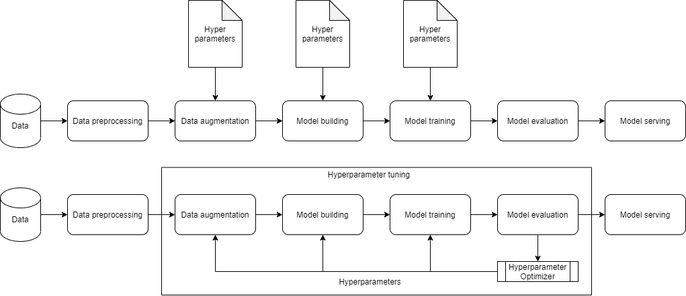
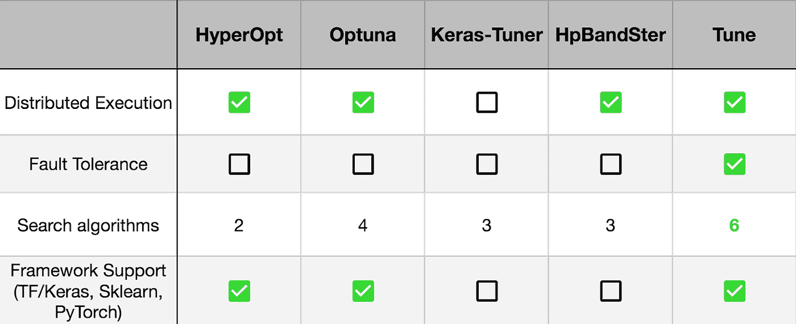
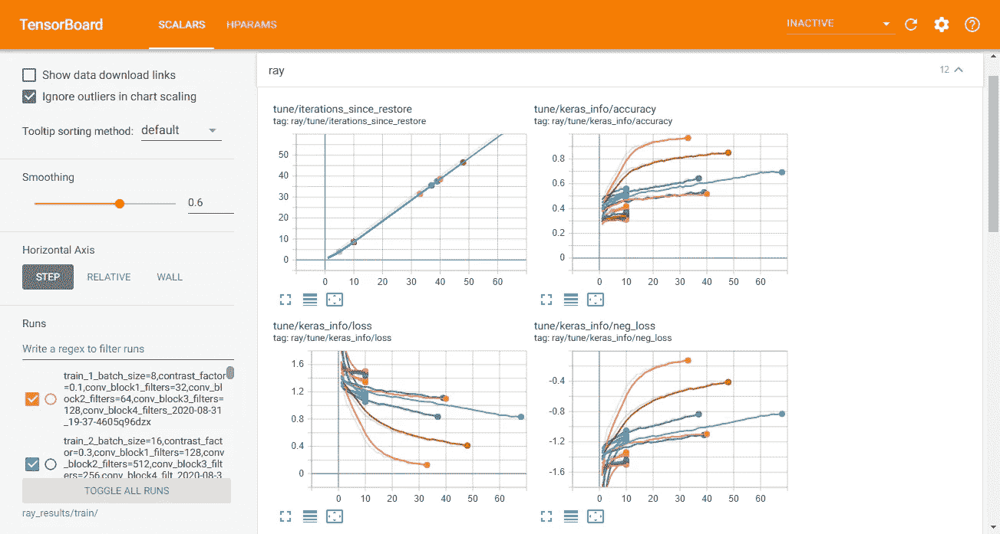
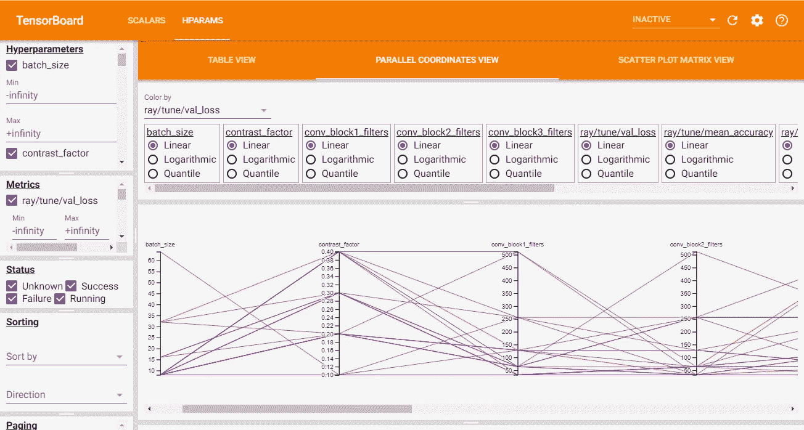

# 使用 Keras 和光线调节进行超参数调节

> 原文：<https://towardsdatascience.com/hyperparameter-tuning-with-keras-and-ray-tune-1353e6586fda?source=collection_archive---------10----------------------->

## 使用 HyperOpt 的贝叶斯优化和超带调度器为机器学习模型选择最佳超参数

Alexis Baydoun 在 [Unsplash](https://unsplash.com?utm_source=medium&utm_medium=referral) 上拍摄的照片

在我之前的[文章](/implementing-a-fully-convolutional-network-fcn-in-tensorflow-2-3c46fb61de3b)中，我解释了如何构建一个小巧灵活的图像分类器，以及在卷积神经网络中拥有可变输入维度的优势。然而，在经历了模型构建代码和训练例程之后，人们可以问这样的问题:

1.  如何选择一个神经网络的层数？
2.  如何选择各层单元/滤波器的最优数量？
3.  我的数据集的最佳数据扩充策略是什么？
4.  什么样的批量和学习率是合适的？

建立或训练神经网络包括找出上述问题的答案。例如，您可能对 CNN 有一种直觉，随着我们越来越深入，每一层中的过滤器数量应该增加，因为神经网络学习提取越来越复杂的特征，这些特征建立在早期层中提取的简单特征的基础上。但是，可能有一个更优的模型(对于您的数据集而言)具有更少的参数，其性能可能优于您根据直觉设计的模型。

在本文中，我将解释这些参数是什么，以及它们如何影响机器学习模型的训练。我将解释机器学习工程师如何选择这些参数，以及我们如何使用一个简单的数学概念来自动化这个过程。我将从我以前的[文章](/implementing-a-fully-convolutional-network-fcn-in-tensorflow-2-3c46fb61de3b)中的相同模型架构开始，并对其进行修改，以使大多数训练和架构参数可调。

# 什么是超参数？

超参数是机器学习工程师在训练模型之前设置的训练参数。**在训练过程中，机器学习模型不会学习这些参数**。例子包括批量大小、学习速率、层数和相应的单元等。机器学习模型在训练过程中从数据中学习的参数称为模型参数。

**为什么超参数很重要？**

当训练机器学习模型时，主要目标是获得在验证集上具有最佳性能的最佳性能模型。我们关注验证集，因为它代表了模型的泛化能力(在看不见的数据上的性能)。**超参数构成了训练过程**的前提。例如，如果*学习速率*设置得太高，那么模型可能永远不会收敛到最小值，因为它在每次迭代后将采取太大的步骤。另一方面，如果*学习率*设置得太低，模型将需要很长时间才能达到最小值。

超参数调整前后的机器学习管道

**为什么超参数很难选择？**

找到正确的*学习率*包括选择一个值，训练一个模型，评估它，然后再次尝试。每个数据集都是独一无二的，有这么多参数可供选择，初学者很容易感到困惑。经历了多次失败训练尝试的机器学习工程师最终会对超参数如何影响给定的训练过程产生直觉。然而，这种直觉并不能推广到所有的数据集，一个新的用例通常需要一些实验才能确定令人信服的超参数。然而，有可能错过最佳或最优参数。

**我们希望选择超参数，以便在训练过程完成后，我们有一个既精确又通用的模型**。当处理神经网络时，评估目标函数可能非常昂贵，因为训练需要很长时间，并且手动尝试不同的超参数可能需要几天。这变成了手工完成的困难任务。

# 超参数调整/优化

**超参数调整可被视为一个黑盒优化问题，我们试图在不知道其解析形式的情况下找到函数 f(x)的最小值**。它也被称为无导数优化，因为我们不知道它的解析形式，也不能计算导数来最小化 f(x)，因此像梯度下降这样的技术不能使用。

一些著名的超参数调整技术包括网格搜索、随机搜索、差分进化和贝叶斯优化。网格搜索和随机搜索的性能略好于手动调整，因为我们建立了一个超参数网格，并对分别从网格中系统或随机选择的参数运行训练和评估周期。

然而，网格和随机搜索相对低效，因为它们不基于先前的结果选择下一组超参数。另一方面，**差分进化是一种进化算法，其中最佳执行超参数配置的初始集合(其是随机初始化的个体之一)被选择来产生更多的超参数**。新一代的超参数(后代)更有可能表现得更好，因为他们继承了父母的良好特征，并且群体随着时间的推移而改善(一代又一代)。在这个美丽而实用的教程[中阅读更多关于这个概念的内容。](https://pablormier.github.io/2017/09/05/a-tutorial-on-differential-evolution-with-python/)

尽管差异进化起作用，但它需要很长时间，并且仍然没有采取明智的步骤，或者它不知道我们试图实现/优化什么。**贝叶斯优化方法跟踪过去的评估结果，并使用它来创建待优化的实际训练目标函数的概率模型**。这个概率模型被称为目标函数的“*替代物“*”，其形成了超参数到目标函数表现如何的概率分数的映射。要评估的下一组超参数是基于它们在代理上的表现来选择的。这使得贝叶斯优化有效，因为它以*知情的方式*选择下一组超参数。在这篇详细的文章[中阅读更多关于这个概念的内容。这篇文章解释了 Tree Parzen Estimators (TPE)代理模型，它将在我们下面的实现中内部使用。](/a-conceptual-explanation-of-bayesian-model-based-hyperparameter-optimization-for-machine-learning-b8172278050f)

# 去拿圣经

一如既往，你可以在[这个 GitHub 链接](https://github.com/himanshurawlani/hyper_fcn)中获得本教程使用的所有代码。我建议读者克隆这个项目，并按照教程一步一步来更好地理解。**注意**:本文中的代码片段只突出了实际脚本的一部分，完整代码请参考 GitHub 链接。

 [## himanshurawlani/hyper_fcn

### 这个项目使用 HyperOpt 的贝叶斯优化和光线调整来执行简单图像的超参数调整…

github.com](https://github.com/himanshurawlani/hyper_fcn) 

# 什么是雷调？

[Ray Tune](https://ray.readthedocs.io/en/latest/tune.html) 是一个 Python 库，通过允许您大规模利用尖端优化算法来加速超参数调整。它建立在[射线](https://github.com/ray-project/ray)之上，旨在消除缩放和设置实验执行过程中的摩擦。

[来源](https://medium.com/riselab/cutting-edge-hyperparameter-tuning-with-ray-tune-be6c0447afdf)

Ray Tune 与 MLFlow、TensorBoard、weights and biases 等实验管理工具无缝集成。并为 [HyperOpt](https://github.com/hyperopt/hyperopt) (以下实现) [Ax](http://ax.dev/) 等众多前沿优化算法和库提供了灵活的接口。

# 建立一个超级模型

超模型是一种模型，其超参数可以使用优化算法进行优化，以便在某个指标上提供最佳性能(在这种情况下为验证损失)。这些超参数包括层数、每层中的单元数、要使用的层的类型、激活函数的类型等。让我们创建一个简单的超级模型来执行图像分类任务。

在上面的模型构建代码中，我们传递了一个`config`字典，其中包含过滤器数量、辍学率、是否使用特定的数据扩充层等值。每次运行超参数调整都会创建一个新的配置字典。对应于最佳运行的`config`将被选为最佳配置，包括数据扩充、模型和训练程序的最佳参数。下面的超参数搜索空间部分解释了一个`config`的例子。

# 选择最佳数据扩充

选择数据扩充对模型被训练的应用的性质非常敏感。人脸识别系统可能会遇到不同亮度、方向、部分裁剪等的人脸。然而，用于从系统生成的 PDF 中提取文本的基于 OCR 的文本提取系统肯定会遇到方向和亮度变化非常小的文本。

如果我们有庞大的数据集，可能无法检查每一张图像来决定要使用的数据扩充。我们可以将这个任务作为超参数之一留给我们的优化算法。**在 TensorFlow 2 中，使用 Keras 预处理层作为模型代码的一部分来添加数据扩充变得比以往任何时候都容易**。这些预处理层仅在训练模式下是活动的，并且在推断或评估期间是禁用的。点击了解更多信息[。](https://keras.io/guides/preprocessing_layers/)

# 定义超参数搜索空间

为了定义超参数搜索空间，我们首先需要了解哪些可能的有效配置可以用来创建我们的模型。让我们考虑下面一个有效的`config`字典:

如果我们考虑`batch_size`，那么我们可以选择 1 到 100 之间的任意值，甚至更高。然而，最常见的批量大小是 2 的幂，介于 8 和 64 之间。因此，我们可以将搜索空间定义为 1 到 100 之间的任意整数值，或者我们可以通过提供一个最常见值的列表来减轻优化算法的负担，比如`[8, 16, 32, 64]`。同样，如果考虑学习率(`lr`)，可以选择 0.0001 到 0.1 之间的任意浮点值。我们可以更低或更高，但这通常是不必要的。我们可以指定最常见的值，这些值通常是 10 的幂，就像`[0.1, 0.01, 0.001, 0.0001]`一样，而不是去寻找 0.0001 到 0.1 的穷尽搜索空间。

**在 HyperOpt 中，搜索空间由嵌套的函数表达式组成，包括随机表达式**。随机表达式是超参数，优化算法通过用自适应探索策略替换正常的“采样”逻辑来对其进行工作。点击了解更多信息[。我们可以定义一个随机表达式，它由一列`batch_size`值组成，称为`hp.choice(‘batch_size’, [8, 16, 32, 64])`。同样，对于学习率，我们可以定义一个表达式为`hp.choice(‘lr’, [0.0001, 0.001, 0.01, 0.1])`。如果您想定义一个由双边区间约束的连续空间，我们可以将表达式修改为`hp.uniform(‘lr’, 0.0001, 0.1)`。这里](https://github.com/hyperopt/hyperopt/wiki/FMin#2-defining-a-search-space)可以参考参数表达式[的完整列表。我们最终的超参数搜索空间将如下所示:](https://github.com/hyperopt/hyperopt/wiki/FMin#21-parameter-expressions)

# 指定试验调度程序和搜索算法

**搜索算法是一种“*优化算法”*，它通过在每次后续试验中建议更好的超参数来优化训练过程的超参数。** Tune 的搜索算法是围绕开源优化库的包装器，用于高效的超参数选择。每个库都有特定的方式定义搜索空间，就像上面的搜索空间是为 [HyperOpt](https://docs.ray.io/en/latest/tune/api_docs/suggestion.html#hyperopt-tune-suggest-hyperopt-hyperoptsearch) 定义的。要使用这个搜索算法，我们需要使用`pip install -U hyperopt`单独安装它。

**试验调度程序也是一种优化算法，作为“*调度算法”*实现，使超参数调整过程更加有效**。试验调度程序可以提前终止不良试验、暂停试验、克隆试验，并更改正在运行的试验的超参数，从而加快超参数调整过程。**注意**:与搜索算法不同，试验调度程序不会为每次运行选择要评估的超参数配置。我们将使用[asynccessivehalvingalgorithm](https://docs.ray.io/en/latest/tune/api_docs/schedulers.html#asha-tune-schedulers-ashascheduler)(ASHA)调度器，它提供了与 [HyperBand](https://docs.ray.io/en/latest/tune/api_docs/schedulers.html#hyperband-tune-schedulers-hyperbandscheduler) (SHA)类似的理论性能，但提供了更好的并行性，并避免了消除期间的掉队问题。我们不需要单独安装 AsyncSuccessiveHalvingAlgorithm 调度程序。

通过随机采样 n 个配置开始连续减半。在每次迭代中，它丢弃最差的一半，并将剩余部分的资源加倍，直到达到最大资源。每条线对应一个配置，每个梯级对应连续的一半。([来源](https://wood-b.github.io/post/a-novices-guide-to-hyperparameter-optimization-at-scale/))

所有的试验调度程序和搜索算法都接受根据`mode`最大化或最小化的`metric`。试验调度程序也接收`grace_period`，类似于 Keras 中*提前停止*回调中使用的`patience`。对于搜索算法，我们可以提供一个初始配置(搜索空间),这通常是通过手动调整找到的最佳配置，或者如果没有，我们可以跳过它。

# 定义超参数调整的目标

要开始超参数调整，我们需要指定一个目标函数进行优化，并将其传递给`tune.run()`。训练(更新模型参数)我们的图像分类器的损失函数将是分类交叉熵。训练和验证损失更准确地反映了我们的模型的表现。然而，在过度拟合期间，我们的训练损失将减少，但我们的验证损失将增加。因此，验证损失将向右度量，以监控超参数调整。

训练图像分类器是一个漫长的过程，等待训练完成，然后报告验证损失度量不是一个好主意，因为我们的试验调度程序不知道训练进展如何，也不知道是否需要提前停止它。为了克服这个问题，**我们将利用 Keras 回调，在每个时期结束时计算验证损失，因此我们可以使用** `**tune.report()**`将分数发送给 Tune。下面给出了 Keras 回调的最小代码，请参考 GitHub 上的完整[代码。](https://github.com/himanshurawlani/hyper_fcn/blob/master/callbacks.py#L8)

在 Ray Tune 中，我们可以使用基于[函数的](https://docs.ray.io/en/latest/tune/api_docs/trainable.html#tune-function-api) API 或基于[类的](https://docs.ray.io/en/latest/tune/api_docs/trainable.html#tune-class-api) API 来指定目标函数，在本教程中，我们将使用基于函数的 API。在超参数调整完成后，我们获得了最佳配置，用于训练我们的最终模型，该模型将保存在磁盘上。我们将把我们的目标函数封装在一个类中，以存储几个目录路径和一个布尔变量，该变量告诉我们给定的运行是否是最终的运行。

# 可视化结果

如果安装了 TensorBoard，Tune 会在`tune.run()`期间自动输出 Tensorboard 文件。运行实验后，您可以通过指定结果的输出目录来使用 TensorBoard 可视化您的结果:`$ tensorboard --logdir=~/ray_results/my_experiment`

张量板标量视图

在 TF2，Tune 也自动生成 [TensorBoard HParams](https://www.tensorflow.org/tensorboard/hyperparameter_tuning_with_hparams) 输出，如下所示:

TensorBoard HParams 平行坐标视图

# 关于超参数调整的更多信息

在许多用例中，我们使用标准架构(如 ResNet50)而不是从头开始构建。这些架构非常庞大，执行超参数调整可能不切实际，或者您可能希望利用预先训练的 ImageNet 权重，因此改变模型架构不是一个选项。在这种情况下，我们可以在模型架构之外寻找超参数，例如数据扩充、批量大小、学习速率、优化器等。

**物体检测中的锚框**

让我们考虑对象检测作为一个这样的用例，其中我们利用锚框进行边界框预测，这在训练过程中没有被学习到。每个对象检测数据集都有要检测的对象的唯一纵横比，默认锚点配置可能不适合检测数据集中的对象。例如，如果您的对象小于最小锚点的大小，或者您的对象具有较高的纵横比。在这种情况下，修改锚配置可能是合适的。这可以通过将锚参数设置为要调整的超参数来自动完成。

# 结论

我希望这篇博文让你对机器学习模型训练中涉及的不同超参数有所了解。手动调整这些参数是乏味且不直观的，但在贝叶斯优化的帮助下，我们可以跟踪过去的评估结果，并使用它来创建实际训练目标函数的概率模型。这不仅自动化了调优过程，还产生了一个我们可能无法通过手动调优找到的最佳模型。

将 HyperOpt 搜索算法与 HyperBand 试验调度程序相结合，可以显著减少我们的超参数调谐搜索时间和计算资源。此外，能够找到给定数据集的最佳数据扩充步骤只是锦上添花。在讨论本文中的各种主题时，我已经链接了一些很棒的资源，但我将在下面重新链接它们，以便您不会错过任何内容。继续学习！

## 参考资料和资源

1.  [机器学习的贝叶斯超参数优化的概念解释](/a-conceptual-explanation-of-bayesian-model-based-hyperparameter-optimization-for-machine-learning-b8172278050f)
2.  [大规模超参数优化新手指南](https://wood-b.github.io/post/a-novices-guide-to-hyperparameter-optimization-at-scale/)
3.  [BOHB:大规模稳健高效的超参数优化](https://www.automl.org/blog_bohb/)
4.  [使用贝叶斯优化的云机器学习引擎中超参数调整](https://cloud.google.com/blog/products/gcp/hyperparameter-tuning-cloud-machine-learning-engine-using-bayesian-optimization)
5.  [贝叶斯优化初级读本](https://sigopt.com/static/pdf/SigOpt_Bayesian_Optimization_Primer.pdf)
6.  [Python 差分进化教程](https://pablormier.github.io/2017/09/05/a-tutorial-on-differential-evolution-with-python/)
7.  [Python 中超参数调优:2020 年完整指南](https://neptune.ai/blog/hyperparameter-tuning-in-python-a-complete-guide-2020)

我很乐意听到你对这篇文章和 [GitHub 项目](https://github.com/himanshurawlani/hyper_fcn)的反馈和改进。你可以在推特( [@raw_himanshu](https://twitter.com/raw_himanshu) )和 LinkedIn([himanshurawlani](https://www.linkedin.com/in/himanshurawlani/))上找到我