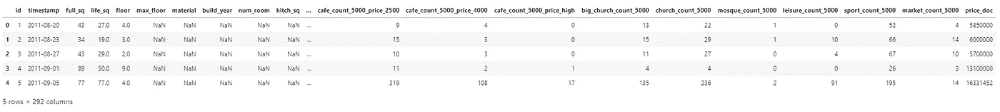
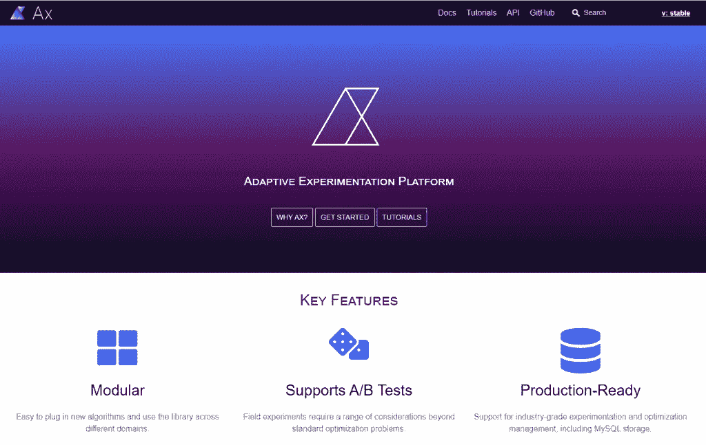
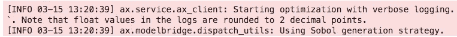
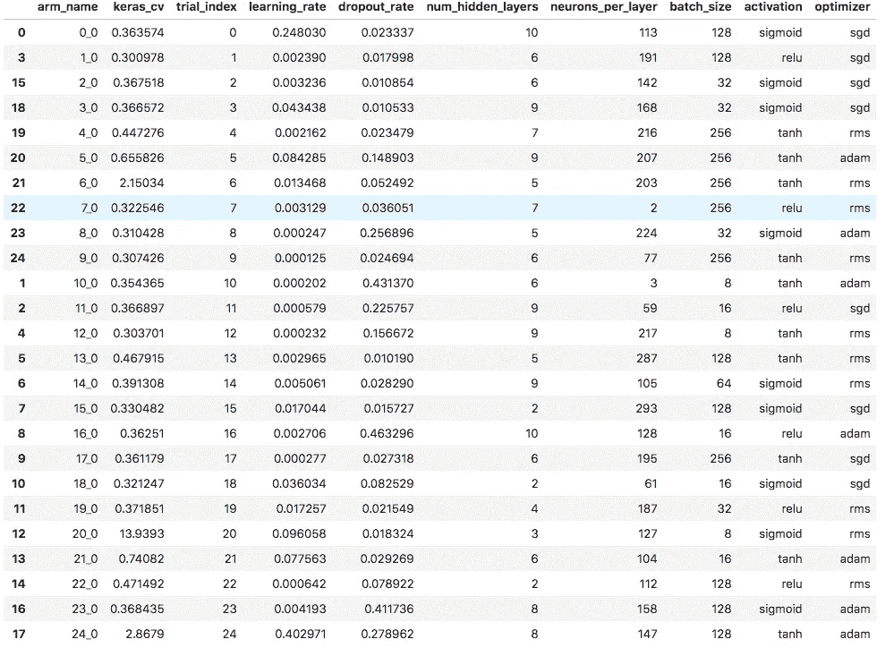
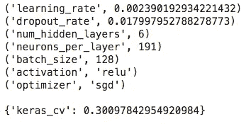
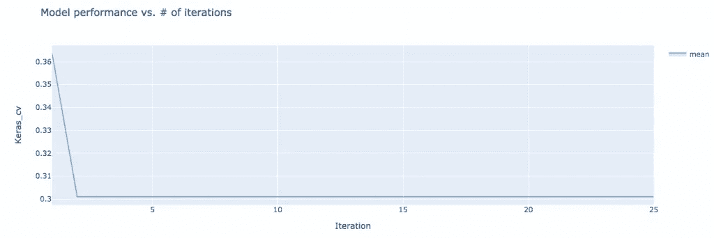

# 使用 Python 进行超参数调优:完整的分步指南

> 原文：<https://towardsdatascience.com/hyperparameter-tuning-with-python-keras-xgboost-guide-7cb3ef480f9c?source=collection_archive---------8----------------------->

## 为什么以及如何使用示例 **Keras** / **XGBoost**

来源:[土坯股票](https://stock.adobe.com/ca/images/businesswoman-in-suit-and-ballet-shoes-jumping-with-coffee-and-digital-tablet-isolated-on-grey/189458703)

我们都喜欢建立机器学习或统计模型。但是，一个经常被忽略的重要步骤是**超参数调整**。

在这篇文章中，你会看到:

*   **为什么要使用**这种机器学习技术。
*   **如何使用**搭配 **Keras** (深度学习神经网络) **Tensorflow** 搭配 **Python** 。
    本文是文章[用 Python 调优超参数:完整分步指南](https://www.justintodata.com/hyperparameter-tuning-with-python-complete-step-by-step-guide/)的配套文章。要查看关于 **XGBoost** 的示例，请阅读上一篇文章。

如果你想更快更远地提高你的模型的性能，让我们开始吧！

# 常见问题解答:什么是超参数调整/优化，为什么

## 超参数到底是什么？

> **超参数**是一个参数，其值在学习过程开始前设置。
> 
> 相比之下，其他**参数**的值是通过训练数据得出的。
> 
> [维基百科](https://en.wikipedia.org/wiki/Hyperparameter_(machine_learning))

例如，神经网络有许多超参数，包括:

*   隐藏层数
*   神经元数量
*   学习率
*   激活功能
*   和优化器设置

## 我们为什么要关心这些超参数？

因为这些超参数对于机器学习模型的性能、速度和质量至关重要。因此，我们应该优化它们。

> 超参数优化找到一个超参数元组，该元组产生一个最佳模型，该模型最小化给定测试数据上的预定义损失函数。目标函数采用一组超参数，并返回相关的损失。
> 
> [维基百科](https://en.wikipedia.org/wiki/Hyperparameter_optimization)

但是这些超参数看起来都很复杂。将它们结合在一起会导致更高维的问题，这甚至更糟糕。

我们应该如何选择这些超参数的值？

通常，我们根据自己的经验并通过反复试验的过程来选择它们。它是非常手动的，并不能保证我们的模型是最好的。

## 有什么更好的方法来调优超参数？

我们需要一个系统的方法来优化它们。

有网格搜索、随机搜索等基本技术；还有更复杂的技术，如贝叶斯优化，进化优化。

虽然我们没有涵盖这些方法的细节，但看看[维基百科](https://en.wikipedia.org/wiki/Hyperparameter_optimization#Approaches)或【YouTube 视频了解详情。

现在让我们一步一步地看看超参数调优。

**相关文章:** [超参数调优的冠状病毒死亡率是多少](https://www.justintodata.com/coronavirus-death-rate-with-hyperparameter-tuning/)

# 步骤#1:预处理数据

在本帖中，我们使用来自 Kaggle 的[俄罗斯住房数据集](https://www.kaggle.com/c/sberbank-russian-housing-market/overview/description)。这个项目的目标是预测俄罗斯的房价波动。我们不会为它找到最好的模型，而只是将它作为一个例子。

在我们开始构建模型之前，让我们先来看看它。

为了准备用于建模演示的数据 *df* ，我们仅通过以下方式对其进行轻微处理:

*   将目标 *log(price_doc)* (房价的对数)，作为 *y* ，与其余的数字特征，作为 *X* 。
    在本例中，我们将只使用数字特征。
*   使用数值要素的中值输入缺失值。
*   将 X 和 y 进一步拆分为训练和测试数据集。
*   为训练数据集和测试数据集缩放特征。
    如果不进行转换，数据集无法适合神经网络。

现在，我们有了一个新的训练数据集 *X_train_scaled* ，其中 90%的数据来自原始数据集。

**相关文章:**[Python 中的数据清理:终极指南(2020)](https://www.justintodata.com/data-cleaning-python-ultimate-guide/)
在之前的这篇文章中，我们探索了使用相同数据集的数据清理技术。

# 步骤#2:定义优化的目标

在开始调优过程之前，我们必须为超参数优化定义一个目标函数。

我们将使用 [Tensorflow Keras](https://www.tensorflow.org/guide/keras) 对房价建模。这是一个用于 Python 的深度学习神经网络 API。

首先，我们需要建立一个模型 *get_keras_model* 。这个函数定义了 [**多层感知器**](https://en.wikipedia.org/wiki/Multilayer_perceptron) (MLP)，这是最简单的深度学习神经网络。MLP 至少由三层节点组成:输入层、隐藏层和输出层。

然后基于该模型，我们创建目标函数 *keras_mlp_cv_score* 如下:

*   关键输入*参数化*包括将被调整的 MLP 的超参数:
    –数量 _ 隐藏 _ 层数
    –神经元 _ 每层
    –丢弃 _ 速率
    –激活
    –优化器
    –学习 _ 速率
    –批处理 _ 大小
*   [MSE](https://en.wikipedia.org/wiki/Mean_squared_error) (均方误差)用作得分/损失函数，该函数将在超参数优化中最小化。
*   我们还使用交叉验证来计算给定的一组超参数值的得分(MSE)。

对于任何一组给定的超参数值，该函数基于交叉验证返回得分的平均值和标准差(MSE)。

您可以在下面的 Python 代码中看到详细信息。

根据我们自己的经验，我们还为将要调整的超参数值设置了限制。

选择这些限值没有一致的方法。你需要理解这些超参数并做出决定。

# 步骤 3:选择包:Ax

在我们之前的文章([什么是使用超参数调整的冠状病毒死亡率](https://www.justintodata.com/coronavirus-death-rate-with-hyperparameter-tuning/))中，我们使用[hyperpt](https://github.com/hyperopt/hyperopt)包应用了超参数调整。虽然它是一个流行的包，但我们发现它使用起来很笨拙，并且缺乏好的文档。

我们一直在寻找其他包，最终找到了 [Ax](https://ax.dev/) (自适应实验平台)。

Ax 是一个新的平台，有助于优化任何类型的实验，包括机器学习、A/B 测试和模拟。它是由脸书开发的，现在是脸书开源项目的一部分。

我们选择它是因为它:

*   内置特性，支持将结果保存到 JSON 文件或 MySQL 数据库。
*   从属参数约束的支持。
    比如我们可以将参数 m 和 n 的界限设置为 1 < m < 10，0 < n < 10，m*n > 10。而其他大多数软件包不支持 m*n > 10 条件。
*   良好的可视化功能。
*   体面的文件。
    虽然不是全部清晰，但比其他包装如远视要好。

Ax 也有三种不同的 API(使用模式)用于超参数调整:

*   **循环 API** 使用起来最简单。但是它不允许足够的定制。
*   **服务 API** 比循环 API 允许更多的控制，尤其是对试验的控制。这种控制很有价值，因为:
    –您可以将试验安排在不同的时间进行，甚至可以与其他试验同时进行。
    –您还可以在每次试验后保存进度，而不是等到所有试验完成后才看到结果。
*   **开发者 API** 允许最多的控制，但需要最多的知识，这并不容易，因为:
    –特性的文档并不都很清楚。
    –网站上的例子没有显示优化后如何获得最佳参数。
    –你经常需要浏览 API 来完成这个过程。

由于 Loop API 的局限性和缺乏明确的开发者 API 示例，我们将使用*服务 API* 。

**相关文章:** [超参数调优的冠状病毒死亡率是多少](https://www.justintodata.com/coronavirus-death-rate-with-hyperparameter-tuning/)

# 步骤#4:优化/调整超参数

最后，我们可以开始优化过程。

在服务 API 中，我们不需要太多关于 Ax 数据结构的知识。所以我们可以按照它的[样本代码](https://ax.dev/docs/api.html)来设置结构。

我们用之前构建的目标函数和超参数列表创建实验 *keras_experiment* 。

运行上面的代码后，您会看到下面的日志记录。

如前所述，有不同的方法来搜索超参数的最佳值。根据*generation _ strategy*的 [Ax_client 文档，如果没有显式选择，则根据搜索空间的属性智能选择方法。从注释中可以看出，Ax_client 在本练习中选择了](https://ax.dev/api/service.html#ax-client) [*Sobol*](https://en.wikipedia.org/wiki/Sobol_sequence) (一种统一搜索)。

接下来，让我们运行实验来评估不同的超参数值。

由于这个项目只是为了演示，我们进行了少量的 25 次试验。

每个试验评估超参数值的可能组合，并从 keras_mlp_cv_score 函数中输出分数。Ax_client 跟踪参数和分数的历史，并智能地猜测下一组更好的参数。

随着代码的运行，您还可以看到每次试验的日志记录。

# 步骤 5:打印/可视化结果

## 打印结果

要以表格的形式查看结果，您可以使用下面的代码将其打印出来。

为了查看超参数的最佳值，我们使用下面的代码。

## 可视化结果

除了打印数字之外，您还可以可视化结果。

我们可以绘制 keras_cv 分数在迭代过程中的演变。可以看到，经过 2 次迭代/尝试，分数达到了最小值。

## 评估结果

另外，我们可以使用这个模型对测试数据集进行预测。

以下 Python 代码打印出的测试结果的 MSE 为 0.30，与训练数据集中的 MSE 接近。

# 步骤#6:保存结果—可选

如前所述，Ax 还允许我们将流程保存到 JSON 文件中。

当我们想暂停并在以后继续这个过程时，这很方便。

就是这样。你做到了！如果你有任何问题，请留言。

如果你想看一个 Python 中 XGBoost 的例子，请阅读[Hyperparameter Tuning with Python:Complete Step-by-Step Guide](https://www.justintodata.com/hyperparameter-tuning-with-python-complete-step-by-step-guide/)。

离开之前，别忘了去 [*报名参加刚刚进入数据通迅的*](https://www.justintodata.com/) ！或者通过[推特](https://twitter.com/JustintoData)、[脸书](https://www.facebook.com/justintodata/)与我们联系。
因此，您*不会*错过我们的任何新数据科学文章。

*原载于 2020 年 3 月 13 日 https://www.justintodata.com***。**

* [## 如何在 Python 中使用 NLP:一个实用的分步示例——只进入数据

### 这是 Python 中超参数调优的实用指南。要提高模型的性能，请学习:-为什么你…

www.justintodata.com](https://www.justintodata.com/use-nlp-in-python-practical-step-by-step-example/)  [## 如何提高体育博彩赔率 Python 中的一步一步指南-只是进入数据

### 体育博彩可能不仅仅是利用你的直觉。查看我用来赚 20，000 美元的数据科学策略…

www.justintodata.com](https://www.justintodata.com/improve-sports-betting-odds-guide-in-python/)  [## Python 中的数据清理:终极指南(2020)——只进入数据

### 我们用 Python 创建了这个新的完整的分步指南。你将学习如何寻找和清理的技巧:丢失…

www.justintodata.com](https://www.justintodata.com/data-cleaning-python-ultimate-guide/)*