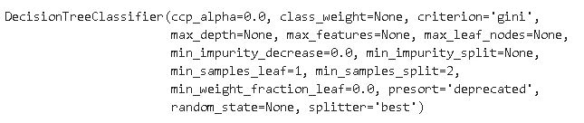
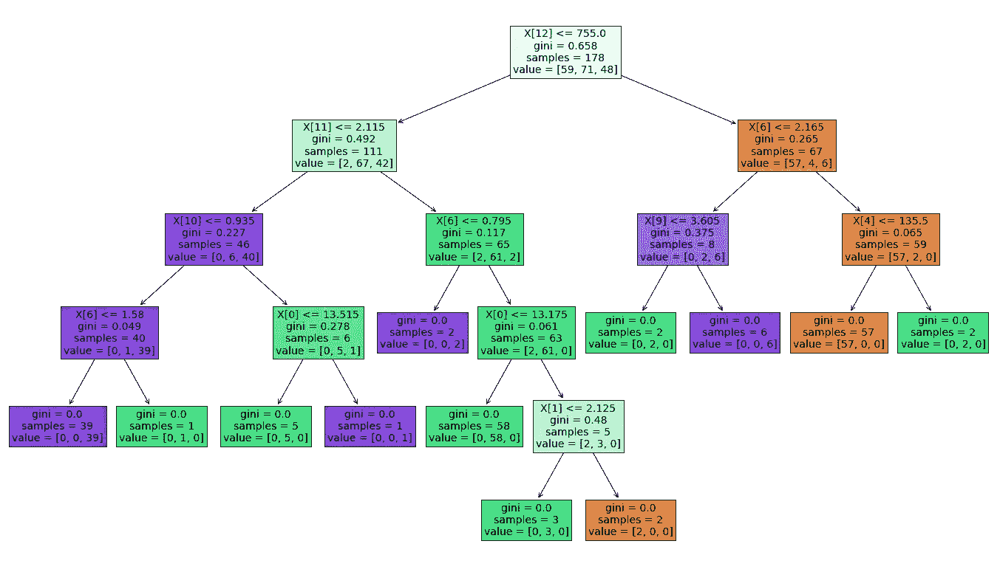
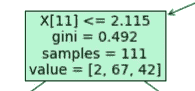
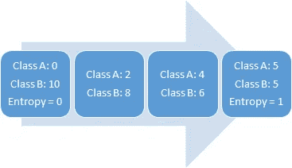
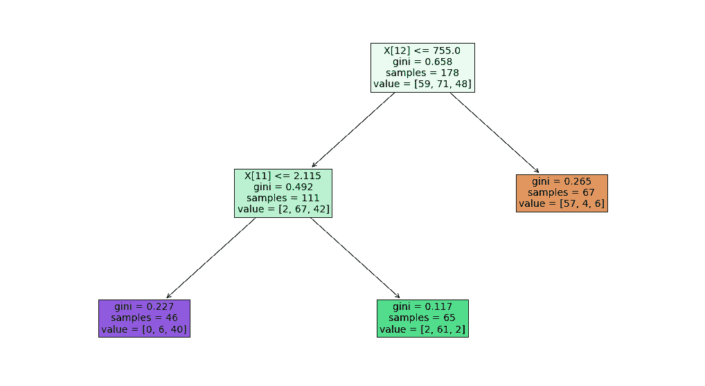
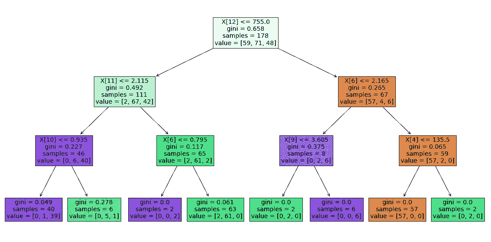
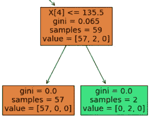
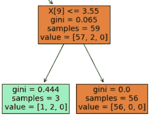
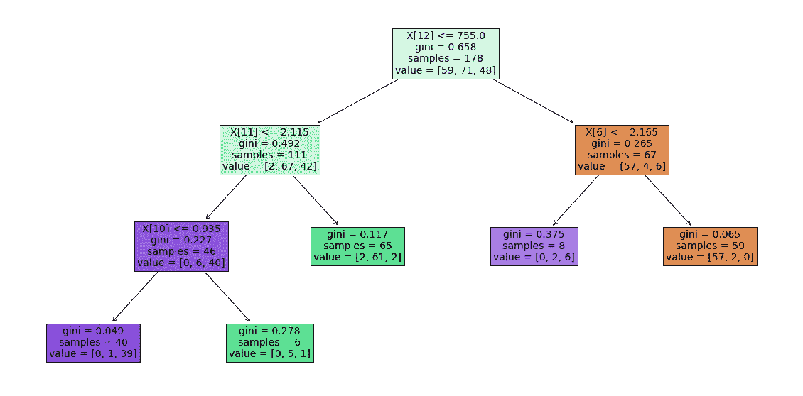

# 用可视化解释决策树的超参数

> 原文：<https://towardsdatascience.com/hyperparameters-of-decision-trees-explained-with-visualizations-1a6ef2f67edf?source=collection_archive---------5----------------------->

## 超参数在建立稳健模型中的重要性。

决策树是一种广泛使用的监督学习算法，适用于分类和回归任务。决策树是一些著名的集成学习算法的构建模块，如随机森林、GBDT 和 XGBOOST。

决策树建立在反复询问问题以划分数据的基础上。例如，下图显示了一个用作预测客户流失模型的决策树。


决策树在机器学习领域很流行，因为它们既成功又简单。使它们非常高效的一些特性:

*   易于理解和解释
*   可以处理数字和分类数据
*   需要很少或不需要预处理，如标准化或虚拟编码

不利的一面是，决策树容易过度拟合。它们很容易变得过于复杂，这使得它们无法很好地推广到数据集中的结构。在这种情况下，模型很可能以**过度拟合**而告终，这是机器学习中的一个严重问题。

为了克服这个问题，我们需要仔细调整决策树的超参数。在本帖中，我们将尝试使用树形可视化来全面理解这些超参数。

我们将使用 scikit-learn 的一个内置数据集。葡萄酒数据集包含三个不同葡萄酒类别的 13 个特征(即列)。数据集中有 178 个样本(即行)。

```
import numpy as np
import pandas as pdfrom sklearn.datasets import load_wine
X, y = load_wine(return_X_y = True)
```

让我们从没有任何超参数调整的决策树分类器开始。

```
from sklearn import treeclf = tree.DecisionTreeClassifier()
clf.fit(X, y)
```



所有超参数都设置为默认设置。我们可以使用 **plot_tree** 函数绘制我们的模型。

```
import matplotlib.pyplot as plt
%matplotlib inlineplt.figure(figsize=(24,14))
tree.plot_tree(clf, filled=True, fontsize=14)
```



该模型不断分割节点，直到所有节点都是纯的(即包含仅来自一个类别的样本)。让我们先了解一下 a 中的信息



盒子告诉我们。第一行表示特征的名称(即列)。因为我们没有命名列，所以显示了列的索引。**样本**表示观察值的数量(即行数)**值**表示这些样本根据目标变量的分布。

基尼系数是衡量杂质的一个标准。正如在[维基百科](https://en.wikipedia.org/wiki/Decision_tree_learning)上所述，“基尼不纯度是对从集合中随机选择的元素被错误标记的频率的度量，如果它是根据标签在子集中的分布随机标记的话”。基本上就是杂质随着随机性增加。例如，假设我们有一个盒子，里面有十个球。如果所有的球都是同样的颜色，我们就没有随机性，杂质为零。然而，如果我们有 5 个蓝色球和 5 个红色球，杂质是 1。如果你看一下叶节点(树末端的节点)，你会发现基尼等于零。

评估分裂质量的另一个函数是**熵**，它是不确定性或随机性的度量。一个变量的随机性越大，熵就越大。



熵 vs 随机性

我们可以使用**标准**参数选择基尼或杂质。默认值是基尼。

> 我们通常不希望一棵树只有纯叶节点。它会太具体，可能会过拟合。

当算法执行拆分时，主要目标是尽可能减少杂质。杂质减少得越多，分裂获得的信息量就越大。随着树变得更深，杂质减少的量变得更低。我们可以利用这一点来防止树做进一步的分裂。该任务的超参数是**最小杂质减少**。默认情况下，它被设置为零。让我们改变它，看看有什么不同。

```
clf = tree.DecisionTreeClassifier(min_impurity_decrease=0.2)
clf.fit(X, y)
plt.figure(figsize=(18,10))
tree.plot_tree(clf, filled=True, fontsize=14)
```



我们现在有了一棵更小的树。考虑底部的绿色节点。它包含 65 个样本，其中 61 个属于一个类。没有必要进一步分割该节点，因为我们可以承受 65 个样本中的 4 个错误分类。如果我们继续分割那个节点，模型可能会过拟合。**最小杂质分割**参数可用于根据杂质值控制树。它设定了基尼系数的门槛。例如，如果 min _ infinity _ split 设置为 0.3，则节点需要具有大于 0.3 的基尼值才能进一步分裂。

另一个控制树深度的超参数是 **max_depth** 。它不进行任何关于杂质或样品比率的计算。当达到 max_depth 时，模型停止分割。

```
clf = tree.DecisionTreeClassifier(max_depth=3)
clf.fit(X, y)
plt.figure(figsize=(20,10))
tree.plot_tree(clf, filled=True, fontsize=14)
```



与最小杂质减少相比，最大深度灵活性较差。举个例子，



我们也许不应该在左边分开。它只能区分 2 个样品，杂质减少不到 0.1。这实际上带给我们另一个超参数，即 **min_samples_leaf** 。它表示叶节点上所需的最小样本数。在一起使用超参数时，我们需要小心。例如，如果我们在前一个树中将 min_samples_leaf 设置为 3，那么将不会发生分隔 2 个样本的拆分，因为我们不能拥有少于 3 个样本的叶节点。嗯，不太对。让我们看看到底会发生什么。

```
clf = tree.DecisionTreeClassifier(max_depth=3,min_samples_leaf=3)
clf.fit(X, y)
plt.figure(figsize=(20,10))
tree.plot_tree(clf, filled=True, fontsize=14)
```



在这种情况下，min_samples_leaf 实际上对模型是有害的。这并不妨碍模型进行最后的分割。此外，它还造成了额外的错误分类。因此，以这种方式使用 min_samples_leaf 是不明智的。

我们还可以使用 **max_leaf_nodes** 参数限制叶节点的数量，该参数以最佳优先的方式增长树，直到达到 max_leaf_nodes。最佳分割是基于杂质减少来决定的。

```
clf = tree.DecisionTreeClassifier(max_leaf_nodes=5)
clf.fit(X, y)
plt.figure(figsize=(20,10))
tree.plot_tree(clf, filled=True, fontsize=14)
```



我们最终得到一个有 5 个叶节点的树。

决策树的另一个重要超参数是 **max_features** ，它是寻找最佳分割时要考虑的特征数量。如果未指定，模型将考虑所有特征。我们的数据集中有 13 个要素。如果我们将 max_features 设置为 5，则模型随机选择 5 个特征来决定下一次分割。Max_features 参数也有助于防止模型过度拟合，但仅仅使用 max_features 是不够的。如果我们让模型变得太深，它最终会使用所有的功能。

需要仔细调整超参数，以获得具有高样本外精度的健壮决策树。我们不需要使用所有的方法。根据任务和数据集的不同，几个就足够了。如果同时使用多个超参数，请格外注意，因为其中一个可能会对另一个产生负面影响。

感谢您的阅读。如果您有任何反馈，请告诉我。