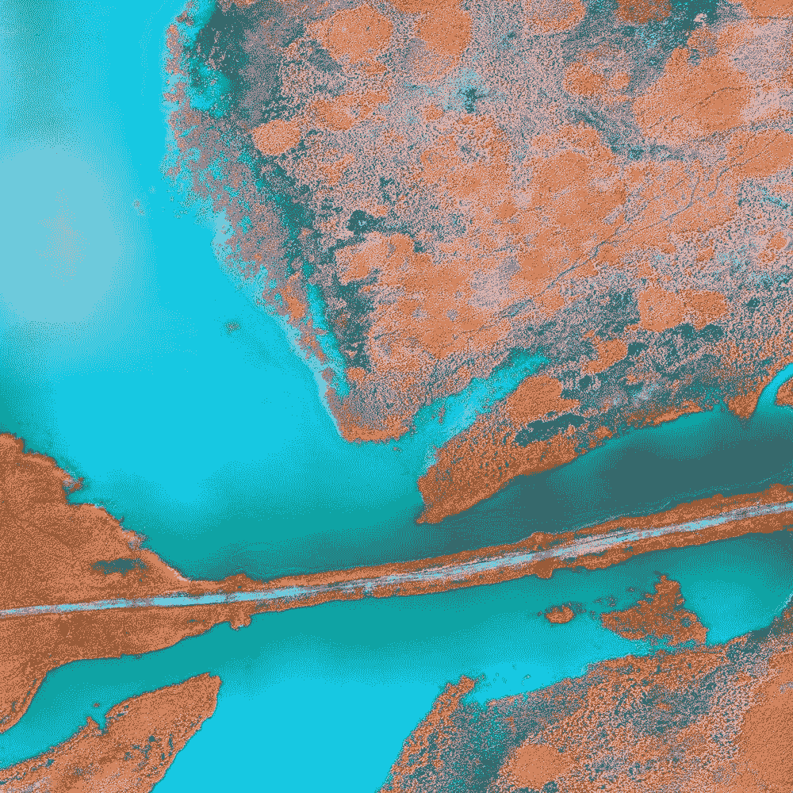
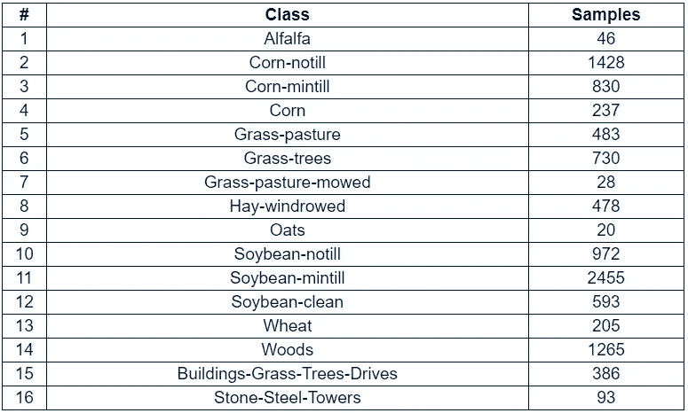
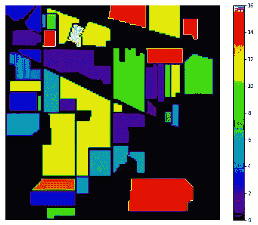
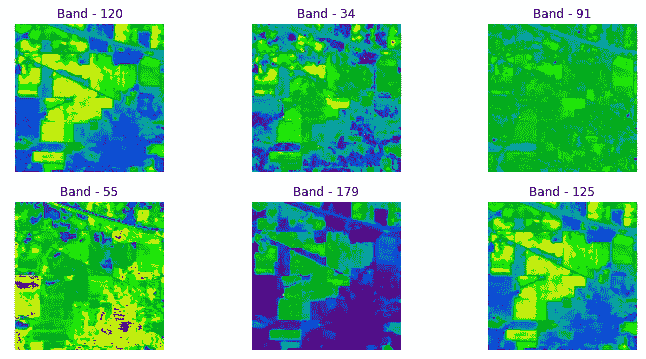
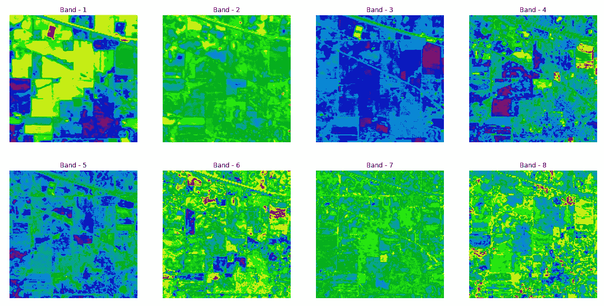
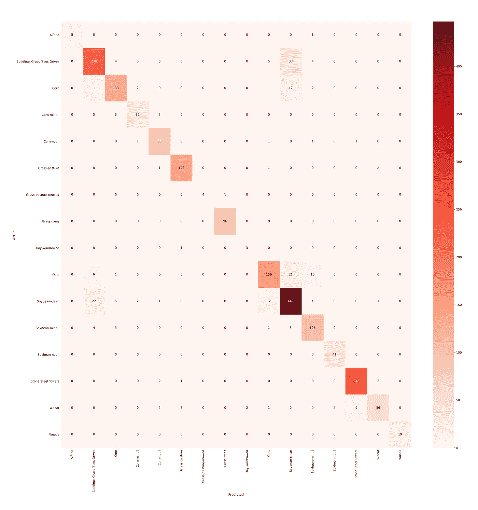
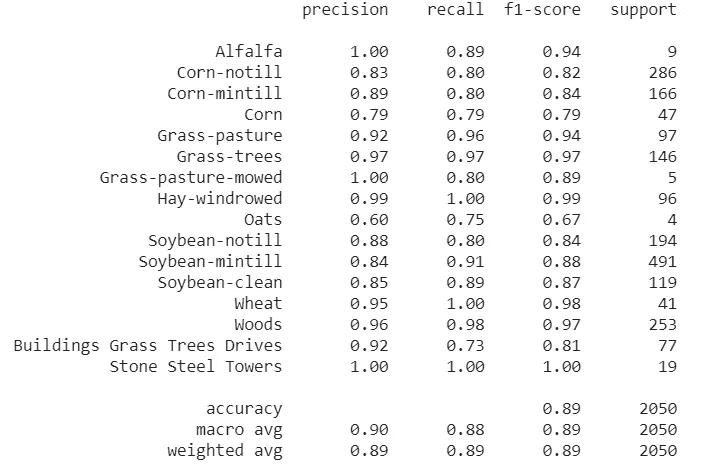
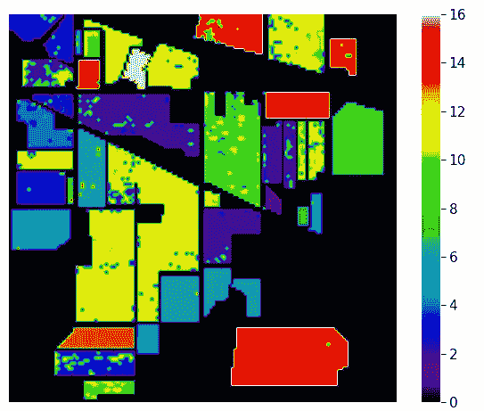

# 超光谱图像分析分类

> 原文：<https://towardsdatascience.com/hyperspectral-image-analysis-classification-c41f69ac447f?source=collection_archive---------10----------------------->

## 初学者指南

## 使用 *python 对高光谱图像(HSI)进行分类的演练。*

[美国地质勘探局](https://unsplash.com/@usgs?utm_source=unsplash&utm_medium=referral&utm_content=creditCopyText)在 [Unsplash](https://unsplash.com/?utm_source=unsplash&utm_medium=referral&utm_content=creditCopyText) 上拍摄的照片

本文提供了高光谱图像(HSI)上不同分类算法的详细实现。

# 目录

*   **高光谱图像(HSI)简介**
*   **降维**
*   **分类算法**
*   **实施 HSI 分类**
*   **参考文献**

# 超光谱图像(HSI)介绍

在*遥感*中，高光谱遥感器以其高光谱分辨率被广泛用于监测地球表面。通常，与传统的 RGB 图像相比，HSI 包含三个以上的波段。高光谱图像(HSI)用于解决不同领域的各种问题，如 C *rop 分析*，G *地质测绘*，M *矿物勘探*，*国防研究、城市调查、军事监视、*等。

使用以下文章，该文章提供了关于 HSI 上的*数据收集*、*数据预处理、*和*探索性数据分析*的信息。

 [## 超光谱图像分析—入门

### 使用 Python 进行高光谱图像分析的演练。

towardsdatascience.com](/hyperspectral-image-analysis-getting-started-74758c12f2e9) 

有各种开源网站为学习目的提供超光谱数据。以下是两个受欢迎的网站:

 [## 高光谱遥感场景

### 收集者:M . graa，MA Veganzons，B . ayer di 在这里你可以找到一些公开的高光谱信息…

www.ehu.eus](http://www.ehu.eus/ccwintco/index.php/Hyperspectral_Remote_Sensing_Scenes)  [## 数据- rslab

### (1)在 VV 和 VH 极化下的 SAR 哨兵-1 卫星图像

rslab.ut.ac.ir](https://rslab.ut.ac.ir/data) 

在本文中，我们使用**印度松树(IP)** 高光谱图像数据集。印第安松树(IP) HSI 数据是使用 [AVIRIS 传感器](http://aviris.jpl.nasa.gov/)在印第安纳州西北部的印第安松树试验场收集的，由 145 X 145 像素、16 类和 200 个波段组成。以下是印度松树(IP)数据集的地面实况详细信息:

印度松树(IP)数据集的地面实况细节-作者提供的图像

读取数据集的代码:

Indian Pines 数据集的地面真实情况的可视化如下所示:

印度松树数据集的地面真实可视化——图片由作者提供

六个随机选择的超过 200 个波段的可视化如下所示:

印度松树条带(IP)数据集的可视化-图片由作者提供

# **降维**

降维用于减少数据的维数，从而为分类器以低计算成本生成综合模型铺平道路。因此，降维在提高高光谱图像像素分类精度方面变得越来越重要。

降维有两种方式。它们是:

*   特征选择
*   特征抽出

**特征选择**是选择数据集特征维度的过程，它为机器学习任务(如分类、聚类等)提供模式。这可以通过使用不同的方法来实现，如相关性分析、单变量分析等

**特征提取**特征提取是通过选择和/或组合现有特征来创建缩减的特征空间，同时仍然准确和完整地描述数据集而不丢失信息，从而发现新特征的过程。

基于准则函数和收敛过程，降维技术也分为凸和非凸两类。一些流行的降维技术包括 PCA、ICA、LDA、GDA、核 PCA、Isomap、局部线性嵌入(LLE)、Hessian LLE 等。

使用下面的文章“使用 Python 降低超光谱图像的维数”来更好地理解。

 [## 利用 Python 实现高光谱图像的降维

### 高光谱图像的降维技术。

towardsdatascience.com](/dimensionality-reduction-in-hyperspectral-images-using-python-611b40b6accc) 

在本文中，我们将使用**主成分分析(PCA)** 来降低数据的维度。

## 主成分分析

主成分分析(PCA)是用于降低数据维度的标准算法之一。PCA 是一种非参数算法，其增加了可解释性，同时减少了最小化的信息损失(重建误差)。

使用下面两篇论文来更好地理解 PCA 背后的数学原理。

 [## 主成分分析教程

### 主成分分析(PCA)是现代数据分析的中流砥柱-一个广泛使用的黑箱，但…

arxiv.org](https://arxiv.org/abs/1404.1100)  [## 主成分分析:回顾与进展

### 大型数据集在许多学科中越来越普遍。为了解释这样的数据集，方法是…

royalsocietypublishing.org](https://royalsocietypublishing.org/doi/10.1098/rsta.2015.0202) 

基于解释的方差比，组件的数量取为 40。下面的代码解释了—

前八个主成分或八个波段如下所示:

主成分分析后的前八个波段

# 分类算法

分类指的是预测建模问题，其中为给定的输入数据预测类别标签。分类可分为:

*   分类预测建模
*   二元分类
*   多类分类
*   多标签分类
*   不平衡分类

今天，我们正在处理多类分类问题。有不同的分类算法用于高光谱图像(HSI)的分类，例如:

*   k-最近邻
*   支持向量机
*   光谱角度制图仪
*   卷积神经网络
*   决策树

在本文中，我们将使用**支持向量机(SVM)** 对高光谱图像(HSI)进行分类。

## **支持向量机(SVM)**

支持向量机是一种监督分类算法，可以最大化数据和超平面之间的间隔。不同的核函数用于将数据投影到更高维度，例如线性、多项式、径向基函数(RBF)等

为了更好的理解，SVM 背后的概念参考下面的讲座:

 [## 大间隔分类背后的数学-支持向量机| Coursera

### 斯坦福大学为“机器学习”课程制作的视频。支持向量机，简称 SVMs，是一种机器…

www.coursera.org](https://www.coursera.org/lecture/machine-learning/about-3eNnh)  [## 内核 II -支持向量机| Coursera

### 斯坦福大学为“机器学习”课程制作的视频。支持向量机，简称 SVMs，是一种机器…

www.coursera.org](https://www.coursera.org/lecture/machine-learning/kernels-ii-hxdcH)  [## 优化目标-支持向量机| Coursera

### 斯坦福大学为“机器学习”课程制作的视频。支持向量机，简称 SVMs，是一种机器…

www.coursera.org](https://www.coursera.org/lecture/machine-learning/optimization-objective-sHfVT) 

# **实施 HSI 分类**

以下代码用于实现支持向量机对高光谱图像进行分类。

混淆矩阵是使用代码生成的:

混淆矩阵-作者图片

生成的分类报告由*分类准确度、准确度精度、召回率、F1 分数、*和*支持组成，如下所示:*

分类报告—按作者分类的图像

最后，分类图如下所示:

印度松树(IP)数据集的分类地图-按作者分类的图像

> 我在本文中写的全部代码可以在 GitHub 和 CoLab 中使用下面的笔记本来访问。

 [## syamkakarla 98/超光谱 _ 图像 _ 分析 _ 简化

### 超光谱图像分析-分类

github.com](https://github.com/syamkakarla98/Hyperspectral_Image_Analysis_Simplified/blob/master/Articles/Hyperspectral_Image_Analysis%E2%80%8A_%E2%80%8AClassification.ipynb)  [## 超光谱图像分析分类

### 使用 Python 对高光谱图像进行分类的演练

colab.research.google.com](https://colab.research.google.com/drive/1hugIX9_PJxAvKoXySzQcZ4aW-yYYUqIk?usp=sharing) 

# 参考

 [## 评估降维方法对信息类和分类器的影响…

### 土地覆被分类更喜欢分类器和降维方法的某些组合。*设计 MCS…

www.sciencedirect.com](https://www.sciencedirect.com/science/article/abs/pii/S0273117713007308)  [## 奇异值分解和主成分分析

### Wall M.E .，Rechtsteiner A .，Rocha L.M. (2003)奇异值分解和主成分分析。在:贝拉尔…

link.springer.com](https://link.springer.com/chapter/10.1007%2F0-306-47815-3_5)  [## sk learn . decomposition . PCA-sci kit-learn 0 . 23 . 2 文档

### 主成分分析。使用数据的奇异值分解进行线性降维…

scikit-learn.org](https://scikit-learn.org/stable/modules/generated/sklearn.decomposition.PCA.html)  [## sk learn . SVM . SVC-sci kit-learn 0 . 23 . 2 文档

### c-支持向量分类。该实现基于 libsvm。拟合时间至少与…成二次比例

scikit-learn.org](https://scikit-learn.org/stable/modules/generated/sklearn.svm.SVC.html)