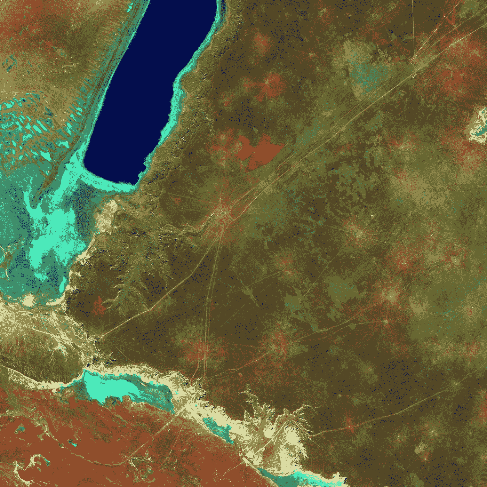
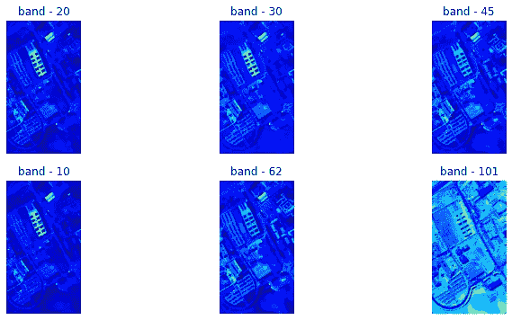

# 超光谱图像分析—入门

> 原文：<https://towardsdatascience.com/hyperspectral-image-analysis-getting-started-74758c12f2e9?source=collection_archive---------10----------------------->

## 初学者指南

## 使用 Python 进行高光谱图像分析的演练。

美国地质勘探局在 [Unsplash](https://unsplash.com?utm_source=medium&utm_medium=referral) 上拍摄的照片

高光谱图像(HSI)分析是人工智能(AI)研究的前沿领域之一，因为它在从*农业到监控*的各个领域都有应用。许多研究论文发表在这个领域，这使得它更加有趣！“对于初学者来说，在 HSI 上开始模式识别和机器学习非常麻烦”，因为与计算机视觉中的其他机器学习(ML)技术(如对象检测、人脸识别、GAN、自动编码器等)相比，它对社区的影响有限。

> 这篇文章提供了帮助初学者开始高光谱图像(HSI)分析的信息，从数据收集到数据可视化和分析，以及使用使用 **Python** 的交互式数据可视化工具。
> 
> 让我们开始:

# 目录

*   **简介**
*   **数据收集**
*   **数据预处理**
*   **探索性数据分析**

# **简介**

在*遥感*中，高光谱遥感器以其高光谱分辨率被广泛用于监测地球表面。**高光谱图像(HSI)** 数据通常包含同一空间区域内的数百个光谱带，这些光谱带为识别各种材料提供了有价值的信息。在 HSI 中，每个**像素**可以看作一个高维向量，其条目对应于从可见光到红外的光谱反射率。

高光谱数据的获取和收集变得更加容易和经济，使得高光谱图像分析成为许多应用中有前途的技术之一，包括精确农业、环境分析、军事监视、矿物勘探、城市调查等

**超光谱图像分类**的任务是对使用超光谱传感器捕获的图像中的每个像素的类别标签进行分类。本博客重点介绍**数据收集**、**数据预处理**和**探索性数据分析**。

# 数据收集

困难的部分来了，HSI 没有流行的数据源，这使得初学者很难开始 HSI 分析。以下是 HSI 的几个数据来源。

*   [计算智能集团](http://www.ehu.eus/ccwintco/index.php/Hyperspectral_Remote_Sensing_Scenes#Pavia_Centre_and_University)
*   [遥感实验室](https://rslab.ut.ac.ir/data)

# 数据预处理

高光谱图像(HSI)数据大多以。mat 文件。可以使用不同的编程语言访问，博客使用 python。

提取 HSI 的像素是重要的预处理任务之一。这使得更容易处理数据，也更容易实现机器学习算法，如分类、聚类等

*帕维亚大学数据集*用于说明目的。在意大利北部帕维亚上空的一次飞行活动中，[安明传感器](http://www.opairs.aero/rosis_en.html)拍摄到的 HSI 场景。*光谱波段数*为 103 *，HSI*的*大小为610*340 *像素*，地物包含 9 个*类*。图像中的一些像素不包含信息，并且在分析之前必须被丢弃。几何分辨率为 1.3 米。这里是来自帕维亚大学 HSI 的几个样本乐队。*

**

*帕维亚大学 HSI 的样本波段—图片由作者提供*

## *读取数据集*

*通过使用科学 Python(SciPy) python 库，我们可以读取数据集。以下代码用于读取数据集。*

*该函数返回数据和地面实况或类，还显示数据和地面实况的大小，它们是 3D 和 2D 矩阵。*

## *提取像素*

*像素是高光谱图像(HSI)中的单个元素，它是一个长度等于 HSI 波段数的向量。以下代码用于从 HSI 提取像素，保存到 *CSV* 文件中，并返回熊猫数据帧。*

# *探索性数据分析*

*这是很难处理的数据是巨大的，因为帕维亚大学数据集的维数很高。因此，使用主成分分析(PCA)将数据的维度降低到 3D，这是一种流行且广泛使用的维度降低技术。以下代码用于将数据集的维度缩减为三个。*

*上面的代码生成了一个数据帧，其中列是三个主要组件(PC)和类。让我们看几个交互式可视化来检查数据中的模式。*

*很难想象数据集中的所有模式，因为它包含近 45k。因此，*采样*数据是可视化所有数据点或观察值或像素的最佳方式。除计数图外，随机使用每个类别的 200 个样本来描绘这些图。*

*   ***计数图**:可以认为是一个分类变量的直方图，而不是一个定量变量。下图说明了 HSI 类别之间的关系。*我们可以看到在帕维亚大学 HSI* 中,“沥青、裸土、自阻挡砖块和树木”是最受欢迎的课程。*

*计数图-按作者排列的图像*

1.  ***结对图**:这是一种非常简单的可视化每个变量之间关系的方法。它提供了数据中每个变量之间的关系矩阵。下图显示了*主成分* (PC1、PC2 和 PC3)之间的关系。*

*PC-1、PC-2 和 PC-3 之间的配对图—图片由作者提供*

*2. **3D 散点图**:绘制三维轴上的数据点，显示三个变量之间的关系。*下图以 3D 散点图的形式展示了主成分(PC1、PC2 和 PC3)之间的关系*。*

*PC-1、PC-2 和 PC-3 之间的 3D 散点图—图片由作者提供*

*3. **3D 线图**:与 3D 散点图非常相似，但区别在于每个数据点都用一条线连接。下图以 3D 线图的形式显示了数据的可视化。*这里我们可以看到，即使使用线性降维技术(PCA)* ，类的投影也相当好。*

*PC-1、PC-2 和 PC-3 之间的 3D 线图—作者提供的图像*

*4.**面积图**:表示连接数据点和线段的一个变量相对于另一个变量的变化。主要组件(PC1、PC2 和 PC3)的可视化如下所示:*

*PC-1 和 PC-2 之间的面积图—作者提供的图像*

*PC-2 和 PC-3 之间的面积图—图片由作者提供*

*PC-2 和 PC-3 之间的面积图—图片由作者提供*

*这些是几种交互式可视化。*

> **现在，您知道了在哪里可以找到 HSI 数据，如何读取和转换，以及可视化数据或模式的不同方法。**
> 
> *如果您对帖子中显示的代码感兴趣，可以使用下面的链接访问:*

* [## 超光谱图像分析—入门

### 使用 Python 进行高光谱图像分析的演练

colab.research.google.com](https://colab.research.google.com/drive/1YxdtSvvhZCIf5u_d4pD69SKfpqPe0OrZ) 

> 下一篇博客将介绍在 HSI 分类中使用的不同分类算法。

 [## 超光谱图像分析分类

### 使用 python 对高光谱图像(HSI)进行分类的演练。

towardsdatascience.com](/hyperspectral-image-analysis-classification-c41f69ac447f) 

来源:

 [## Python 图形库

### Plotly 的 Python 图形库制作出交互式的、出版物质量的图形。如何制作线图的示例…

plotly.com](https://plotly.com/python/)  [## sk learn . decomposition . PCA-sci kit-learn 0 . 22 . 2 文档

### 主成分分析。使用数据的奇异值分解进行线性降维…

scikit-learn.org](https://scikit-learn.org/stable/modules/generated/sklearn.decomposition.PCA.html)*