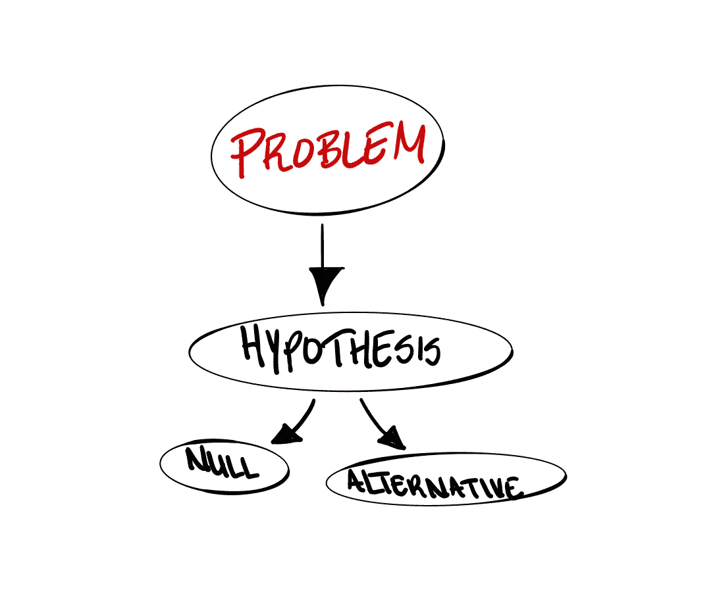

# 假设检验:解释 A/B 检验

> 原文：<https://towardsdatascience.com/hypothesis-testing-a-b-tests-explained-4d89de6b4ad2?source=collection_archive---------9----------------------->

## 假设检验的分类、A/B 检验的解释和 A/B 检验案例研究。

图片作者:特里斯特·约瑟夫

统计分析的一个重要目标是发现数据中的模式，然后将这些模式应用于“现实世界”。事实上，机器学习通常被定义为寻找模式并将其应用于大型数据集的过程。有了这种发现和应用模式的新能力，世界上的许多过程和决策都变得非常数据驱动。想一想；当一个人从亚马逊查看或购买一件商品时，他们通常会看到亚马逊推荐的他们可能会喜欢的产品。

现在，亚马逊不是在表演魔术。相反，他们已经建立了一个推荐系统，使用从用户那里收集的关于他们观看什么产品、喜欢什么产品以及购买什么产品的信息。有许多因素可以决定一个人是否“可能喜欢”一种产品并购买它。这些可以包括以前的搜索、当前搜索的频率、用户统计数据甚至一天中的时间。如果购买按钮是一种平静的颜色，如蓝色，人们是否更有可能点击购买按钮？嗯，这可以通过分析数据中的模式找到。

图片作者:特里斯特·约瑟夫

问题是，当数据受到随机噪声的影响时，很难确定一个合适的模式。这是因为随机噪声可以偶然产生模式。由于这种困难的存在，分析师必须使用所有适当的工具和模型来从他们的数据中做出推论。确定一个模式是否偶然出现的一种非常常见且严格的方法是进行假设检验。

假设检验是使用统计学来确定给定假设为真的概率。这意味着，可以通过假设一个特定的结果，然后使用统计方法来确认或拒绝该假设来解释数据。假设检验的通常过程包括四个步骤。首先，必须提出假设。**零假设**指的是被假定为真实的事情，通常的事实是，观察结果纯属偶然。**替代假设**指的是被检验为无效的东西，通常观察结果显示了一个真实的影响，并结合了一个随机变化的成分。

图片作者:特里斯特·约瑟夫

接下来，必须决定**测试统计量**。这是将用于帮助确定零假设的真值的方法和值。有许多测试统计可以使用，最合适的一个将取决于正在进行的假设检验。一旦找到检验统计量，就可以计算出 **p 值**。p 值是在假设零假设为真的情况下，获得至少与观察到的统计量同等重要的检验统计量的概率。换句话说，它是相应检验统计右侧的概率。p 值的好处是，通过将这个概率与α直接比较，可以在任何期望的显著性水平α下对其进行测试；这是假设检验的最后一步。

Alpha 指的是对结果有多少“信心”。当 alpha 为 5%时，意味着对结果有 95%的置信度。当比较 p 值和α值时，一旦 p 值小于或等于α值，就排除零假设。一般来说，p 值越低越好。这是因为低 p 值意味着，如果零假设为真，则出现与被测观测一样极端的观测结果的概率较小。本质上，p 值衡量样本统计量与给定的零假设的一致性。因此，如果 p 值足够小，就可以断定样本与零假设不相容，可以拒绝零假设。

图片作者:特里斯特·约瑟夫

现在，回到购买按钮是蓝色还是红色时人们更有可能点击这个问题。我仍然不知道，但像这样的场景在数据驱动的业务中经常大规模发生。这是假设检验的一种形式，用于优化业务的特定特征。这被称为 A/B 测试，指的是一种比较两个版本的东西，以找出哪个表现更好的方法。它包括同时向不同的业务用户群展示同一产品或功能的两个变体，然后通过使用成功和跟踪指标来确定哪个变体更成功。

A/B 测试往往与网站和 app 联系在一起，在大型社交媒体平台上极为常见。这是因为平台的转化率(有多少人看到了某样东西并点击了它)在很大程度上决定了平台的命运。因此，平台用户可以看到的每一条内容都需要优化，以实现其最大潜力。

A/B 测试的过程与前面解释的假设测试的过程相同。它需要分析师进行一些初步的研究，以了解正在发生的事情，并确定需要测试什么特性。此时，分析师还可以确定什么是成功和跟踪指标，因为他们会使用这些统计数据来了解观察结果的趋势。在此之后，假设将被公式化。没有这些假设，测试活动将没有方向。接下来，测试特性的变化将被随机分配给用户。然后收集和分析结果，并部署成功的变体。

图片作者:特里斯特·约瑟夫

最后，让我们检查一个假设的 A/B 测试。考虑一个大型社交媒体平台，其中既有分享生活内容的个人用户，也有分享重要信息(如公司更新或世界新闻)的公司。可以看出，用户对公司内容的参与度很低，这是一个问题，因为该平台希望确保其用户群尽可能跟上世界各地发生的事情。从逻辑上讲，我们的目标是制定一个计划来提高用户对公司内容的参与度。

可以合理地假设，参与度可能较低，因为公司内容隐藏在个人内容中，用户不会立即意识到他们正在浏览两种不同类型的内容。因此，如果将公司内容从个人内容中分离出来，然后放在自己的“新闻页面”上，参与度可能会提高。这样，用户将确切地知道他们正在观看的内容类型，他们可能会花更多的时间来了解他们周围的世界；从而提高参与度。因此，零假设可能是重新设计的平均参与度和原始设计的平均参与度之间的差异不等于零。另一个假设是，均值之间的差异明显大于零。

图片作者:特里斯特·约瑟夫

这个测试的成功标准是访问这个“新闻页面”的用户数量(来自测试样本)。原因是这种重新设计只有在用户访问和消费该页面上的内容时才能成功。跟踪指标可以是每个用户的观看时间。这是因为需要确定用户到达页面后是否还在与内容互动，或者他们是否已经登陆页面(出于偶然或类似原因)并立即离开。

如果发现重新设计的参与度明显更高，而且这不是偶然的，那么应该对整个平台实施重新设计。应该注意的是，该示例是 A/B 测试过程的简化版本，但是仍然可以应用这些概念。

欢迎来到假设检验的奇妙世界！

**参考文献:**

[ab 测试/#如何执行 ab 测试](https://vwo.com/ab-testing/#how-to-perform-an-a-b-test)

machinelearningmastery.com/statistical-hypothesis-tests/

【mathworld.wolfram.com/HypothesisTesting.html 

[ncbi.nlm.nih.gov/pmc/articles/PMC5991789/](https://www.ncbi.nlm.nih.gov/pmc/articles/PMC5991789/)

[statistics byjim . com/假设检验/解释-p 值/](https://statisticsbyjim.com/hypothesis-testing/interpreting-p-values/)

**其他有用的素材:**

[Amazon . com/Introducing-Statistics-Graham-J-G-Upton/DP/0199148015](https://www.amazon.com/Introducing-Statistics-Graham-J-G-Upton/dp/0199148015)

[optimize ly . com/optimization-glossary/AB-testing/#:~:text = AB % 20 testing % 20 is % 20 essentially % 20 an，for % 20a % 20 given % 20 conversion % 20 goal。](https://www.optimizely.com/optimization-glossary/ab-testing/#:~:text=AB%20testing%20is%20essentially%20an,for%20a%20given%20conversion%20goal.)

[researchgate.net/post/how_to_interpret_P_values](https://www.researchgate.net/post/how_to_interpret_P_values)

[towards data science . com/statistical-tests-when-to-use-which-704557554740](/statistical-tests-when-to-use-which-704557554740)

[neilpatel.com/blog/ab-testing-introduction/](https://neilpatel.com/blog/ab-testing-introduction/)