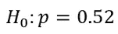
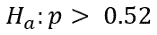
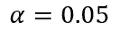
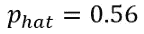
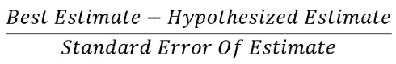
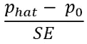
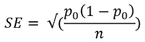
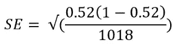
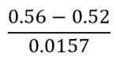
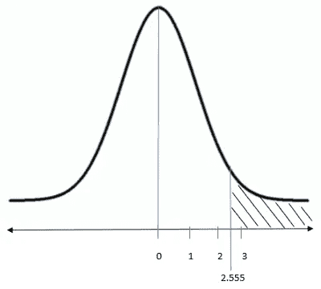

# 假设检验、特征和计算

> 原文：<https://towardsdatascience.com/hypothesis-testing-characteristics-and-calculation-ba3bdf516ea5?source=collection_archive---------35----------------------->

在 [Unsplash](https://unsplash.com?utm_source=medium&utm_medium=referral) 上由 [Albert S](https://unsplash.com/@albert_s?utm_source=medium&utm_medium=referral) 拍摄的照片

## 什么是假设检验，它的重要特征以及如何进行假设检验

假设检验是一种统计方法，用于检验关于总体的公认主张的有效性。这种被普遍接受的说法被称为无效假设。基于 p 值，我们拒绝或未能拒绝零假设。

# 要记住的关键特征

1.  p 值越小，应该拒绝零假设的证据就越强。
2.  当样本量足够大时，检验统计量服从正态分布。当样本中至少有 10 个肯定答案和 10 个否定答案时，样本量就可以称为足够大。请参见下面的例子以获得更清楚的解释。

# 用一个例子理解假设检验

下面是研究问题:

去年，52%的父母认为电子产品和社交媒体是他们青少年睡眠不足的原因。“现在有更多的父母认为他们的孩子睡眠不足是由电子产品和社交媒体造成的吗？”

这个问题摘自 Coursera 的“使用 Python 进行推断统计分析”课程。在这个问题中，我们被要求测试，是否有大量的父母认为社交媒体是他们青少年睡眠不足的原因。以下是执行该测试的逐步过程:

第一步:

建立了**零假设**。在任何假设检验中，我们都需要在收集任何数据之前建立假设。研究人员提出了两个假设。第一个是零假设，即研究者想要检验和拒绝的信念或前提。在上面的例子中，零假设是 0.52。因为 52%的父母认为电子产品和社交媒体导致了他们青少年的睡眠不足。

第二步:

定义**替代假设**。再看研究题。我们需要弄清楚今天是否有更多的父母认为电子产品和社交媒体是睡眠不足的原因。这意味着，我们必须找出今天 p 是否大于 0.52。

在进行 p-检验后，如果我们有足够的证据拒绝零假设，我们将接受替代假设。

第三步:

选择**显著性水平**。大多数时候研究人员选择 0.05。这意味着置信度为 95%。显著性水平小于或等于 5%的 p 值意味着结果不是随机的概率大于或等于 95%。所以，你的结果是有意义的，有足够的证据来拒绝零假设。对于这个例子，我们将使用显著性水平 0.05。

第四步:

**收集数据**。在明确假设和显著性水平后，我们应该收集数据。对于这个例子，莫特儿童医院收集了数据，发现了这个:

随机抽样调查了 1018 名有一个十几岁孩子的父母。56%的人说，他们认为电子产品和社交媒体是他们青少年睡眠不足的原因。

第五步:

为假设检验检查标准**假设** **。有两个假设:**

1.  我们需要一个简单的随机样本。
2.  我们需要足够大的样本量来保证样本比例的分布是正态的。

如何知道样本是否足够大？n* p 需要至少为 10，n*(1-p)也需要至少为 10。这里 p 是 0.52。因为 0.52 是我们的零假设。n 是人口数量。在这种情况下是 1018。

n*p = 1018 * 0.52 = 529

n *(1-p)= 1018 *(1–0.52)= 489

样本是随机的。因此，检查假设已经完成。现在我们可以进行 p 测试了。

第六步:

**计算 p 值**。计算检验统计量 Z 的公式为:

如果我用符号代替文字:

标准误差(SE)的公式为:

插入值:

标准误差为 0.0157。检验统计量 Z 为:

检验统计量 Z 是 2.555。这意味着观察样本比例(0.56 或 56%)比零假设(0.520 或 52%)高 2.555 个零标准误差。

在上图中，散列区域是 p 值。使用 Z 检验统计，我们可以发现**的 p 值为 0.0053** 。您可以使用 Python 等编程语言或 [z-table](http://www.z-table.com/) 找到这个 p 值。

第七步:

得出**结论**。由于 p 值(0.0053)小于显著性水平(0.05)，我们有足够的证据拒绝零假设。所以，我们的另一个假设是正确的，今天超过 52%的父母认为电子产品和社交媒体是他们青少年睡眠不足的原因。

这个例子是对人口比例进行 p 检验。我希望解释清楚了。以下是一些更有效的假设检验示例，并附有详细解释:

 [## 如何在 Python 中执行假设检验:比例和比例差异

### 学习在 python 中对一个人口比例和两个人口的差异进行假设检验…

towardsdatascience.com](/how-to-perform-hypothesis-testing-in-python-proportion-and-the-difference-in-proportions-ea7d23dcd038) 

本文解释了总体均值的假设检验以及两个总体均值的差异:

 [## Python 中的假设检验:一个均值和两个均值的差异

### 学习在 python 中对一个均值和两个均值的差异进行假设检验。

towardsdatascience.com](/hypothesis-testing-in-python-one-mean-and-the-difference-in-two-means-87cb60b02a51) 

这里还有一些阅读材料:

[如何为有意义的数据分析提出好的研究问题](/how-to-formulate-good-research-question-for-data-analysis-7bbb88bd546a)

[置信区间、计算和特征](/confidence-interval-calculation-and-characteristics-1a60fd724e1d)

[如何计算均值的置信区间和均值的差](/how-to-calculate-confidence-interval-of-mean-and-the-difference-of-mean-993bfec0c968)